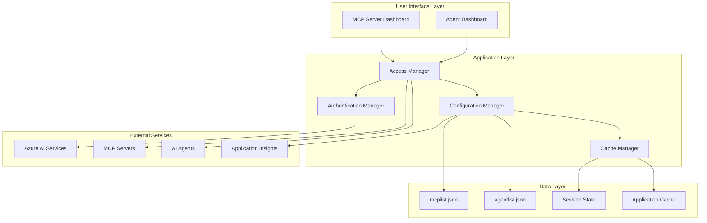

# AgenticAI Access Management - Documentation Index

## Overview

This comprehensive documentation suite covers the AgenticAI Access Management system, which consists of two primary applications for managing user access to AI resources:

- **MCP Server Access Dashboard** (`stmcplist.py`) - Manages access to Model Context Protocol servers
- **Agents Access Dashboard** (`stagentlist.py`) - Manages access to AI agents and their configurations

## Documentation Structure

### 📚 Core Documentation

| Document | Description | Audience |
|----------|-------------|----------|
| **[stmcplist-documentation.md](./stmcplist-documentation.md)** | Complete documentation for MCP Server Access Dashboard | Developers, Administrators |
| **[stagentlist-documentation.md](./stagentlist-documentation.md)** | Complete documentation for Agents Access Dashboard | Developers, Administrators |
| **[access-management-technical-architecture.md](./access-management-technical-architecture.md)** | Comprehensive technical architecture overview | Architects, Senior Developers |
| **[access-management-quick-reference.md](./access-management-quick-reference.md)** | Quick reference guide for common operations | Administrators, Operators |

### 🎯 Visual Documentation

| Document | Description | Use Case |
|----------|-------------|----------|
| **[access-management-mermaid-diagrams.md](./access-management-mermaid-diagrams.md)** | Complete set of Mermaid architecture and sequence diagrams | Understanding system flows, Architecture reviews |

## Getting Started

### For Administrators

1. **Start Here**: [Quick Reference Guide](./access-management-quick-reference.md)
   - Common operations and troubleshooting
   - Configuration management
   - Security operations

2. **Deep Dive**: [MCP Server Documentation](./stmcplist-documentation.md) or [Agent Documentation](./stagentlist-documentation.md)
   - Detailed feature explanations
   - Configuration options
   - Best practices

### For Developers

1. **Architecture Overview**: [Technical Architecture](./access-management-technical-architecture.md)
   - System design principles
   - Component interactions
   - Integration patterns

2. **Visual Understanding**: [Mermaid Diagrams](./access-management-mermaid-diagrams.md)
   - System architecture diagrams
   - Sequence flow diagrams
   - Data flow visualizations

3. **Implementation Details**: Individual component documentation
   - [MCP Server Implementation](./stmcplist-documentation.md)
   - [Agent Management Implementation](./stagentlist-documentation.md)

### For Architects

1. **System Design**: [Technical Architecture](./access-management-technical-architecture.md)
   - Architectural principles and patterns
   - Security architecture
   - Scalability considerations

2. **Visual Models**: [Mermaid Diagrams](./access-management-mermaid-diagrams.md)
   - High-level system overview
   - Integration architecture
   - Component relationships

## Key Features

### 🔐 Access Control Management

- **Fine-grained Permissions**: User-level access control for individual resources
- **Role-based Access**: Administrative and user roles with appropriate permissions
- **Expiration Management**: Automatic handling of resource expiration dates
- **Audit Trail**: Comprehensive logging of access changes and administrative actions

### 🖥️ User Interface

- **Dual Dashboard System**: Separate interfaces for users and administrators
- **Advanced Filtering**: Multi-dimensional filtering for resource discovery
- **Real-time Updates**: Immediate reflection of configuration changes
- **Responsive Design**: Works across different screen sizes and devices

### 🔧 Configuration Management

- **JSON-based Configuration**: Simple, readable configuration files
- **Environment Variable Support**: Secure credential and endpoint management
- **Validation Framework**: Comprehensive validation for all configuration data
- **Cache Management**: Optimized performance through intelligent caching

### 🛡️ Security Features

- **Multi-method Authentication**: Support for API keys, OAuth2, Basic Auth, and JWT
- **Azure Integration**: Native integration with Azure AI services and authentication
- **Session Management**: Secure session handling and timeout management
- **Security Monitoring**: Built-in security event logging and monitoring

### 📊 Monitoring and Observability

- **Application Insights Integration**: Comprehensive telemetry and monitoring
- **Performance Tracking**: Real-time performance metrics and alerting
- **Error Handling**: Robust error handling with detailed logging
- **Health Checks**: System health monitoring and status reporting

## System Architecture



## Technology Stack

### Core Technologies

- **Python 3.8+**: Primary programming language
- **Streamlit**: Web application framework
- **Azure AI Services**: Cloud AI platform integration
- **JSON**: Configuration data format
- **OpenTelemetry**: Observability and monitoring

### Azure Services Integration

- **Azure AI Projects**: AI project management and orchestration
- **Azure OpenAI**: Large language model services
- **Application Insights**: Monitoring and telemetry
- **Azure Active Directory**: Authentication and identity management
- **Azure Key Vault**: Secure credential management (future enhancement)

### Development Tools

- **Git**: Version control
- **Docker**: Containerization (deployment)
- **Kubernetes**: Container orchestration (production deployment)
- **Mermaid**: Architecture and sequence diagrams
- **JSON Schema**: Configuration validation

## Configuration Files

### MCP Server Configuration (`mcplist.json`)

```json
{
  "users": [
    {
      "id": 1,
      "username": "admin",
      "password": "hashed_password",
      "access_servers": [1, 2, 3]
    }
  ],
  "mcp_servers": [
    {
      "id": 1,
      "name": "Production MCP Server",
      "auth": {
        "username": "mcp_user",
        "api_key": "secure_api_key"
      },
      "certified": true,
      "expiration_date": "2025-12-31",
      "company_name": "TechCorp",
      "business_unit": "Engineering",
      "purpose": "Production"
    }
  ]
}
```

### Agent Configuration (`agentlist.json`)

```json
{
  "users": [
    {
      "id": 1,
      "username": "admin",
      "password": "hashed_password",
      "access_agents": ["1", "2", "3"]
    }
  ],
  "agents": [
    {
      "id": 1,
      "name": "Customer Support Agent",
      "business_unit": "Support",
      "purpose": "Customer Support",
      "owner": "TechCorp",
      "auth": {
        "method": "api_key",
        "credentials": {
          "api_key": "agent_api_key"
        }
      },
      "parameters": {
        "temperature": 0.7,
        "max_tokens": 150,
        "model": "gpt-4"
      },
      "certified": true,
      "expiration_date": "2025-06-30"
    }
  ]
}
```

## Environment Variables

### Required Variables

```bash
# Azure AI Services
PROJECT_ENDPOINT="https://your-project.services.ai.azure.com/api/projects/your-project"
MODEL_ENDPOINT="https://your-model.services.ai.azure.com"
MODEL_API_KEY="your-api-key"
MODEL_DEPLOYMENT_NAME="gpt-4o-mini"

# MCP Configuration
MCP_SERVER_URL="https://learn.microsoft.com/api/mcp"
MCP_SERVER_LABEL="MicrosoftLearn"

# Monitoring
APPLICATION_INSIGHTS_CONNECTION_STRING="InstrumentationKey=your-key"

# OpenAI Configuration
AZURE_OPENAI_ENDPOINT="https://your-openai.openai.azure.com"
AZURE_OPENAI_KEY="your-openai-key"
```

## Quick Start Guide

### 1. Installation

```bash
# Clone repository
git clone <repository-url>
cd AgenticAIFoundry

# Install dependencies
pip install -r requirements.txt

# Configure environment variables
cp .env.example .env
# Edit .env with your values
```

### 2. Configuration

```bash
# Verify JSON configuration files
python -m json.tool mcplist.json
python -m json.tool agentlist.json

# Set up Azure authentication
az login
```

### 3. Running the Applications

```bash
# Start MCP Server Dashboard
streamlit run stmcplist.py --server.port 8501

# Start Agent Dashboard (in separate terminal)
streamlit run stagentlist.py --server.port 8502
```

### 4. Access the Applications

- **MCP Server Dashboard**: http://localhost:8501
- **Agent Dashboard**: http://localhost:8502

## Common Use Cases

### 1. Grant User Access to MCP Server

1. Open MCP Server Dashboard
2. Navigate to "Admin: Edit MCP Server & Access" tab
3. Select the target server
4. Add user to "Users with Access" multiselect
5. Click "Save Changes"

### 2. Configure New AI Agent

1. Open Agent Dashboard
2. Navigate to "Admin: Edit Agent & Access" tab
3. Select agent to configure
4. Update metadata, authentication, and parameters
5. Assign user access permissions
6. Save configuration

### 3. Monitor Resource Expiration

1. Check dashboard for "Expired?" column
2. Review expiration dates in resource lists
3. Update expiration dates as needed
4. Remove access for expired resources

### 4. Troubleshoot Access Issues

1. Verify user exists in configuration
2. Check user's access lists
3. Validate resource is not expired
4. Confirm resource certification status
5. Review authentication configuration

## Security Best Practices

### 1. Credential Management

- Store sensitive credentials in environment variables
- Use Azure Key Vault for production deployments
- Rotate API keys regularly
- Implement proper access controls

### 2. User Access Control

- Follow principle of least privilege
- Regularly review user access permissions
- Monitor access patterns and anomalies
- Implement proper session management

### 3. Configuration Security

- Validate all configuration changes
- Maintain audit logs of modifications
- Implement proper backup procedures
- Use version control for configuration files

### 4. Monitoring and Alerting

- Monitor authentication failures
- Track unauthorized access attempts
- Set up alerts for security events
- Regular security reviews and assessments

## Support and Maintenance

### 1. Monitoring

- **Application Insights**: Real-time monitoring and alerting
- **Performance Metrics**: Response times and throughput
- **Error Tracking**: Automatic error detection and reporting
- **Usage Analytics**: User behavior and system utilization

### 2. Maintenance Tasks

- **Regular Backups**: Configuration and data backups
- **Security Updates**: Keep dependencies updated
- **Performance Optimization**: Monitor and optimize performance
- **Capacity Planning**: Plan for growth and scaling

### 3. Troubleshooting Resources

- **Quick Reference Guide**: Common issues and solutions
- **Debug Mode**: Enable detailed logging for troubleshooting
- **Support Channels**: Internal support team contacts
- **Documentation Updates**: Keep documentation current

## Future Enhancements

### Planned Features

1. **Database Backend**: Migration from JSON to proper database
2. **Advanced RBAC**: Fine-grained role-based access control
3. **API Interface**: REST API for external integrations
4. **Bulk Operations**: Batch management of users and resources
5. **Advanced Analytics**: Usage analytics and reporting
6. **Automated Workflows**: Approval workflows for access requests

### Integration Roadmap

1. **Identity Providers**: SAML/OIDC integration
2. **Workflow Systems**: Integration with approval systems
3. **Monitoring Tools**: Enhanced monitoring and alerting
4. **Compliance Tools**: Compliance reporting and auditing
5. **Backup Solutions**: Automated backup and recovery

## Conclusion

The AgenticAI Access Management system provides a comprehensive solution for managing user access to AI resources within enterprise environments. With its dual dashboard approach, robust security features, and extensive monitoring capabilities, it serves as a central hub for AI resource governance.

This documentation suite provides everything needed to understand, deploy, configure, and maintain the system effectively. Whether you're an administrator managing day-to-day operations or a developer extending the system's capabilities, these documents provide the necessary guidance and reference materials.

For additional support or questions not covered in this documentation, please refer to the troubleshooting sections in the individual component documentation or contact the development team.

---

**Document Version**: 1.0  
**Last Updated**: December 2024  
**Maintained By**: AgenticAI Development Team