# AgenticAI Access Management - Mermaid Architecture Diagrams

## Table of Contents

1. [System Architecture Overview](#system-architecture-overview)
2. [MCP Server Access Management](#mcp-server-access-management)
3. [Agent Access Management](#agent-access-management)
4. [User Access Flow Diagrams](#user-access-flow-diagrams)
5. [Administrative Workflows](#administrative-workflows)
6. [Authentication and Security](#authentication-and-security)
7. [Data Flow Diagrams](#data-flow-diagrams)
8. [Integration Architecture](#integration-architecture)

## System Architecture Overview

### High-Level System Architecture

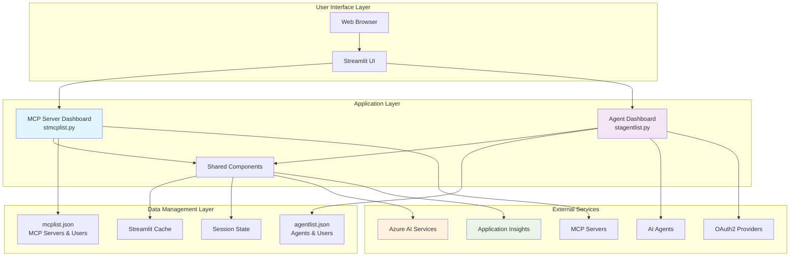

### Component Interaction Model

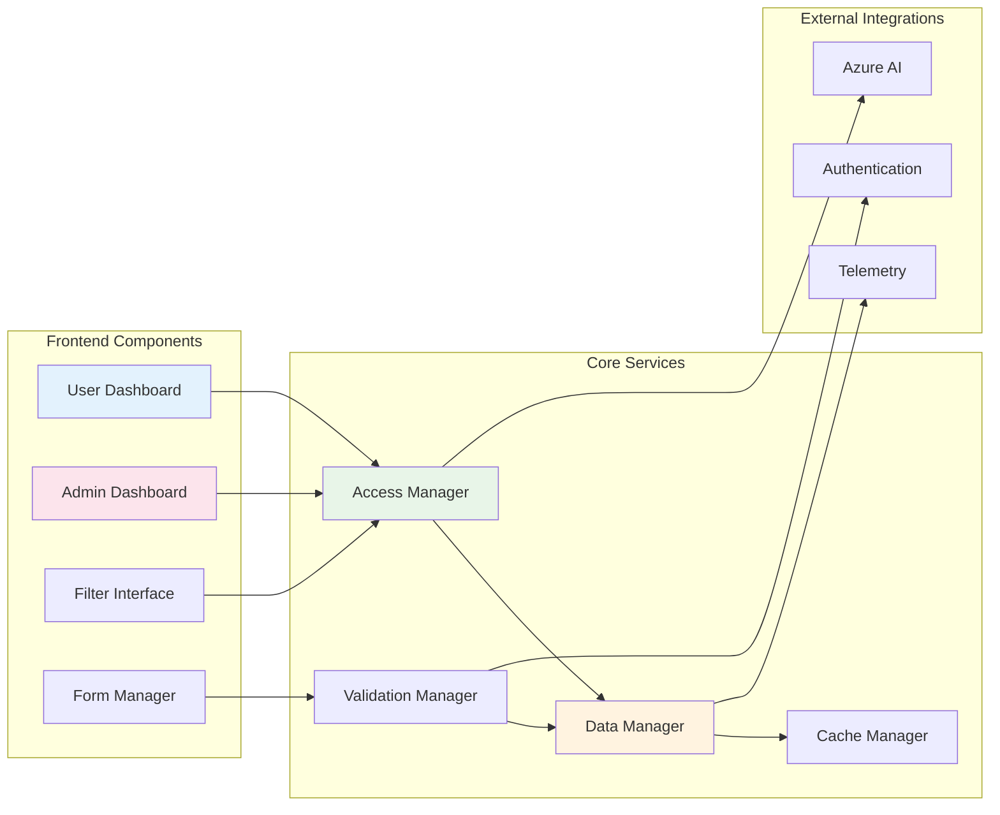

## MCP Server Access Management

### MCP Server Management Architecture

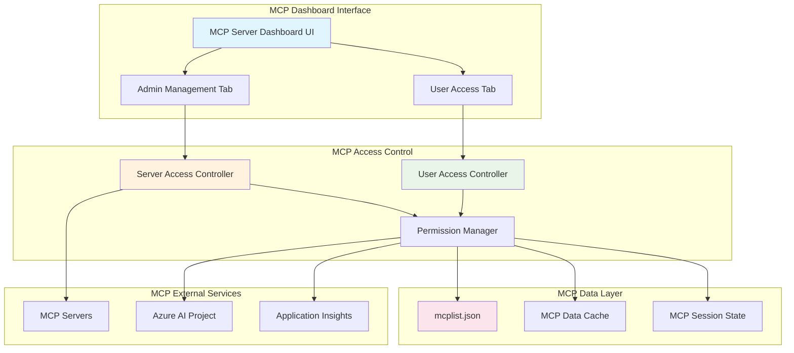

### MCP Server Access Flow

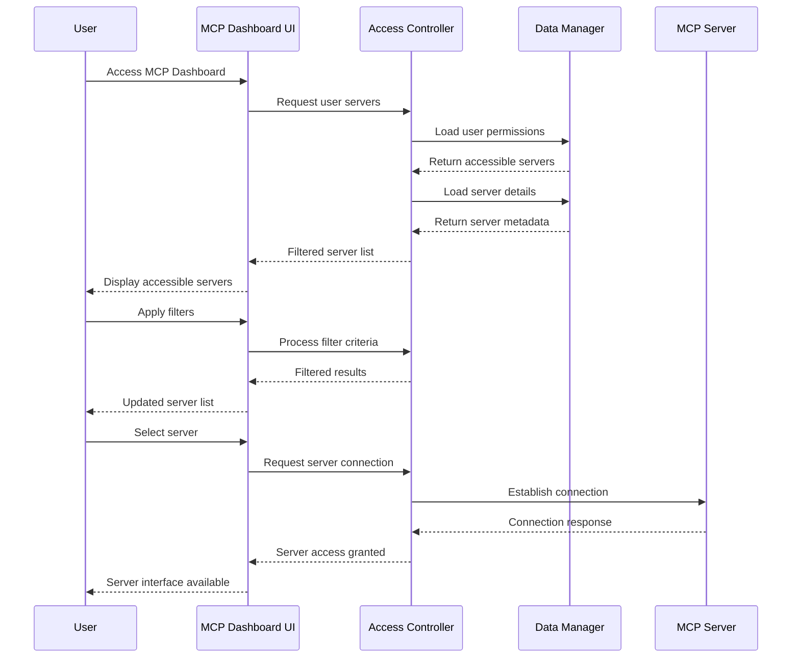

## Agent Access Management

### Agent Management Architecture

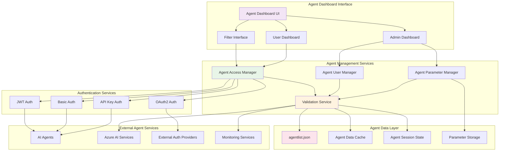

### Agent Authentication Flow

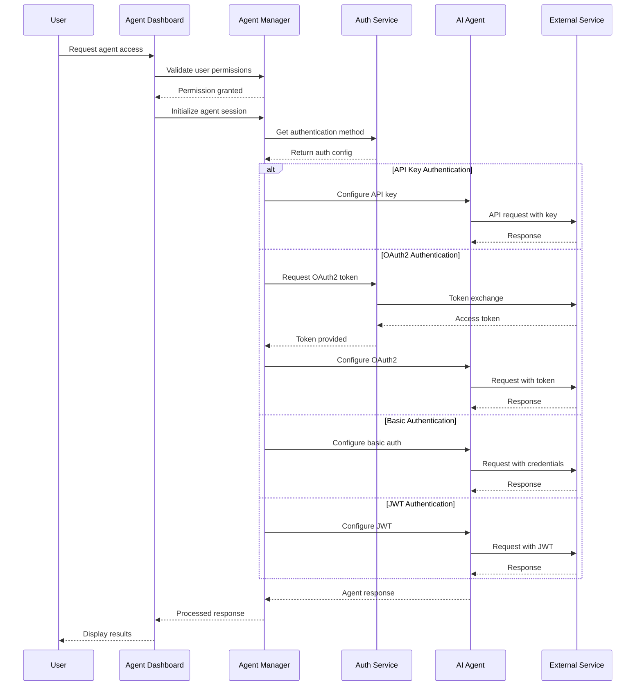

## User Access Flow Diagrams

### User Dashboard Access Workflow

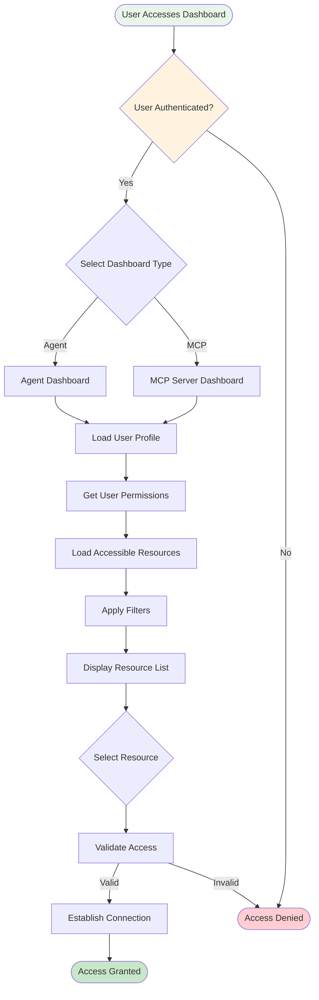

### Admin Management Workflow

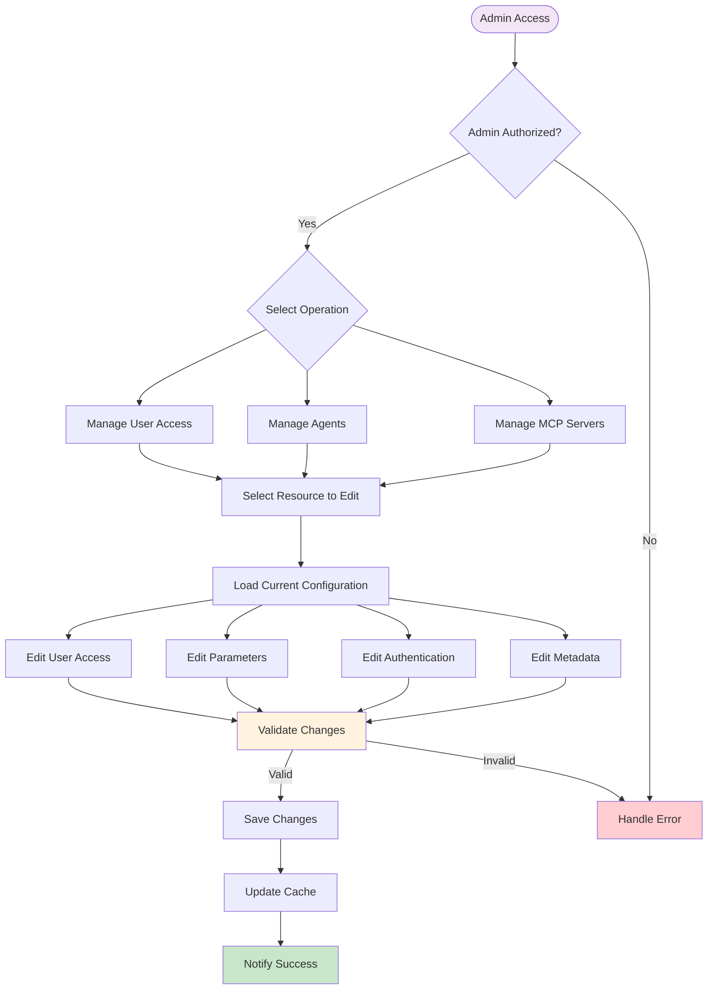

## Administrative Workflows

### Server/Agent Lifecycle Management

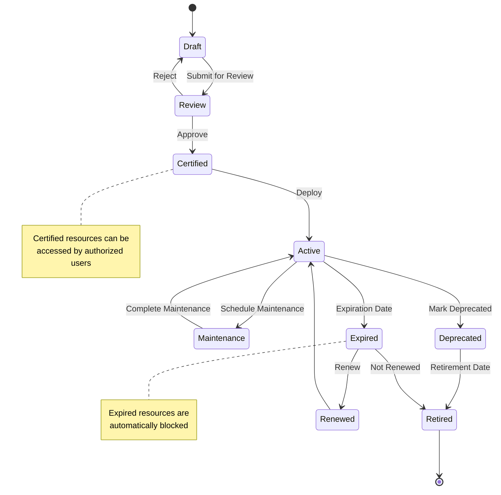

### User Access Management State

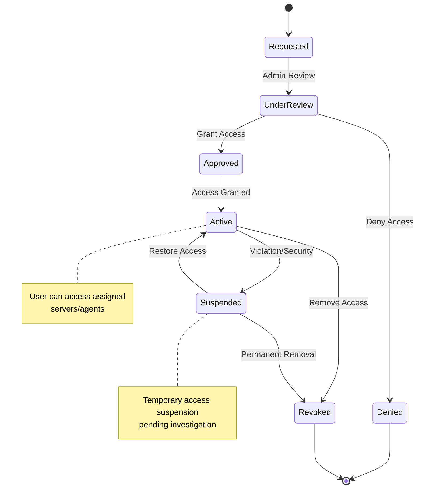

## Authentication and Security

### Multi-Factor Authentication Flow

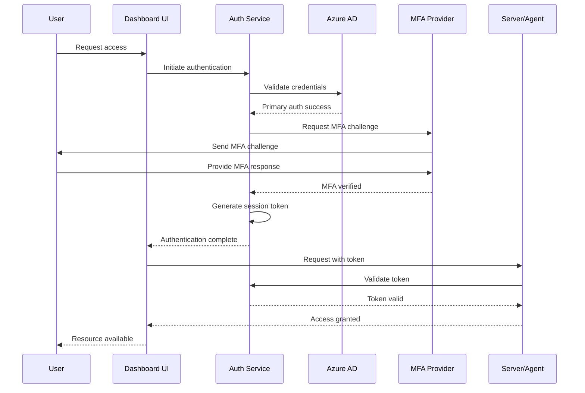

### Security Access Control Matrix

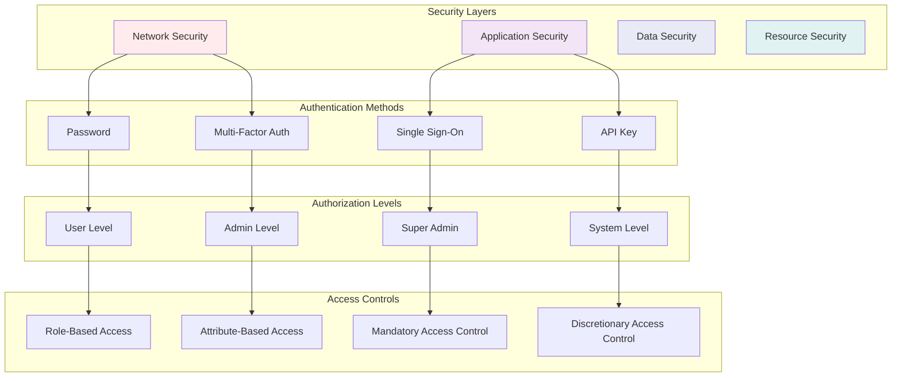

## Data Flow Diagrams

### Configuration Data Flow

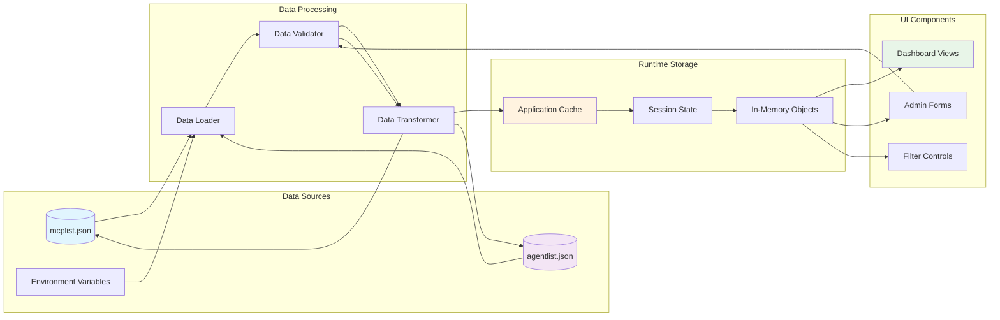

### User Access Decision Flow

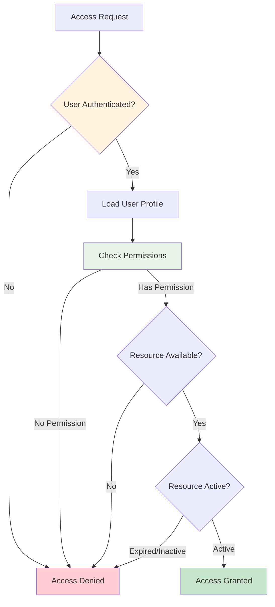

## Integration Architecture

### Azure Services Integration

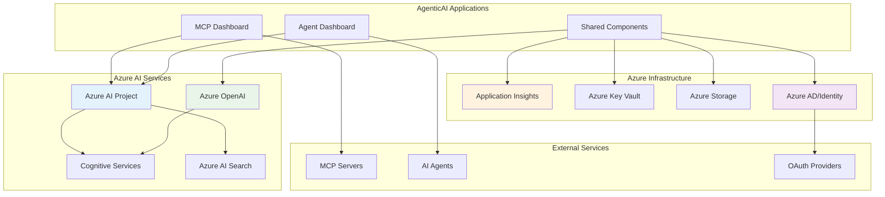

### External Service Integration

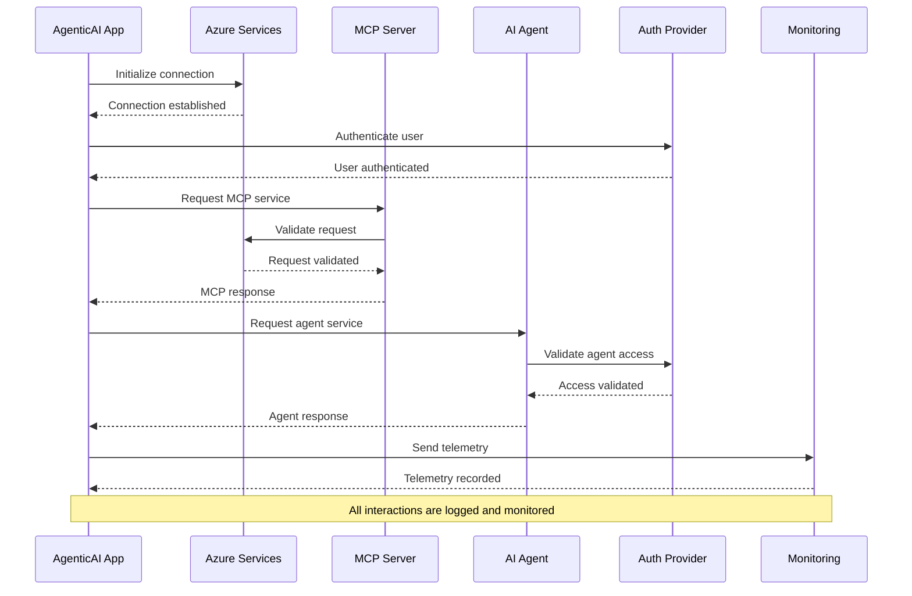

### Data Synchronization Flow

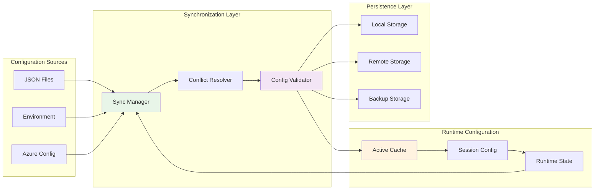

---

## Usage Notes

### Viewing These Diagrams

These Mermaid diagrams can be viewed in:

1. **GitHub**: Natively rendered in README and documentation files
2. **VS Code**: With Mermaid preview extensions
3. **Online Editors**: 
   - [Mermaid Live Editor](https://mermaid.live/)
   - [Draw.io](https://draw.io/) with Mermaid support
4. **Documentation Platforms**: 
   - GitBook, Notion, Confluence with Mermaid support

### Diagram Maintenance

- Keep diagrams synchronized with code changes
- Update architectural diagrams when adding new components
- Validate sequence diagrams against actual implementation
- Use consistent styling and naming conventions

### Integration with Development

- Include relevant diagrams in pull request reviews
- Reference diagrams in technical specifications
- Use diagrams for onboarding new team members
- Maintain diagram versioning alongside code releases