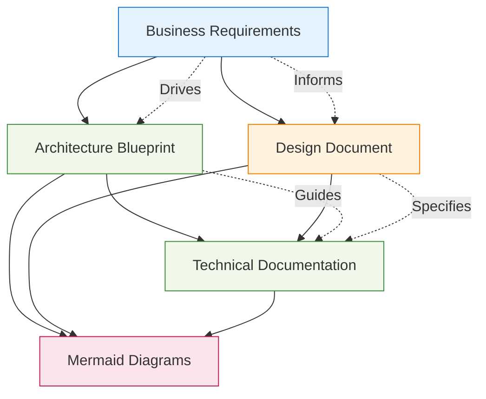

# AgenticAI Foundry - app.py Documentation Index

## Overview

This directory contains comprehensive documentation for the `app.py` component of the AgenticAI Foundry platform. The app.py file serves as the primary Streamlit web interface, providing an enterprise-grade user experience for AI agent development, evaluation, and management.

## Documentation Structure

### 📐 [Architecture Blueprint](./architecture-blueprint.md)
**Purpose**: Technical architecture overview and system design
**Audience**: Software architects, senior developers, system integrators
**Contents**:
- Component architecture and design patterns
- Integration points and data flow
- Security implementation
- Performance and scalability considerations
- Future enhancement roadmap

### 📊 [Mermaid Diagrams](./mermaid-diagrams.md)
**Purpose**: Visual system architecture and process flows
**Audience**: Technical teams, stakeholders, documentation readers
**Contents**:
- System overview diagrams
- Component interaction flows
- Data processing sequences
- UI component structure
- Deployment architecture

### 🔧 [Technical Documentation](./technical-documentation.md)
**Purpose**: Detailed implementation guide and API reference
**Audience**: Developers, DevOps engineers, technical implementers
**Contents**:
- System requirements and dependencies
- API documentation and integration guides
- Configuration management
- Performance optimization
- Security implementation details
- Testing strategies and troubleshooting

### 🎨 [Design Document](./design-document.md)
**Purpose**: User experience design and interface specifications
**Audience**: UX/UI designers, product managers, frontend developers
**Contents**:
- User experience design principles
- Visual design system (Material Design 3)
- Information architecture
- Interaction design patterns
- Responsive design guidelines
- Accessibility compliance
- Component library specifications

### 💼 [Business Requirements](./business-requirements.md)
**Purpose**: Business objectives, requirements, and value proposition
**Audience**: Business stakeholders, product managers, executives
**Contents**:
- Business context and market analysis
- Stakeholder analysis and engagement
- Functional and non-functional requirements
- User stories and use cases
- Success metrics and ROI analysis
- Risk assessment and mitigation strategies
- Implementation roadmap

## Document Relationships

## Quick Navigation

### For Business Stakeholders
1. Start with [Business Requirements](./business-requirements.md) - understand the business value and strategic context
2. Review [Design Document](./design-document.md) - understand user experience and interface design
3. Check [Mermaid Diagrams](./mermaid-diagrams.md) - visualize system architecture and processes

### For Technical Teams
1. Begin with [Architecture Blueprint](./architecture-blueprint.md) - understand system design and patterns
2. Dive into [Technical Documentation](./technical-documentation.md) - get implementation details and APIs
3. Reference [Mermaid Diagrams](./mermaid-diagrams.md) - visualize technical architectures and flows

### For Design Teams
1. Start with [Design Document](./design-document.md) - comprehensive UX/UI specifications
2. Review [Business Requirements](./business-requirements.md) - understand user needs and business context
3. Check [Mermaid Diagrams](./mermaid-diagrams.md) - see UI component relationships

### For Product Managers
1. Begin with [Business Requirements](./business-requirements.md) - complete business context and requirements
2. Review [Design Document](./design-document.md) - understand user experience strategy
3. Check [Architecture Blueprint](./architecture-blueprint.md) - understand technical capabilities and constraints

## Key Features Documented

### Core Functionality
- **AI Agent Development Interface**: Visual workflow design and code interpretation
- **Comprehensive Evaluation Framework**: Performance testing and business metrics
- **Security Testing and Validation**: Red team testing and compliance validation
- **Multi-Modal Communication**: Voice, text, and visual interaction capabilities
- **Enterprise Integration**: SSO, audit logging, and business system connectivity

### Technical Capabilities
- **Streamlit Framework**: Modern web application with Material Design 3 styling
- **Backend Integration**: Seamless connection to agenticai.py and bbmcp.py services
- **External Service Integration**: Azure OpenAI, MCP servers, and third-party APIs
- **Session Management**: Stateful user interactions and workflow persistence
- **Error Handling**: Graceful degradation and comprehensive fallback mechanisms

### Business Value
- **Accelerated Development**: 50% reduction in AI development cycle times
- **Democratized Access**: Non-technical stakeholder participation in AI development
- **Enhanced Quality**: Comprehensive testing and validation frameworks
- **Cost Optimization**: 40% reduction in development costs through efficiency gains
- **Risk Mitigation**: Security testing and compliance validation capabilities

## Documentation Standards

### Version Control
- All documentation follows semantic versioning aligned with code releases
- Changes tracked through Git with clear commit messages and pull request reviews
- Documentation updates included in all feature development cycles

### Quality Assurance
- Technical accuracy validated by development teams
- Business alignment confirmed by product management
- User experience consistency verified by design teams
- Regular documentation audits ensure completeness and currency

### Accessibility
- All documentation follows WCAG 2.1 AA accessibility guidelines
- Multiple formats provided for different learning preferences
- Clear navigation and search capabilities
- Plain language principles applied for business stakeholder communication

## Maintenance and Updates

### Regular Review Schedule
- **Monthly**: Technical accuracy review and updates for API changes
- **Quarterly**: Business requirements validation and strategic alignment
- **Bi-annually**: Comprehensive documentation audit and restructuring
- **Ad-hoc**: Updates for major feature releases and architectural changes

### Feedback and Improvement
- Documentation feedback collected through user surveys and direct input
- Usage analytics tracked to identify improvement opportunities
- Continuous improvement based on stakeholder needs and technology evolution
- Community contributions welcomed through established review processes

## Getting Started

### New Team Members
1. Read [Business Requirements](./business-requirements.md) for context
2. Review [Architecture Blueprint](./architecture-blueprint.md) for system understanding
3. Study [Technical Documentation](./technical-documentation.md) for implementation details
4. Reference [Design Document](./design-document.md) for UX/UI guidelines

### Project Planning
1. Use [Business Requirements](./business-requirements.md) for scope and objectives
2. Reference [Architecture Blueprint](./architecture-blueprint.md) for technical planning
3. Leverage [Mermaid Diagrams](./mermaid-diagrams.md) for visual communication
4. Apply [Design Document](./design-document.md) for user experience planning

### Implementation
1. Follow [Technical Documentation](./technical-documentation.md) for development
2. Use [Architecture Blueprint](./architecture-blueprint.md) for design decisions
3. Reference [Design Document](./design-document.md) for UI implementation
4. Validate against [Business Requirements](./business-requirements.md) for business alignment

This documentation suite provides comprehensive coverage of the app.py component, enabling effective development, deployment, and maintenance of this critical platform interface.