# AgenticAI Foundry - app.py Mermaid Architecture Diagrams

## Table of Contents
1. [System Overview Diagram](#system-overview-diagram)
2. [Component Architecture](#component-architecture)
3. [Data Flow Diagrams](#data-flow-diagrams)
4. [UI Component Structure](#ui-component-structure)
5. [Integration Architecture](#integration-architecture)
6. [Audio Processing Flow](#audio-processing-flow)
7. [Session Management](#session-management)
8. [Error Handling Flow](#error-handling-flow)

## System Overview Diagram

```mermaid
graph TB
    User[👤 User] --> StreamlitUI[🌐 Streamlit Web Interface<br/>app.py]
    
    StreamlitUI --> SessionMgr[📦 Session State Manager]
    StreamlitUI --> DepHandler[🔧 Dependency Handler]
    StreamlitUI --> UIController[🎮 Main UI Controller]
    
    UIController --> DevPhase[🔧 Development Phase]
    UIController --> EvalPhase[📊 Evaluation Phase]
    UIController --> SecPhase[🛡️ Security Phase]
    UIController --> ProdPhase[🌐 Production Phase]
    UIController --> AudioChat[🎙️ Audio Chat]
    
    DevPhase --> CodeInterp[📝 Code Interpreter]
    EvalPhase --> AIEval[📊 AI Evaluation]
    EvalPhase --> AgentEval[✅ Agent Evaluation]
    SecPhase --> RedTeam[🛡️ Red Team Testing]
    ProdPhase --> MCPServers[🔗 MCP Servers]
    ProdPhase --> ConnectedAgents[🌐 Connected Agents]
    ProdPhase --> AgentCleanup[🗑️ Agent Cleanup]
    
    %% Backend Integration
    CodeInterp --> AgenticAI[🤖 agenticai.py]
    AIEval --> AgenticAI
    AgentEval --> AgenticAI
    RedTeam --> AgenticAI
    ConnectedAgents --> AgenticAI
    AgentCleanup --> AgenticAI
    
    MCPServers --> BBMCP[🔌 bbmcp.py]
    AudioChat --> BBMCP
    
    %% External Services
    AgenticAI --> AzureAI[☁️ Azure AI Services]
    BBMCP --> MSFTLearn[📚 Microsoft Learn]
    BBMCP --> GitHub[🐙 GitHub]
    BBMCP --> HuggingFace[🤗 HuggingFace]
    
    %% Styling
    classDef userClass fill:#e1f5fe,stroke:#01579b,stroke-width:2px
    classDef uiClass fill:#f3e5f5,stroke:#4a148c,stroke-width:2px
    classDef phaseClass fill:#e8f5e8,stroke:#1b5e20,stroke-width:2px
    classDef backendClass fill:#fff3e0,stroke:#e65100,stroke-width:2px
    classDef externalClass fill:#fce4ec,stroke:#880e4f,stroke-width:2px
    
    class User userClass
    class StreamlitUI,SessionMgr,DepHandler,UIController uiClass
    class DevPhase,EvalPhase,SecPhase,ProdPhase,AudioChat phaseClass
    class AgenticAI,BBMCP backendClass
    class AzureAI,MSFTLearn,GitHub,HuggingFace externalClass
```

## Component Architecture

```mermaid
graph LR
    subgraph "🌐 Streamlit Application (app.py)"
        subgraph "🎨 UI Layer"
            MD3[Material Design 3<br/>Styling Engine]
            Layout[Responsive Layout<br/>Manager]
            Components[UI Components<br/>Library]
        end
        
        subgraph "🎮 Control Layer"
            MainCtrl[Main Controller<br/>main function]
            SessionState[Session State<br/>Manager]
            ErrorHandler[Error Handler &<br/>Graceful Fallback]
        end
        
        subgraph "🔧 Phase Managers"
            DevMgr[Development<br/>Phase Manager]
            EvalMgr[Evaluation<br/>Phase Manager]
            SecMgr[Security<br/>Phase Manager]
            ProdMgr[Production<br/>Phase Manager]
            AudioMgr[Audio Chat<br/>Manager]
        end
        
        subgraph "🔌 Integration Layer"
            DepDetector[Dependency<br/>Detector]
            ServiceProxy[Service<br/>Proxy]
            ConfigMgr[Configuration<br/>Manager]
        end
    end
    
    %% Flow connections
    MainCtrl --> DevMgr
    MainCtrl --> EvalMgr
    MainCtrl --> SecMgr
    MainCtrl --> ProdMgr
    MainCtrl --> AudioMgr
    
    SessionState --> MainCtrl
    ErrorHandler --> MainCtrl
    
    MD3 --> Layout
    Layout --> Components
    Components --> MainCtrl
    
    DepDetector --> ServiceProxy
    ServiceProxy --> ConfigMgr
    ConfigMgr --> MainCtrl
    
    %% Styling
    classDef uiLayer fill:#e3f2fd,stroke:#0277bd,stroke-width:2px
    classDef controlLayer fill:#f1f8e9,stroke:#388e3c,stroke-width:2px
    classDef phaseLayer fill:#fff8e1,stroke:#f57c00,stroke-width:2px
    classDef integrationLayer fill:#fce4ec,stroke:#c2185b,stroke-width:2px
    
    class MD3,Layout,Components uiLayer
    class MainCtrl,SessionState,ErrorHandler controlLayer
    class DevMgr,EvalMgr,SecMgr,ProdMgr,AudioMgr phaseLayer
    class DepDetector,ServiceProxy,ConfigMgr integrationLayer
```

## Data Flow Diagrams

### User Interaction Flow

### Audio Processing Flow

## UI Component Structure

```mermaid
graph TD
    subgraph "🎨 Streamlit App Layout"
        Header[🤖 Main Header<br/>AgenticAI Foundry]
        Workflow[🔄 Workflow Overview<br/>Progress Indicators]
        
        subgraph "📊 Main Content Area"
            subgraph "🚀 Agent Operations (Left Column)"
                DevExp[🔧 Development Phase<br/>Expandable Section]
                EvalExp[📊 Evaluation Phase<br/>Expandable Section]
                SecExp[🛡️ Security Phase<br/>Expandable Section]
                ProdExp[🌐 Production Phase<br/>Expandable Section]
            end
            
            subgraph "📋 Control Panel (Right Column)"
                StatusPanel[📊 System Status<br/>Real-time Indicators]
                ActivityPanel[📈 Recent Activity<br/>Event Log]
                MCPInfo[🔗 MCP Server Info<br/>Connection Status]
                QuickActions[⚡ Quick Actions<br/>Common Operations]
            end
        end
        
        subgraph "🎙️ Audio Chat Interface (Conditional)"
            AudioHeader[🎙️ MCP Audio Chat Header]
            AudioControls[🎤 Voice Input Controls]
            MCPSelection[🌐 MCP Server Selection]
            ConversationHistory[💬 Chat History Display]
        end
    end
    
    %% Flow connections
    Header --> Workflow
    Workflow --> DevExp
    Workflow --> StatusPanel
    
    DevExp --> EvalExp
    EvalExp --> SecExp
    SecExp --> ProdExp
    
    StatusPanel --> ActivityPanel
    ActivityPanel --> MCPInfo
    MCPInfo --> QuickActions
    
    QuickActions -.-> AudioHeader
    AudioHeader --> AudioControls
    AudioControls --> MCPSelection
    MCPSelection --> ConversationHistory
    
    %% Styling
    classDef headerClass fill:#e8eaf6,stroke:#3f51b5,stroke-width:3px
    classDef mainClass fill:#f3e5f5,stroke:#9c27b0,stroke-width:2px
    classDef phaseClass fill:#e8f5e8,stroke:#4caf50,stroke-width:2px
    classDef controlClass fill:#fff3e0,stroke:#ff9800,stroke-width:2px
    classDef audioClass fill:#e0f2f1,stroke:#009688,stroke-width:2px
    
    class Header,Workflow headerClass
    class DevExp,EvalExp,SecExp,ProdExp phaseClass
    class StatusPanel,ActivityPanel,MCPInfo,QuickActions controlClass
    class AudioHeader,AudioControls,MCPSelection,ConversationHistory audioClass
```

## Integration Architecture

## Audio Processing Flow

```mermaid
flowchart TD
    Start([🎙️ User Audio Input]) --> Upload[📁 Audio File Upload<br/>Streamlit Interface]
    Upload --> Validate{🔍 Validate<br/>File Format?}
    
    Validate -->|Invalid| Error1[❌ Format Error<br/>Display Message]
    Validate -->|Valid| TempSave[💾 Save Temporary File<br/>/tmp/audio_input.wav]
    
    TempSave --> Convert[🔄 Convert Audio<br/>WAV → PCM 16kHz Mono]
    Convert --> STTCall[🗣️ Speech-to-Text<br/>Azure OpenAI Whisper]
    
    STTCall --> STTCheck{✅ STT<br/>Success?}
    STTCheck -->|Failed| Error2[❌ STT Error<br/>Display Message]
    STTCheck -->|Success| MCPSelect[🌐 MCP Server Selection<br/>Microsoft Learn/GitHub/HuggingFace]
    
    MCPSelect --> MCPCall[📡 MCP Server API Call<br/>Send Transcribed Query]
    MCPCall --> MCPCheck{✅ MCP<br/>Response OK?}
    
    MCPCheck -->|Failed| Error3[❌ MCP Error<br/>Display Message]
    MCPCheck -->|Success| TTSCall[🔊 Text-to-Speech<br/>Azure OpenAI TTS]
    
    TTSCall --> TTSCheck{✅ TTS<br/>Success?}
    TTSCheck -->|Failed| TextOnly[📝 Text Response Only<br/>Display Text]
    TTSCheck -->|Success| AudioSave[💾 Save Response Audio<br/>Base64 Encoding]
    
    AudioSave --> Display[🎭 Display Response<br/>Text + Audio Player]
    TextOnly --> Display
    Display --> SessionSave[💾 Save to Session<br/>Conversation History]
    
    SessionSave --> Cleanup[🗑️ Cleanup Temp Files<br/>Remove Audio Files]
    Cleanup --> End([✅ Process Complete])
    
    %% Error paths lead to cleanup
    Error1 --> End
    Error2 --> Cleanup
    Error3 --> Cleanup
    
    %% Styling
    classDef processClass fill:#e8f5e8,stroke:#2e7d32,stroke-width:2px
    classDef decisionClass fill:#fff3e0,stroke:#f57c00,stroke-width:2px
    classDef errorClass fill:#ffebee,stroke:#c62828,stroke-width:2px
    classDef startEndClass fill:#e3f2fd,stroke:#1565c0,stroke-width:3px
    
    class Upload,TempSave,Convert,STTCall,MCPCall,TTSCall,AudioSave,Display,SessionSave,Cleanup,TextOnly processClass
    class Validate,STTCheck,MCPCheck,TTSCheck decisionClass
    class Error1,Error2,Error3 errorClass
    class Start,End startEndClass
```

## Session Management

## Error Handling Flow

```mermaid
flowchart TD
    UserAction[👤 User Action] --> TryBlock{🔄 Try Block<br/>Operation Execution}
    
    TryBlock -->|Success| SuccessPath[✅ Operation Successful]
    TryBlock -->|ImportError| ImportError[📦 Import Error<br/>Missing Dependencies]
    TryBlock -->|ValueError| ValueError[📝 Value Error<br/>Invalid Input]
    TryBlock -->|ConnectionError| ConnError[🌐 Connection Error<br/>Service Unavailable]
    TryBlock -->|Exception| GenericError[❌ Generic Exception<br/>Unexpected Error]
    
    ImportError --> DemoMode[🎭 Demo Mode<br/>Simulated Response]
    ValueError --> InputValidation[🔍 Input Validation<br/>Error Message]
    ConnError --> RetryLogic{🔄 Retry Logic<br/>Attempt Count < 3?}
    GenericError --> ErrorLogging[📋 Error Logging<br/>Traceback Capture]
    
    RetryLogic -->|Yes| DelayRetry[⏱️ Delay & Retry<br/>Exponential Backoff]
    RetryLogic -->|No| ServiceUnavailable[🚫 Service Unavailable<br/>Error Message]
    
    DelayRetry --> TryBlock
    
    DemoMode --> UserNotification[📢 User Notification<br/>Demo Mode Message]
    InputValidation --> UserNotification
    ServiceUnavailable --> UserNotification
    ErrorLogging --> UserNotification
    SuccessPath --> UserNotification
    
    UserNotification --> StateUpdate[📊 Update UI State<br/>Reflect Changes]
    StateUpdate --> LogActivity[📝 Log Activity<br/>Session History]
    LogActivity --> Ready[🟢 Ready for Next Action]
    
    %% Styling
    classDef actionClass fill:#e3f2fd,stroke:#1976d2,stroke-width:2px
    classDef errorClass fill:#ffebee,stroke:#d32f2f,stroke-width:2px
    classDef handlingClass fill:#f1f8e9,stroke:#388e3c,stroke-width:2px
    classDef successClass fill:#e8f5e8,stroke:#2e7d32,stroke-width:2px
    classDef notificationClass fill:#fff3e0,stroke:#f57c00,stroke-width:2px
    
    class UserAction,TryBlock actionClass
    class ImportError,ValueError,ConnError,GenericError errorClass
    class DemoMode,InputValidation,RetryLogic,DelayRetry,ServiceUnavailable,ErrorLogging handlingClass
    class SuccessPath successClass
    class UserNotification,StateUpdate,LogActivity,Ready notificationClass
```

## Deployment Architecture

This comprehensive set of Mermaid diagrams provides visual documentation of all major architectural aspects of the app.py component, from high-level system overview to detailed process flows and deployment architecture.