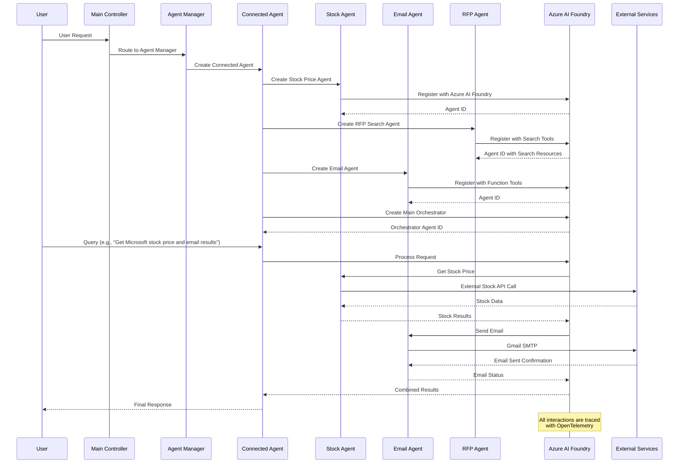
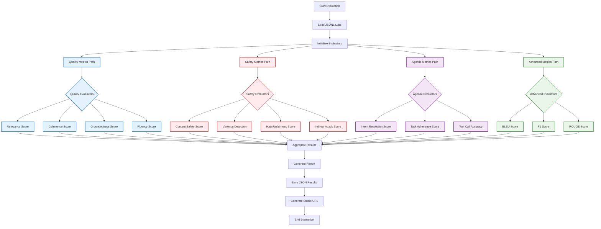
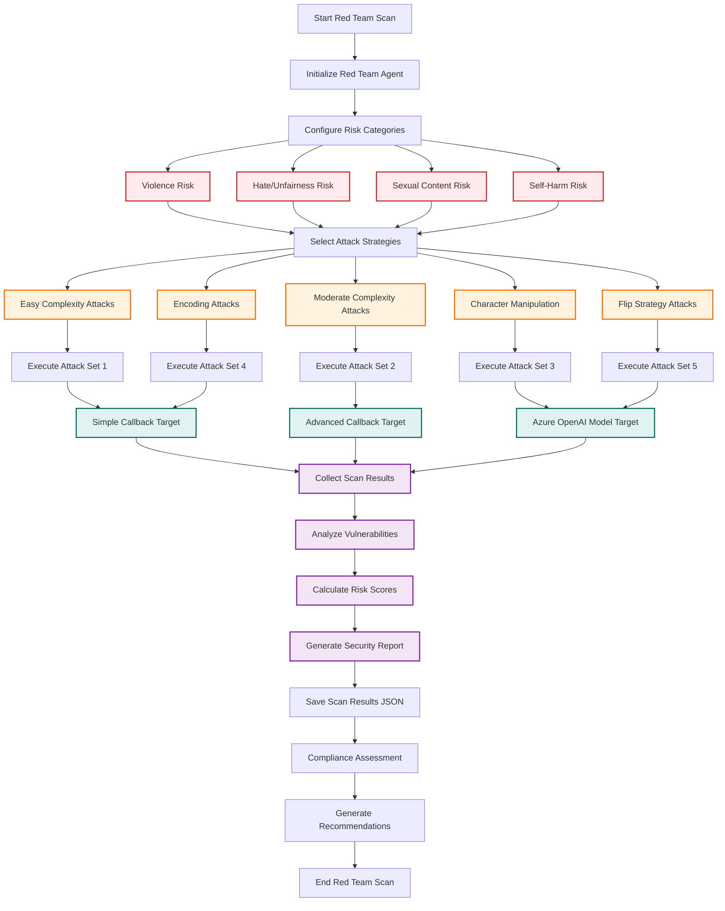
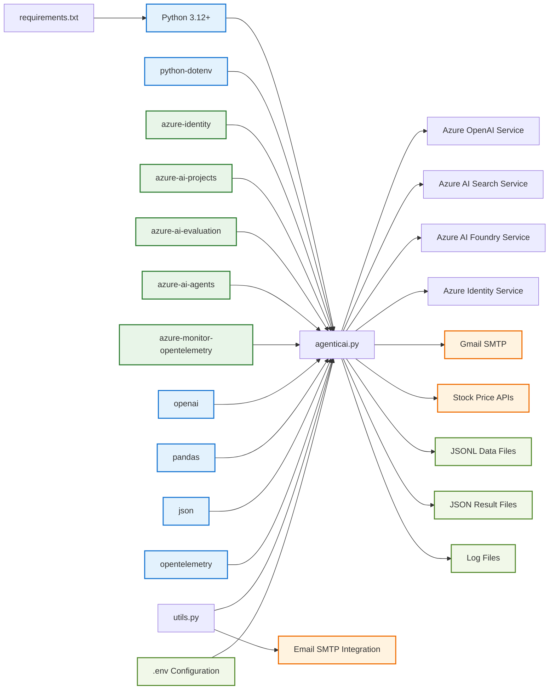

# AgenticAIFoundry - Mermaid Architecture Diagram

This document contains a comprehensive mermaid diagram showing the complete architecture of the AgenticAIFoundry platform, including all connected agents, evaluation frameworks, red team testing, and external integrations.

## Complete System Architecture

```mermaid
graph TB
    %% Main Controller
    User[User Request] --> Main[Main Controller<br/>agenticai.py]
    
    %% Core Agent Ecosystem
    Main --> AgentManager[Agent Manager]
    AgentManager --> CodeAgent[Code Interpreter Agent<br/>code_interpreter()]
    AgentManager --> SearchAgent[AI Search Agent<br/>ai_search_agent()]
    AgentManager --> ConnectedAgent[Connected Agent<br/>connected_agent()]
    AgentManager --> ReasoningAgent[Reasoning Agent<br/>process_message_reasoning()]
    AgentManager --> WeatherAgent[Weather Agent<br/>fetch_weather()]
    
    %% Evaluation Framework
    Main --> EvalFramework[Evaluation Framework<br/>eval()]
    EvalFramework --> QualityEval[Quality Evaluators]
    EvalFramework --> SafetyEval[Safety Evaluators]
    EvalFramework --> AgenticEval[Agentic Evaluators<br/>agent_eval()]
    EvalFramework --> AdvancedEval[Advanced Metrics]
    
    %% Quality Evaluators Details
    QualityEval --> Relevance[Relevance Evaluator]
    QualityEval --> Coherence[Coherence Evaluator]
    QualityEval --> Groundedness[Groundedness Evaluator]
    QualityEval --> Fluency[Fluency Evaluator]
    QualityEval --> Similarity[Similarity Evaluator]
    
    %% Safety Evaluators Details
    SafetyEval --> ContentSafety[Content Safety Evaluator]
    SafetyEval --> Violence[Violence Evaluator]
    SafetyEval --> HateUnfairness[Hate/Unfairness Evaluator]
    SafetyEval --> Sexual[Sexual Content Evaluator]
    SafetyEval --> SelfHarm[Self-Harm Evaluator]
    SafetyEval --> IndirectAttack[Indirect Attack Evaluator]
    SafetyEval --> ProtectedMaterial[Protected Material Evaluator]
    
    %% Agentic Evaluators Details
    AgenticEval --> IntentResolution[Intent Resolution Evaluator]
    AgenticEval --> TaskAdherence[Task Adherence Evaluator]
    AgenticEval --> ToolCallAccuracy[Tool Call Accuracy Evaluator]
    
    %% Advanced Metrics Details
    AdvancedEval --> BLEU[BLEU Score Evaluator]
    AdvancedEval --> GLEU[GLEU Score Evaluator]
    AdvancedEval --> ROUGE[ROUGE Score Evaluator]
    AdvancedEval --> METEOR[METEOR Score Evaluator]
    AdvancedEval --> F1Score[F1 Score Evaluator]
    AdvancedEval --> Retrieval[Retrieval Evaluator]
    AdvancedEval --> GroundnessPro[Groundedness Pro Evaluator]
    
    %% Red Team Security Testing
    Main --> RedTeam[Red Team Framework<br/>redteam()]
    RedTeam --> RiskCategories[Risk Categories]
    RedTeam --> AttackStrategies[Attack Strategies]
    RedTeam --> TargetSystems[Target Systems]
    
    %% Risk Categories Details
    RiskCategories --> ViolenceRisk[Violence]
    RiskCategories --> HateRisk[Hate/Unfairness]
    RiskCategories --> SexualRisk[Sexual Content]
    RiskCategories --> SelfHarmRisk[Self-Harm]
    
    %% Attack Strategies Details
    AttackStrategies --> EasyAttack[Easy Complexity]
    AttackStrategies --> ModerateAttack[Moderate Complexity]
    AttackStrategies --> CharManip[Character Manipulation]
    AttackStrategies --> Encoding[Encoding Attacks<br/>ROT13, Base64, Binary]
    AttackStrategies --> UnicodeAttack[Unicode Confusables]
    AttackStrategies --> FlipAttack[Flip Strategy]
    
    %% Target Systems Details
    TargetSystems --> SimpleCallback[Simple Callback Target]
    TargetSystems --> AdvancedCallback[Advanced Callback Target]
    TargetSystems --> ModelConfig[Azure OpenAI Model Config]
    
    %% Connected Agent Sub-components
    ConnectedAgent --> StockAgent[Stock Price Agent]
    ConnectedAgent --> EmailAgent[Email Agent<br/>send_email()]
    ConnectedAgent --> RFPAgent[RFP Search Agent]
    ConnectedAgent --> MainOrchestrator[Main Orchestrator Agent]
    
    %% Azure AI Foundry Platform
    AgentManager --> AzureFoundry[Azure AI Foundry Platform]
    EvalFramework --> AzureFoundry
    RedTeam --> AzureFoundry
    
    AzureFoundry --> AgentMgmt[Agent Management]
    AzureFoundry --> ThreadMgmt[Thread Management]
    AzureFoundry --> MessageProc[Message Processing]
    AzureFoundry --> ToolExecution[Tool Execution Engine]
    
    %% Azure Services
    AzureFoundry --> AzureOpenAI[Azure OpenAI Services]
    AzureFoundry --> AzureSearch[Azure AI Search]
    AzureFoundry --> AzureIdentity[Azure Identity]
    AzureFoundry --> AzureCognitive[Azure Cognitive Services]
    
    %% Azure OpenAI Models
    AzureOpenAI --> GPT4Models[GPT-4 Models]
    AzureOpenAI --> O1Models[O1 Series Models<br/>Reasoning]
    AzureOpenAI --> O4Models[O4 Mini Models]
    
    %% Azure AI Search Components
    AzureSearch --> SearchIndex[Construction RFP Docs Index]
    AzureSearch --> VectorDB[Vector Database Connection]
    AzureSearch --> SimpleQuery[Simple Query Type]
    
    %% External Services Integration
    ConnectedAgent --> ExternalServices[External Services]
    ExternalServices --> GmailSMTP[Gmail SMTP<br/>Email Service]
    ExternalServices --> StockAPIs[Stock Price APIs]
    ExternalServices --> CustomAPIs[Custom APIs]
    ExternalServices --> FileSystem[File System<br/>Data Storage]
    
    %% Tool Systems
    CodeAgent --> CodeTool[Code Interpreter Tool]
    SearchAgent --> SearchTool[Azure AI Search Tool]
    ConnectedAgent --> ConnectedTools[Connected Agent Tools]
    WeatherAgent --> FunctionTool[Function Tool]
    
    %% Tool Details
    CodeTool --> PythonExec[Python Execution Engine]
    CodeTool --> DataAnalysis[Data Analysis<br/>Pandas, NumPy, Matplotlib]
    CodeTool --> Visualization[Visualization Tools]
    
    SearchTool --> QueryProcessor[Query Processor]
    SearchTool --> ResultRanker[Result Ranker]
    SearchTool --> TopKRetrieval[Top-K Retrieval]
    
    ConnectedTools --> StockTool[Stock Price Tool]
    ConnectedTools --> EmailTool[Email Tool]
    ConnectedTools --> SearchConnTool[Search Connected Tool]
    
    %% Monitoring and Telemetry
    Main --> Monitoring[Monitoring & Telemetry]
    Monitoring --> OpenTelemetry[OpenTelemetry Integration]
    Monitoring --> AzureMonitor[Azure Monitor]
    Monitoring --> Tracing[Request Tracing]
    Monitoring --> Performance[Performance Monitoring]
    
    %% Data Flow and Storage
    EvalFramework --> DataStorage[Data Storage]
    RedTeam --> DataStorage
    DataStorage --> JSONLFiles[JSONL Input Files]
    DataStorage --> JSONResults[JSON Result Files]
    DataStorage --> LogFiles[Log Files]
    DataStorage --> ConfigFiles[Configuration Files<br/>.env]
    
    %% Results and Outputs
    EvalFramework --> EvalResults[Evaluation Results]
    RedTeam --> SecurityResults[Security Scan Results]
    AgentManager --> AgentResponses[Agent Responses]
    
    EvalResults --> MetricsReport[Metrics Report]
    EvalResults --> StudioURL[AI Foundry Studio URL]
    SecurityResults --> VulnAssessment[Vulnerability Assessment]
    SecurityResults --> RiskScoring[Risk Scoring]
    SecurityResults --> ComplianceReport[Compliance Report]
    
    %% Styling
    classDef agentClass fill:#e1f5fe,stroke:#0277bd,stroke-width:2px
    classDef evalClass fill:#f3e5f5,stroke:#7b1fa2,stroke-width:2px
    classDef securityClass fill:#ffebee,stroke:#c62828,stroke-width:2px
    classDef azureClass fill:#e8f5e8,stroke:#2e7d32,stroke-width:2px
    classDef externalClass fill:#fff3e0,stroke:#ef6c00,stroke-width:2px
    classDef dataClass fill:#f1f8e9,stroke:#558b2f,stroke-width:2px
    
    class CodeAgent,SearchAgent,ConnectedAgent,ReasoningAgent,WeatherAgent,AgentManager agentClass
    class EvalFramework,QualityEval,SafetyEval,AgenticEval,AdvancedEval evalClass
    class RedTeam,RiskCategories,AttackStrategies,SecurityResults securityClass
    class AzureFoundry,AzureOpenAI,AzureSearch,AzureIdentity azureClass
    class ExternalServices,GmailSMTP,StockAPIs externalClass
    class DataStorage,JSONLFiles,JSONResults dataClass
```

## Agent Interaction Flow Diagram



## Evaluation Pipeline Flow



## Red Team Security Testing Flow



## Component Dependencies



---

*This mermaid diagram provides a comprehensive visual representation of the AgenticAIFoundry architecture, showing all connected agents, evaluation frameworks, security testing components, and their relationships. The diagram is designed to complement the Architecture Blueprint document and provide an interactive visual guide to the system.*