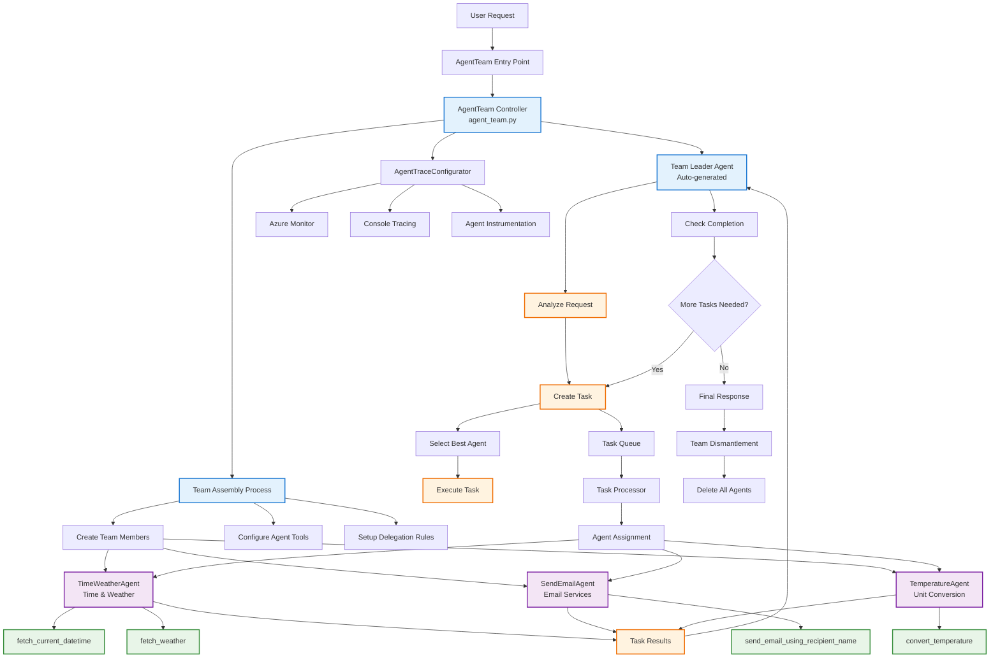
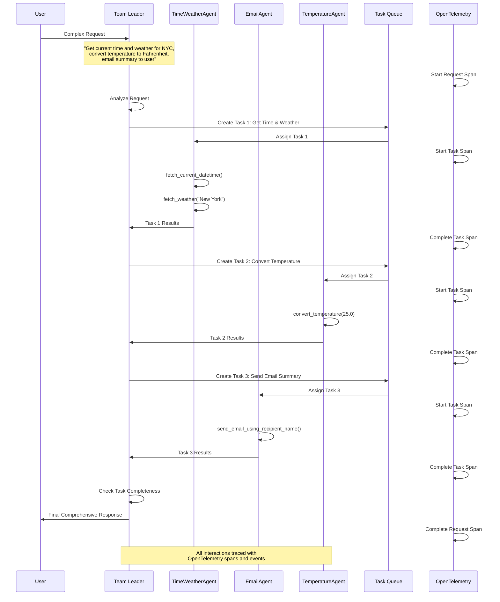
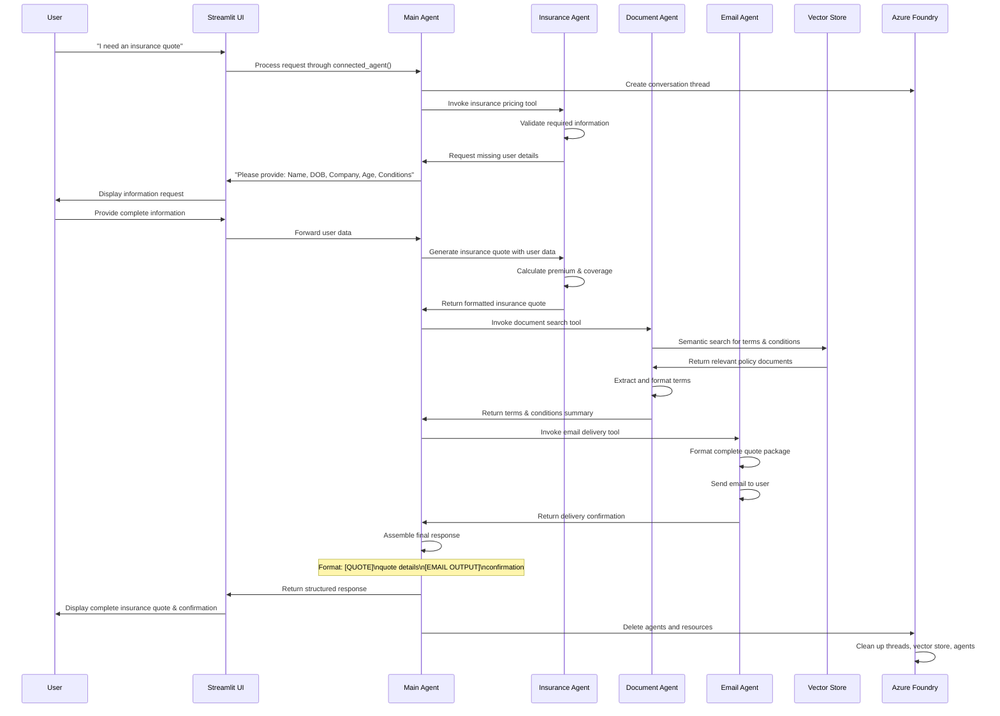
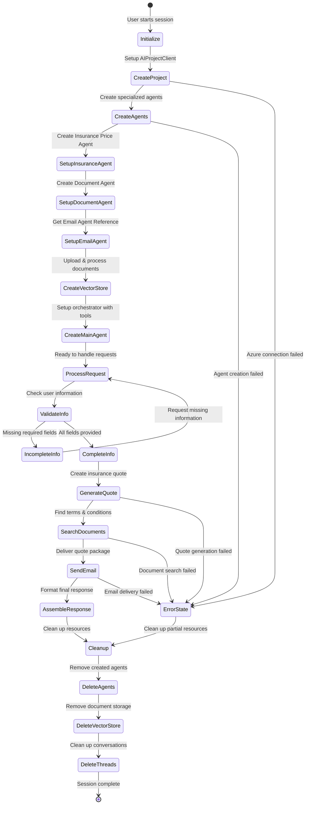
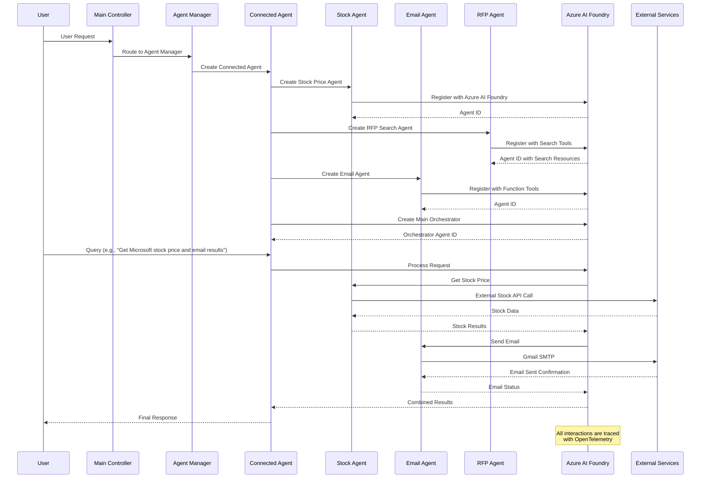
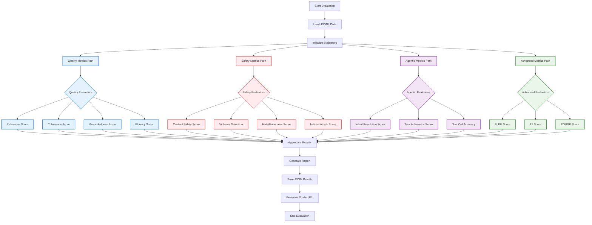
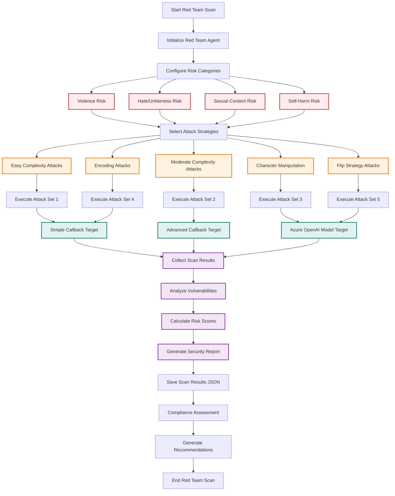
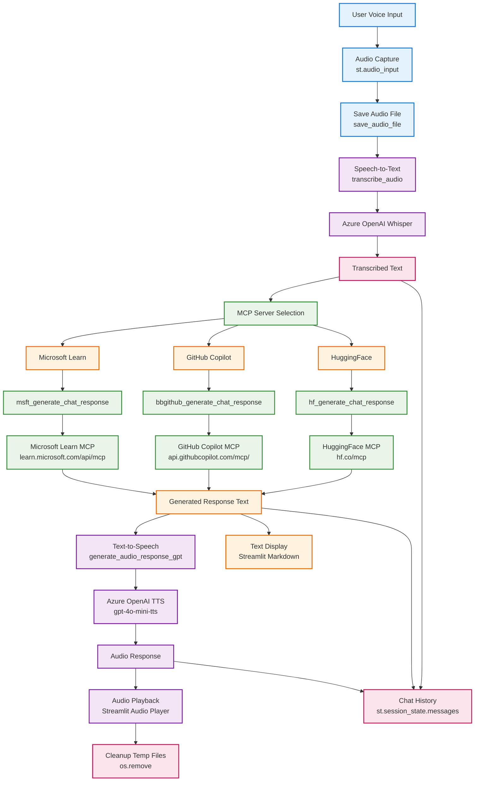
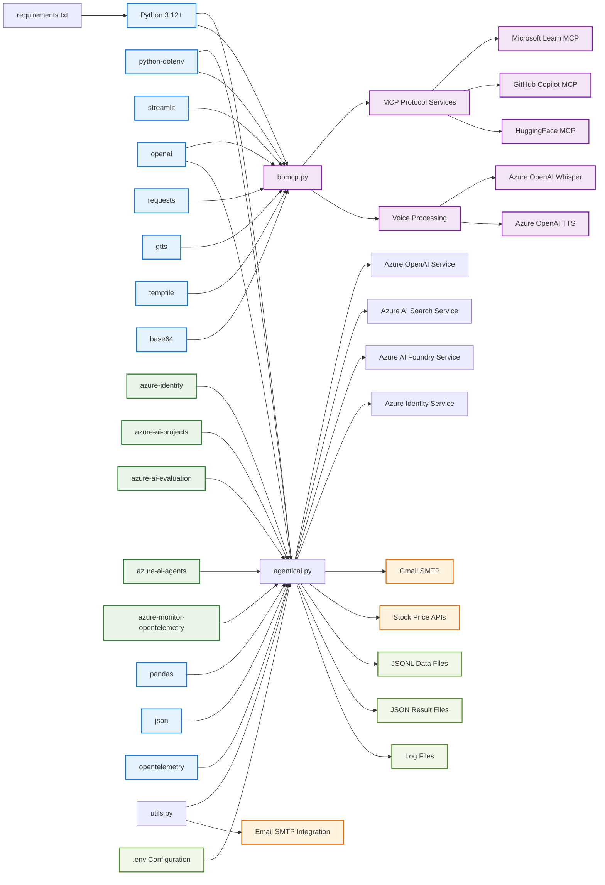

# AgenticAIFoundry - Mermaid Architecture Diagram

This document contains comprehensive mermaid diagrams showing the complete architecture of the AgenticAIFoundry platform, including all connected agents, evaluation frameworks, red team testing, and external integrations.

## Viewing the Diagrams

These mermaid diagrams can be viewed in several ways:

1. **GitHub**: The diagrams should render automatically when viewing this file on GitHub
2. **VS Code**: Install the "Mermaid Markdown Syntax Highlighting" extension
3. **Online Viewers**: Copy the mermaid code to [mermaid.live](https://mermaid.live) or [mermaid-js.github.io](https://mermaid-js.github.io/mermaid-live-editor)
4. **Local Tools**: Use mermaid CLI tools or browser extensions that support mermaid rendering

> **Note**: If the diagrams don't render properly in your environment, you can copy the mermaid code blocks to any online mermaid viewer for proper visualization.

## Complete System Architecture

```mermaid
graph TB
    %% Main Controller
    User[User Request] --> Main[Main Controller<br/>agenticai.py]
    User --> MCPInterface[MCP Voice Interface<br/>bbmcp.py]
    User --> VisionInterface[Vision Analysis Interface<br/>stdrawing.py]
    
    %% Core Agent Ecosystem
    Main --> AgentManager[Agent Manager]
    AgentManager --> CodeAgent[Code Interpreter Agent<br/>code_interpreter]
    AgentManager --> SearchAgent[AI Search Agent<br/>ai_search_agent]
    AgentManager --> ConnectedAgent[Connected Agent<br/>connected_agent]
    AgentManager --> ReasoningAgent[Reasoning Agent<br/>process_message_reasoning]
    AgentManager --> WeatherAgent[Weather Agent<br/>fetch_weather]
    AgentManager --> MultiAgentTeam[Multi-Agent Team<br/>sample_agents_multi_agent_team]
    
    %% MCP Integration Layer
    MCPInterface --> MCPManager[MCP Protocol Manager]
    MCPManager --> MSFTLearnMCP[Microsoft Learn MCP<br/>msft_generate_chat_response]
    MCPManager --> GitHubMCP[GitHub Copilot MCP<br/>bbgithub_generate_chat_response]
    MCPManager --> HuggingFaceMCP[HuggingFace MCP<br/>hf_generate_chat_response]
    
    %% Vision Analysis Layer
    VisionInterface --> VisionManager[Vision Analysis Manager]
    VisionManager --> AzureVision[Azure GPT-4.1 Vision<br/>analyze_with_azure]
    VisionManager --> O3Vision[O3 Vision Model<br/>analyze_with_o3]
    VisionManager --> ImageProcessor[Image Processing<br/>image_to_base64]
    
    %% Voice Interface Components
    MCPInterface --> VoiceInput[Audio Input<br/>save_audio_file]
    MCPInterface --> Transcription[Speech-to-Text<br/>transcribe_audio]
    MCPInterface --> TextToSpeech[Text-to-Speech<br/>generate_audio_response_gpt]
    MCPInterface --> ChatHistory[Chat History Management]
    
    %% Evaluation Framework
    Main --> EvalFramework[Evaluation Framework<br/>eval]
    EvalFramework --> QualityEval[Quality Evaluators]
    EvalFramework --> SafetyEval[Safety Evaluators]
    EvalFramework --> AgenticEval[Agentic Evaluators<br/>agent_eval]
    EvalFramework --> AdvancedEval[Advanced Metrics]
    
    %% Quality Evaluators Details
    QualityEval --> Relevance[Relevance Evaluator]
    QualityEval --> Coherence[Coherence Evaluator]
    QualityEval --> Groundedness[Groundedness Evaluator]
    QualityEval --> Fluency[Fluency Evaluator]
    QualityEval --> Similarity[Similarity Evaluator]
    
    %% Safety Evaluators Details
    SafetyEval --> ContentSafety[Content Safety Evaluator]
    SafetyEval --> Violence[Violence Evaluator]
    SafetyEval --> HateUnfairness[Hate/Unfairness Evaluator]
    SafetyEval --> Sexual[Sexual Content Evaluator]
    SafetyEval --> SelfHarm[Self-Harm Evaluator]
    SafetyEval --> IndirectAttack[Indirect Attack Evaluator]
    SafetyEval --> ProtectedMaterial[Protected Material Evaluator]
    
    %% Agentic Evaluators Details
    AgenticEval --> IntentResolution[Intent Resolution Evaluator]
    AgenticEval --> TaskAdherence[Task Adherence Evaluator]
    AgenticEval --> ToolCallAccuracy[Tool Call Accuracy Evaluator]
    
    %% Advanced Metrics Details
    AdvancedEval --> BLEU[BLEU Score Evaluator]
    AdvancedEval --> GLEU[GLEU Score Evaluator]
    AdvancedEval --> ROUGE[ROUGE Score Evaluator]
    AdvancedEval --> METEOR[METEOR Score Evaluator]
    AdvancedEval --> F1Score[F1 Score Evaluator]
    AdvancedEval --> Retrieval[Retrieval Evaluator]
    AdvancedEval --> GroundnessPro[Groundedness Pro Evaluator]
    
    %% Red Team Security Testing
    Main --> RedTeam[Red Team Framework<br/>redteam]
    RedTeam --> RiskCategories[Risk Categories]
    RedTeam --> AttackStrategies[Attack Strategies]
    RedTeam --> TargetSystems[Target Systems]
    
    %% Risk Categories Details
    RiskCategories --> ViolenceRisk[Violence]
    RiskCategories --> HateRisk[Hate/Unfairness]
    RiskCategories --> SexualRisk[Sexual Content]
    RiskCategories --> SelfHarmRisk[Self-Harm]
    
    %% Attack Strategies Details
    AttackStrategies --> EasyAttack[Easy Complexity]
    AttackStrategies --> ModerateAttack[Moderate Complexity]
    AttackStrategies --> CharManip[Character Manipulation]
    AttackStrategies --> Encoding[Encoding Attacks<br/>ROT13, Base64, Binary]
    AttackStrategies --> UnicodeAttack[Unicode Confusables]
    AttackStrategies --> FlipAttack[Flip Strategy]
    
    %% Target Systems Details
    TargetSystems --> SimpleCallback[Simple Callback Target]
    TargetSystems --> AdvancedCallback[Advanced Callback Target]
    TargetSystems --> ModelConfig[Azure OpenAI Model Config]
    
    %% Connected Agent Sub-components
    ConnectedAgent --> StockAgent[Stock Price Agent]
    ConnectedAgent --> EmailAgent[Email Agent<br/>send_email]
    ConnectedAgent --> RFPAgent[RFP Search Agent]
    ConnectedAgent --> MainOrchestrator[Main Orchestrator Agent]
    
    %% Azure AI Foundry Platform
    AgentManager --> AzureFoundry[Azure AI Foundry Platform]
    EvalFramework --> AzureFoundry
    RedTeam --> AzureFoundry
    
    AzureFoundry --> AgentMgmt[Agent Management]
    AzureFoundry --> ThreadMgmt[Thread Management]
    AzureFoundry --> MessageProc[Message Processing]
    AzureFoundry --> ToolExecution[Tool Execution Engine]
    
    %% Azure Services
    AzureFoundry --> AzureOpenAI[Azure OpenAI Services]
    AzureFoundry --> AzureSearch[Azure AI Search]
    AzureFoundry --> AzureIdentity[Azure Identity]
    AzureFoundry --> AzureCognitive[Azure Cognitive Services]
    
    %% Azure OpenAI Models
    AzureOpenAI --> GPT4Models[GPT-4 Models]
    AzureOpenAI --> O1Models[O1 Series Models<br/>Reasoning]
    AzureOpenAI --> O4Models[O4 Mini Models]
    
    %% Azure AI Search Components
    AzureSearch --> SearchIndex[Construction RFP Docs Index]
    AzureSearch --> VectorDB[Vector Database Connection]
    AzureSearch --> SimpleQuery[Simple Query Type]
    
    %% External Services Integration
    ConnectedAgent --> ExternalServices[External Services]
    ExternalServices --> GmailSMTP[Gmail SMTP<br/>Email Service]
    ExternalServices --> StockAPIs[Stock Price APIs]
    ExternalServices --> CustomAPIs[Custom APIs]
    ExternalServices --> FileSystem[File System<br/>Data Storage]
    
    %% MCP External Services
    MCPManager --> MCPServices[MCP Protocol Services]
    MCPServices --> MSFTLearnAPI[Microsoft Learn API<br/>learn.microsoft.com/api/mcp]
    MCPServices --> GitHubCopilotAPI[GitHub Copilot API<br/>api.githubcopilot.com/mcp/]
    MCPServices --> HuggingFaceAPI[HuggingFace API<br/>hf.co/mcp]
    
    %% Voice Processing Services
    MCPInterface --> VoiceServices[Voice Processing Services]
    VoiceServices --> WhisperAPI[Azure OpenAI Whisper<br/>Speech-to-Text]
    VoiceServices --> TTSAPI[Azure OpenAI TTS<br/>Text-to-Speech]
    
    %% Tool Systems
    CodeAgent --> CodeTool[Code Interpreter Tool]
    SearchAgent --> SearchTool[Azure AI Search Tool]
    ConnectedAgent --> ConnectedTools[Connected Agent Tools]
    WeatherAgent --> FunctionTool[Function Tool]
    
    %% Tool Details
    CodeTool --> PythonExec[Python Execution Engine]
    CodeTool --> DataAnalysis[Data Analysis<br/>Pandas, NumPy, Matplotlib]
    CodeTool --> Visualization[Visualization Tools]
    
    SearchTool --> QueryProcessor[Query Processor]
    SearchTool --> ResultRanker[Result Ranker]
    SearchTool --> TopKRetrieval[Top-K Retrieval]
    
    ConnectedTools --> StockTool[Stock Price Tool]
    ConnectedTools --> EmailTool[Email Tool]
    ConnectedTools --> SearchConnTool[Search Connected Tool]
    
    %% Monitoring and Telemetry
    Main --> Monitoring[Monitoring & Telemetry]
    Monitoring --> OpenTelemetry[OpenTelemetry Integration]
    Monitoring --> AzureMonitor[Azure Monitor]
    Monitoring --> Tracing[Request Tracing]
    Monitoring --> Performance[Performance Monitoring]
    
    %% Data Flow and Storage
    EvalFramework --> DataStorage[Data Storage]
    RedTeam --> DataStorage
    DataStorage --> JSONLFiles[JSONL Input Files]
    DataStorage --> JSONResults[JSON Result Files]
    DataStorage --> LogFiles[Log Files]
    DataStorage --> ConfigFiles[Configuration Files<br/>.env]
    
    %% Results and Outputs
    EvalFramework --> EvalResults[Evaluation Results]
    RedTeam --> SecurityResults[Security Scan Results]
    AgentManager --> AgentResponses[Agent Responses]
    
    EvalResults --> MetricsReport[Metrics Report]
    EvalResults --> StudioURL[AI Foundry Studio URL]
    SecurityResults --> VulnAssessment[Vulnerability Assessment]
    SecurityResults --> RiskScoring[Risk Scoring]
    SecurityResults --> ComplianceReport[Compliance Report]
    
    %% Styling
    classDef agentClass fill:#e1f5fe,stroke:#0277bd,stroke-width:2px
    classDef evalClass fill:#f3e5f5,stroke:#7b1fa2,stroke-width:2px
    classDef securityClass fill:#ffebee,stroke:#c62828,stroke-width:2px
    classDef azureClass fill:#e8f5e8,stroke:#2e7d32,stroke-width:2px
    classDef externalClass fill:#fff3e0,stroke:#ef6c00,stroke-width:2px
    classDef dataClass fill:#f1f8e9,stroke:#558b2f,stroke-width:2px
    
    class CodeAgent,SearchAgent,ConnectedAgent,ReasoningAgent,WeatherAgent,AgentManager agentClass
    class EvalFramework,QualityEval,SafetyEval,AgenticEval,AdvancedEval evalClass
    class RedTeam,RiskCategories,AttackStrategies,SecurityResults securityClass
    class AzureFoundry,AzureOpenAI,AzureSearch,AzureIdentity azureClass
    class ExternalServices,GmailSMTP,StockAPIs externalClass
    class DataStorage,JSONLFiles,JSONResults dataClass
    class MCPInterface,MCPManager,MSFTLearnMCP,GitHubMCP,HuggingFaceMCP mcpClass
    class VoiceInput,Transcription,TextToSpeech,ChatHistory voiceClass
    class VisionInterface,VisionManager,AzureVision,O3Vision,ImageProcessor visionClass
```



## Multi-Agent Team Coordination Architecture



## Multi-Agent Team Task Delegation Flow



## Insurance Quote Assistant Multi-Agent Architecture

```mermaid
graph TB
    %% User Interface
    User[User] --> StreamlitUI[Streamlit Interface<br/>stins.py]
    StreamlitUI --> ChatInput[Chat Input Processing]
    
    %% Main Orchestrator
    ChatInput --> MainAgent[Main Orchestrator<br/>InsuranceQuoteAssistant]
    
    %% Connected Agents
    MainAgent --> InsuranceAgent[Insurance Price Agent<br/>insurancepricebot]
    MainAgent --> DocumentAgent[Document Search Agent<br/>insdocagent]  
    MainAgent --> EmailAgent[Email Agent<br/>sendemail]
    
    %% Agent Capabilities
    InsuranceAgent --> InfoValidation[Information Validation<br/>• First Name<br/>• Last Name<br/>• Date of Birth<br/>• Company Name<br/>• Age<br/>• Preexisting Conditions]
    InsuranceAgent --> QuoteCalc[Quote Calculation<br/>• Premium Calculation<br/>• Coverage Analysis<br/>• Risk Assessment]
    
    DocumentAgent --> VectorStore[Vector Store<br/>insurance_vector_store]
    VectorStore --> FileSearch[File Search Tool<br/>insurancetc.pdf]
    DocumentAgent --> TermsExtraction[Terms Extraction<br/>• Policy Terms<br/>• Conditions<br/>• Legal Requirements]
    
    EmailAgent --> EmailFormat[Email Formatting<br/>• Quote Integration<br/>• Terms Attachment<br/>• Professional Layout]
    EmailAgent --> DeliveryService[Email Delivery<br/>• SMTP Integration<br/>• Confirmation<br/>• Error Handling]
    
    %% Response Assembly
    QuoteCalc --> ResponseAssembly[Response Assembly]
    TermsExtraction --> ResponseAssembly
    DeliveryService --> ResponseAssembly
    
    ResponseAssembly --> FinalFormat[Final Response<br/>QUOTE<br/>quote details<br/>[EMAIL OUTPUT]<br/>confirmation]
    FinalFormat --> StreamlitUI
    
    %% Azure AI Foundry Integration
    MainAgent --> AzureFoundry[Azure AI Foundry<br/>AIProjectClient]
    AzureFoundry --> AgentManagement[Agent Management<br/>• Lifecycle<br/>• Threading<br/>• Cleanup]
    AzureFoundry --> ConnectedTools[Connected Agent Tools<br/>• Tool Definitions<br/>• Communication<br/>• Orchestration]
    
    %% Styling
    classDef userClass fill:#e1f5fe,stroke:#0277bd,stroke-width:2px
    classDef agentClass fill:#f3e5f5,stroke:#7b1fa2,stroke-width:2px
    classDef toolClass fill:#e8f5e8,stroke:#388e3c,stroke-width:2px
    classDef azureClass fill:#fff3e0,stroke:#ef6c00,stroke-width:2px
    
    class User,StreamlitUI,ChatInput userClass
    class MainAgent,InsuranceAgent,DocumentAgent,EmailAgent agentClass
    class InfoValidation,QuoteCalc,TermsExtraction,EmailFormat toolClass
    class AzureFoundry,AgentManagement,ConnectedTools azureClass
```

## Insurance Assistant Sequential Processing Flow



## Insurance Assistant Resource Lifecycle


```

## Agent Interaction Flow Diagram



## Evaluation Pipeline Flow



## Red Team Security Testing Flow



## MCP Voice Interface Flow



## Component Dependencies



---

*This mermaid diagram provides a comprehensive visual representation of the AgenticAIFoundry architecture, showing all connected agents, evaluation frameworks, security testing components, MCP protocol integration, voice interface capabilities, and their relationships. The diagram is designed to complement the Architecture Blueprint document and provide an interactive visual guide to the system.*
