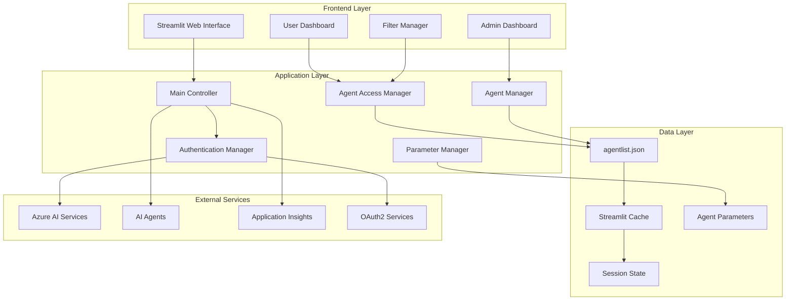
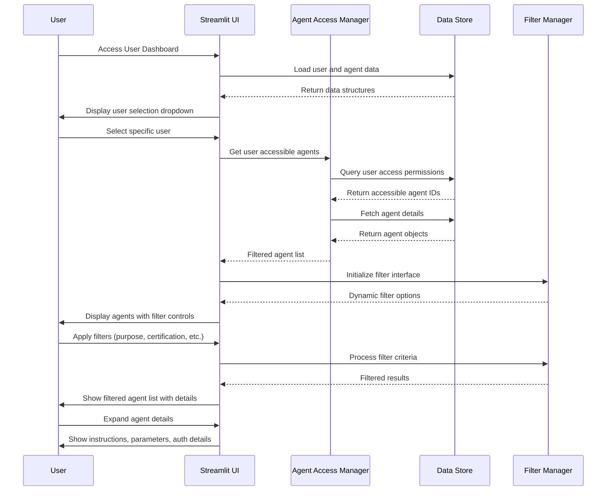
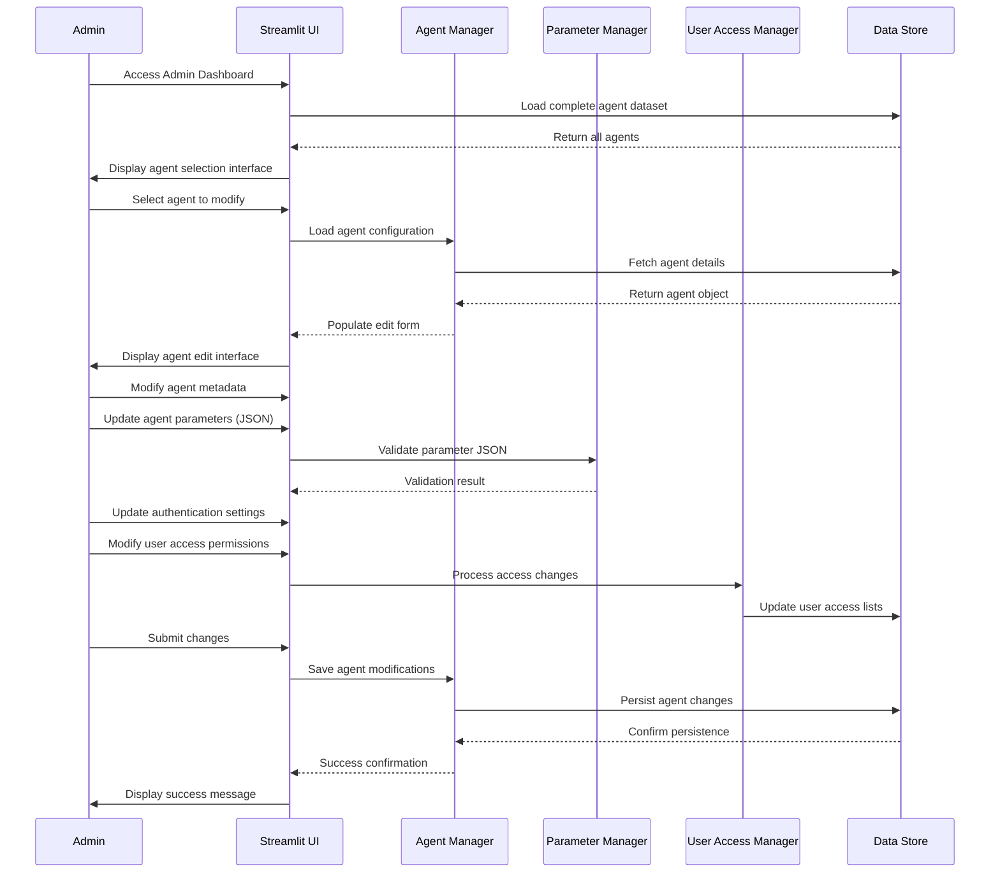
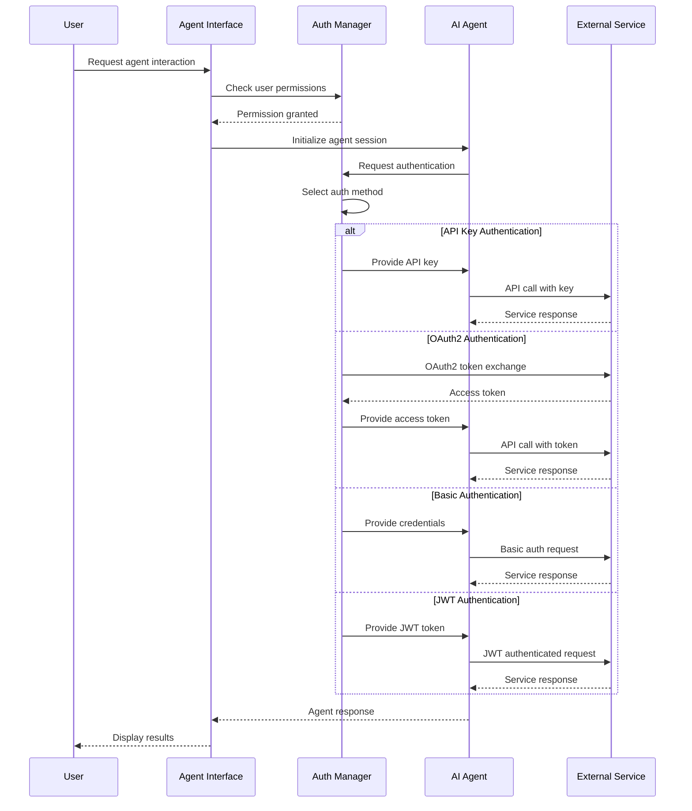

# Agents Access Dashboard (`stagentlist.py`) - Complete Documentation

## Overview

The Agents Access Dashboard is a sophisticated Streamlit-based web application designed for managing user access to AI agents within the AgenticAI ecosystem. This application provides comprehensive agent lifecycle management, user access control, and administrative oversight for AI agent deployments across different business units and use cases.

## Architecture Overview

### System Components



### Data Model

The application manages sophisticated data structures for agent and user management:

#### Agent Object
```json
{
  "id": "integer",
  "name": "string",
  "business_unit": "string",
  "instructions": "string",
  "prompt": "string",
  "purpose": "string",
  "owner": "string",
  "auth": {
    "method": "api_key|oauth2|basic_auth|jwt",
    "credentials": {
      "api_key": "string",
      "token": "string",
      "username": "string",
      "password": "string"
    }
  },
  "parameters": {
    "temperature": "float",
    "max_tokens": "integer",
    "model": "string",
    "top_p": "float"
  },
  "certified": "boolean",
  "expiration_date": "YYYY-MM-DD"
}
```

#### User Object
```json
{
  "id": "integer",
  "username": "string",
  "password": "string",
  "access_agents": ["array of agent IDs"]
}
```

## Core Functionality

### 1. User Access Dashboard

The User Access Dashboard provides a comprehensive view of AI agents accessible to specific users with advanced filtering capabilities.

#### Key Features:

- **User Selection**: Dropdown interface for user selection
- **Multi-Dimensional Filtering**:
  - Purpose-based filtering (Customer Support, Code Review, etc.)
  - Certification status filtering (Certified/Non-certified)
  - Business unit filtering (Engineering, Finance, HR, etc.)
  - Owner-based filtering
- **Expiration Management**: Visual indicators and tracking for agent expiration
- **Detailed Agent Views**: Expandable sections showing:
  - Complete instructions and prompts
  - Authentication methods and credentials
  - Model parameters and configurations

#### Filtering Logic:
```python
def apply_filters(agents, filters):
    """Apply multi-dimensional filters to agent list"""
    filtered_agents = agents
    
    if filters.get('purpose'):
        filtered_agents = [a for a in filtered_agents 
                          if a.get('purpose') in filters['purpose']]
    
    if filters.get('certified') != 'All':
        certified_value = filters['certified'] == 'Yes'
        filtered_agents = [a for a in filtered_agents 
                          if bool(a.get('certified')) == certified_value]
    
    if filters.get('business_unit'):
        filtered_agents = [a for a in filtered_agents 
                          if a.get('business_unit') in filters['business_unit']]
    
    return filtered_agents
```

### 2. Admin Dashboard

The Admin Dashboard provides comprehensive agent lifecycle management and user access administration.

#### Administrative Features:

- **Agent Selection**: Dropdown interface for selecting agents to manage
- **Metadata Management**:
  - Basic properties (name, certification, expiration)
  - Organizational details (business unit, owner, purpose)
  - Operational instructions and prompts
- **Parameter Configuration**: JSON-based parameter management for:
  - Model temperature and token limits
  - Model selection and inference parameters
  - Custom agent-specific configurations
- **Authentication Management**: Support for multiple auth methods:
  - API Key authentication
  - OAuth2 token-based authentication
  - Basic authentication (username/password)
  - JWT token authentication
- **User Access Matrix**: Visual representation of user-agent access relationships

#### Access Management Logic:
```python
def update_user_access_for_agent(agent_id, selected_usernames, users_list):
    """Update user access lists for agent permissions"""
    agent_id_str = str(agent_id)
    username_set = set(selected_usernames)
    
    for user in users_list:
        access_list = [str(aid) for aid in user.get('access_agents', [])]
        has_access = agent_id_str in access_list
        
        if user['username'] in username_set and not has_access:
            user.setdefault('access_agents', []).append(agent_id_str)
        elif user['username'] not in username_set and has_access:
            user['access_agents'] = [aid for aid in access_list 
                                   if aid != agent_id_str]
    
    # Ensure uniqueness and string type consistency
    for user in users_list:
        if 'access_agents' in user:
            user['access_agents'] = sorted({str(aid) for aid in user['access_agents']})
```

## Configuration Management

### Environment Variables

The application shares configuration with the broader AgenticAI ecosystem:

| Variable | Purpose | Example |
|----------|---------|---------|
| `PROJECT_ENDPOINT` | Azure AI Project endpoint | `https://account.services.ai.azure.com/api/projects/project` |
| `MODEL_ENDPOINT` | Azure OpenAI endpoint | `https://account.services.ai.azure.com` |
| `MODEL_API_KEY` | Azure OpenAI API key | `abc123...` |
| `MODEL_DEPLOYMENT_NAME` | Model deployment name | `gpt-4o-mini` |
| `APPLICATION_INSIGHTS_CONNECTION_STRING` | Telemetry connection string | `InstrumentationKey=...` |

### Agent Parameter Schema

Agents support flexible parameter configurations:

```json
{
  "temperature": 0.7,
  "max_tokens": 150,
  "model": "gpt-4",
  "top_p": 0.9,
  "custom_parameter": "value"
}
```

### Authentication Methods

#### API Key Authentication
```json
{
  "method": "api_key",
  "credentials": {
    "api_key": "agent_api_123456"
  }
}
```

#### OAuth2 Authentication
```json
{
  "method": "oauth2",
  "credentials": {
    "token": "oauth_token_654321"
  }
}
```

#### Basic Authentication
```json
{
  "method": "basic_auth",
  "credentials": {
    "username": "agentuser",
    "password": "securepassword"
  }
}
```

#### JWT Authentication
```json
{
  "method": "jwt",
  "credentials": {
    "token": "jwt_token_789012"
  }
}
```

## Security Features

### Multi-Method Authentication Support

The system supports diverse authentication mechanisms to accommodate different agent types and security requirements:

1. **API Key**: Simple key-based authentication for internal agents
2. **OAuth2**: Token-based authentication for external services
3. **Basic Auth**: Username/password for legacy systems
4. **JWT**: JSON Web Token for modern microservices

### Access Control Matrix

Advanced RBAC implementation with:

- **User-Agent Mapping**: Granular control over agent access
- **Business Unit Isolation**: Agents can be restricted by organizational boundaries
- **Certification Requirements**: Access control based on agent certification status
- **Expiration Management**: Automatic access revocation for expired agents

### Data Security

- **Credential Protection**: Sensitive authentication data stored securely
- **Session Isolation**: User sessions isolated using Streamlit session state
- **Audit Integration**: Comprehensive logging via Application Insights
- **Parameter Validation**: JSON parameter validation and sanitization

## Technical Implementation

### Core Functions

#### Data Loading with Error Handling
```python
@st.cache_data
def load_data():
    """Load and cache user and agent data with error handling"""
    try:
        with open('agentlist.json', 'r') as f:
            data = json.load(f)
        return data['users'], data['agents']
    except FileNotFoundError:
        st.error("Agent configuration file not found")
        return [], []
    except json.JSONDecodeError as e:
        st.error(f"Invalid JSON configuration: {e}")
        return [], []
```

#### Robust Data Persistence
```python
def save_agent_data(updated_users, updated_agents, file_path='agentlist.json'):
    """Persist modified users and agents with validation"""
    try:
        existing = {}
        try:
            with open(file_path, 'r') as f:
                existing = json.load(f)
        except FileNotFoundError:
            pass
        
        existing['users'] = updated_users
        existing['agents'] = updated_agents
        
        with open(file_path, 'w') as f:
            json.dump(existing, f, indent=2)
        
        st.cache_data.clear()
        return True, None
    except Exception as e:
        return False, str(e)
```

#### Type-Safe Agent Lookup
```python
def get_agent_by_id(agent_list, agent_id):
    """Type-safe agent lookup by ID"""
    aid = str(agent_id).strip()
    for agent in agent_list:
        if str(agent.get('id')).strip() == aid:
            return agent
    return None
```

### Advanced UI Components

#### Dynamic Filtering Interface
```python
def render_filter_interface(accessible_agents):
    """Render dynamic filter interface based on available data"""
    purposes = sorted({a.get('purpose') for a in accessible_agents if a.get('purpose')})
    business_units = sorted({a.get('business_unit') for a in accessible_agents if a.get('business_unit')})
    owners = sorted({a.get('owner') for a in accessible_agents if a.get('owner')})
    
    col1, col2 = st.columns(2)
    with col1:
        selected_purpose = st.multiselect("Filter by Purpose:", purposes, default=purposes)
    with col2:
        selected_certified = st.selectbox("Filter by Certified:", ['All', 'Yes', 'No'], index=0)
    
    return {
        'purpose': selected_purpose,
        'certified': selected_certified,
        'business_unit': business_units,
        'owner': owners
    }
```

#### Parameter Management Interface
```python
def render_parameter_editor(agent_obj):
    """Render JSON parameter editor with validation"""
    current_params = agent_obj.get('parameters', {})
    params_json = json.dumps(current_params, indent=2)
    
    params_raw = st.text_area(
        "Parameters JSON", 
        value=params_json, 
        height=180,
        help="Enter valid JSON for agent parameters"
    )
    
    try:
        parsed_params = json.loads(params_raw) if params_raw.strip() else {}
        return parsed_params, None
    except json.JSONDecodeError as e:
        return current_params, f"Invalid JSON: {e}"
```

## Integration Points

### Azure AI Services Integration

Comprehensive integration with Azure ecosystem:

```python
# Azure AI Project Client Configuration
project_client = AIProjectClient(
    endpoint=endpoint,
    credential=DefaultAzureCredential(),
)

# OpenAI Client for Agent Capabilities
client = AzureOpenAI(
    azure_endpoint=os.getenv("AZURE_OPENAI_ENDPOINT"), 
    api_key=os.getenv("AZURE_OPENAI_KEY"),  
    api_version="2024-10-21",
)
```

### Telemetry and Monitoring

Advanced observability features:

```python
from opentelemetry import trace
tracer = trace.get_tracer(__name__)

# Telemetry integration for agent interactions
configure_azure_monitor(connection_string=connection_string)
```

## Usage Workflows

### User Agent Discovery Workflow



### Admin Agent Management Workflow



### Agent Authentication Flow



## Performance Optimizations

### Advanced Caching Strategy

1. **Multi-Level Caching**:
   - File-level caching with `@st.cache_data`
   - Session-level caching for user interactions
   - Component-level caching for filter states

2. **Lazy Loading**:
   - Agent details loaded on-demand
   - Parameter validation on form submission
   - Authentication details shown only when needed

3. **Efficient Data Structures**:
   - Set-based operations for access control
   - Dictionary lookups for agent retrieval
   - List comprehensions for filtering

### Memory Management

```python
# Efficient filtering with generator expressions
filtered_agents = (agent for agent in accessible_agents 
                  if meets_filter_criteria(agent, filters))

# Memory-efficient access control
access_set = set(str(aid) for aid in user.get('access_agents', []))
has_access = str(agent_id) in access_set
```

## Error Handling and Validation

### Parameter Validation

```python
def validate_agent_parameters(params_json):
    """Validate agent parameter JSON with detailed error reporting"""
    try:
        parsed = json.loads(params_json) if params_json.strip() else {}
        
        # Validate common parameters
        if 'temperature' in parsed:
            temp = parsed['temperature']
            if not isinstance(temp, (int, float)) or not 0 <= temp <= 2:
                return None, "Temperature must be a number between 0 and 2"
        
        if 'max_tokens' in parsed:
            tokens = parsed['max_tokens']
            if not isinstance(tokens, int) or tokens <= 0:
                return None, "Max tokens must be a positive integer"
        
        return parsed, None
    except json.JSONDecodeError as e:
        return None, f"Invalid JSON: {e}"
```

### Authentication Validation

```python
def validate_auth_config(auth_config):
    """Validate authentication configuration"""
    method = auth_config.get('method')
    credentials = auth_config.get('credentials', {})
    
    if method == 'api_key' and not credentials.get('api_key'):
        return False, "API key is required for api_key authentication"
    
    if method == 'oauth2' and not credentials.get('token'):
        return False, "Token is required for OAuth2 authentication"
    
    if method == 'basic_auth':
        if not credentials.get('username') or not credentials.get('password'):
            return False, "Username and password required for basic authentication"
    
    if method == 'jwt' and not credentials.get('token'):
        return False, "JWT token is required for JWT authentication"
    
    return True, None
```

## Deployment Considerations

### Prerequisites

1. **Environment Setup**:
   - Python 3.8+ with required dependencies
   - Azure AI services properly configured
   - Valid `agentlist.json` configuration file

2. **Security Configuration**:
   - Proper environment variable setup
   - Azure credential configuration
   - Application Insights connection string

3. **Data Initialization**:
   - Well-formed JSON configuration
   - Valid agent parameter schemas
   - Proper user-agent access mappings

### Production Deployment

#### Scalability Considerations

1. **Database Migration**: Consider migrating from JSON to database for larger deployments
2. **Caching Strategy**: Implement Redis or similar for distributed caching
3. **Load Balancing**: Support for multiple Streamlit instances
4. **Session Management**: External session storage for high availability

#### Security Hardening

1. **Credential Encryption**: Encrypt sensitive authentication data
2. **Access Logging**: Comprehensive audit trails
3. **Rate Limiting**: Prevent abuse of agent interactions
4. **Network Security**: Proper firewall and network isolation

## Monitoring and Observability

### Application Insights Integration

```python
# Telemetry for agent interactions
with tracer.start_as_current_span("agent_access_check"):
    accessible_agents = get_user_accessible_agents(user, agents)
    tracer.get_current_span().set_attribute("agent_count", len(accessible_agents))
```

### Key Metrics to Monitor

1. **Usage Metrics**:
   - Agent access frequency
   - User activity patterns
   - Popular agent types

2. **Performance Metrics**:
   - Page load times
   - Filter operation performance
   - Data persistence latency

3. **Security Metrics**:
   - Authentication failures
   - Unauthorized access attempts
   - Expired agent usage

## Troubleshooting Guide

### Common Issues and Solutions

#### 1. Agent Access Issues
**Symptoms**: User cannot see expected agents
**Solutions**:
- Verify user has correct access permissions in `agentlist.json`
- Check agent expiration dates
- Validate agent certification requirements

#### 2. Parameter Validation Errors
**Symptoms**: Invalid JSON parameter errors
**Solutions**:
- Validate JSON syntax using online validators
- Check parameter value ranges (temperature, tokens)
- Ensure proper data types for parameters

#### 3. Authentication Configuration Issues
**Symptoms**: Agent authentication failures
**Solutions**:
- Verify authentication method matches agent requirements
- Check credential validity and format
- Validate external service connectivity

#### 4. Performance Issues
**Symptoms**: Slow dashboard loading
**Solutions**:
- Clear Streamlit cache: `st.cache_data.clear()`
- Check JSON file size and structure
- Monitor Application Insights for bottlenecks

### Debug Mode

Enable detailed debugging:

```python
import logging
logging.basicConfig(level=logging.DEBUG)
```

## Future Enhancements

### Planned Improvements

1. **Advanced Analytics**:
   - Agent usage analytics and reporting
   - Performance metrics dashboard
   - User behavior analysis

2. **Enhanced Security**:
   - Multi-factor authentication
   - Advanced RBAC with custom roles
   - Encryption at rest for sensitive data

3. **Integration Expansion**:
   - REST API for external integrations
   - Webhook support for real-time updates
   - Third-party identity provider integration

4. **Operational Features**:
   - Bulk agent management operations
   - Automated agent deployment workflows
   - Configuration backup and restore

## API Reference

### Core Functions

#### Data Management
- `load_data()`: Load users and agents from JSON configuration
- `save_agent_data(users, agents)`: Persist data changes with validation
- `get_agent_by_id(agents, agent_id)`: Type-safe agent lookup

#### Access Control
- `update_user_access_for_agent(agent_id, usernames, users)`: Update user permissions
- `get_user_accessible_agents(user, agents)`: Get agents accessible to user

#### Validation
- `validate_agent_parameters(params_json)`: Validate agent parameter JSON
- `validate_auth_config(auth_config)`: Validate authentication configuration

#### UI Components
- `render_filter_interface(agents)`: Dynamic filter interface
- `render_parameter_editor(agent)`: JSON parameter editor
- `render_access_matrix(users, agents)`: User-agent access visualization

### Configuration Schema

#### Environment Variables
- `PROJECT_ENDPOINT`: Azure AI project endpoint
- `MODEL_DEPLOYMENT_NAME`: OpenAI model deployment name
- `APPLICATION_INSIGHTS_CONNECTION_STRING`: Telemetry connection

#### Data Structures
- Agent object schema with metadata, parameters, and authentication
- User object schema with access permissions
- Parameter schema with validation rules

This comprehensive documentation provides complete coverage of the Agents Access Dashboard system, including detailed architecture, implementation patterns, security considerations, and operational procedures for effective agent lifecycle management.