# AI Maturity Assessment Tool - Mermaid Architecture Diagrams

## 📋 Overview

This document contains comprehensive Mermaid diagrams for the AI Maturity Assessment Tool (`stasses.py`), illustrating system architecture, user workflows, data flows, and component interactions.

## Table of Contents
1. [System Architecture Diagram](#system-architecture-diagram)
2. [User Assessment Workflow](#user-assessment-workflow)
3. [Data Flow Architecture](#data-flow-architecture)
4. [Component Interaction Diagram](#component-interaction-diagram)
5. [Azure Integration Architecture](#azure-integration-architecture)
6. [Assessment Processing Pipeline](#assessment-processing-pipeline)
7. [Recommendation Generation Flow](#recommendation-generation-flow)
8. [State Management Diagram](#state-management-diagram)

## 🏗️ System Architecture Diagram

### Complete System Overview

```mermaid
graph TB
    %% User Interface Layer
    User[👤 User] --> StreamlitUI[🖥️ Streamlit Web Interface]
    
    %% Frontend Components
    StreamlitUI --> AssessmentForm[📝 Assessment Form]
    StreamlitUI --> VisualizationEngine[📊 Visualization Engine]
    StreamlitUI --> ResultsDisplay[📋 Results Display]
    
    %% Core Application Layer
    AssessmentForm --> AssessmentEngine[⚙️ Assessment Engine]
    AssessmentEngine --> ScoringEngine[📊 Scoring Engine]
    AssessmentEngine --> QuadrantClassifier[📍 Quadrant Classifier]
    
    %% Configuration Management
    ConfigManager[⚙️ Config Manager] --> AssessmentEngine
    ConfigJSON[📄 aiassessment.json] --> ConfigManager
    
    %% AI Recommendation Service
    QuadrantClassifier --> RecommendationService[🤖 AI Recommendation Service]
    RecommendationService --> AzureOpenAI[🧠 Azure OpenAI]
    
    %% Visualization Components
    ScoringEngine --> VisualizationEngine
    QuadrantClassifier --> VisualizationEngine
    VisualizationEngine --> PlotlyChart[📈 Plotly Interactive Chart]
    VisualizationEngine --> DataTable[📊 Results Data Table]
    
    %% Azure AI Foundry Integration
    AzureFoundry[☁️ Azure AI Foundry] --> ProjectClient[🔗 AI Project Client]
    ProjectClient --> TelemetryService[📡 Telemetry Service]
    ProjectClient --> AzureMonitor[📊 Azure Monitor]
    
    %% Monitoring and Observability
    TelemetryService --> OpenTelemetry[📈 OpenTelemetry]
    OpenTelemetry --> AzureMonitor
    
    %% Environment and Security
    EnvVars[🔐 Environment Variables] --> AzureOpenAI
    EnvVars --> AzureFoundry
    DefaultCredential[🔑 DefaultAzureCredential] --> ProjectClient
    
    %% Results Flow
    RecommendationService --> ResultsDisplay
    PlotlyChart --> ResultsDisplay
    DataTable --> ResultsDisplay
    
    %% Styling
    classDef userClass fill:#e1f5fe,stroke:#01579b,stroke-width:2px
    classDef uiClass fill:#f3e5f5,stroke:#4a148c,stroke-width:2px
    classDef engineClass fill:#e8f5e8,stroke:#1b5e20,stroke-width:2px
    classDef azureClass fill:#fff3e0,stroke:#e65100,stroke-width:2px
    classDef configClass fill:#fce4ec,stroke:#880e4f,stroke-width:2px
    classDef monitorClass fill:#f1f8e9,stroke:#33691e,stroke-width:2px
    
    class User userClass
    class StreamlitUI,AssessmentForm,VisualizationEngine,ResultsDisplay,PlotlyChart,DataTable uiClass
    class AssessmentEngine,ScoringEngine,QuadrantClassifier,RecommendationService engineClass
    class AzureOpenAI,AzureFoundry,ProjectClient,DefaultCredential azureClass
    class ConfigManager,ConfigJSON,EnvVars configClass
    class TelemetryService,OpenTelemetry,AzureMonitor monitorClass
```

## 🔄 User Assessment Workflow

### Interactive Assessment Process

```mermaid
sequenceDiagram
    participant User as 👤 User
    participant UI as 🖥️ Streamlit UI
    participant Form as 📝 Assessment Form
    participant Engine as ⚙️ Assessment Engine
    participant Scoring as 📊 Scoring Engine
    participant Classifier as 📍 Quadrant Classifier
    participant AI as 🤖 Azure OpenAI
    participant Viz as 📊 Visualization
    
    User->>UI: Access Assessment Tool
    UI->>Form: Load Assessment Form
    Form->>User: Display 6 Dimensions + Questions
    
    loop For Each Dimension
        User->>Form: Fill Slider Values (1-5)
        Form->>Form: Store in Session State
    end
    
    User->>Form: Submit Assessment
    Form->>Engine: Process Assessment Data
    
    Engine->>Scoring: Calculate Dimension Scores
    Scoring->>Scoring: Apply Weights
    Scoring->>Engine: Return Weighted Scores
    
    Engine->>Classifier: Determine Quadrant Position
    Classifier->>Classifier: Calculate X,Y Coordinates
    Classifier->>Engine: Return Quadrant Assignment
    
    Engine->>AI: Generate Recommendations
    AI->>AI: Process Assessment Context
    AI->>Engine: Return Strategic Guidance
    
    Engine->>Viz: Prepare Visualization Data
    Viz->>Viz: Generate Plotly Chart
    Viz->>Viz: Create Results Table
    
    Viz->>UI: Display Complete Results
    UI->>User: Show Quadrant Chart + Recommendations
    
    Note over User,Viz: Assessment Complete
```

## 📊 Data Flow Architecture

### Configuration and Data Processing Flow

```mermaid
flowchart TD
    %% Configuration Loading
    ConfigFile[📄 aiassessment.json] --> ConfigLoader{🔄 Config Loader}
    ConfigLoader --> Dimensions[📋 6 Assessment Dimensions]
    ConfigLoader --> Questions[❓ Question Sets]
    ConfigLoader --> Weights[⚖️ Dimension Weights]
    
    %% User Input Processing
    Dimensions --> FormGeneration[📝 Dynamic Form Generation]
    Questions --> FormGeneration
    FormGeneration --> UserInterface[🖥️ Streamlit Interface]
    
    UserInterface --> UserInput[👤 User Responses]
    UserInput --> SessionState[💾 Session State Storage]
    
    %% Assessment Processing
    SessionState --> ValidationLayer[✅ Input Validation]
    ValidationLayer --> ScoringCalculation[📊 Score Calculation]
    Weights --> ScoringCalculation
    
    ScoringCalculation --> DimensionScores[📊 Dimension Scores]
    DimensionScores --> WeightedScores[⚖️ Weighted Scores]
    
    %% Quadrant Analysis
    WeightedScores --> QuadrantLogic[📍 Quadrant Classification]
    QuadrantLogic --> Coordinates[📍 X,Y Coordinates]
    QuadrantLogic --> BubbleSize[⭕ Bubble Size Calculation]
    QuadrantLogic --> ColorScore[🎨 Color Intensity]
    
    %% AI Recommendation Generation
    DimensionScores --> PromptConstruction[📝 Prompt Construction]
    WeightedScores --> PromptConstruction
    PromptConstruction --> AzureOpenAI[🧠 Azure OpenAI API]
    AzureOpenAI --> AIRecommendations[🤖 AI Recommendations]
    
    %% Visualization Generation
    Coordinates --> PlotlyVisualization[📈 Plotly Chart Generation]
    BubbleSize --> PlotlyVisualization
    ColorScore --> PlotlyVisualization
    
    DimensionScores --> ResultsTable[📊 Results Data Table]
    WeightedScores --> ResultsTable
    
    %% Final Output
    PlotlyVisualization --> FinalDisplay[🖥️ Final Results Display]
    ResultsTable --> FinalDisplay
    AIRecommendations --> FinalDisplay
    
    %% Styling
    classDef configClass fill:#fce4ec,stroke:#880e4f,stroke-width:2px
    classDef processClass fill:#e8f5e8,stroke:#1b5e20,stroke-width:2px
    classDef uiClass fill:#e1f5fe,stroke:#01579b,stroke-width:2px
    classDef azureClass fill:#fff3e0,stroke:#e65100,stroke-width:2px
    classDef outputClass fill:#f3e5f5,stroke:#4a148c,stroke-width:2px
    
    class ConfigFile,ConfigLoader,Dimensions,Questions,Weights configClass
    class ValidationLayer,ScoringCalculation,QuadrantLogic,PromptConstruction processClass
    class FormGeneration,UserInterface,UserInput,SessionState,FinalDisplay uiClass
    class AzureOpenAI azureClass
    class PlotlyVisualization,ResultsTable,AIRecommendations,DimensionScores,WeightedScores outputClass
```

## 🔗 Component Interaction Diagram

### Internal Component Communication

## ☁️ Azure Integration Architecture

### Azure AI Foundry Service Integration

## 🔄 Assessment Processing Pipeline

### Step-by-Step Processing Flow

## 🤖 Recommendation Generation Flow

### AI-Powered Recommendation Pipeline

```mermaid
sequenceDiagram
    participant Assessment as 📊 Assessment Engine
    participant Prompt as 📝 Prompt Builder
    participant OpenAI as 🧠 Azure OpenAI
    participant Response as 📋 Response Processor
    participant UI as 🖥️ User Interface
    
    Assessment->>Prompt: Assessment Results Data
    
    Note over Prompt: Construct System Prompt<br/>- AI Assessment Assistant Role<br/>- Score-based Analysis Context<br/>- Strategic Guidance Instructions
    
    Prompt->>Prompt: Build User Message
    Note over Prompt: Include:<br/>- Dimension scores<br/>- Individual question responses<br/>- Current maturity level
    
    Prompt->>OpenAI: Chat Completion Request
    Note over OpenAI: Model: GPT-4<br/>Temperature: 0.7<br/>Max Tokens: 4000
    
    OpenAI->>OpenAI: Process Assessment Context
    OpenAI->>OpenAI: Generate Strategic Recommendations
    OpenAI->>OpenAI: Create Implementation Guidance
    
    OpenAI->>Response: AI-Generated Content
    
    Response->>Response: Parse Response Content
    Response->>Response: Format Recommendations
    Response->>Response: Structure Implementation Steps
    
    Response->>UI: Formatted Recommendations
    UI->>UI: Display in Results Section
    
    Note over Assessment,UI: Complete Recommendation Flow<br/>Typical Duration: 3-8 seconds
    
    alt Error Handling
        OpenAI-->>Response: API Error
        Response-->>UI: Fallback Recommendations
        Note over UI: Display generic guidance<br/>based on quadrant positioning
    end
```

## 💾 State Management Diagram

### Streamlit Session State Management

```mermaid
graph TD
    %% Session Initialization
    AppStart[🚀 Application Start] --> SessionInit[💾 Session State Init]
    
    %% Configuration Loading
    SessionInit --> ConfigLoad[📄 Load Assessment Config]
    ConfigLoad --> DimensionSetup[📋 Setup Dimensions]
    DimensionSetup --> QuestionSetup[❓ Setup Questions]
    
    %% Form State Management
    QuestionSetup --> FormState[📝 Form State Management]
    
    subgraph "📝 Form Session State"
        SliderStates[🎚️ Slider Values]
        FormSubmission[✅ Form Submission Flag]
        ValidationState[✅ Validation Status]
    end
    
    FormState --> SliderStates
    FormState --> FormSubmission
    FormState --> ValidationState
    
    %% Processing State
    FormSubmission --> ProcessingState[⚙️ Processing State]
    
    subgraph "⚙️ Assessment Processing State"
        ScoreState[📊 Calculated Scores]
        QuadrantState[📍 Quadrant Assignment]
        RecommendationState[🤖 AI Recommendations]
    end
    
    ProcessingState --> ScoreState
    ProcessingState --> QuadrantState
    ProcessingState --> RecommendationState
    
    %% Results State
    RecommendationState --> ResultsState[📋 Results Display State]
    
    subgraph "📋 Results State"
        ChartData[📈 Chart Data]
        TableData[📊 Table Data]
        AIContent[🤖 AI Generated Content]
    end
    
    ResultsState --> ChartData
    ResultsState --> TableData
    ResultsState --> AIContent
    
    %% State Persistence
    ChartData --> SessionPersistence[💾 Session Persistence]
    TableData --> SessionPersistence
    AIContent --> SessionPersistence
    
    %% User Interaction Loop
    SessionPersistence --> UserModification[👤 User Modifies Answers]
    UserModification --> SliderStates
    
    %% Session Cleanup
    SessionPersistence --> SessionEnd[🔚 Session End]
    SessionEnd --> StateCleanup[🧹 State Cleanup]
    
    %% Styling
    classDef initClass fill:#e8f5e8,stroke:#1b5e20,stroke-width:2px
    classDef stateClass fill:#e1f5fe,stroke:#01579b,stroke-width:2px
    classDef processClass fill:#fff3e0,stroke:#e65100,stroke-width:2px
    classDef resultsClass fill:#f3e5f5,stroke:#4a148c,stroke-width:2px
    classDef persistClass fill:#fce4ec,stroke:#880e4f,stroke-width:2px
    
    class AppStart,SessionInit,ConfigLoad,DimensionSetup,QuestionSetup initClass
    class FormState,SliderStates,FormSubmission,ValidationState stateClass
    class ProcessingState,ScoreState,QuadrantState,RecommendationState processClass
    class ResultsState,ChartData,TableData,AIContent resultsClass
    class SessionPersistence,UserModification,SessionEnd,StateCleanup persistClass
```

## 📊 Telemetry and Monitoring Flow

### Observability Architecture

```mermaid
graph TB
    %% Application Events
    subgraph "🏠 Application Layer"
        UserActions[👤 User Actions]
        AssessmentProcessing[⚙️ Assessment Processing]
        AIRecommendations[🤖 AI Recommendations]
        ErrorEvents[❌ Error Events]
    end
    
    %% Tracing Layer
    subgraph "📡 OpenTelemetry Layer"
        TracerProvider[📊 Tracer Provider]
        SpanCreation[📏 Span Creation]
        AttributeCollection[🏷️ Attribute Collection]
        EventCapture[📋 Event Capture]
    end
    
    %% Processing Layer
    subgraph "🔄 Processing Layer"
        TraceProcessor[🔄 Trace Processor]
        MetricProcessor[📈 Metric Processor]
        LogProcessor[📝 Log Processor]
    end
    
    %% Azure Monitor Integration
    subgraph "☁️ Azure Monitor"
        ApplicationInsights[📊 Application Insights]
        LogAnalytics[📋 Log Analytics Workspace]
        Metrics[📈 Custom Metrics]
        Alerts[🚨 Alerting Rules]
    end
    
    %% Monitoring Dashboards
    subgraph "📈 Monitoring & Alerting"
        Dashboards[📊 Azure Dashboards]
        WorkbookReports[📋 Workbook Reports]
        AlertNotifications[📧 Alert Notifications]
    end
    
    %% Data Flow
    UserActions --> TracerProvider
    AssessmentProcessing --> TracerProvider
    AIRecommendations --> TracerProvider
    ErrorEvents --> TracerProvider
    
    TracerProvider --> SpanCreation
    TracerProvider --> AttributeCollection
    TracerProvider --> EventCapture
    
    SpanCreation --> TraceProcessor
    AttributeCollection --> MetricProcessor
    EventCapture --> LogProcessor
    
    TraceProcessor --> ApplicationInsights
    MetricProcessor --> Metrics
    LogProcessor --> LogAnalytics
    
    ApplicationInsights --> Dashboards
    LogAnalytics --> WorkbookReports
    Metrics --> Alerts
    Alerts --> AlertNotifications
    
    %% Custom Metrics Flow
    AssessmentProcessing -.->|"Assessment Completion Rate"| Metrics
    AIRecommendations -.->|"Recommendation Generation Time"| Metrics
    UserActions -.->|"User Interaction Patterns"| Metrics
    ErrorEvents -.->|"Error Rate & Types"| Metrics
    
    %% Styling
    classDef appClass fill:#e1f5fe,stroke:#01579b,stroke-width:2px
    classDef telemetryClass fill:#e8f5e8,stroke:#1b5e20,stroke-width:2px
    classDef processClass fill:#fff3e0,stroke:#e65100,stroke-width:2px
    classDef azureClass fill:#f3e5f5,stroke:#4a148c,stroke-width:2px
    classDef monitorClass fill:#fce4ec,stroke:#880e4f,stroke-width:2px
    
    class UserActions,AssessmentProcessing,AIRecommendations,ErrorEvents appClass
    class TracerProvider,SpanCreation,AttributeCollection,EventCapture telemetryClass
    class TraceProcessor,MetricProcessor,LogProcessor processClass
    class ApplicationInsights,LogAnalytics,Metrics,Alerts azureClass
    class Dashboards,WorkbookReports,AlertNotifications monitorClass
```

---

*These Mermaid diagrams provide comprehensive visual documentation of the AI Maturity Assessment Tool architecture, enabling better understanding of system design, data flows, and component interactions for developers, architects, and stakeholders.*