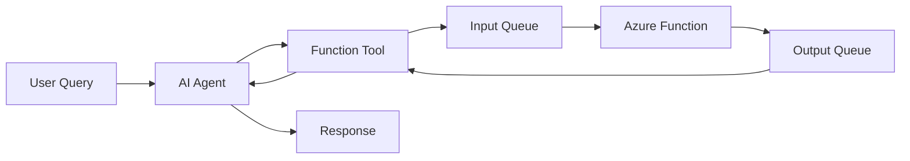
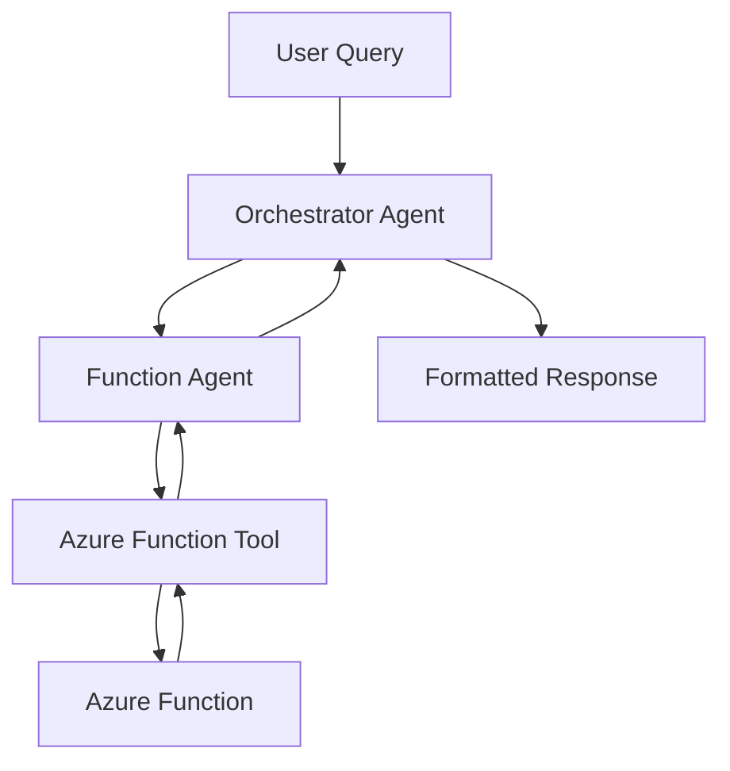

# Azure Function Agent Integration (stazfunctest.py)

> **A sophisticated Azure Function integration module for Azure AI Foundry agents, enabling serverless compute orchestration with intelligent agent patterns.**

## 🎯 Overview

The `stazfunctest.py` module demonstrates advanced patterns for integrating Azure Functions with Azure AI Foundry agents, providing both basic function integration and sophisticated connected agent orchestration capabilities.

## ✨ Key Features

- **🔧 Azure Function Integration**: Direct integration with Azure Functions through tool patterns
- **🤝 Connected Agent Orchestration**: Multi-agent coordination and delegation patterns  
- **📨 Queue-Based Messaging**: Asynchronous communication via Azure Storage Queues
- **🔄 Lifecycle Management**: Comprehensive resource management and cleanup
- **⚡ Serverless Scaling**: Leverage Azure Functions auto-scaling capabilities
- **🛡️ Error Handling**: Robust error handling and validation patterns

## 🚀 Quick Start

### Prerequisites

```bash
# Azure Services Required
- Azure AI Foundry project
- Azure Storage account with Queue service
- Azure Functions (for actual function execution)

# Python Environment
- Python 3.8+
- pip package manager
```

### Installation

```bash
pip install azure-ai-projects azure-ai-agents azure-identity python-dotenv
```

### Environment Configuration

Create a `.env` file:

```bash
PROJECT_ENDPOINT_ENT=https://your-project.cognitiveservices.azure.com/
MODEL_DEPLOYMENT_NAME=your-model-deployment
STORAGE_SERVICE_ENDPOINT=https://account.queue.core.windows.net
```

### Basic Usage

```python
from stazfunctest import azurefunc_test, connected_azure_function_agent

# Basic function agent integration
response = azurefunc_test("What is the weather in New York?")
print(f"Basic Response: {response}")

# Advanced connected agent orchestration  
response = connected_azure_function_agent("What would foo say about AI?")
print(f"Connected Response: {response}")
```

## 🏗️ Architecture

### Function Integration Pattern



### Connected Agent Pattern



## 📚 Core Functions

### `azurefunc_test(query: str) -> str`

**Purpose**: Basic Azure Function agent integration test

**Features**:
- Creates AzureFunctionTool with queue configuration
- Initializes AI agent with function capability
- Processes queries through function integration
- Handles response extraction and formatting
- Performs automatic resource cleanup

**Example**:
```python
response = azurefunc_test("Get stock price for MSFT")
```

### `connected_azure_function_agent(query: str) -> str`

**Purpose**: Advanced connected agent orchestration

**Features**:
- Creates specialized function agent
- Establishes connected agent relationship  
- Implements orchestrator agent pattern
- Handles complex tool call interactions
- Monitors execution with polling mechanism
- Comprehensive multi-resource cleanup

**Example**:
```python
response = connected_azure_function_agent("What would foo say?")
```

## 🔧 Configuration

### Azure Function Tool Setup

```python
azure_function_tool = AzureFunctionTool(
    name="foo",
    description="Get answers from the foo bot.",
    parameters={
        "type": "object",
        "properties": {
            "query": {"type": "string", "description": "The question to ask."},
            "outputqueueuri": {"type": "string", "description": "The full output queue URI."}
        }
    },
    input_queue=AzureFunctionStorageQueue(
        queue_name="azure-function-foo-input",
        storage_service_endpoint=storage_service_endpoint
    ),
    output_queue=AzureFunctionStorageQueue(
        queue_name="azure-function-foo-output",
        storage_service_endpoint=storage_service_endpoint
    )
)
```

### Queue Configuration

- **Input Queue**: `azure-function-{name}-input`
- **Output Queue**: `azure-function-{name}-output`
- **Storage Endpoint**: `https://{account}.queue.core.windows.net`

## 💡 Use Cases

### 1. Weather Service Integration
```python
# Integrate weather APIs through Azure Functions
response = azurefunc_test("What's the current weather in Seattle?")
```

### 2. Data Processing Pipeline
```python
# Process data through connected agent orchestration
response = connected_azure_function_agent("Analyze sales data for Q4")
```

### 3. External API Integration
```python
# Route external API calls through Azure Functions
response = azurefunc_test("Get latest news about technology")
```

### 4. Multi-Step Workflows
```python
# Complex workflows with agent delegation
response = connected_azure_function_agent("Process invoice and send confirmation")
```

## ⚠️ Error Handling

### Configuration Validation

```python
# Automatic environment validation
if not storage_service_endpoint:
    print("Missing STORAGE_SERVICE_ENDPOINT", file=sys.stderr)
    sys.exit(1)

if not storage_service_endpoint.startswith("https://"):
    print("Invalid storage endpoint format", file=sys.stderr)
    sys.exit(1)
```

### Runtime Error Handling

```python
# Run status monitoring
if run.status == "failed":
    print(f"Run failed: {run.last_error}")

# Safe message extraction
def _extract_text_from_message(msg) -> str:
    try:
        # Safe extraction logic with fallbacks
        return extracted_text
    except Exception:
        return ""
```

### Resource Cleanup

```python
# Guaranteed cleanup
finally:
    project_client.agents.delete_agent(agent.id)
    project_client.agents.threads.delete(thread.id)
```

## 🔍 Debugging & Monitoring

### Enable Logging

```python
import logging
logging.basicConfig(level=logging.DEBUG)

# Monitor agent operations
print(f"Created agent, agent ID: {agent.id}")
print(f"Created thread, thread ID: {thread.id}")
print(f"Run finished with status: {run.status}")
```

### Message Inspection

```python
# Inspect message content
for msg in messages:
    print(f"Role: {msg.role}")
    print(f"Content: {msg.content}")
```

## 🎯 Best Practices

### 1. **Resource Management**
- Always clean up agents and threads
- Use try/finally blocks for guaranteed cleanup
- Monitor resource usage in production

### 2. **Error Handling**
- Validate configuration at startup
- Handle both transient and permanent failures
- Provide meaningful error messages

### 3. **Performance**
- Reuse client connections when possible
- Implement connection pooling for high-volume scenarios
- Monitor queue performance and scaling

### 4. **Security**
- Use Azure Identity for authentication
- Secure environment variable management
- Validate all input parameters

### 5. **Testing**
- Test with various query types and edge cases
- Validate error scenarios and recovery
- Monitor performance under load

## 📖 Complete Documentation

| Document | Description |
|----------|-------------|
| **[Documentation Index](docs/stazfunctest-documentation-index.md)** | Complete documentation overview |
| **[Technical Architecture](docs/stazfunctest-technical-architecture.md)** | Detailed architecture and design patterns |
| **[Mermaid Diagrams](docs/stazfunctest-mermaid-diagrams.md)** | Visual architecture and flow diagrams |
| **[API Reference](docs/stazfunctest-api-reference.md)** | Complete function reference and examples |
| **[Quick Reference](docs/stazfunctest-quick-reference.md)** | Quick start guide and common patterns |

## 🔗 Related Resources

- [Azure AI Foundry Documentation](https://docs.microsoft.com/azure/ai/)
- [Azure Functions Documentation](https://docs.microsoft.com/azure/azure-functions/)
- [Azure Storage Queues Documentation](https://docs.microsoft.com/azure/storage/queues/)
- [AgenticAI Foundry Main Repository](https://github.com/balakreshnan/AgenticAIFoundry)

## 🤝 Contributing

This module is part of the AgenticAI Foundry project. For contributions and issues, please refer to the main repository guidelines.

## 📄 License

This project follows the licensing terms of the main AgenticAI Foundry repository.

---

*The Azure Function Agent Integration module provides powerful patterns for combining serverless compute with intelligent agents, enabling scalable and sophisticated AI-powered applications.*