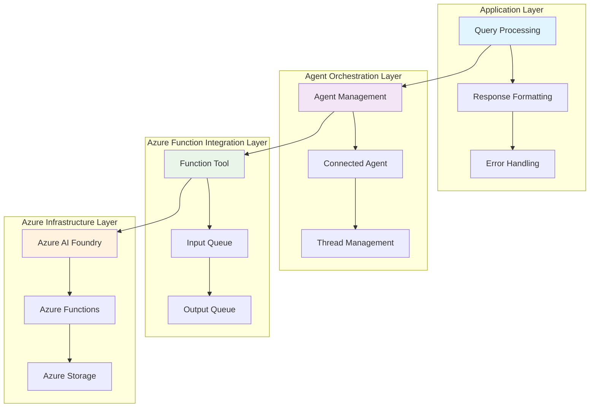
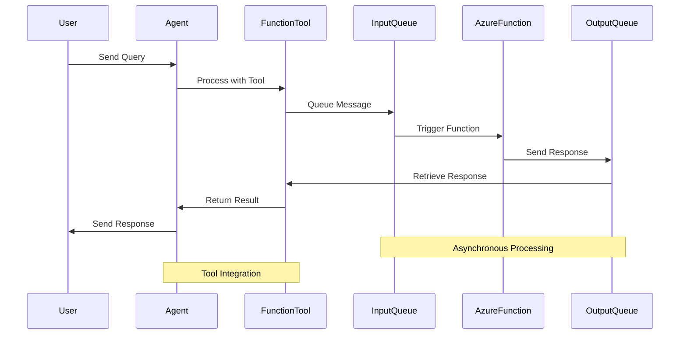
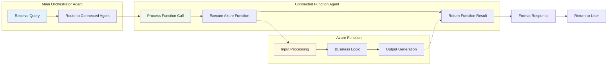
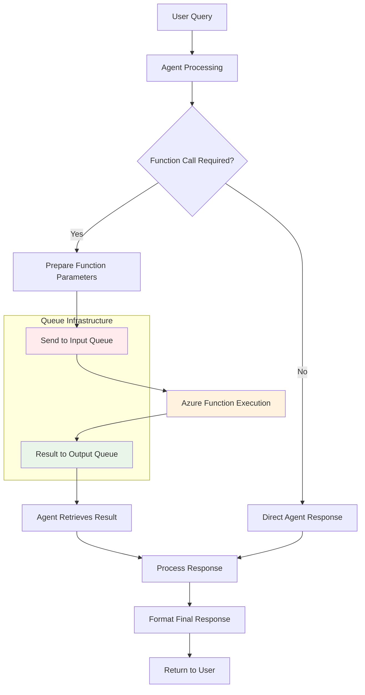
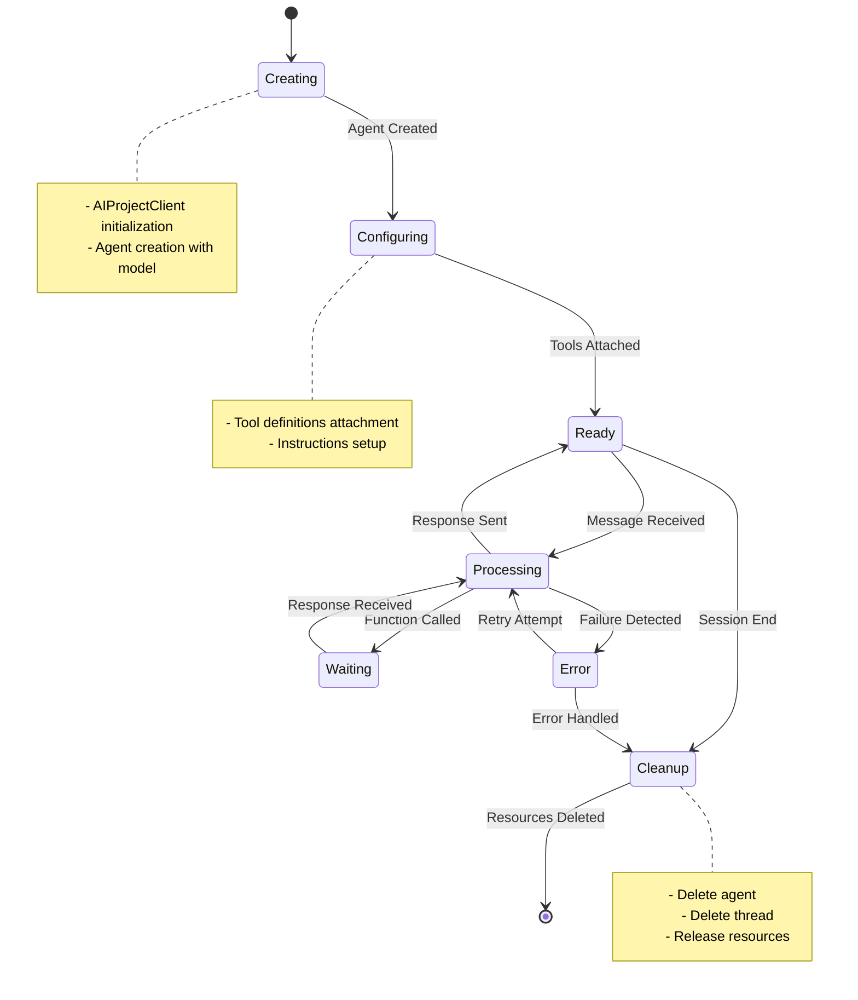
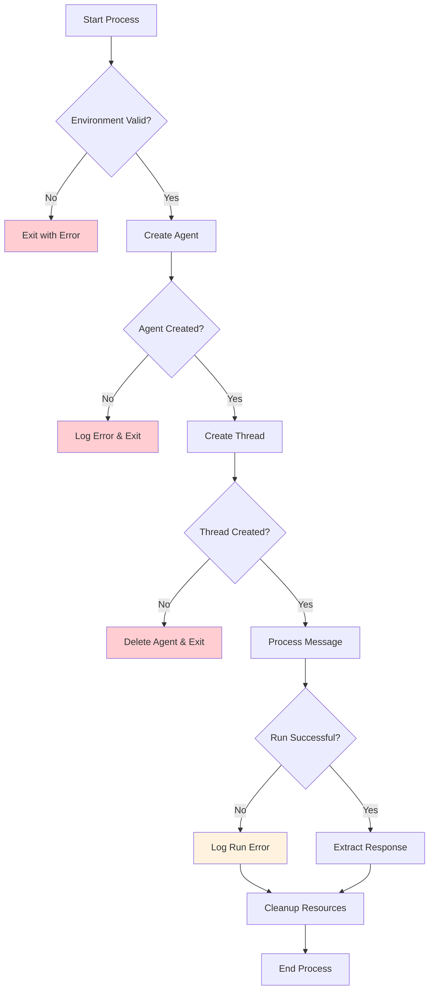
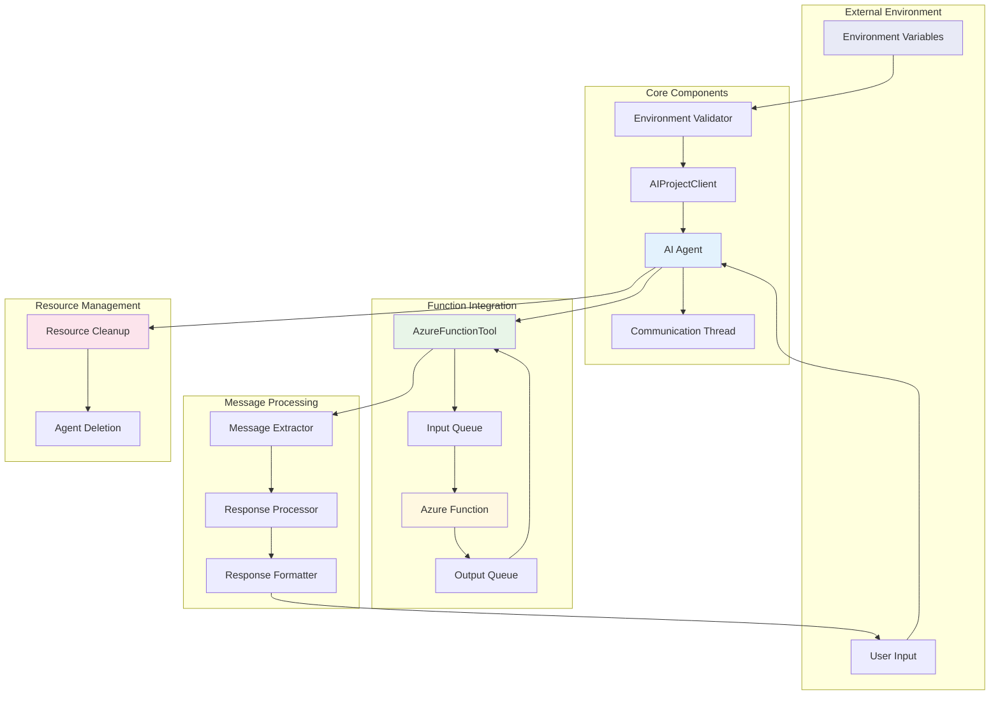
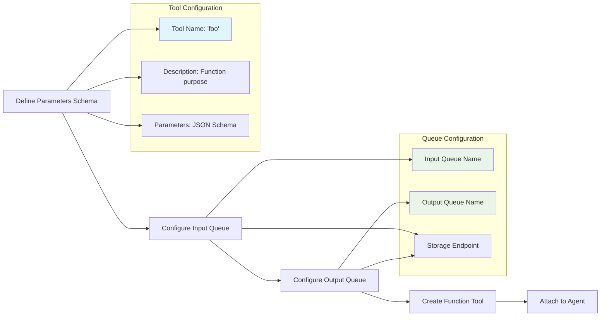
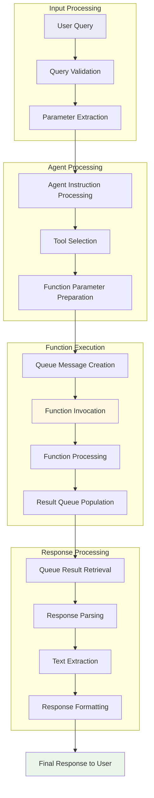

# Azure Function Agent Integration - Mermaid Architecture Diagrams

## Table of Contents
1. [System Architecture Overview](#system-architecture-overview)
2. [Azure Function Integration Flow](#azure-function-integration-flow)
3. [Connected Agent Orchestration](#connected-agent-orchestration)
4. [Queue-Based Messaging Flow](#queue-based-messaging-flow)
5. [Agent Lifecycle Management](#agent-lifecycle-management)
6. [Error Handling Flow](#error-handling-flow)
7. [Component Interaction Diagram](#component-interaction-diagram)

## System Architecture Overview

## Azure Function Integration Flow

## Connected Agent Orchestration

## Queue-Based Messaging Flow

## Agent Lifecycle Management

## Error Handling Flow

## Component Interaction Diagram

## Function Tool Configuration Flow

## Data Flow Architecture

---

*These Mermaid diagrams provide visual representations of the Azure Function Agent Integration architecture and workflows. They can be rendered in any Mermaid-compatible viewer or documentation platform.*