# AI Brainstorming Hub - Complete Architecture & Documentation

## 📐 Architecture Overview

The AI Brainstorming Hub (`stbrainstorm.py`) is a sophisticated multi-agent collaborative intelligence platform that orchestrates specialized AI agents to provide comprehensive brainstorming and strategic analysis capabilities. Built on Azure AI Foundry with Streamlit frontend, it enables voice-enabled interactions, real-time collaboration, and intelligent content management.

## Table of Contents

1. [System Architecture](#system-architecture)
2. [Multi-Agent Architecture](#multi-agent-architecture) 
3. [Component Architecture](#component-architecture)
4. [Data Flow Architecture](#data-flow-architecture)
5. [Integration Architecture](#integration-architecture)
6. [Voice & Audio Architecture](#voice--audio-architecture)
7. [User Interface Architecture](#user-interface-architecture)
8. [Security Architecture](#security-architecture)
9. [API Reference](#api-reference)
10. [Usage Guidelines](#usage-guidelines)
11. [Performance & Monitoring](#performance--monitoring)
12. [Deployment Architecture](#deployment-architecture)

## 🏗️ System Architecture

### High-Level System Overview

```mermaid
graph TB
    subgraph "Frontend Layer"
        UI[Streamlit Web Interface]
        Voice[Voice Input/Output]
        Mermaid[Mermaid Visualization]
        Export[Content Export]
    end
    
    subgraph "Application Layer"
        Main["Main Controller
        brainstormmain()"]
        Processor["Request Processor
        process_brainstorm_request()"]
        Orchestrator["Agent Orchestrator
        connected_agent_brainstorm()"]
    end
    
    subgraph "AI Agent Layer"
        OrcAgent["Orchestrator Agent
        PresalesAgent"]
        subgraph "Specialized Agents"
            Ideation[💡 Ideation Agent]
            Inquiry[❓ Inquiry Agent]
            Business[💼 Business Analyst]
            Tech[🚀 Technology Advisor]
            Strategic[📊 Strategic Analyst]
            Resource[📋 Resource Planner]
            Metrics[🎯 Success Metrics Agent]
            TechArch[🏗️ Technical Architect]
        end
    end
    
    subgraph "Azure AI Services"
        AIF[Azure AI Foundry]
        OpenAI[Azure OpenAI]
        Whisper[Whisper Speech-to-Text]
        TTS[Text-to-Speech]
        Monitor[Application Insights]
    end
    
    subgraph "Data Layer"
        Vector[Vector Store]
        Files[File Storage]
        Session[Session State]
        Telemetry[Telemetry Data]
    end
    
    %% Connections
    UI --> Main
    Voice --> Main
    Main --> Processor
    Processor --> Orchestrator
    Orchestrator --> OrcAgent
    OrcAgent --> Ideation
    OrcAgent --> Inquiry
    OrcAgent --> Business
    OrcAgent --> Tech
    OrcAgent --> Strategic
    OrcAgent --> Resource
    OrcAgent --> Metrics
    OrcAgent --> TechArch
    
    OrcAgent --> AIF
    AIF --> OpenAI
    Voice --> Whisper
    Voice --> TTS
    AIF --> Monitor
    
    TechArch --> Vector
    Files --> Vector
    Session --> UI
    Monitor --> Telemetry
```



### Architecture Patterns

- **Multi-Agent Orchestration**: Coordinated team of specialized AI agents
- **Service-Oriented Architecture**: Azure AI Foundry service integration
- **Event-Driven Processing**: Streamlit reactive programming model
- **Microservices Pattern**: Independently functioning agent services
- **Observer Pattern**: Real-time UI updates and state management
- **Strategy Pattern**: Configurable agent behaviors and roles

## 🤖 Multi-Agent Architecture

### Agent Ecosystem Overview

```mermaid
graph TD
    subgraph "Agent Orchestration Layer"
        PresalesAgent["Presales Solution Architect
        Main Orchestrator"]
    end
    
    subgraph "Creative & Analysis Agents"
        IdeationAgent["💡 Ideation Catalyst
        Creative powerhouse for brainstorming"]
        InquiryAgent["❓ Inquiry Specialist
        Strategic questioning expert"]
    end
    
    subgraph "Business & Strategy Agents"
        BusinessAnalyst["💼 Business Analyst
        Market & financial analysis"]
        StrategicAnalyst["📊 Strategic Analyst
        SWOT & PESTEL analysis"]
        ResourcePlanner["📋 Resource Planner
        Implementation planning"]
        MetricsAgent["🎯 Success Metrics Expert
        KPI definition & measurement"]
    end
    
    subgraph "Technology Agents"
        TechAdvisor["🚀 Technology Advisor
        Emerging tech guidance"]
        TechArchitect["🏗️ Technical Architect
        Azure PaaS & AI-first design"]
    end
    
    subgraph "Knowledge Agents"
        SustainabilityAgent["🌱 Sustainability Expert
        Document analysis specialist"]
    end
    
    %% Orchestration Flow
    PresalesAgent -->|Delegates to| IdeationAgent
    PresalesAgent -->|Delegates to| InquiryAgent
    PresalesAgent -->|Delegates to| BusinessAnalyst
    PresalesAgent -->|Delegates to| StrategicAnalyst
    PresalesAgent -->|Delegates to| ResourcePlanner
    PresalesAgent -->|Delegates to| MetricsAgent
    PresalesAgent -->|Delegates to| TechAdvisor
    PresalesAgent -->|Delegates to| TechArchitect
    PresalesAgent -->|May delegate to| SustainabilityAgent
    
    %% Return Flow
    IdeationAgent -->|Creative insights| PresalesAgent
    InquiryAgent -->|Strategic questions| PresalesAgent
    BusinessAnalyst -->|Market analysis| PresalesAgent
    StrategicAnalyst -->|Strategic insights| PresalesAgent
    ResourcePlanner -->|Implementation plans| PresalesAgent
    MetricsAgent -->|Success metrics| PresalesAgent
    TechAdvisor -->|Tech recommendations| PresalesAgent
    TechArchitect -->|Architecture diagrams| PresalesAgent
    SustainabilityAgent -->|Document insights| PresalesAgent
```



### Agent Roles and Responsibilities

#### 💡 Ideation Catalyst
- **Purpose**: Generate creative and innovative ideas
- **Capabilities**: 
  - Brainstorm creative solutions
  - Expand on initial concepts with fresh perspectives
  - Ask thought-provoking questions to stimulate creativity
  - Encourage out-of-the-box thinking
  - Build upon ideas to create new possibilities
- **Output Format**: 
  ```
  ## 💡 Creative Insights
  ### Initial Ideas
  - [List 3-5 innovative ideas]
  ### Expansion Opportunities
  - [Ways to expand or modify ideas]
  ### Provocative Questions
  - [Questions to spark further creativity]
  ```

#### ❓ Inquiry Specialist  
- **Purpose**: Strategic questioning and deep analysis
- **Capabilities**:
  - Ask strategic follow-up questions
  - Probe deeper into assumptions and ideas
  - Uncover hidden opportunities and challenges
  - Challenge thinking to strengthen concepts
  - Guide discovery through targeted questioning
- **Output Format**: 
  ```
  ## ❓ Strategic Inquiry
  ### Key Questions to Explore
  - [5-7 strategic questions]
  ### Assumptions to Validate
  - [Critical assumptions that need testing]
  ### Areas for Deep Dive
  - [Topics requiring further investigation]
  ```

#### 💼 Business Analyst
- **Purpose**: Market and financial analysis
- **Capabilities**:
  - Analyze market potential and sizing
  - Evaluate revenue models and financial viability
  - Assess competitive landscape
  - Identify target customer segments
  - Evaluate business model feasibility
- **Output Format**: 
  ```
  ## 💼 Business Analysis
  ### Market Opportunity
  - Market size and growth potential
  - Target customer segments
  ### Revenue Model
  - Potential revenue streams
  - Pricing strategies
  ### Competitive Landscape
  - Key competitors and differentiation
  ### Financial Viability
  - Investment requirements and ROI projections
  ```

#### 🚀 Technology Advisor
- **Purpose**: Emerging technology guidance and implementation
- **Capabilities**:
  - Recommend relevant emerging technologies
  - Assess technical feasibility
  - Identify technology trends and opportunities
  - Suggest implementation approaches
  - Evaluate technical risks and mitigation strategies
- **Output Format**: 
  ```
  ## 🚀 Technology Recommendations
  ### Emerging Technologies
  - [Relevant cutting-edge technologies]
  ### Implementation Approach
  - [Technical architecture and approach]
  ### Technology Stack
  - [Recommended tools and platforms]
  ### Innovation Opportunities
  - [Ways to leverage technology for competitive advantage]
  ```

#### 📊 Strategic Analyst
- **Purpose**: Comprehensive strategic analysis
- **Capabilities**:
  - Conduct SWOT analysis (Strengths, Weaknesses, Opportunities, Threats)
  - Perform PESTEL analysis (Political, Economic, Social, Technological, Environmental, Legal)
  - Identify strategic opportunities and risks
  - Assess market positioning
  - Evaluate strategic alternatives
- **Output Format**: 
  ```
  ## 📊 Strategic Analysis
  ### SWOT Analysis
  - **Strengths**: [Internal advantages]
  - **Weaknesses**: [Internal challenges]
  - **Opportunities**: [External possibilities]
  - **Threats**: [External risks]
  ### PESTEL Analysis
  - **Political**: [Political factors]
  - **Economic**: [Economic conditions]
  - **Social**: [Social trends]
  - **Technological**: [Technology impact]
  - **Environmental**: [Environmental considerations]
  - **Legal**: [Legal/regulatory factors]
  ### Strategic Recommendations
  - [Key strategic priorities and actions]
  ```

#### 📋 Resource Planner
- **Purpose**: Practical implementation planning
- **Capabilities**:
  - Plan resource requirements (human, financial, technical)
  - Create realistic project timelines
  - Estimate costs and budgets
  - Identify critical dependencies
  - Suggest team structure and skills needed
- **Output Format**: 
  ```
  ## 📋 Resource Planning
  ### Team Requirements
  - [Roles and skills needed]
  ### Timeline & Milestones
  - [Project phases and key milestones]
  ### Budget Estimation
  - [Cost breakdown and financial requirements]
  ### Critical Dependencies
  - [Key dependencies and risk factors]
  ### Implementation Roadmap
  - [Step-by-step execution plan]
  ```

#### 🎯 Success Metrics Expert
- **Purpose**: Define and measure success
- **Capabilities**:
  - Define key performance indicators (KPIs)
  - Create measurement frameworks
  - Establish success criteria
  - Design monitoring and evaluation systems
  - Recommend analytics and tracking tools
- **Output Format**: 
  ```
  ## 🎯 Success Metrics Framework
  ### Key Performance Indicators
  - [Primary KPIs and metrics]
  ### Success Criteria
  - [Clear success definitions]
  ### Measurement Framework
  - [How to track and measure progress]
  ### Monitoring Tools
  - [Recommended analytics and tracking tools]
  ### Review & Optimization
  - [Regular review processes and optimization approaches]
  ```

#### 🏗️ Technical Architect
- **Purpose**: Azure PaaS and AI-first architecture design
- **Capabilities**:
  - Design scalable, secure Azure cloud architectures using PaaS services
  - Implement AI-first design principles and patterns
  - Apply Security by Design and Zero Trust principles
  - Create comprehensive technical documentation
  - Design system integrations and data flows
  - Recommend Azure AI and cognitive services integration
- **Output Format**: 
  ```
  ## 🏗️ Technical Architecture Design
  ### Azure Services Recommendation
  - [Core Azure PaaS services for the solution]
  ### Architecture Patterns
  - [Recommended architectural patterns and designs]
  ### Mermaid Architecture Diagram
  ```mermaid
  [Include detailed architecture diagram showing components, data flows, and integrations]
  ```
  ### Security Architecture
  - [Security by Design principles and Zero Trust implementation]
  ### AI Integration Strategy
  - [Azure AI services integration and AI-first design patterns]
  ### Implementation Roadmap
  - [Technical implementation phases and milestones]
  ### Performance & Scalability
  - [Scalability patterns and performance optimization strategies]
  ```

#### 🌱 Sustainability Expert
- **Purpose**: Document analysis and sustainability insights  
- **Capabilities**:
  - Analyze uploaded documents using vector search
  - Extract sustainability insights from documents
  - Answer questions about document content
  - Provide sustainability recommendations based on uploaded materials
  - Search through document knowledge base
- **Output Format**: Document-based insights and recommendations with citations
- **Special Features**: 
  - Uses Azure AI file search with vector store
  - Processes PDF documents for knowledge extraction
  - Provides context-aware responses based on uploaded content

## 🧩 Component Architecture

### Core Components

```mermaid
graph TB
    subgraph "UI Components"
        ChatInterface[💬 Chat Interface]
        AccumulatorTab[📝 Content Accumulator]
        MermaidTab[📊 Mermaid Charts]
        VoiceInput[🎤 Voice Input System]
        StatusPanel[📊 Status & Metrics Panel]
        AgentOutputs[🤖 Agent Insights Panel]
    end
    
    subgraph "Processing Components"
        RequestProcessor[Request Processor]
        AudioProcessor[Audio Processor]
        MermaidProcessor[Mermaid Processor]
        TokenTracker[Token Usage Tracker]
        SessionManager[Session Manager]
        ContentManager[Content Manager]
        FileProcessor[File Processor]
    end
    
    subgraph "Agent Management"
        AgentOrchestrator[Agent Orchestrator]
        SpecialistAgents[9 Specialist Agents]
        MainOrchestrator[Main Presales Agent]
        ConnectedAgentTools[Connected Agent Tools]
        ThreadManager[Thread Manager]
        VectorStoreManager[Vector Store Manager]
    end
    
    subgraph "Utility Components"
        AudioTranscriber[Whisper Audio Transcriber]
        TTSGenerator[Azure TTS Generator]
        DiagramExtractor[Mermaid Diagram Extractor]
        DiagramCleaner[Advanced Diagram Cleaner]
        ContentExporter[Multi-format Exporter]
        TemplateSystem[Template System]
    end
    
    %% Component Interactions
    ChatInterface --> RequestProcessor
    VoiceInput --> AudioProcessor
    RequestProcessor --> AgentOrchestrator
    AgentOrchestrator --> SpecialistAgents
    SpecialistAgents --> MainOrchestrator
    MainOrchestrator --> ConnectedAgentTools
    ConnectedAgentTools --> ThreadManager
    
    AudioProcessor --> AudioTranscriber
    AudioProcessor --> TTSGenerator
    MermaidTab --> MermaidProcessor
    MermaidProcessor --> DiagramExtractor
    DiagramExtractor --> DiagramCleaner
    
    AccumulatorTab --> ContentManager
    ContentManager --> TemplateSystem
    ContentManager --> ContentExporter
    StatusPanel --> TokenTracker
    AgentOutputs --> SessionManager
    
    FileProcessor --> VectorStoreManager
    VectorStoreManager --> SpecialistAgents
```



### Component Details

#### User Interface Components

1. **Chat Interface** (`💬 Brainstorming Chat`)
   - Real-time conversation display with message history
   - Voice message indicators and timestamps
   - Chat copy controls for accumulator integration
   - Audio response player with MP3 support
   - Dual input system (text and voice tabs)

2. **Content Accumulator** (`📝 Content Accumulator`)
   - Quick action buttons for copying chat and agent outputs
   - Large content editor (500px height) with live editing
   - Template system for analysis and brainstorming formats
   - Content statistics (word count, character count)
   - Export controls with timestamped file downloads

3. **Mermaid Charts** (`📊 Mermaid Charts`)
   - Automatic diagram extraction from all agent outputs
   - Interactive diagram display with expandable containers
   - Advanced Mermaid code cleaning and validation
   - Live diagram editor with syntax fixing
   - Export to Mermaid Live Editor and file downloads
   - Test section for diagram cleaning verification

4. **Voice Input System** (`🎤 Voice Input`)
   - Audio recording with st.audio_input
   - Real-time transcription via Azure Whisper
   - Voice response generation with Azure TTS
   - Audio settings and controls
   - Processing indicators and error handling

5. **Agent Outputs Panel** (`🤖 AI Agent Insights`)
   - Scrollable container (600px height) for all agent responses
   - Expandable containers for each individual agent
   - Text areas for easy content selection and copying
   - Copy-to-accumulator buttons for each agent
   - Agent-specific icons and formatted names

#### Processing Components

1. **Request Processor**
   - Input validation and formatting
   - Session state management with comprehensive tracking
   - Error handling and recovery with graceful degradation
   - Response orchestration and token aggregation

2. **Audio Processor**
   - Whisper integration for real-time transcription
   - Azure TTS for professional voice responses (Nova voice, 0.9 speed)
   - Audio format conversion and optimization
   - Temporary file management with UUID-based naming

3. **Mermaid Processor**
   - Advanced diagram extraction from all content sources
   - Sophisticated syntax cleaning and validation
   - Interactive rendering with live editing capabilities
   - Export functionality to multiple formats

4. **Content Manager**
   - Real-time content accumulation from multiple sources
   - Live editing with immediate state updates
   - Template system integration for structured content
   - Word/character counting and statistics

5. **Token Tracker**
   - Real-time token counting per request
   - Session-level aggregation and reporting
   - Usage analytics with prompt/completion breakdown
   - Cost estimation and optimization insights

6. **File Processor**
   - PDF document upload and processing
   - Vector store integration for semantic search
   - Document analysis capabilities for sustainability expert
   - File cleanup and management

## 🎯 New Features Architecture

### Content Accumulator System


### Voice Integration Architecture


### Advanced Mermaid Support


## 🔄 Data Flow Architecture

### Request Processing Flow


### Voice Processing Flow


### Data Storage Flow


## 🔗 Integration Architecture

### Azure AI Foundry Integration


### Environment Configuration


## 🎤 Voice & Audio Architecture

### Audio Processing Pipeline


### Audio Configuration

| Component | Technology | Purpose |
|-----------|-----------|---------|
| Speech-to-Text | Azure Whisper | Convert voice input to text |
| Text-to-Speech | Azure TTS | Generate audio responses |
| Audio Format | MP3/WAV | Standard audio formats |
| Voice Model | Nova | Professional voice for responses |
| Audio Quality | 24kHz | High-quality audio processing |

## 💻 User Interface Architecture

### Layout Structure

```mermaid
graph TB
    subgraph "Main Layout"
        Header[🧠 AI Brainstorming Hub Header]
        MainColumns[Two-Column Layout]
    end
    
    subgraph "Left Column (3/5)"
        TabContainer[Tab Container - Three Tabs]
        ChatTab[💬 Brainstorming Chat]
        AccumulatorTab[📝 Content Accumulator]
        MermaidTab[📊 Mermaid Charts]
    end
    
    subgraph "Right Column (2/5)"
        StatusPanel[📊 Status & Metrics]
        AgentPanel[🤖 Agent Insights]
        ExportPanel[📤 Export Options]
    end
    
    subgraph "Chat Tab Components"
        ChatHistory[Chat History Display]
        ChatControls[Chat Copy Controls]
        AudioPlayer[🔊 Audio Response Player]
        InputSection[Input Section]
        TextInputTab[💬 Text Input Tab]
        VoiceInputTab[🎤 Voice Input Tab]
        AudioTranscribe[🎤 Audio Transcription]
        AudioSettings[🔊 Audio Settings]
    end
    
    subgraph "Content Accumulator Components"
        QuickActions[📋 Quick Copy Actions]
        ContentEditor[✏️ Main Content Editor]
        Templates[📋 Template System]
        AccumulatorStats[📊 Content Statistics]
        AccumulatorExport[💾 Export Controls]
    end
    
    subgraph "Mermaid Tab Components"
        DiagramControls[🔄 Diagram Controls]
        DiagramDisplay[🎨 Interactive Diagrams]
        DiagramEditor[✏️ Diagram Code Editor]
        DiagramActions[📋 Diagram Actions]
        TestSection[🔧 Test Section]
    end
    
    Header --> MainColumns
    MainColumns --> TabContainer
    MainColumns --> StatusPanel
    
    TabContainer --> ChatTab
    TabContainer --> AccumulatorTab
    TabContainer --> MermaidTab
    
    ChatTab --> ChatHistory
    ChatTab --> ChatControls
    ChatTab --> AudioPlayer
    ChatTab --> InputSection
    InputSection --> TextInputTab
    InputSection --> VoiceInputTab
    VoiceInputTab --> AudioTranscribe
    VoiceInputTab --> AudioSettings
    
    AccumulatorTab --> QuickActions
    AccumulatorTab --> ContentEditor
    AccumulatorTab --> Templates
    AccumulatorTab --> AccumulatorStats
    AccumulatorTab --> AccumulatorExport
    
    MermaidTab --> DiagramControls
    MermaidTab --> DiagramDisplay
    MermaidTab --> DiagramEditor
    MermaidTab --> DiagramActions
    MermaidTab --> TestSection
    
    StatusPanel --> AgentPanel
    AgentPanel --> ExportPanel
```



### UI State Management


## 🔒 Security Architecture

### Security Components


### Security Best Practices

1. **Authentication**
   - Uses Default Azure Credential for seamless authentication
   - Leverages Azure Active Directory for identity management
   - No hardcoded credentials in source code

2. **Data Protection**
   - All API communications encrypted in transit (HTTPS)
   - Temporary files securely managed and cleaned up
   - Session data stored securely in memory

3. **API Security**
   - API keys managed through environment variables
   - Token usage monitored and tracked
   - Rate limiting implemented through Azure services

4. **Monitoring**
   - Comprehensive telemetry with Application Insights
   - Audit logging for all agent interactions
   - Security events monitored and alerted

## 📚 API Reference

### Core Functions

#### `connected_agent_brainstorm(query: str) -> tuple[str, dict, dict]`

Main orchestration function that coordinates all AI agents including the sustainability expert.

**Parameters:**
- `query` (str): User's brainstorming question or challenge

**Returns:**
- Tuple containing:
  - `final_response` (str): Aggregated response from the main orchestrator agent
  - `agent_outputs` (dict): Individual responses from each specialist agent
  - `token_usage` (dict): Token consumption metrics with prompt, completion, and total tokens

**Agent Flow:**
1. Creates 9 specialized agents (Ideation, Inquiry, Business, Technology, Strategic, Resource, Success Metrics, Technical Architect, Sustainability)
2. Creates main orchestrator agent (PresalesAgent) with connected agent tools
3. Processes request through thread-based conversation
4. Collects individual agent outputs and aggregated response
5. Cleans up all agents and threads after processing

**Example:**
```python
response, outputs, tokens = connected_agent_brainstorm(
    "How can we build a sustainable AI-powered customer service platform?"
)
```

#### `brainstormmain()`

Main Streamlit application entry point with three-tab UI layout.

**Functionality:**
- Initializes Streamlit UI with custom CSS styling
- Manages session state for chat history, agent outputs, token usage
- Coordinates three-tab layout (Chat, Content Accumulator, Mermaid Charts)
- Handles user interactions and voice input/output
- Manages content accumulation and export systems

#### `process_brainstorm_request(user_input: str, is_voice: bool = False)`

Processes user requests through the multi-agent system with full session management.

**Parameters:**
- `user_input` (str): User's input text
- `is_voice` (bool): Whether input came from voice transcription

**Functionality:**
- Updates session state with user message
- Calls `connected_agent_brainstorm()` for agent processing
- Updates total session token counters
- Generates audio responses if enabled
- Updates Mermaid diagram extraction
- Manages error handling and UI state updates

#### `transcribe_audio(audio_data) -> str`

Transcribes audio input using Azure OpenAI Whisper.

**Parameters:**
- `audio_data`: Audio file data from Streamlit audio input

**Returns:**
- `str`: Transcribed text from audio

**Technical Details:**
- Uses Azure OpenAI Whisper deployment
- Converts audio to BytesIO format for API compatibility
- Handles transcription errors gracefully

#### `generate_audio_response_gpt(text: str) -> str`

Generates audio response using Azure OpenAI TTS API with advanced text preprocessing.

**Parameters:**
- `text` (str): Text to convert to speech (max 3000 characters)

**Returns:**
- `str`: Path to generated MP3 audio file or None on error

**Features:**
- Text cleaning for optimal TTS quality (removes markdown, limits length)
- Uses 'nova' voice with 0.9 speed for professional delivery
- Generates unique temporary files with UUID
- Comprehensive error handling and logging

#### `extract_mermaid_diagrams(text: str) -> list`

Extracts Mermaid diagrams from text content using regex pattern matching.

**Parameters:**
- `text` (str): Text content to search for Mermaid code blocks

**Returns:**
- `list`: List of Mermaid diagram code blocks (without markdown fences)

#### `clean_mermaid_code(mermaid_code: str) -> str`

Advanced Mermaid diagram cleaning for proper rendering, handling complex syntax issues.

**Parameters:**
- `mermaid_code` (str): Raw Mermaid code that may have formatting issues

**Returns:**
- `str`: Cleaned and properly formatted Mermaid code

**Cleaning Features:**
- Fixes problematic text replacements ('less than', 'greater than')
- Handles HTML entities and special characters
- Normalizes node labels and removes newlines from labels
- Preserves edge labels like (OAuth2) while cleaning syntax
- Fixes arrow formatting and spacing
- Comprehensive error handling for complex diagrams

#### `parse_agent_outputs(run_steps) -> dict`

Parses individual agent outputs from Azure AI agent run steps.

**Parameters:**
- `run_steps`: Azure AI agent run steps from thread execution

**Returns:**
- `dict`: Dictionary mapping agent names to their specific outputs

**Usage:**
- Extracts connected agent tool call results
- Maps agent IDs to human-readable names
- Preserves individual agent responses for UI display

#### `update_mermaid_diagrams()`

Updates session state with Mermaid diagrams from agent outputs and chat history.

**Functionality:**
- Scans all agent outputs for Mermaid diagrams
- Scans chat history for diagrams in responses
- Cleans and formats diagrams for proper rendering
- Updates session state with structured diagram information
- Includes source attribution and timestamps

### Session State Variables

| Variable | Type | Purpose |
|----------|------|---------|
| `chat_history` | list | Full conversation history with timestamps and voice indicators |
| `agent_outputs` | dict | Individual agent responses mapped by agent name |
| `processing` | bool | Processing state flag for UI updates |
| `current_audio` | bytes | Current audio response file data |
| `audio_enabled` | bool | Audio response generation setting |
| `accumulator_content` | str | Editable accumulated content |
| `selected_content` | str | Currently selected content for copying |
| `pending_copy_text` | str | Text pending copy operation |
| `token_usage` | dict | Current request token consumption |
| `total_session_tokens` | dict | Cumulative session token usage |
| `mermaid_diagrams` | list | Extracted and cleaned Mermaid diagrams with metadata |

## 📖 Usage Guidelines

### Getting Started

1. **Environment Setup**
   ```bash
   # Set required environment variables
   export PROJECT_ENDPOINT="https://your-project.services.ai.azure.com/api/projects/your-project"
   export MODEL_ENDPOINT="https://your-model.services.ai.azure.com"
   export MODEL_API_KEY="your-api-key"
   export MODEL_DEPLOYMENT_NAME="gpt-4o-mini"
   export AZURE_OPENAI_ENDPOINT="https://your-openai.openai.azure.com"
   export AZURE_OPENAI_KEY="your-openai-key"
   export AZURE_SUBSCRIPTION_ID="your-subscription-id"
   export AZURE_RESOURCE_GROUP="your-resource-group"
   ```

2. **Launch Application**
   ```bash
   streamlit run stbrainstorm.py
   ```

3. **Three-Tab Workflow**
   - **💬 Brainstorming Chat**: Main conversation interface with voice support
   - **📝 Content Accumulator**: Collect, edit, and organize insights
   - **📊 Mermaid Charts**: Visualize and edit architecture diagrams

### Best Practices

#### Effective Brainstorming Questions

1. **Strategic Questions**
   - "How can we enter the renewable energy market with AI-powered solutions?"
   - "What are the key challenges in digital transformation for healthcare?"
   - "How do we build a competitive advantage in sustainable AI?"

2. **Technical Architecture Questions**
   - "Design a scalable microservices architecture for real-time analytics"
   - "What's the best cloud-native approach for processing 1M events/second?"
   - "How to implement zero-trust security in Azure with AI integration?"

3. **Business Analysis Questions**
   - "Analyze the market opportunity for AI-powered sustainable packaging"
   - "What's the ROI of implementing generative AI in customer service?"
   - "How to monetize our data assets while ensuring privacy compliance?"

#### Three-Tab Workflow Optimization

1. **Start in Chat Tab** 💬
   - Use text or voice input for natural conversation
   - Enable audio responses for accessibility
   - Monitor token usage in the right panel
   - Ask follow-up questions to deepen analysis

2. **Accumulate Content** 📝
   - Copy valuable insights from chat and agent outputs
   - Use quick copy buttons for efficiency
   - Edit and structure content with live editor
   - Apply templates for standardized formats
   - Track word counts and export regularly

3. **Visualize with Mermaid** 📊
   - Technical Architect agent generates architecture diagrams
   - Review and edit Mermaid code directly
   - Export to Mermaid Live Editor for advanced editing
   - Copy diagrams to accumulator for documentation

#### Voice Interaction Best Practices

1. **Voice Input**
   - Speak clearly in a quiet environment
   - Keep questions concise (under 2 minutes)
   - Review transcription before processing
   - Use voice for brainstorming sessions

2. **Audio Responses**
   - Enable for hands-free operation
   - Useful during presentations or meetings
   - Professional Nova voice optimized for business
   - Fallback to text if audio fails

#### Content Management Strategies

1. **Accumulator Usage**
   - Start with analysis or brainstorming templates
   - Copy the most relevant agent insights
   - Edit content to create cohesive narratives
   - Export at key milestones for backup

2. **Agent Output Selection**
   - Focus on actionable insights from Business Analyst
   - Use Technical Architect for implementation planning
   - Leverage Strategic Analyst for comprehensive analysis
   - Include Success Metrics for measurable outcomes

3. **Mermaid Diagram Management**
   - Request technical diagrams explicitly
   - Clean and edit diagrams for presentation quality
   - Export diagrams early in session
   - Use test section to verify complex diagrams

### Advanced Workflows

#### 1. Comprehensive Business Strategy Development

```
Workflow Steps:
1. Chat Tab: "We're a traditional retailer looking to expand into AI-powered e-commerce. 
   What's our comprehensive digital transformation strategy?"

2. Review Agent Outputs:
   - Business Analyst: Market analysis and competitive landscape
   - Strategic Analyst: SWOT analysis and strategic recommendations
   - Technology Advisor: E-commerce platform recommendations
   - Technical Architect: System architecture with Mermaid diagrams
   - Resource Planner: Implementation timeline and resources
   - Success Metrics: KPIs and measurement framework

3. Content Accumulator: 
   - Apply "Analysis Template"
   - Copy most relevant insights from each agent
   - Structure as executive summary, analysis, and recommendations

4. Mermaid Tab:
   - Review architecture diagrams from Technical Architect
   - Edit and clean diagrams for presentation
   - Export to Mermaid Live for final polishing

5. Export:
   - Download session report (JSON)
   - Download accumulated content (TXT)
   - Download Mermaid diagrams (MD)
```

#### 2. Technical Architecture Design Session

```
Workflow Steps:
1. Chat Tab: "Design a cloud-native architecture for a real-time analytics platform 
   handling 1M events per second with AI-powered insights."

2. Voice Follow-up: Record detailed requirements and constraints

3. Focus on Technical Outputs:
   - Technical Architect: Detailed architecture with Mermaid diagrams
   - Technology Advisor: Technology stack recommendations
   - Resource Planner: Infrastructure requirements and scaling plan
   - Success Metrics: Performance KPIs and monitoring strategy

4. Mermaid Tab Priority:
   - Extract and clean all architecture diagrams
   - Edit diagrams for technical accuracy
   - Test diagram rendering for complex components
   - Export to documentation tools

5. Accumulator Documentation:
   - Create technical specification document
   - Include architecture rationale and trade-offs
   - Add implementation phases and milestones
```

#### 3. Innovation Ideation Workshop

```
Workflow Steps:
1. Voice Input: "How can we use generative AI to revolutionize customer 
   experience in healthcare while ensuring privacy and compliance?"

2. Multi-Round Conversation:
   - Initial brainstorming response
   - Follow-up: "What are the biggest technical challenges?"
   - Follow-up: "How do we ensure regulatory compliance?"
   - Follow-up: "What's the implementation roadmap?"

3. Agent Focus Areas:
   - Ideation Catalyst: Creative AI applications and scenarios
   - Inquiry Specialist: Critical questions and assumptions to validate
   - Business Analyst: Market opportunity and revenue models
   - Strategic Analyst: Implementation strategy and risk analysis
   - Technical Architect: AI system architecture and data flows

4. Collaborative Content Building:
   - Use "Ideas Template" in accumulator
   - Iteratively add insights from each conversation round
   - Build comprehensive innovation proposal
   - Include visual architecture from Mermaid diagrams

5. Presentation Preparation:
   - Export final content for stakeholder review
   - Prepare Mermaid diagrams for technical discussions
   - Generate session report for reference and follow-up
```

## 📊 Performance & Monitoring

### Performance Metrics


### Monitoring Setup

#### Application Insights Integration

```python
# Telemetry configuration
from azure.monitor.opentelemetry import configure_azure_monitor
connection_string = project_client.telemetry.get_application_insights_connection_string()
configure_azure_monitor(connection_string=connection_string)

# Custom telemetry tracking
from opentelemetry import trace
tracer = trace.get_tracer(__name__)

with tracer.start_as_current_span("BrainStormingMultiAgent-tracing"):
    brainstormmain()
```

#### Key Performance Indicators

| Metric | Target | Measurement | Current Implementation |
|--------|--------|-------------|----------------------|
| Multi-Agent Response Time | < 45 seconds | End-to-end agent orchestration | 9 specialist agents + main orchestrator |
| Individual Agent Time | < 5 seconds | Per specialist agent completion | Parallel processing where possible |
| Token Efficiency | < 15K tokens/request | Token usage optimization | Real-time tracking with session aggregation |
| UI Responsiveness | < 2 seconds | UI state update time | Streamlit reactive programming |
| Audio Generation | < 15 seconds | TTS processing time | Azure TTS with text optimization |
| Voice Transcription | < 5 seconds | Whisper STT processing | Azure Whisper integration |
| Memory Usage | < 4GB | Application memory footprint | Session state optimization |
| Mermaid Processing | < 3 seconds | Diagram extraction & cleaning | Advanced regex + syntax cleaning |
| Content Accumulation | < 1 second | Content copy operations | Real-time session state updates |
| File Processing | < 30 seconds | PDF upload to vector store | Azure AI file service integration |

#### Enhanced Monitoring Capabilities

1. **Token Usage Tracking**
   - Real-time token counting per request
   - Session-level token aggregation
   - Breakdown by prompt vs completion tokens
   - Cost estimation based on usage patterns

2. **Content Management Metrics**
   - Content accumulator usage patterns
   - Copy operation frequency and sources
   - Template utilization statistics
   - Export frequency and formats

3. **Voice Interaction Analytics**
   - Voice input success rates
   - Transcription accuracy metrics
   - Audio response generation time
   - Voice vs text interaction ratios

4. **Mermaid Diagram Analytics**
   - Diagram extraction success rates
   - Cleaning operation effectiveness
   - User editing patterns
   - Export and live editor usage

5. **Multi-Agent Performance**
   - Individual agent response times
   - Agent output quality scoring
   - Orchestration efficiency metrics
   - Agent cleanup and lifecycle management

### Export and Integration Capabilities


#### Export Types and Use Cases

1. **Session Report Export (JSON)**
   - **Content**: Complete session data including chat history, agent outputs, token usage, and metadata
   - **Format**: Structured JSON with timestamps and attribution
   - **Use Case**: Complete session backup, data analysis, audit trails
   - **Filename**: `brainstorming_session_YYYYMMDD_HHMMSS.json`

2. **Content Accumulator Export (TXT)**
   - **Content**: Curated and edited content from accumulator
   - **Format**: Plain text with optional formatting preservation
   - **Use Case**: Document creation, report generation, content sharing
   - **Filename**: `accumulated_insights_YYYYMMDD_HHMMSS.txt`

3. **Mermaid Diagrams Export (MD)**
   - **Content**: All extracted and cleaned Mermaid diagrams
   - **Format**: Markdown with proper Mermaid code blocks
   - **Use Case**: Technical documentation, architecture reviews, presentations
   - **Filename**: `mermaid_diagrams_YYYYMMDD_HHMMSS.md`

4. **Individual Agent Outputs**
   - **Content**: Specific agent responses with attribution
   - **Format**: Copy-to-clipboard functionality
   - **Use Case**: Focused analysis, agent performance review, selective content use

#### Advanced Export Features

1. **Rich Metadata Inclusion**
   ```json
   {
     "session_metadata": {
       "session_id": "unique_session_identifier",
       "start_time": "2024-01-15T10:30:00Z",
       "end_time": "2024-01-15T11:15:00Z",
       "total_questions": 5,
       "voice_interactions": 2,
       "total_tokens": 12450
     },
     "agent_performance": {
       "agents_used": 9,
       "response_times": {...},
       "token_usage_by_agent": {...}
     },
     "content_summary": {
       "mermaid_diagrams_count": 3,
       "accumulator_word_count": 1250,
       "export_timestamp": "2024-01-15T11:16:00Z"
     }
   }
   ```

2. **Mermaid Live Editor Integration**
   - Direct links to Mermaid Live Editor with pre-loaded diagrams
   - URL encoding for complex diagrams
   - Automatic diagram validation before link generation

3. **Template-based Exports**
   - Analysis Template exports with structured sections
   - Brainstorming Template exports with idea organization
   - Custom template support for specific use cases

4. **Multi-format Content Preservation**
   - Markdown formatting preservation in exports
   - Code block integrity maintenance
   - Timestamp and attribution preservation
   - Agent response structure maintenance

### Error Handling

#### Error Scenarios

1. **Agent Creation Failures**
   - Retry mechanism with exponential backoff
   - Fallback to reduced agent set
   - User notification with graceful degradation

2. **API Rate Limiting**
   - Request queuing and throttling
   - User feedback on delays
   - Automatic retry with backoff

3. **Audio Processing Errors**
   - Fallback to text-only mode
   - Error logging and user notification
   - Graceful audio feature disable

4. **Network Connectivity Issues**
   - Offline mode indicators
   - Session state preservation
   - Automatic reconnection attempts

## 🚀 Deployment Architecture

### Development Environment


### Production Environment


### Containerization

#### Dockerfile Example

```dockerfile
FROM python:3.9-slim

WORKDIR /app

COPY requirements.txt .
RUN pip install -r requirements.txt

COPY . .

EXPOSE 8501

HEALTHCHECK CMD curl --fail http://localhost:8501/_stcore/health

CMD ["streamlit", "run", "stbrainstorm.py", "--server.port=8501", "--server.address=0.0.0.0"]
```

#### Container Configuration

```yaml
# docker-compose.yml
version: '3.8'
services:
  brainstorm-app:
    build: .
    ports:
      - "8501:8501"
    environment:
      - PROJECT_ENDPOINT=${PROJECT_ENDPOINT}
      - MODEL_ENDPOINT=${MODEL_ENDPOINT}
      - MODEL_API_KEY=${MODEL_API_KEY}
      - MODEL_DEPLOYMENT_NAME=${MODEL_DEPLOYMENT_NAME}
      - AZURE_OPENAI_ENDPOINT=${AZURE_OPENAI_ENDPOINT}
      - AZURE_OPENAI_KEY=${AZURE_OPENAI_KEY}
    restart: unless-stopped
    healthcheck:
      test: ["CMD", "curl", "-f", "http://localhost:8501/_stcore/health"]
      interval: 30s
      timeout: 10s
      retries: 3
```

### Scaling Considerations

#### Horizontal Scaling

1. **Stateless Design**
   - Session state managed in Streamlit
   - No server-side state persistence
   - Load balancer compatible

2. **Resource Optimization**
   - Memory-efficient agent management
   - Temporary file cleanup
   - Connection pooling

3. **Performance Tuning**
   - Async processing where possible
   - Caching strategies
   - Response optimization

#### Vertical Scaling

1. **Memory Requirements**
   - Base: 2GB RAM minimum
   - Recommended: 4-8GB RAM
   - Heavy usage: 16GB+ RAM

2. **CPU Requirements**
   - Base: 2 vCPU minimum
   - Recommended: 4-8 vCPU
   - Heavy usage: 16+ vCPU

3. **Storage Requirements**
   - Temporary files: 1-2GB
   - Logs and cache: 5-10GB
   - Total recommended: 20GB+

## 🎯 Conclusion

The AI Brainstorming Hub represents a sophisticated multi-agent collaboration platform that demonstrates best practices in:

- **Multi-Agent Orchestration**: Coordinated team of 9 specialized AI agents with structured output formats
- **Azure AI Integration**: Deep integration with Azure AI Foundry services, vector stores, and file processing
- **Advanced User Experience**: Three-tab interface with voice-enabled interactions, content accumulation, and real-time collaboration
- **Intelligent Content Management**: Sophisticated content accumulator with templates, live editing, and multi-format exports
- **Architecture Visualization**: Automatic Mermaid diagram extraction, advanced cleaning, and interactive editing
- **Comprehensive Monitoring**: Detailed token tracking, session management, and performance analytics
- **Enterprise Security**: Azure identity integration with file processing and document analysis capabilities

This architecture provides a scalable, maintainable, and extensible foundation for enterprise-grade AI-powered brainstorming and strategic analysis applications.

### Key Architectural Benefits

1. **Modularity**: Each of the 9 specialist agents serves a specific purpose and can be independently modified
2. **Scalability**: Stateless design with efficient agent lifecycle management enables horizontal scaling
3. **Extensibility**: New agents and features can be easily added to the ecosystem
4. **Observability**: Comprehensive monitoring with real-time token tracking and session analytics
5. **Security**: Enterprise-grade security with Azure identity integration and document processing
6. **Usability**: Voice-enabled three-tab interface with intelligent content management and export capabilities
7. **Content Intelligence**: Advanced Mermaid diagram processing and content accumulation workflows
8. **Performance**: Optimized multi-agent orchestration with token efficiency and error handling

### Technical Excellence Features

1. **Advanced Voice Integration**: Azure Whisper for STT and professional TTS with optimized audio processing
2. **Sophisticated Content Processing**: Real-time Mermaid extraction, cleaning, and validation
3. **Intelligent Session Management**: Comprehensive state tracking with multi-format export capabilities  
4. **Document Intelligence**: Vector store integration for document analysis and knowledge extraction
5. **Professional UI/UX**: Three-tab workflow with responsive design and professional business styling
6. **Robust Error Handling**: Graceful degradation and comprehensive error recovery mechanisms

### Future Enhancement Opportunities

1. **Agent Personalization**: Custom agent personalities, expertise fine-tuning, and specialized industry agents
2. **Collaborative Workspaces**: Multi-user brainstorming sessions with real-time collaboration features
3. **Advanced Analytics**: Deeper insights into brainstorming patterns, agent performance optimization, and user behavior analytics
4. **Integration APIs**: REST/GraphQL APIs for external system integration and enterprise workflow automation
5. **Mobile Support**: Mobile-optimized interface, native apps, and cross-platform synchronization
6. **Offline Capabilities**: Local processing for sensitive environments and air-gapped deployments
7. **Advanced Export**: Integration with popular documentation tools, automated report generation, and workflow automation
8. **Enhanced AI Features**: Custom model fine-tuning, specialized domain knowledge integration, and advanced reasoning capabilities

This comprehensive documentation serves as a complete architectural guide for developers, architects, and stakeholders working with the AI Brainstorming Hub platform, reflecting the sophisticated implementation achieved in the current codebase.