# AI Brainstorming Hub - Complete Architecture & Documentation

## 📐 Architecture Overview

The AI Brainstorming Hub (`stbrainstorm.py`) is a sophisticated multi-agent collaborative intelligence platform that orchestrates specialized AI agents to provide comprehensive brainstorming and strategic analysis capabilities. Built on Azure AI Foundry with Streamlit frontend, it enables voice-enabled interactions, real-time collaboration, and intelligent content management.

## Table of Contents

1. [System Architecture](#system-architecture)
2. [Multi-Agent Architecture](#multi-agent-architecture) 
3. [Component Architecture](#component-architecture)
4. [Data Flow Architecture](#data-flow-architecture)
5. [Integration Architecture](#integration-architecture)
6. [Voice & Audio Architecture](#voice--audio-architecture)
7. [User Interface Architecture](#user-interface-architecture)
8. [Security Architecture](#security-architecture)
9. [API Reference](#api-reference)
10. [Usage Guidelines](#usage-guidelines)
11. [Performance & Monitoring](#performance--monitoring)
12. [Deployment Architecture](#deployment-architecture)

## 🏗️ System Architecture

### High-Level System Overview


### Architecture Patterns

- **Multi-Agent Orchestration**: Coordinated team of specialized AI agents
- **Service-Oriented Architecture**: Azure AI Foundry service integration
- **Event-Driven Processing**: Streamlit reactive programming model
- **Microservices Pattern**: Independently functioning agent services
- **Observer Pattern**: Real-time UI updates and state management
- **Strategy Pattern**: Configurable agent behaviors and roles

## 🤖 Multi-Agent Architecture

### Agent Ecosystem Overview

```mermaid
graph TD
    subgraph "Agent Orchestration Layer"
        PresalesAgent["Presales Solution Architect
        Main Orchestrator"]
    end
    
    subgraph "Creative & Analysis Agents"
        IdeationAgent["💡 Ideation Catalyst
        Creative powerhouse for brainstorming"]
        InquiryAgent["❓ Inquiry Specialist
        Strategic questioning expert"]
    end
    
    subgraph "Business & Strategy Agents"
        BusinessAnalyst["💼 Business Analyst
        Market & financial analysis"]
        StrategicAnalyst["📊 Strategic Analyst
        SWOT & PESTEL analysis"]
        ResourcePlanner["📋 Resource Planner
        Implementation planning"]
        MetricsAgent["🎯 Success Metrics Expert
        KPI definition & measurement"]
    end
    
    subgraph "Technology Agents"
        TechAdvisor["🚀 Technology Advisor
        Emerging tech guidance"]
        TechArchitect["🏗️ Technical Architect
        Azure PaaS & AI-first design"]
    end
    
    subgraph "Knowledge Agents"
        SustainabilityAgent["🌱 Sustainability Expert
        Document analysis specialist"]
    end
    
    %% Orchestration Flow
    PresalesAgent -->|Delegates to| IdeationAgent
    PresalesAgent -->|Delegates to| InquiryAgent
    PresalesAgent -->|Delegates to| BusinessAnalyst
    PresalesAgent -->|Delegates to| StrategicAnalyst
    PresalesAgent -->|Delegates to| ResourcePlanner
    PresalesAgent -->|Delegates to| MetricsAgent
    PresalesAgent -->|Delegates to| TechAdvisor
    PresalesAgent -->|Delegates to| TechArchitect
    PresalesAgent -->|May delegate to| SustainabilityAgent
    
    %% Return Flow
    IdeationAgent -->|Creative insights| PresalesAgent
    InquiryAgent -->|Strategic questions| PresalesAgent
    BusinessAnalyst -->|Market analysis| PresalesAgent
    StrategicAnalyst -->|Strategic insights| PresalesAgent
    ResourcePlanner -->|Implementation plans| PresalesAgent
    MetricsAgent -->|Success metrics| PresalesAgent
    TechAdvisor -->|Tech recommendations| PresalesAgent
    TechArchitect -->|Architecture diagrams| PresalesAgent
    SustainabilityAgent -->|Document insights| PresalesAgent
```



### Agent Roles and Responsibilities

#### 💡 Ideation Catalyst
- **Purpose**: Generate creative and innovative ideas
- **Capabilities**: 
  - Brainstorm creative solutions
  - Expand on initial concepts
  - Ask thought-provoking questions
  - Encourage out-of-the-box thinking
- **Output Format**: Structured creative insights with expansion opportunities

#### ❓ Inquiry Specialist  
- **Purpose**: Strategic questioning and deep analysis
- **Capabilities**:
  - Ask strategic follow-up questions
  - Probe deeper into assumptions
  - Uncover hidden opportunities
  - Challenge thinking to strengthen concepts
- **Output Format**: Strategic questions and assumptions to validate

#### 💼 Business Analyst
- **Purpose**: Market and financial analysis
- **Capabilities**:
  - Analyze market potential and sizing
  - Evaluate revenue models
  - Assess competitive landscape
  - Identify target customer segments
- **Output Format**: Comprehensive business analysis with market insights

#### 🚀 Technology Advisor
- **Purpose**: Emerging technology guidance
- **Capabilities**:
  - Recommend relevant emerging technologies
  - Assess technical feasibility
  - Identify technology trends
  - Suggest implementation approaches
- **Output Format**: Technology recommendations and implementation roadmaps

#### 📊 Strategic Analyst
- **Purpose**: Comprehensive strategic analysis
- **Capabilities**:
  - Conduct SWOT analysis
  - Perform PESTEL analysis
  - Identify strategic opportunities and risks
  - Evaluate strategic alternatives
- **Output Format**: Structured SWOT/PESTEL analysis with strategic recommendations

#### 📋 Resource Planner
- **Purpose**: Practical implementation planning
- **Capabilities**:
  - Plan resource requirements
  - Create realistic project timelines
  - Estimate costs and budgets
  - Identify critical dependencies
- **Output Format**: Detailed resource planning and implementation roadmaps

#### 🎯 Success Metrics Expert
- **Purpose**: Define and measure success
- **Capabilities**:
  - Define key performance indicators
  - Create measurement frameworks
  - Establish success criteria
  - Design monitoring systems
- **Output Format**: KPI frameworks and success measurement plans

#### 🏗️ Technical Architect
- **Purpose**: Azure PaaS and AI-first architecture design
- **Capabilities**:
  - Design scalable Azure cloud architectures
  - Implement AI-first design principles
  - Apply Security by Design principles
  - Create Mermaid architecture diagrams
- **Output Format**: Technical architecture with Mermaid diagrams

#### 🌱 Sustainability Expert
- **Purpose**: Document analysis and sustainability insights
- **Capabilities**:
  - Analyze uploaded documents
  - Extract sustainability insights
  - Answer questions about document content
  - Provide sustainability recommendations
- **Output Format**: Document-based insights and recommendations

## 🧩 Component Architecture

### Core Components

```mermaid
graph TB
    subgraph "UI Components"
        ChatInterface[💬 Chat Interface]
        AccumulatorTab[📝 Content Accumulator]
        MermaidTab[📊 Mermaid Charts]
        VoiceInput[🎤 Voice Input]
        StatusPanel[📊 Status Panel]
        AgentOutputs[🤖 Agent Outputs]
    end
    
    subgraph "Processing Components"
        RequestProcessor[Request Processor]
        AudioProcessor[Audio Processor]
        MermaidProcessor[Mermaid Processor]
        TokenTracker[Token Usage Tracker]
        SessionManager[Session Manager]
    end
    
    subgraph "Agent Management"
        AgentFactory[Agent Factory]
        AgentOrchestrator[Agent Orchestrator]
        ConnectedAgentTool[Connected Agent Tool]
        ThreadManager[Thread Manager]
    end
    
    subgraph "Utility Components"
        AudioTranscriber[Audio Transcriber]
        TTSGenerator[TTS Generator]
        DiagramExtractor[Diagram Extractor]
        ContentExporter[Content Exporter]
    end
    
    %% Component Interactions
    ChatInterface --> RequestProcessor
    VoiceInput --> AudioProcessor
    RequestProcessor --> AgentOrchestrator
    AgentOrchestrator --> AgentFactory
    AgentFactory --> ConnectedAgentTool
    ConnectedAgentTool --> ThreadManager
    
    AudioProcessor --> AudioTranscriber
    AudioProcessor --> TTSGenerator
    MermaidTab --> MermaidProcessor
    MermaidProcessor --> DiagramExtractor
    
    AccumulatorTab --> ContentExporter
    StatusPanel --> TokenTracker
    AgentOutputs --> SessionManager
```



### Component Details

#### User Interface Components

1. **Chat Interface** (`💬 Brainstorming Chat`)
   - Real-time conversation display
   - Message history management
   - Voice message indicators
   - Timestamp tracking

2. **Content Accumulator** (`📝 Content Accumulator`)
   - Editable content collection
   - Template suggestions
   - Export functionality
   - Word/character counting

3. **Mermaid Charts** (`📊 Mermaid Charts`)
   - Automatic diagram extraction
   - Interactive diagram display
   - Diagram editing capabilities
   - Export to various formats

4. **Voice Input** (`🎤 Voice Input`)
   - Audio recording
   - Real-time transcription
   - Voice response generation
   - Audio playback controls

5. **Agent Outputs** (`🤖 AI Agent Insights`)
   - Individual agent response display
   - Expandable agent containers
   - Copy-to-accumulator functionality
   - Token usage metrics

#### Processing Components

1. **Request Processor**
   - Input validation and formatting
   - Session state management
   - Error handling and recovery
   - Response orchestration

2. **Audio Processor**
   - Whisper integration for transcription
   - Azure TTS for response generation
   - Audio format conversion
   - Temporary file management

3. **Mermaid Processor**
   - Diagram extraction from text
   - Mermaid code validation
   - Interactive rendering
   - Export functionality

4. **Token Tracker**
   - Real-time token counting
   - Session-level aggregation
   - Usage analytics
   - Cost estimation

## 🔄 Data Flow Architecture

### Request Processing Flow


### Voice Processing Flow


### Data Storage Flow


## 🔗 Integration Architecture

### Azure AI Foundry Integration


### Environment Configuration


## 🎤 Voice & Audio Architecture

### Audio Processing Pipeline


### Audio Configuration

| Component | Technology | Purpose |
|-----------|-----------|---------|
| Speech-to-Text | Azure Whisper | Convert voice input to text |
| Text-to-Speech | Azure TTS | Generate audio responses |
| Audio Format | MP3/WAV | Standard audio formats |
| Voice Model | Nova | Professional voice for responses |
| Audio Quality | 24kHz | High-quality audio processing |

## 💻 User Interface Architecture

### Layout Structure

```mermaid
graph TB
    subgraph "Main Layout"
        Header[🧠 AI Brainstorming Hub Header]
        MainColumns[Two-Column Layout]
    end
    
    subgraph "Left Column (3/5)"
        TabContainer[Tab Container]
        ChatTab[💬 Brainstorming Chat]
        AccumulatorTab[📝 Content Accumulator]
        MermaidTab[📊 Mermaid Charts]
    end
    
    subgraph "Right Column (2/5)"
        StatusPanel[📊 Status & Metrics]
        AgentPanel[🤖 Agent Insights]
        ExportPanel[📤 Export Options]
    end
    
    subgraph "Chat Tab Components"
        ChatHistory[Chat History Display]
        InputSection[Input Section]
        TextInput[💬 Text Input]
        VoiceInput[🎤 Voice Input]
        AudioControls[🔊 Audio Controls]
    end
    
    Header --> MainColumns
    MainColumns --> TabContainer
    MainColumns --> StatusPanel
    
    TabContainer --> ChatTab
    TabContainer --> AccumulatorTab
    TabContainer --> MermaidTab
    
    ChatTab --> ChatHistory
    ChatTab --> InputSection
    InputSection --> TextInput
    InputSection --> VoiceInput
    InputSection --> AudioControls
    
    StatusPanel --> AgentPanel
    AgentPanel --> ExportPanel
```



### UI State Management


## 🔒 Security Architecture

### Security Components


### Security Best Practices

1. **Authentication**
   - Uses Default Azure Credential for seamless authentication
   - Leverages Azure Active Directory for identity management
   - No hardcoded credentials in source code

2. **Data Protection**
   - All API communications encrypted in transit (HTTPS)
   - Temporary files securely managed and cleaned up
   - Session data stored securely in memory

3. **API Security**
   - API keys managed through environment variables
   - Token usage monitored and tracked
   - Rate limiting implemented through Azure services

4. **Monitoring**
   - Comprehensive telemetry with Application Insights
   - Audit logging for all agent interactions
   - Security events monitored and alerted

## 📚 API Reference

### Core Functions

#### `connected_agent_brainstorm(query: str) -> tuple[str, dict, dict]`

Main orchestration function that coordinates all AI agents.

**Parameters:**
- `query` (str): User's brainstorming question or challenge

**Returns:**
- Tuple containing:
  - `final_response` (str): Aggregated response from all agents
  - `agent_outputs` (dict): Individual responses from each agent
  - `token_usage` (dict): Token consumption metrics

**Example:**
```python
response, outputs, tokens = connected_agent_brainstorm(
    "How can we build a sustainable AI-powered customer service platform?"
)
```

#### `brainstormmain()`

Main Streamlit application entry point.

**Functionality:**
- Initializes Streamlit UI
- Manages session state
- Handles user interactions
- Coordinates UI updates

#### `process_brainstorm_request(user_input: str, is_voice: bool = False)`

Processes user requests through the multi-agent system.

**Parameters:**
- `user_input` (str): User's input text
- `is_voice` (bool): Whether input came from voice

**Functionality:**
- Updates session state
- Calls agent orchestrator
- Generates audio responses if enabled
- Updates UI with results

#### `transcribe_audio(audio_data) -> str`

Transcribes audio input using Azure Whisper.

**Parameters:**
- `audio_data`: Audio file data

**Returns:**
- `str`: Transcribed text

#### `generate_audio_response_gpt(text: str) -> str`

Generates audio response using Azure TTS.

**Parameters:**
- `text` (str): Text to convert to speech

**Returns:**
- `str`: Path to generated audio file

#### `extract_mermaid_diagrams(text: str) -> list`

Extracts Mermaid diagrams from text content.

**Parameters:**
- `text` (str): Text content to search

**Returns:**
- `list`: List of Mermaid diagram code blocks

#### `parse_agent_outputs(run_steps) -> dict`

Parses individual agent outputs from run steps.

**Parameters:**
- `run_steps`: Azure AI agent run steps

**Returns:**
- `dict`: Dictionary mapping agent names to their outputs

### Agent Configurations

#### Agent Creation Pattern

```python
agent = project_client.agents.create_agent(
    model=os.environ["MODEL_DEPLOYMENT_NAME"],
    name="agent_name",
    instructions="Agent instructions...",
    tools=[...],  # Optional tools
    tool_resources={...}  # Optional resources
)
```

#### Connected Agent Tool Pattern

```python
connected_agent = ConnectedAgentTool(
    id=agent.id,
    name="agent_name",
    description="Agent description"
)
```

### Session State Variables

| Variable | Type | Purpose |
|----------|------|---------|
| `chat_history` | list | Conversation history |
| `agent_outputs` | dict | Individual agent responses |
| `processing` | bool | Processing state flag |
| `current_audio` | bytes | Current audio response |
| `audio_enabled` | bool | Audio response setting |
| `accumulator_content` | str | Accumulated content |
| `token_usage` | dict | Current request token usage |
| `total_session_tokens` | dict | Session total tokens |
| `mermaid_diagrams` | list | Extracted Mermaid diagrams |

## 📖 Usage Guidelines

### Getting Started

1. **Environment Setup**
   ```bash
   # Set required environment variables
   export PROJECT_ENDPOINT="https://your-project.services.ai.azure.com/api/projects/your-project"
   export MODEL_ENDPOINT="https://your-model.services.ai.azure.com"
   export MODEL_API_KEY="your-api-key"
   export MODEL_DEPLOYMENT_NAME="gpt-4o-mini"
   export AZURE_OPENAI_ENDPOINT="https://your-openai.openai.azure.com"
   export AZURE_OPENAI_KEY="your-openai-key"
   ```

2. **Launch Application**
   ```bash
   streamlit run stbrainstorm.py
   ```

### Best Practices

#### Effective Brainstorming Questions

1. **Strategic Questions**
   - "How can we enter the renewable energy market?"
   - "What are the key challenges in digital transformation?"
   - "How do we build a competitive advantage in AI?"

2. **Technical Architecture Questions**
   - "Design a scalable microservices architecture for e-commerce"
   - "What's the best cloud-native approach for data analytics?"
   - "How to implement zero-trust security in Azure?"

3. **Business Analysis Questions**
   - "Analyze the market opportunity for sustainable packaging"
   - "What's the ROI of implementing AI in customer service?"
   - "How to monetize our data assets?"

#### Content Management

1. **Use the Content Accumulator**
   - Copy important insights from agent responses
   - Edit and organize content for reports
   - Export for external use

2. **Leverage Mermaid Diagrams**
   - Request technical architecture diagrams
   - Export diagrams for presentations
   - Edit diagram code for customization

3. **Voice Interactions**
   - Use voice input for natural conversations
   - Enable audio responses for accessibility
   - Maintain conversation flow with voice

#### Token Optimization

1. **Efficient Questioning**
   - Be specific and focused in queries
   - Avoid overly broad questions
   - Build on previous responses

2. **Monitor Usage**
   - Track token consumption per request
   - Monitor session totals
   - Optimize based on usage patterns

### Common Use Cases

#### 1. Business Strategy Development

```
Question: "We're a traditional retailer looking to expand into e-commerce. 
What's our strategy for digital transformation?"

Expected Agents:
- Business Analyst: Market analysis and competitive landscape
- Strategic Analyst: SWOT analysis and strategic recommendations
- Technology Advisor: E-commerce platform recommendations
- Technical Architect: System architecture design
- Resource Planner: Implementation timeline and resources
```

#### 2. Technical Architecture Design

```
Question: "Design a cloud-native architecture for a real-time analytics platform 
handling 1M events per second."

Expected Agents:
- Technical Architect: Detailed architecture with Mermaid diagrams
- Technology Advisor: Technology stack recommendations
- Resource Planner: Infrastructure requirements
- Success Metrics: Performance KPIs
```

#### 3. Innovation Ideation

```
Question: "How can we use AI to revolutionize customer experience in healthcare?"

Expected Agents:
- Ideation Catalyst: Creative AI applications
- Inquiry Specialist: Critical questions and assumptions
- Business Analyst: Market opportunity assessment
- Strategic Analyst: Implementation strategy
```

## 📊 Performance & Monitoring

### Performance Metrics


### Monitoring Setup

#### Application Insights Integration

```python
# Telemetry configuration
from azure.monitor.opentelemetry import configure_azure_monitor
connection_string = project_client.telemetry.get_application_insights_connection_string()
configure_azure_monitor(connection_string=connection_string)

# Custom telemetry tracking
from opentelemetry import trace
tracer = trace.get_tracer(__name__)

with tracer.start_as_current_span("BrainStormingMultiAgent-tracing"):
    brainstormmain()
```

#### Key Performance Indicators

| Metric | Target | Measurement |
|--------|--------|-------------|
| Agent Response Time | < 30 seconds | Per agent completion time |
| Total Request Time | < 60 seconds | End-to-end processing |
| Token Efficiency | < 10K tokens/request | Token usage optimization |
| UI Responsiveness | < 2 seconds | UI state update time |
| Audio Generation | < 10 seconds | TTS processing time |
| Memory Usage | < 2GB | Application memory footprint |

### Error Handling

#### Error Scenarios

1. **Agent Creation Failures**
   - Retry mechanism with exponential backoff
   - Fallback to reduced agent set
   - User notification with graceful degradation

2. **API Rate Limiting**
   - Request queuing and throttling
   - User feedback on delays
   - Automatic retry with backoff

3. **Audio Processing Errors**
   - Fallback to text-only mode
   - Error logging and user notification
   - Graceful audio feature disable

4. **Network Connectivity Issues**
   - Offline mode indicators
   - Session state preservation
   - Automatic reconnection attempts

## 🚀 Deployment Architecture

### Development Environment


### Production Environment


### Containerization

#### Dockerfile Example

```dockerfile
FROM python:3.9-slim

WORKDIR /app

COPY requirements.txt .
RUN pip install -r requirements.txt

COPY . .

EXPOSE 8501

HEALTHCHECK CMD curl --fail http://localhost:8501/_stcore/health

CMD ["streamlit", "run", "stbrainstorm.py", "--server.port=8501", "--server.address=0.0.0.0"]
```

#### Container Configuration

```yaml
# docker-compose.yml
version: '3.8'
services:
  brainstorm-app:
    build: .
    ports:
      - "8501:8501"
    environment:
      - PROJECT_ENDPOINT=${PROJECT_ENDPOINT}
      - MODEL_ENDPOINT=${MODEL_ENDPOINT}
      - MODEL_API_KEY=${MODEL_API_KEY}
      - MODEL_DEPLOYMENT_NAME=${MODEL_DEPLOYMENT_NAME}
      - AZURE_OPENAI_ENDPOINT=${AZURE_OPENAI_ENDPOINT}
      - AZURE_OPENAI_KEY=${AZURE_OPENAI_KEY}
    restart: unless-stopped
    healthcheck:
      test: ["CMD", "curl", "-f", "http://localhost:8501/_stcore/health"]
      interval: 30s
      timeout: 10s
      retries: 3
```

### Scaling Considerations

#### Horizontal Scaling

1. **Stateless Design**
   - Session state managed in Streamlit
   - No server-side state persistence
   - Load balancer compatible

2. **Resource Optimization**
   - Memory-efficient agent management
   - Temporary file cleanup
   - Connection pooling

3. **Performance Tuning**
   - Async processing where possible
   - Caching strategies
   - Response optimization

#### Vertical Scaling

1. **Memory Requirements**
   - Base: 2GB RAM minimum
   - Recommended: 4-8GB RAM
   - Heavy usage: 16GB+ RAM

2. **CPU Requirements**
   - Base: 2 vCPU minimum
   - Recommended: 4-8 vCPU
   - Heavy usage: 16+ vCPU

3. **Storage Requirements**
   - Temporary files: 1-2GB
   - Logs and cache: 5-10GB
   - Total recommended: 20GB+

## 🎯 Conclusion

The AI Brainstorming Hub represents a sophisticated multi-agent collaboration platform that demonstrates best practices in:

- **Multi-Agent Orchestration**: Coordinated team of specialized AI agents
- **Azure AI Integration**: Deep integration with Azure AI Foundry services
- **User Experience**: Intuitive voice-enabled interface with real-time collaboration
- **Content Management**: Intelligent content accumulation and export capabilities
- **Architecture Visualization**: Automatic Mermaid diagram generation and display
- **Performance Monitoring**: Comprehensive telemetry and usage tracking

This architecture provides a scalable, maintainable, and extensible foundation for enterprise-grade AI-powered brainstorming and strategic analysis applications.

### Key Architectural Benefits

1. **Modularity**: Each agent serves a specific purpose and can be independently modified
2. **Scalability**: Stateless design enables horizontal scaling
3. **Extensibility**: New agents can be easily added to the ecosystem
4. **Observability**: Comprehensive monitoring and telemetry integration
5. **Security**: Enterprise-grade security with Azure identity integration
6. **Usability**: Voice-enabled interface with intelligent content management

### Future Enhancement Opportunities

1. **Agent Personalization**: Custom agent personalities and expertise areas
2. **Collaborative Workspaces**: Multi-user brainstorming sessions
3. **Advanced Analytics**: Deeper insights into brainstorming patterns
4. **Integration APIs**: REST/GraphQL APIs for external system integration
5. **Mobile Support**: Mobile-optimized interface and native apps
6. **Offline Capabilities**: Local processing for sensitive environments

This documentation serves as a comprehensive guide for developers, architects, and stakeholders working with the AI Brainstorming Hub platform.