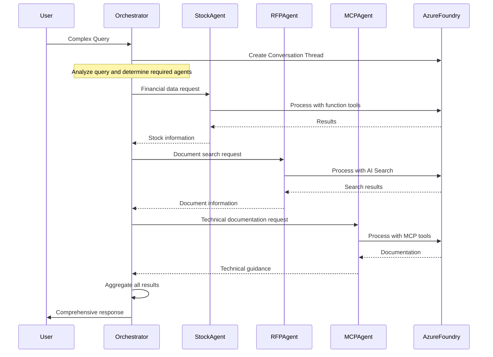

# Agent Demo: Single vs Multi-Agent System - Complete Documentation

## Overview

The Agent Demo system (`stcondemoui.py` and `stcondemo.py`) provides a comprehensive comparison between **Single Agent** and **Multi (Connected) Agent** architectures using Azure AI Foundry. This system demonstrates two distinct approaches to AI agent orchestration, each with unique strengths and use cases.

## Table of Contents

1. [System Architecture](#system-architecture)
2. [User Interface Guide](#user-interface-guide)
3. [Single Agent Mode](#single-agent-mode)
4. [Multi Agent Mode](#multi-agent-mode)
5. [Core Components](#core-components)
6. [Integration Patterns](#integration-patterns)
7. [Usage Examples](#usage-examples)
8. [Configuration](#configuration)
9. [Troubleshooting](#troubleshooting)

## System Architecture

### High-Level Architecture

```
┌─────────────────────────────────────────────────────────────┐
│                  Streamlit UI (stcondemoui.py)             │
│  ┌─────────────────┐  ┌─────────────────┐  ┌─────────────┐ │
│  │  Chat Interface │  │  Mode Selector  │  │ Tool Output │ │
│  │     & History   │  │ Single/Multi    │  │   Display   │ │
│  └─────────────────┘  └─────────────────┘  └─────────────┘ │
└─────────────────────┬───────────────────────────────────────┘
                      │
┌─────────────────────▼───────────────────────────────────────┐
│                 Backend Core (stcondemo.py)                │
│  ┌─────────────────┐              ┌─────────────────┐      │
│  │  single_agent() │              │connected_agent()│      │
│  │                 │              │                 │      │
│  │ • Function Tools│              │ • Agent         │      │
│  │ • MCP Tools     │              │   Orchestration │      │
│  │ • Local Exec    │              │ • Multi-service │      │
│  └─────────────────┘              └─────────────────┘      │
└─────────────────────┬───────────────────────────────────────┘
                      │
┌─────────────────────▼───────────────────────────────────────┐
│              Azure AI Foundry Platform                     │
│  ┌─────────────────┐  ┌─────────────────┐  ┌─────────────┐ │
│  │ Agent Management│  │ Thread Mgmt     │  │ Tool Engine │ │
│  └─────────────────┘  └─────────────────┘  └─────────────┘ │
└─────────────────────────────────────────────────────────────┘
```

### Component Interaction Flow

```
User Request → UI Processing → Mode Selection → Backend Execution → Azure AI Foundry → Response Assembly → UI Display
```

## User Interface Guide

### Main Interface Components

The Streamlit interface (`stcondemoui.py`) provides an intuitive chat-based experience with the following key components:

#### 1. **Configuration Sidebar**
- **Agent Mode Selector**: Radio buttons to choose between "Single Agent" and "Multi Agent"
- **Clear Chat/Reset Button**: Clears all chat history and run records
- **Environment Information**: Displays required environment variables

#### 2. **Main Chat Area** (Split Layout)

**Left Column (55%)**:
- **Summaries Container**: Shows latest run summary and token usage
- **Chat History Container**: Displays conversation history with timestamps

**Right Column (45%)**:
- **Tools & Agent Outputs Container**: Shows detailed tool execution logs
- **Run Logs Expander**: Displays execution details and debugging information

#### 3. **Chat Input**
- Text input field for user queries
- Supports various query types: weather, stocks, documentation, RFP, sustainability

### User Interaction Flow

```mermaid
graph TD
    A[User Opens App] --> B[Select Agent Mode]
    B --> C[Enter Query in Chat]
    C --> D{Mode Selected?}
    D -->|Single Agent| E[Execute single_agent()]
    D -->|Multi Agent| F[Execute connected_agent()]
    E --> G[Display Results]
    F --> G
    G --> H[Show in UI Components]
    H --> I[Wait for Next Query]
    I --> C
```

### UI Session State Management

The interface maintains several session state variables:

- **`chat_history`**: List of chat messages with roles and timestamps
- **`runs`**: List of execution records with summaries, tools, and metadata
- **`last_mode`**: Remembers the user's preferred agent mode

## Single Agent Mode

### Architecture Overview

Single Agent mode uses a unified agent that combines multiple tool types within a single execution context:

```
┌─────────────────────────────────────────────────────────┐
│               Single Agent Architecture                 │
│                                                         │
│  ┌─────────────────────────────────────────────────┐   │
│  │            Agent Controller                     │   │
│  │                                                 │   │
│  │  • Request Processing                           │   │
│  │  • Tool Selection Logic                        │   │
│  │  • Response Coordination                       │   │
│  └─────────────────┬───────────────────────────────┘   │
│                    │                                   │
│  ┌─────────────────▼───────────────────────────────┐   │
│  │              Tool Ecosystem                     │   │
│  │                                                 │   │
│  │  ┌─────────────┐  ┌─────────────┐  ┌─────────┐ │   │
│  │  │   MCP Tool  │  │ Function    │  │  Other  │ │   │
│  │  │             │  │ Tools       │  │  Tools  │ │   │
│  │  │ • MS Learn  │  │ • Weather   │  │         │ │   │
│  │  │   Protocol  │  │ • Stock     │  │         │ │   │
│  │  └─────────────┘  └─────────────┘  └─────────┘ │   │
│  └─────────────────────────────────────────────────┘   │
└─────────────────────────────────────────────────────────┘
```

### Key Features

1. **Integrated Tool Access**: Direct access to both local functions and MCP services
2. **Simplified Execution**: Single agent handles all tool coordination
3. **Efficient Processing**: Minimal overhead for simple to moderate complexity tasks
4. **Direct Response**: Immediate tool execution without agent-to-agent communication

### Tool Types in Single Agent Mode

#### **MCP Tools**
- **Microsoft Learn MCP**: Documentation and how-to queries
- **Server URL**: `https://learn.microsoft.com/api/mcp`
- **Purpose**: Azure documentation, SDK references, REST API guidance

#### **Function Tools**
- **Weather Tool** (`get_weather`): Current weather data using Open-Meteo API
- **Stock Tool** (`fetch_stock_data`): Stock prices using Yahoo Finance API
- **Custom Functions**: User-defined Python functions

### Execution Flow

```
1. User Query Reception
2. Agent Analysis & Tool Selection
3. Parallel Tool Execution (if applicable)
4. Response Assembly
5. Return Structured Results
```

### Single Agent Workflow Example

For a query like *"What's the weather in Paris and Microsoft stock price?"*:

```
Agent Controller
├── Analyzes: Weather query + Stock query
├── Selects Tools: get_weather() + fetch_stock_data()
├── Executes Parallel:
│   ├── get_weather("Paris") → Weather API
│   └── fetch_stock_data("Microsoft") → Yahoo Finance
├── Aggregates Results
└── Returns Combined Response
```

## Multi Agent Mode

### Architecture Overview

Multi Agent mode orchestrates specialized agents, each with distinct capabilities and responsibilities:

```
┌─────────────────────────────────────────────────────────┐
│             Multi Agent Architecture                    │
│                                                         │
│  ┌─────────────────────────────────────────────────┐   │
│  │          Main Orchestrator Agent                │   │
│  │                                                 │   │
│  │  • Request Distribution                         │   │
│  │  • Agent Coordination                          │   │
│  │  • Result Aggregation                          │   │
│  └─────────────────┬───────────────────────────────┘   │
│                    │                                   │
│  ┌─────────────────▼───────────────────────────────┐   │
│  │            Specialized Agents                   │   │
│  │                                                 │   │
│  │ ┌─────────┐ ┌─────────┐ ┌─────────┐ ┌─────────┐ │   │
│  │ │  Base   │ │  Stock  │ │  RFP    │ │  MCP    │ │   │
│  │ │ Agent   │ │ Agent   │ │ Search  │ │ Learn   │ │   │
│  │ │         │ │         │ │ Agent   │ │ Agent   │ │   │
│  │ └─────────┘ └─────────┘ └─────────┘ └─────────┘ │   │
│  │                                                 │   │
│  │ ┌─────────┐                                     │   │
│  │ │Sustain. │  [Additional Agents as Needed]     │   │
│  │ │ Agent   │                                     │   │
│  │ └─────────┘                                     │   │
│  └─────────────────────────────────────────────────┘   │
└─────────────────────────────────────────────────────────┘
```

### Specialized Agents

#### **1. Base Agent (`basaeagent`)**
- **Purpose**: Generic information processing
- **Tools**: Basic response generation
- **Use Case**: General queries and fallback responses

#### **2. Stock Price Agent (`Stockagent`)**
- **Purpose**: Financial data retrieval
- **Tools**: `fetch_stock_data` function
- **Use Case**: Stock prices, market data, financial information

#### **3. RFP Search Agent (`AISearchagent`)**
- **Purpose**: Construction and proposal document search
- **Tools**: Azure AI Search integration
- **Index**: `constructionrfpdocs1`
- **Use Case**: Construction management, RFP documents, project proposals

#### **4. Sustainability Agent (`Sustainabilitypaperagent`)**
- **Purpose**: Sustainability research and analysis
- **Tools**: File search with vector store
- **Resources**: Sustainability research papers (PDF documents)
- **Use Case**: Environmental impact, sustainability frameworks

#### **5. MCP Learn Agent (`Mcplearnagent`)**
- **Purpose**: Microsoft documentation and technical guidance
- **Tools**: Microsoft Learn MCP protocol
- **Use Case**: Azure documentation, technical how-to guides

### Multi Agent Workflow



### Agent Communication Pattern

Multi Agent mode uses Azure AI Foundry's **Connected Agent Tools** pattern:

1. **Agent Registration**: Each specialized agent is created and registered
2. **Tool Definition**: Agents are exposed as tools to the orchestrator
3. **Delegation**: Orchestrator delegates tasks based on capability matching
4. **Result Collection**: Responses are gathered and synthesized
5. **Cleanup**: All agents and resources are properly disposed

## Core Components

### Azure AI Foundry Integration

Both modes leverage Azure AI Foundry's comprehensive platform:

#### **Agent Management**
- **Agent Creation**: Dynamic agent instantiation
- **Lifecycle Management**: Creation, execution, and cleanup
- **Resource Allocation**: Memory and compute resource management

#### **Thread Management**
- **Conversation Context**: Maintains conversation state
- **Message Processing**: Handles request/response cycles
- **Session Persistence**: Temporary conversation storage

#### **Tool Execution Engine**
- **Tool Registration**: Dynamic tool capability registration
- **Execution Coordination**: Parallel and sequential tool execution
- **Result Aggregation**: Combines multiple tool outputs

### Model Integration

The system supports multiple Azure OpenAI models:

- **GPT-4o Models**: Primary reasoning and response generation
- **O1 Series Models**: Complex reasoning tasks (when available)
- **Embedding Models**: Vector search and semantic matching

### External Service Integration

#### **Function Tools Integration**
- **Weather Service**: Open-Meteo API for weather data
- **Financial Service**: Yahoo Finance API for stock data
- **Custom Functions**: User-defined Python functions

#### **MCP Protocol Integration**
- **Microsoft Learn**: Official Microsoft documentation
- **Protocol**: Model Context Protocol for external service access
- **Authentication**: Configurable headers and credentials

#### **Azure AI Search Integration**
- **Document Indexing**: Vector-based document search
- **Semantic Search**: Natural language query processing
- **Result Ranking**: Relevance-based result ordering

## Integration Patterns

### Tool Integration Hierarchy

```
┌─────────────────────────────────────────────────────────┐
│                 Tool Integration Layers                 │
│                                                         │
│  ┌─────────────────────────────────────────────────┐   │
│  │               Application Layer                 │   │
│  │        (stcondemoui.py / stcondemo.py)         │   │
│  └─────────────────┬───────────────────────────────┘   │
│                    │                                   │
│  ┌─────────────────▼───────────────────────────────┐   │
│  │            Azure AI Foundry Layer               │   │
│  │                                                 │   │
│  │  • Agent Management    • Thread Management      │   │
│  │  • Tool Registration   • Execution Engine       │   │
│  └─────────────────┬───────────────────────────────┘   │
│                    │                                   │
│  ┌─────────────────▼───────────────────────────────┐   │
│  │              Tool Implementation Layer          │   │
│  │                                                 │   │
│  │  ┌─────────────┐  ┌─────────────┐  ┌─────────┐ │   │
│  │  │ Function    │  │ Connected   │  │   MCP   │ │   │
│  │  │ Tools       │  │ Agent Tools │  │  Tools  │ │   │
│  │  └─────────────┘  └─────────────┘  └─────────┘ │   │
│  └─────────────────┬───────────────────────────────┘   │
│                    │                                   │
│  ┌─────────────────▼───────────────────────────────┐   │
│  │             External Services Layer             │   │
│  │                                                 │   │
│  │  • Weather APIs   • Financial APIs              │   │
│  │  • Azure Search   • Microsoft Learn             │   │
│  │  • Custom APIs    • File Systems                │   │
│  └─────────────────────────────────────────────────┘   │
└─────────────────────────────────────────────────────────┘
```

### Authentication and Security

#### **Azure Authentication**
- **DefaultAzureCredential**: Automatic credential discovery
- **Service Principal**: Production environment authentication
- **Managed Identity**: Azure-hosted application authentication

#### **Environment Configuration**
Required environment variables:
```
PROJECT_ENDPOINT=https://<account>.services.ai.azure.com/api/projects/<project>
MODEL_ENDPOINT=https://<account>.services.ai.azure.com
MODEL_API_KEY=<api_key>
MODEL_DEPLOYMENT_NAME=<model_name>
MCP_SERVER_URL=https://learn.microsoft.com/api/mcp
MCP_SERVER_LABEL=MicrosoftLearn
AZURE_SUBSCRIPTION_ID=<subscription_id>
AZURE_RESOURCE_GROUP=<resource_group>
```

## Usage Examples

### Single Agent Mode Examples

#### **Weather Query**
```
User: "What's the weather in Tokyo?"

Agent Flow:
1. Analyzes query → Weather request identified
2. Selects tool → get_weather("Tokyo")
3. Executes → Open-Meteo API call
4. Returns → Current temperature and wind speed
```

#### **Stock Query**
```
User: "What is Apple's stock price?"

Agent Flow:
1. Analyzes query → Financial request identified
2. Selects tool → fetch_stock_data("Apple")
3. Executes → Yahoo Finance API call
4. Returns → 7-day stock data and analysis
```

#### **Documentation Query**
```
User: "How do I create an Azure AI agent?"

Agent Flow:
1. Analyzes query → Documentation request identified
2. Selects tool → Microsoft Learn MCP
3. Executes → MCP protocol call
4. Returns → Azure AI agent creation guidance
```

### Multi Agent Mode Examples

#### **Complex Multi-Domain Query**
```
User: "Get Microsoft stock price and email the results to me"

Agent Flow:
1. Orchestrator analyzes → Stock + Email tasks identified
2. Delegates to Stock Agent → fetch_stock_data("Microsoft")
3. Delegates to Email Agent → send_email() with results
4. Aggregates responses → Combined confirmation
```

#### **RFP Construction Query**
```
User: "Show me construction management experience documents"

Agent Flow:
1. Orchestrator analyzes → Document search task
2. Delegates to RFP Agent → Azure AI Search query
3. Searches vector index → Construction RFP documents
4. Returns → Relevant project experience summaries
```

#### **Sustainability Research Query**
```
User: "Summarize sustainability frameworks from uploaded papers"

Agent Flow:
1. Orchestrator analyzes → Research document task
2. Delegates to Sustainability Agent → File search tool
3. Searches vector store → Sustainability papers
4. Returns → Framework summaries and insights
```

## Configuration

### Environment Setup

1. **Azure AI Foundry Project**
   - Create Azure AI Foundry project
   - Configure model deployments
   - Set up authentication

2. **Azure AI Search**
   - Create search service
   - Configure indexes (e.g., `constructionrfpdocs1`)
   - Upload and index documents

3. **Environment Variables**
   - Copy `.env.example` to `.env`
   - Configure all required variables
   - Test connectivity

### Model Configuration

The system supports flexible model configuration:

```python
# Primary model for agent responses
MODEL_DEPLOYMENT_NAME = "gpt-4o-mini"  # or gpt-4o, o1-preview

# Temperature settings
temperature = 0.0  # Deterministic responses

# Token limits
max_tokens = 4000  # Response length limit
```

### MCP Configuration

Microsoft Learn MCP integration:

```python
# MCP Server Configuration
MCP_SERVER_URL = "https://learn.microsoft.com/api/mcp"
MCP_SERVER_LABEL = "MicrosoftLearn"

# Tool configuration
allowed_tools = []  # Empty = all tools allowed
```

## Troubleshooting

### Common Issues

#### **1. Authentication Errors**
**Symptoms**: 401 Unauthorized, 403 Forbidden errors
**Solutions**:
- Verify Azure credentials are properly configured
- Check environment variables are set correctly
- Ensure service principal has necessary permissions

#### **2. Model Not Found Errors**
**Symptoms**: Model deployment not found
**Solutions**:
- Verify `MODEL_DEPLOYMENT_NAME` matches actual deployment
- Check model is deployed in the correct region
- Ensure model has sufficient quota

#### **3. Tool Execution Failures**
**Symptoms**: Tool calls fail or timeout
**Solutions**:
- Check network connectivity to external APIs
- Verify API keys and credentials
- Review rate limiting and quota restrictions

#### **4. MCP Connection Issues**
**Symptoms**: MCP tools not responding
**Solutions**:
- Verify `MCP_SERVER_URL` is accessible
- Check firewall and network restrictions
- Validate MCP server is operational

### Debugging Features

#### **UI Debug Information**
- **Token Usage**: Monitor API consumption
- **Tool Outputs**: Inspect tool execution details
- **Run Logs**: View execution traces
- **Error Messages**: Detailed error information

#### **Logging and Tracing**
```python
# Enable detailed logging
import logging
logging.basicConfig(level=logging.DEBUG)

# OpenTelemetry tracing (when configured)
from opentelemetry import trace
tracer = trace.get_tracer(__name__)
```

### Performance Optimization

#### **Response Time Optimization**
- Use appropriate temperature settings (0.0 for consistent responses)
- Implement result caching where appropriate
- Optimize tool selection logic

#### **Resource Management**
- Properly clean up agents and threads
- Monitor memory usage in long-running sessions
- Implement connection pooling for external APIs

### Best Practices

1. **Error Handling**: Implement comprehensive error handling for all external service calls
2. **Resource Cleanup**: Always dispose of agents and threads after use
3. **Rate Limiting**: Respect API rate limits and implement backoff strategies
4. **Security**: Never expose sensitive credentials in logs or UI
5. **Monitoring**: Implement logging and monitoring for production deployments

---

*This documentation provides a comprehensive guide to understanding and using the Agent Demo system. For additional technical details, see the accompanying architecture and API reference documents.*