# Agent Demo System - Mermaid Architecture Diagrams

This document contains comprehensive Mermaid diagrams for the Agent Demo system (`stcondemoui.py` and `stcondemo.py`), providing visual representations of the architecture, workflows, and interaction patterns.

## Table of Contents

1. [Complete System Architecture](#complete-system-architecture)
2. [Single Agent Mode Flow](#single-agent-mode-flow)
3. [Multi Agent Mode Flow](#multi-agent-mode-flow)
4. [UI Component Architecture](#ui-component-architecture)
5. [Tool Integration Patterns](#tool-integration-patterns)
6. [Sequence Diagrams](#sequence-diagrams)
7. [State Management Diagrams](#state-management-diagrams)
8. [Error Handling Flows](#error-handling-flows)

## Complete System Architecture

### High-Level System Overview

```mermaid
graph TB
    %% User Interface Layer
    User[User] --> StreamlitUI[Streamlit UI<br/>stcondemoui.py]
    StreamlitUI --> ChatInput[Chat Input Interface]
    StreamlitUI --> ModeSelector[Agent Mode Selector<br/>Single/Multi]
    StreamlitUI --> DisplayArea[Results Display Area]
    
    %% Backend Processing Layer
    ChatInput --> BackendCore[Backend Core<br/>stcondemo.py]
    BackendCore --> SingleAgent[single_agent&#40;&#41;<br/>Function]
    BackendCore --> MultiAgent[connected_agent&#40;&#41;<br/>Function]
    
    %% Mode Routing
    ModeSelector -->|Single Agent Mode| SingleAgent
    ModeSelector -->|Multi Agent Mode| MultiAgent
    
    %% Single Agent Architecture
    SingleAgent --> SingleAgentCore[Single Agent Core]
    SingleAgentCore --> FunctionTools[Function Tools<br/>Weather, Stock]
    SingleAgentCore --> MCPTools[MCP Tools<br/>Microsoft Learn]
    SingleAgentCore --> UnifiedExecution[Unified Execution Engine]
    
    %% Multi Agent Architecture  
    MultiAgent --> Orchestrator[Main Orchestrator Agent]
    Orchestrator --> BaseAgent[Base Agent<br/>basaeagent]
    Orchestrator --> StockAgentMA[Stock Agent<br/>Stockagent]
    Orchestrator --> RFPAgent[RFP Search Agent<br/>AISearchagent]
    Orchestrator --> SustainAgent[Sustainability Agent<br/>Sustainabilitypaperagent]
    Orchestrator --> MCPAgent[MCP Learn Agent<br/>Mcplearnagent]
    
    %% Azure AI Foundry Platform
    UnifiedExecution --> AzureFoundry[Azure AI Foundry Platform]
    Orchestrator --> AzureFoundry
    
    AzureFoundry --> AgentMgmt[Agent Management]
    AzureFoundry --> ThreadMgmt[Thread Management]
    AzureFoundry --> ToolEngine[Tool Execution Engine]
    AzureFoundry --> ModelServices[Model Services]
    
    %% External Integrations
    FunctionTools --> WeatherAPI[Weather API<br/>Open-Meteo]
    FunctionTools --> StockAPI[Stock API<br/>Yahoo Finance]
    StockAgentMA --> StockAPI
    
    MCPTools --> MSLearnMCP[Microsoft Learn<br/>MCP Server]
    MCPAgent --> MSLearnMCP
    
    RFPAgent --> AzureSearch[Azure AI Search<br/>RFP Documents]
    SustainAgent --> VectorStore[Vector Store<br/>Research Papers]
    
    %% Results Flow
    UnifiedExecution --> ResultsProcessor[Results Processor]
    Orchestrator --> ResultsAggregator[Results Aggregator]
    ResultsProcessor --> DisplayArea
    ResultsAggregator --> DisplayArea
    
    %% Session Management
    StreamlitUI --> SessionState[Session State Management]
    SessionState --> ChatHistory[Chat History]
    SessionState --> RunRecords[Run Records]
    SessionState --> ModePreference[Mode Preference]
    
    %% Styling
    classDef uiClass fill:#e3f2fd,stroke:#1976d2,stroke-width:2px
    classDef singleClass fill:#f3e5f5,stroke:#7b1fa2,stroke-width:2px
    classDef multiClass fill:#e8f5e8,stroke:#388e3c,stroke-width:2px
    classDef azureClass fill:#fff3e0,stroke:#ef6c00,stroke-width:2px
    classDef externalClass fill:#ffebee,stroke:#c62828,stroke-width:2px
    
    class User,StreamlitUI,ChatInput,ModeSelector,DisplayArea uiClass
    class SingleAgent,SingleAgentCore,FunctionTools,MCPTools,UnifiedExecution singleClass
    class MultiAgent,Orchestrator,BaseAgent,StockAgentMA,RFPAgent,SustainAgent,MCPAgent multiClass
    class AzureFoundry,AgentMgmt,ThreadMgmt,ToolEngine,ModelServices azureClass
    class WeatherAPI,StockAPI,MSLearnMCP,AzureSearch,VectorStore externalClass
```

## Single Agent Mode Flow

### Single Agent Architecture and Execution Flow

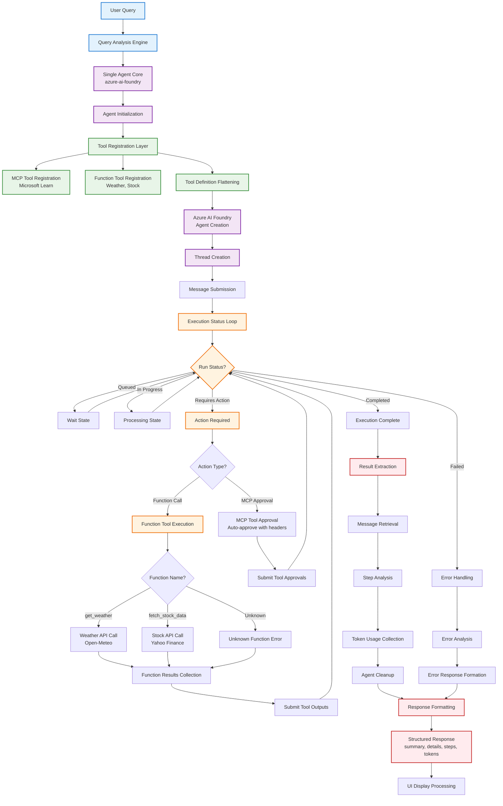

### Single Agent Tool Integration Detail

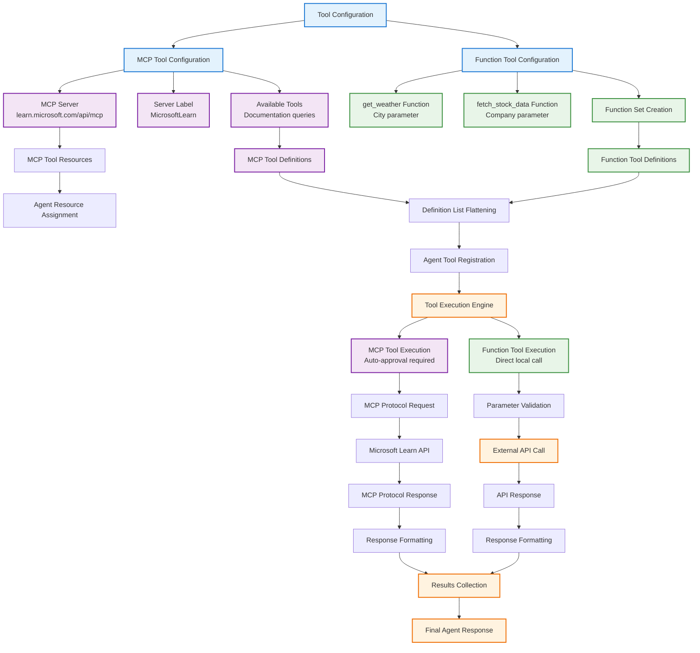

## Multi Agent Mode Flow

### Multi Agent Orchestration Architecture

```mermaid
graph TB
    %% User Request Processing
    UserRequest[User Request] --> RequestAnalysis[Request Analysis]
    RequestAnalysis --> MultiAgentCore[Multi Agent Core<br/>connected_agent&#40;&#41;]
    
    %% Specialized Agent Creation Phase
    MultiAgentCore --> AgentCreationPhase[Agent Creation Phase]
    AgentCreationPhase --> CreateBaseAgent[Create Base Agent<br/>basaeagent]
    AgentCreationPhase --> CreateStockAgent[Create Stock Agent<br/>Stockagent]
    AgentCreationPhase --> CreateRFPAgent[Create RFP Agent<br/>AISearchagent]
    AgentCreationPhase --> CreateSustainAgent[Create Sustainability Agent<br/>Sustainabilitypaperagent]
    AgentCreationPhase --> CreateMCPAgent[Create MCP Agent<br/>Mcplearnagent]
    
    %% Agent Configuration Details
    CreateBaseAgent --> BaseConfig[Base Agent Configuration<br/>Generic responses]
    CreateStockAgent --> StockConfig[Stock Agent Configuration<br/>Function tools: fetch_stock_data]
    CreateRFPAgent --> RFPConfig[RFP Agent Configuration<br/>Azure AI Search tools]
    CreateSustainAgent --> SustainConfig[Sustainability Agent Configuration<br/>File search tools, Vector store]
    CreateMCPAgent --> MCPConfig[MCP Agent Configuration<br/>Microsoft Learn MCP]
    
    %% Connected Agent Tool Registration
    BaseConfig --> ConnectedToolReg[Connected Agent Tool Registration]
    StockConfig --> ConnectedToolReg
    RFPConfig --> ConnectedToolReg
    SustainConfig --> ConnectedToolReg
    MCPConfig --> ConnectedToolReg
    
    %% Main Orchestrator Creation
    ConnectedToolReg --> OrchestratorCreation[Main Orchestrator Creation]
    OrchestratorCreation --> OrchestratorConfig[Orchestrator Configuration<br/>Connected agent tools<br/>Delegation instructions]
    
    %% Execution Phase
    OrchestratorConfig --> ExecutionPhase[Execution Phase]
    ExecutionPhase --> ThreadCreation[Conversation Thread Creation]
    ThreadCreation --> MessageSubmission[User Message Submission]
    MessageSubmission --> OrchestratorExecution[Orchestrator Execution<br/>create_and_process]
    
    %% Orchestration Flow
    OrchestratorExecution --> TaskAnalysis[Task Analysis<br/>Determine required capabilities]
    TaskAnalysis --> AgentSelection[Agent Selection<br/>Match tasks to agents]
    
    %% Agent Delegation
    AgentSelection --> DelegateToStock{Stock Data Needed?}
    AgentSelection --> DelegateToRFP{RFP Search Needed?}
    AgentSelection --> DelegateToSustain{Sustainability Info Needed?}
    AgentSelection --> DelegateToMCP{Technical Docs Needed?}
    AgentSelection --> DelegateToBase{Generic Processing Needed?}
    
    DelegateToStock -->|Yes| StockExecution[Stock Agent Execution<br/>fetch_stock_data function]
    DelegateToRFP -->|Yes| RFPExecution[RFP Agent Execution<br/>Azure AI Search query]
    DelegateToSustain -->|Yes| SustainExecution[Sustainability Agent Execution<br/>Vector store search]
    DelegateToMCP -->|Yes| MCPExecution[MCP Agent Execution<br/>Microsoft Learn query]
    DelegateToBase -->|Yes| BaseExecution[Base Agent Execution<br/>Generic response]
    
    %% Results Aggregation
    StockExecution --> ResultsAggregation[Results Aggregation<br/>Orchestrator coordination]
    RFPExecution --> ResultsAggregation
    SustainExecution --> ResultsAggregation
    MCPExecution --> ResultsAggregation
    BaseExecution --> ResultsAggregation
    
    %% Response Synthesis
    ResultsAggregation --> ResponseSynthesis[Response Synthesis<br/>Combine all agent outputs]
    ResponseSynthesis --> FinalResponse[Final Comprehensive Response]
    
    %% Cleanup Phase
    FinalResponse --> CleanupPhase[Cleanup Phase]
    CleanupPhase --> DeleteAgents[Delete All Created Agents]
    CleanupPhase --> DeleteThreads[Delete Conversation Threads]
    CleanupPhase --> DeleteFiles[Delete Uploaded Files]
    CleanupPhase --> DeleteVectorStores[Delete Vector Stores]
    
    %% UI Response
    DeleteVectorStores --> UIResponse[UI Response Formatting]
    UIResponse --> DisplayResults[Display in Streamlit UI]
    
    %% Styling
    classDef requestClass fill:#e3f2fd,stroke:#1976d2,stroke-width:2px
    classDef creationClass fill:#f3e5f5,stroke:#7b1fa2,stroke-width:2px
    classDef agentClass fill:#e8f5e8,stroke:#388e3c,stroke-width:2px
    classDef executionClass fill:#fff3e0,stroke:#ef6c00,stroke-width:2px
    classDef cleanupClass fill:#ffebee,stroke:#c62828,stroke-width:2px
    
    class UserRequest,RequestAnalysis,MultiAgentCore requestClass
    class AgentCreationPhase,CreateBaseAgent,CreateStockAgent,CreateRFPAgent creationClass
    class BaseConfig,StockConfig,RFPConfig,SustainConfig,MCPConfig agentClass
    class ExecutionPhase,TaskAnalysis,AgentSelection,ResultsAggregation executionClass
    class CleanupPhase,DeleteAgents,DeleteThreads,UIResponse cleanupClass
```

### Multi Agent Communication Sequence

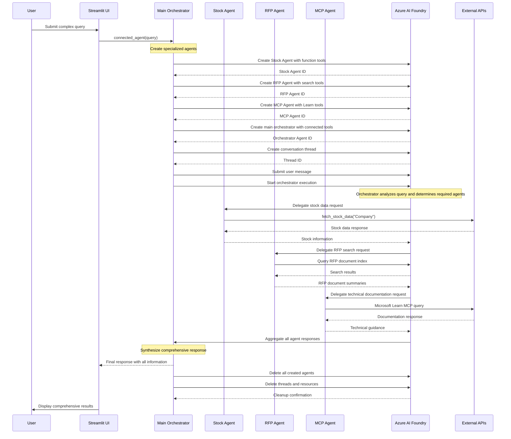

## UI Component Architecture

### Streamlit UI Component Structure

```mermaid
graph TB
    %% Main UI Entry
    StreamlitApp[Streamlit Application<br/>stcondemoui.py] --> UIConfig[UI Configuration<br/>st.set_page_config]
    UIConfig --> SessionInit[Session State Initialization]
    
    %% Session State Components
    SessionInit --> ChatHistoryState[Chat History State<br/>st.session_state.chat_history]
    SessionInit --> RunsState[Runs State<br/>st.session_state.runs]
    SessionInit --> ModeState[Mode State<br/>st.session_state.last_mode]
    
    %% Main Layout Structure
    SessionInit --> MainLayout[Main Layout Structure]
    MainLayout --> TitleHeader[Title Header<br/>Agent Chat Demo]
    MainLayout --> SidebarConfig[Sidebar Configuration]
    MainLayout --> MainColumns[Main Columns Layout<br/>55% / 45% split]
    
    %% Sidebar Components
    SidebarConfig --> ModeSelector[Agent Mode Selector<br/>Single/Multi Radio Buttons]
    SidebarConfig --> ClearButton[Clear Chat/Reset Button]
    SidebarConfig --> EnvInfo[Environment Information]
    
    %% Left Column Components
    MainColumns --> LeftColumn[Left Column Container]
    LeftColumn --> SummaryContainer[Summary Container<br/>Height: 200px]
    LeftColumn --> HistoryContainer[History Container<br/>Height: 300px]
    
    %% Right Column Components
    MainColumns --> RightColumn[Right Column Container]
    RightColumn --> ToolsContainer[Tools & Agent Outputs<br/>Height: 520px]
    
    %% Chat Input Component
    MainLayout --> ChatInputComponent[Chat Input Component<br/>st.chat_input]
    
    %% Event Handlers
    ModeSelector --> ModeChangeHandler[Mode Change Handler<br/>Update session state]
    ClearButton --> ClearHandler[Clear Handler<br/>Reset all session state]
    ChatInputComponent --> MessageHandler[Message Handler<br/>Process user input]
    
    %% Message Processing Flow
    MessageHandler --> InputValidation[Input Validation]
    InputValidation --> ModeRouting[Mode Routing]
    ModeRouting --> SingleAgentCall[Single Agent Function Call<br/>single_agent&#40;&#41;]
    ModeRouting --> MultiAgentCall[Multi Agent Function Call<br/>connected_agent&#40;&#41;]
    
    %% Response Processing
    SingleAgentCall --> ResponseProcessor[Response Processor]
    MultiAgentCall --> ResponseProcessor
    ResponseProcessor --> SessionUpdate[Session State Update<br/>Add to chat_history and runs]
    SessionUpdate --> UIRerun[UI Rerun<br/>st.rerun&#40;&#41;]
    
    %% Display Rendering
    UIRerun --> RenderSummary[Render Summary<br/>Latest run metadata]
    UIRerun --> RenderHistory[Render History<br/>Chat messages with timestamps]
    UIRerun --> RenderTools[Render Tools<br/>Tool outputs and logs]
    
    %% Summary Display Details
    SummaryContainer --> LatestMode[Latest Mode Display]
    SummaryContainer --> SummaryText[Summary Text Display<br/>Truncated to 1200 chars]
    SummaryContainer --> TokenUsage[Token Usage Display<br/>Prompt/Completion/Total]
    
    %% History Display Details
    HistoryContainer --> MessageLoop[Message Iteration Loop]
    MessageLoop --> MessageRole[Message Role<br/>User/Assistant]
    MessageLoop --> MessageContent[Message Content]
    MessageLoop --> MessageTimestamp[Message Timestamp]
    MessageLoop --> MessageSeparator[Message Separator]
    
    %% Tools Display Details
    ToolsContainer --> RunLogs[Run Logs Expander<br/>Execution details]
    ToolsContainer --> ToolOutputs[Tool Outputs Display]
    ToolOutputs --> ToolLoop[Tool Iteration Loop]
    ToolLoop --> ToolName[Tool Name]
    ToolLoop --> ToolExpander[Tool Expander<br/>Individual tool details]
    ToolExpander --> ToolArguments[Tool Arguments<br/>JSON formatted]
    ToolExpander --> ToolOutput[Tool Output<br/>Truncated to 4000 chars]
    
    %% Styling
    classDef uiMainClass fill:#e3f2fd,stroke:#1976d2,stroke-width:2px
    classDef stateClass fill:#f3e5f5,stroke:#7b1fa2,stroke-width:2px
    classDef layoutClass fill:#e8f5e8,stroke:#388e3c,stroke-width:2px
    classDef handlerClass fill:#fff3e0,stroke:#ef6c00,stroke-width:2px
    classDef displayClass fill:#ffebee,stroke:#c62828,stroke-width:2px
    
    class StreamlitApp,UIConfig,MainLayout,TitleHeader uiMainClass
    class SessionInit,ChatHistoryState,RunsState,ModeState stateClass
    class SidebarConfig,MainColumns,LeftColumn,RightColumn layoutClass
    class ModeChangeHandler,ClearHandler,MessageHandler,ResponseProcessor handlerClass
    class RenderSummary,RenderHistory,RenderTools,ToolOutputs displayClass
```

### UI State Management Flow

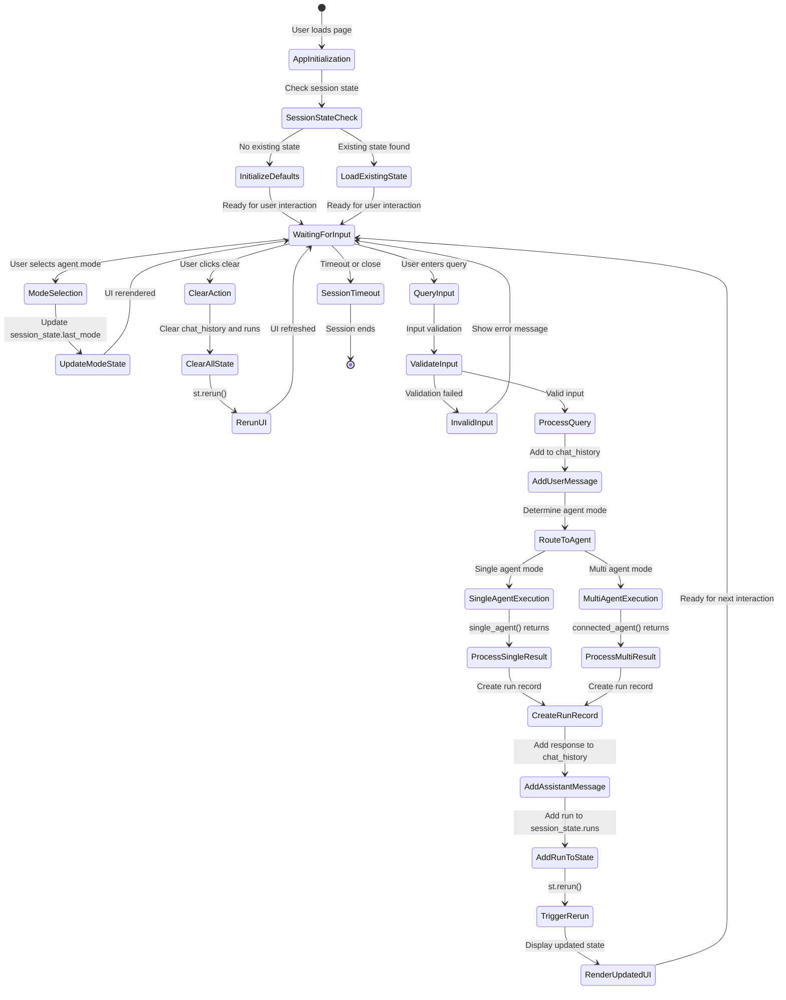

## Tool Integration Patterns

### Tool Integration Architecture

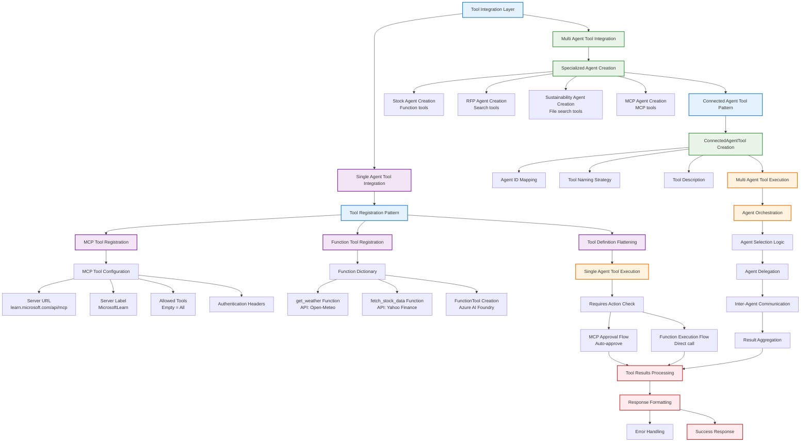

### Function Tool Execution Pattern

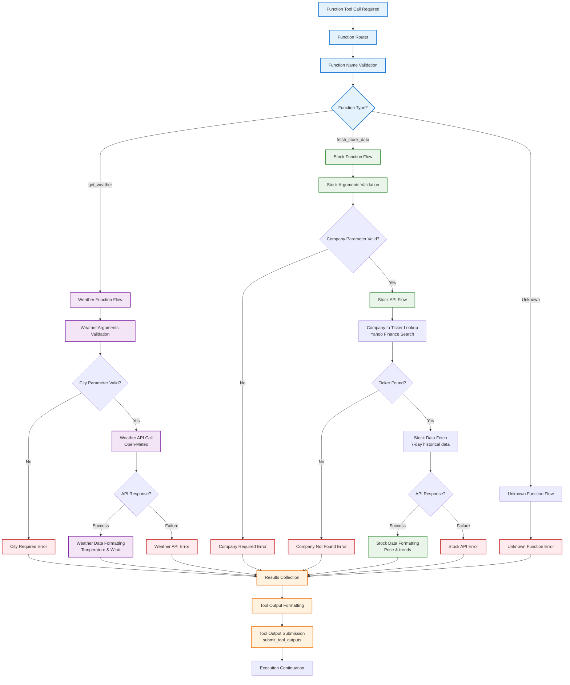

## Sequence Diagrams

### Single Agent Query Processing Sequence

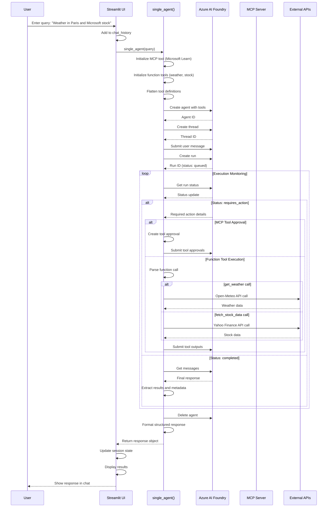

### Multi Agent Orchestration Sequence

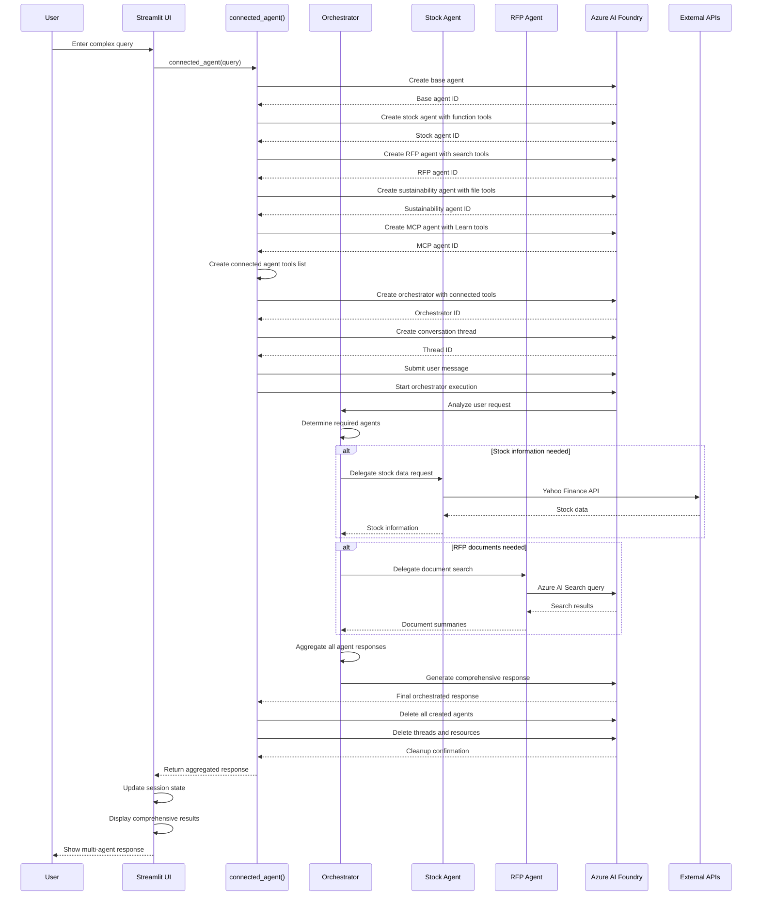

## State Management Diagrams

### Session State Lifecycle

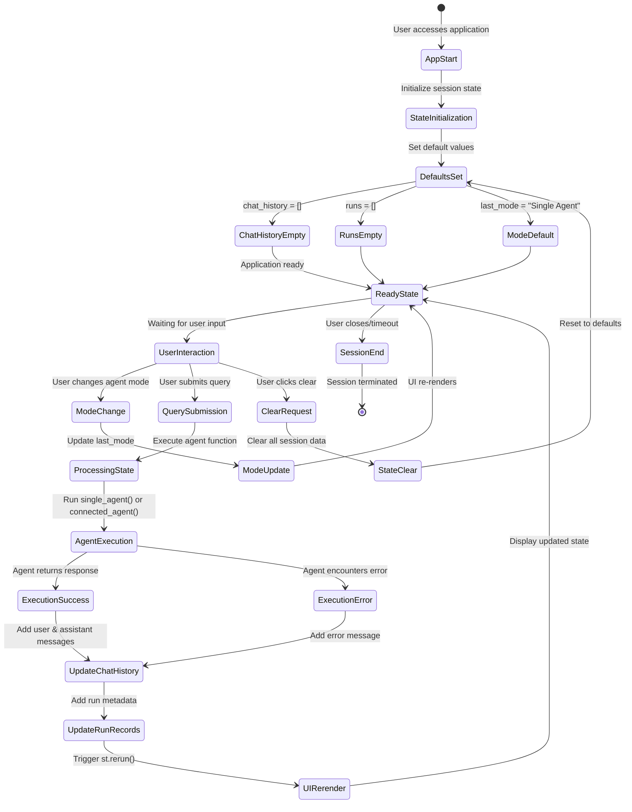

### Chat History State Management

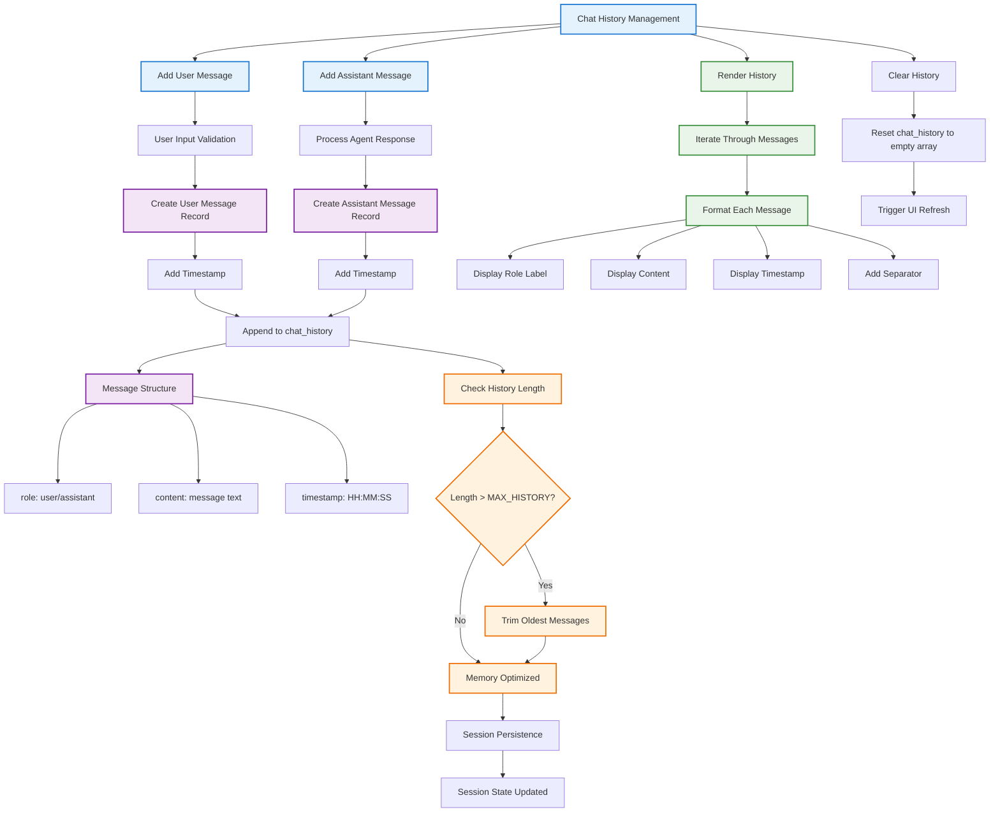

## Error Handling Flows

### Comprehensive Error Handling Architecture

```mermaid
graph TB
    %% Error Entry Points
    ErrorSystem[Error Handling System] --> AgentErrors[Agent Execution Errors]
    ErrorSystem --> UIErrors[UI Interaction Errors]
    ErrorSystem --> ExternalErrors[External Service Errors]
    ErrorSystem --> ValidationErrors[Input Validation Errors]
    
    %% Agent Execution Error Flow
    AgentErrors --> AgentErrorType{Agent Error Type?}
    AgentErrorType -->|Authentication| AuthError[Authentication Error<br/>401/403 responses]
    AgentErrorType -->|Rate Limiting| RateError[Rate Limiting Error<br/>429 responses]
    AgentErrorType -->|Tool Execution| ToolError[Tool Execution Error<br/>Function failures]
    AgentErrorType -->|Model| ModelError[Model Error<br/>Model not found/unavailable]
    AgentErrorType -->|Timeout| TimeoutError[Timeout Error<br/>Long running operations]
    
    %% Authentication Error Handling
    AuthError --> AuthErrorHandler[Authentication Error Handler]
    AuthErrorHandler --> CheckCredentials[Check Azure Credentials]
    AuthErrorHandler --> AuthErrorResponse[Generate Auth Error Message]
    AuthErrorResponse --> AuthRecovery[Suggest Credential Fix]
    
    %% Rate Limiting Error Handling
    RateError --> RateErrorHandler[Rate Limiting Error Handler]
    RateErrorHandler --> BackoffStrategy[Implement Backoff Strategy]
    RateErrorHandler --> RateErrorResponse[Generate Rate Limit Message]
    RateErrorResponse --> RateRecovery[Suggest Retry Later]
    
    %% Tool Execution Error Handling
    ToolError --> ToolErrorHandler[Tool Error Handler]
    ToolErrorHandler --> ToolErrorType{Tool Error Type?}
    ToolErrorType -->|Function Error| FunctionErrorFlow[Function Error Flow]
    ToolErrorType -->|MCP Error| MCPErrorFlow[MCP Error Flow]
    ToolErrorType -->|External API Error| APIErrorFlow[External API Error Flow]
    
    %% Function Error Flow
    FunctionErrorFlow --> FunctionValidation[Function Parameter Validation]
    FunctionValidation --> FunctionErrorResponse[Generate Function Error Message]
    FunctionErrorResponse --> FunctionRecovery[Suggest Parameter Fix]
    
    %% MCP Error Flow
    MCPErrorFlow --> MCPConnectivityCheck[Check MCP Server Connectivity]
    MCPConnectivityCheck --> MCPErrorResponse[Generate MCP Error Message]
    MCPErrorResponse --> MCPRecovery[Suggest Network Check]
    
    %% External API Error Flow
    APIErrorFlow --> APIConnectivityCheck[Check External API Connectivity]
    APIConnectivityCheck --> APIErrorResponse[Generate API Error Message]
    APIErrorResponse --> APIRecovery[Suggest API Status Check]
    
    %% Model Error Handling
    ModelError --> ModelErrorHandler[Model Error Handler]
    ModelErrorHandler --> ModelValidation[Model Deployment Validation]
    ModelValidation --> ModelErrorResponse[Generate Model Error Message]
    ModelErrorResponse --> ModelRecovery[Suggest Model Check]
    
    %% Timeout Error Handling
    TimeoutError --> TimeoutErrorHandler[Timeout Error Handler]
    TimeoutErrorHandler --> TimeoutAnalysis[Analyze Timeout Cause]
    TimeoutAnalysis --> TimeoutErrorResponse[Generate Timeout Error Message]
    TimeoutErrorResponse --> TimeoutRecovery[Suggest Shorter Query]
    
    %% UI Error Handling
    UIErrors --> UIErrorType{UI Error Type?}
    UIErrorType -->|Input Validation| InputValidationError[Input Validation Error]
    UIErrorType -->|Session State| SessionStateError[Session State Error]
    UIErrorType -->|Display| DisplayError[Display Error]
    
    %% Input Validation Error Flow
    InputValidationError --> InputValidationHandler[Input Validation Handler]
    InputValidationHandler --> ValidationRules[Apply Validation Rules]
    ValidationRules --> ValidationErrorResponse[Generate Validation Error]
    ValidationErrorResponse --> ValidationRecovery[Suggest Input Fix]
    
    %% Session State Error Flow
    SessionStateError --> SessionErrorHandler[Session State Error Handler]
    SessionErrorHandler --> StateRecovery[Attempt State Recovery]
    StateRecovery --> StateErrorResponse[Generate State Error Message]
    StateErrorResponse --> StateReset[Suggest State Reset]
    
    %% External Service Error Flow
    ExternalErrors --> ExternalErrorType{External Service Type?}
    ExternalErrorType -->|Weather API| WeatherServiceError[Weather Service Error]
    ExternalErrorType -->|Stock API| StockServiceError[Stock Service Error]
    ExternalErrorType -->|Azure Service| AzureServiceError[Azure Service Error]
    
    %% Error Response Assembly
    AuthRecovery --> ErrorResponseAssembly[Error Response Assembly]
    RateRecovery --> ErrorResponseAssembly
    FunctionRecovery --> ErrorResponseAssembly
    MCPRecovery --> ErrorResponseAssembly
    APIRecovery --> ErrorResponseAssembly
    ModelRecovery --> ErrorResponseAssembly
    TimeoutRecovery --> ErrorResponseAssembly
    ValidationRecovery --> ErrorResponseAssembly
    StateReset --> ErrorResponseAssembly
    
    %% Final Error Response
    ErrorResponseAssembly --> ErrorFormatting[Error Message Formatting]
    ErrorFormatting --> ErrorLogging[Error Logging]
    ErrorLogging --> UserErrorDisplay[User Error Display]
    UserErrorDisplay --> ErrorRecoveryGuidance[Recovery Guidance]
    
    %% Styling
    classDef errorTypeClass fill:#ffebee,stroke:#c62828,stroke-width:2px
    classDef handlerClass fill:#fff3e0,stroke:#ef6c00,stroke-width:2px
    classDef responseClass fill:#e8f5e8,stroke:#388e3c,stroke-width:2px
    classDef recoveryClass fill:#e3f2fd,stroke:#1976d2,stroke-width:2px
    
    class AgentErrors,UIErrors,ExternalErrors,ValidationErrors errorTypeClass
    class AuthErrorHandler,RateErrorHandler,ToolErrorHandler,ModelErrorHandler handlerClass
    class AuthErrorResponse,RateErrorResponse,ModelErrorResponse,ValidationErrorResponse responseClass
    class AuthRecovery,RateRecovery,ModelRecovery,ValidationRecovery,ErrorRecoveryGuidance recoveryClass
```

### Error Recovery Strategies

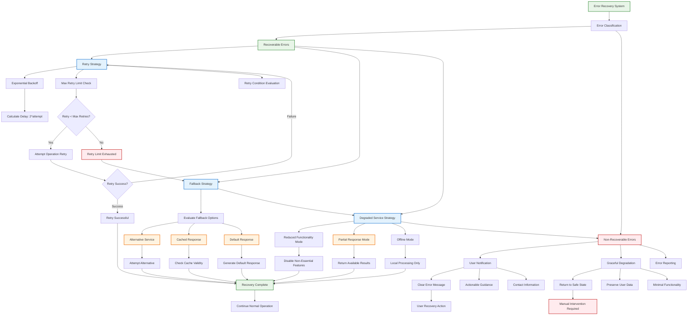

---

*These Mermaid diagrams provide comprehensive visual documentation of the Agent Demo system architecture, covering all major components, flows, and interaction patterns. The diagrams are designed to be viewed in Mermaid-compatible environments and serve as interactive documentation for understanding the system's design and operation.*