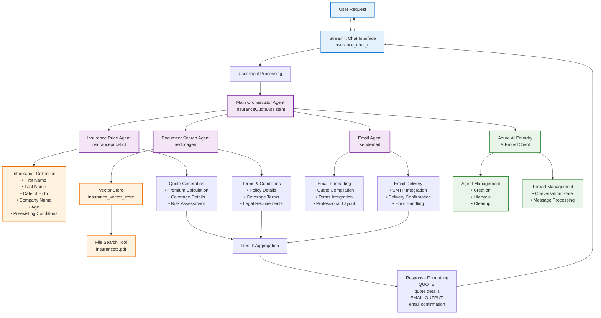
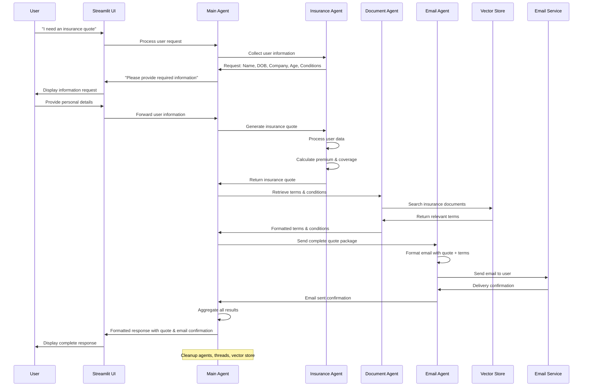
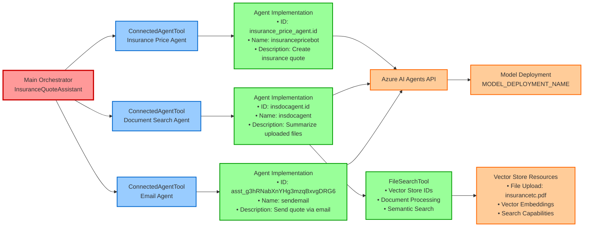
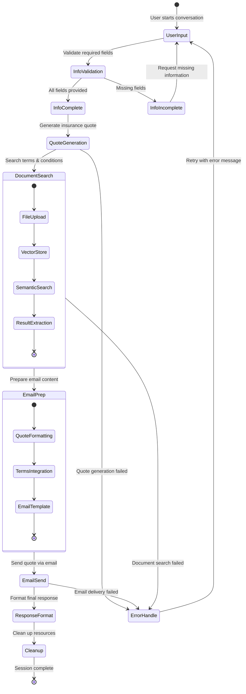
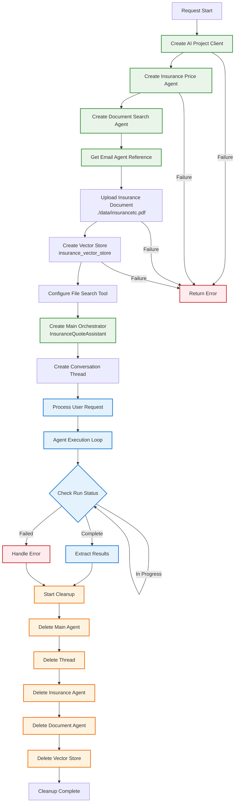
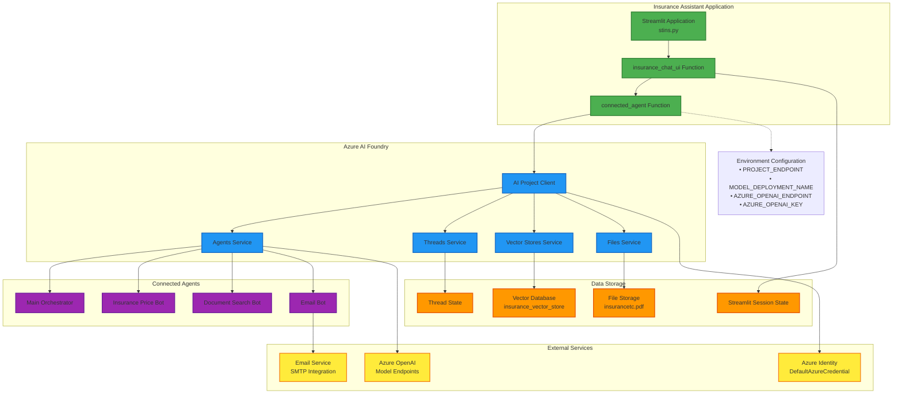

# Insurance Quote Assistant - Mermaid Architecture Diagrams

This document contains comprehensive Mermaid diagrams specifically for the Insurance Quote Assistant (`stins.py`) multi-agent orchestration system.

## Viewing the Diagrams

These mermaid diagrams can be viewed in several ways:

1. **GitHub**: The diagrams should render automatically when viewing this file on GitHub
2. **VS Code**: Install the "Mermaid Markdown Syntax Highlighting" extension
3. **Online Viewers**: Copy the mermaid code to [mermaid.live](https://mermaid.live) or [mermaid-js.github.io](https://mermaid-js.github.io/mermaid-live-editor)
4. **Local Tools**: Use mermaid CLI tools or browser extensions that support mermaid rendering

> **Note**: If the diagrams don't render properly in your environment, you can copy the mermaid code blocks to any online mermaid viewer for proper visualization.

## 1. Insurance Assistant Multi-Agent Architecture

## 2. Agent Communication Flow

## 3. Connected Agent Tool Architecture

## 4. Data Flow and State Management

## 5. Resource Lifecycle Management

## 6. Integration Architecture

## 7. Security and Authentication Flow

```mermaid
graph LR
    %% User Authentication
    User[User] --> StreamlitApp[Streamlit Application]
    
    %% Application Authentication
    StreamlitApp --> EnvValidation[Environment Variable Validation]
    EnvValidation --> AzureAuth[Azure Authentication]
    
    %% Azure Authentication Chain
    AzureAuth --> DefaultCredential[DefaultAzureCredential]
    DefaultCredential --> ServicePrincipal[Service Principal Authentication]
    DefaultCredential --> ManagedIdentity[Managed Identity Authentication]
    DefaultCredential --> AzureCLI[Azure CLI Authentication]
    
    %% Service Access
    ServicePrincipal --> ProjectAccess[AI Project Access]
    ManagedIdentity --> ProjectAccess
    AzureCLI --> ProjectAccess
    
    ProjectAccess --> AgentPermissions[Agent Management Permissions]
    ProjectAccess --> VectorPermissions[Vector Store Permissions]
    ProjectAccess --> FilePermissions[File Management Permissions]
    
    %% Data Security
    AgentPermissions --> SecureComm[Secure Agent Communication<br/>HTTPS/TLS]
    VectorPermissions --> EncryptedStorage[Encrypted Vector Storage]
    FilePermissions --> SecureFileUpload[Secure File Upload]
    
    %% External Service Security
    SecureComm --> EmailSecurity[Email Service Security<br/>• Authentication<br/>• Encryption<br/>• Audit Logging]
    
    %% Privacy Protection
    EncryptedStorage --> DataPrivacy[Data Privacy<br/>• PII Protection<br/>• Data Retention<br/>• GDPR Compliance]
    
    %% Audit and Monitoring
    DataPrivacy --> AuditLogging[Audit Logging<br/>• Access Logs<br/>• Operation Logs<br/>• Error Logs]
    EmailSecurity --> AuditLogging
    
    %% Styling
    classDef userClass fill:#e1f5fe,stroke:#0277bd,stroke-width:2px
    classDef authClass fill:#f3e5f5,stroke:#7b1fa2,stroke-width:2px
    classDef securityClass fill:#e8f5e8,stroke:#388e3c,stroke-width:2px
    classDef privacyClass fill:#fff3e0,stroke:#ef6c00,stroke-width:2px
    
    class User,StreamlitApp userClass
    class EnvValidation,AzureAuth,DefaultCredential,ServicePrincipal,ManagedIdentity,AzureCLI authClass
    class ProjectAccess,AgentPermissions,VectorPermissions,FilePermissions,SecureComm,EmailSecurity securityClass
    class EncryptedStorage,SecureFileUpload,DataPrivacy,AuditLogging privacyClass
```

## Conclusion

These Mermaid diagrams provide comprehensive visual documentation of the Insurance Quote Assistant's multi-agent architecture. The diagrams illustrate:

1. **Multi-Agent Orchestration**: How connected agents work together
2. **Communication Patterns**: Message flow between components
3. **Tool Architecture**: Connected Agent Tool implementation
4. **State Management**: Application state transitions
5. **Resource Lifecycle**: Creation and cleanup processes
6. **Integration Architecture**: External service connections
7. **Security Flow**: Authentication and data protection

The visual representations help understand the complex interactions within the Azure AI Foundry Connected Agent ecosystem and provide a reference for system architecture, troubleshooting, and future enhancements.