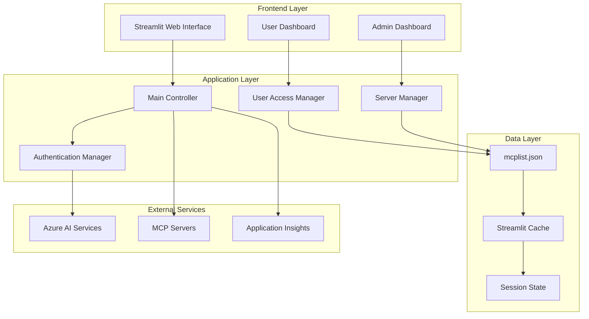
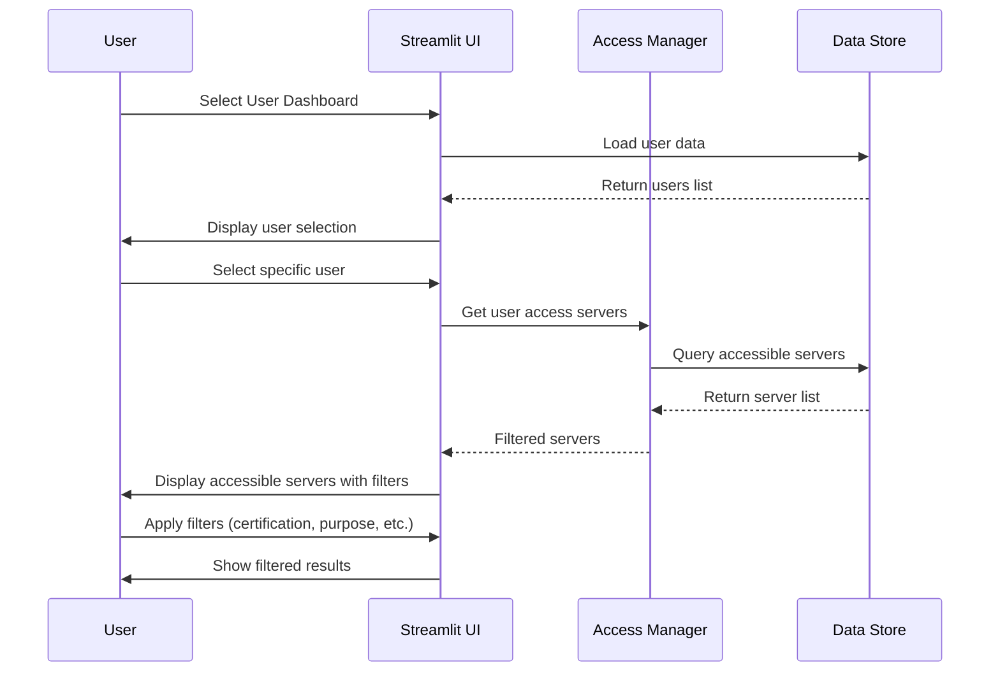
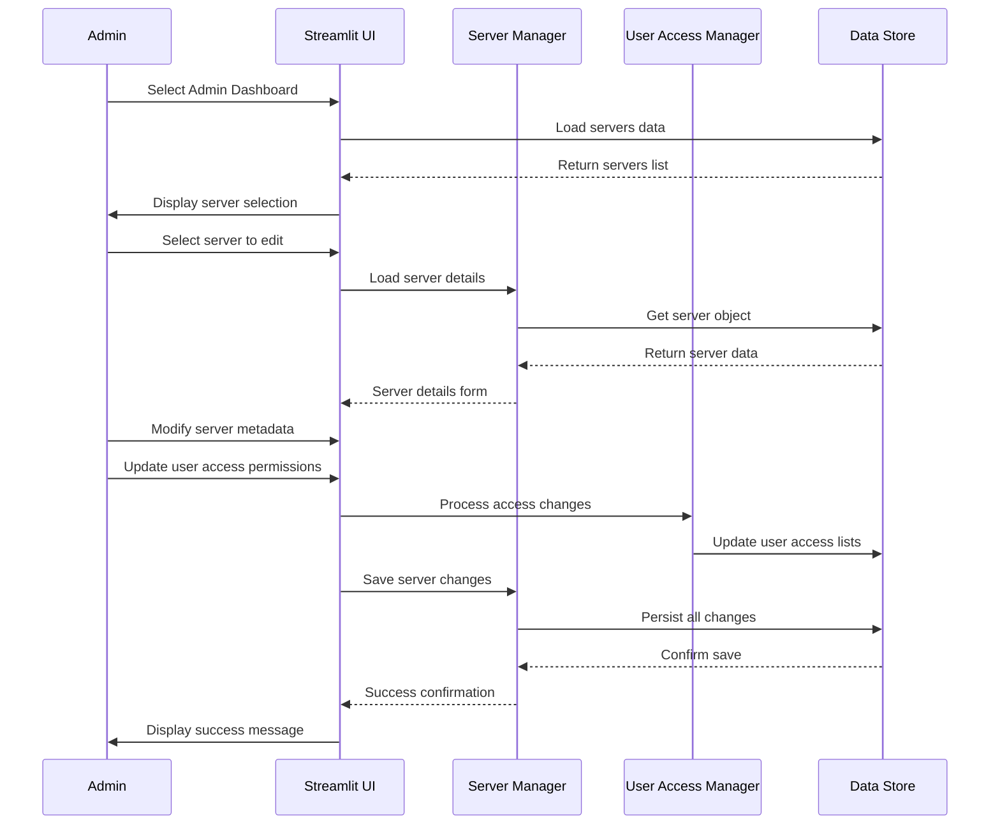

# MCP Server Access Dashboard (`stmcplist.py`) - Complete Documentation

## Overview

The MCP Server Access Dashboard is a comprehensive Streamlit-based web application designed to manage user access to Model Context Protocol (MCP) servers within the AgenticAI ecosystem. This application provides both administrative capabilities for server management and user dashboards for accessing authorized MCP servers.

## Architecture Overview

### System Components



### Data Model

The application manages two primary data structures:

#### MCP Server Object
```json
{
  "id": "integer",
  "name": "string",
  "auth": {
    "username": "string",
    "api_key": "string"
  },
  "certified": "boolean",
  "expiration_date": "YYYY-MM-DD",
  "company_name": "string",
  "business_unit": "string",
  "cost_center": "string",
  "purpose": "string",
  "instructions": "string",
  "prompt": "string"
}
```

#### User Object
```json
{
  "id": "integer",
  "username": "string", 
  "password": "string",
  "access_servers": ["array of server IDs"]
}
```

## Core Functionality

### 1. User Access Dashboard

The User Access Dashboard provides a filtered view of MCP servers that a specific user has access to.

#### Features:
- **User Selection**: Dropdown to select from available users
- **Server Access View**: Display of all servers the selected user can access
- **Advanced Filtering**: Multi-dimensional filtering by:
  - Certification Status (Yes/No)
  - Purpose (Development, Production, Testing, etc.)
  - Business Unit (Engineering, Finance, HR, etc.)
- **Expiration Tracking**: Visual indicators for expired servers
- **Detailed Server Information**: Expandable sections showing authentication details

#### Access Control Logic:
```python
def get_user_accessible_servers(user, servers):
    """Returns servers accessible to the user"""
    access_ids = user.get('access_servers', [])
    return [s for s in servers if s['id'] in access_ids]
```

### 2. Admin Dashboard

The Admin Dashboard provides comprehensive server management and user access administration.

#### Features:
- **Server Selection**: Choose from all available MCP servers
- **Metadata Management**: Edit server properties including:
  - Name and certification status
  - Expiration dates
  - Company and business unit information
  - Purpose and instructions
  - Authentication credentials
- **User Access Management**: Grant or revoke user access via multiselect interface
- **Real-time Updates**: Changes are immediately persisted to storage

#### Access Update Logic:
```python
def update_user_access_for_server(server_id, selected_usernames, users_list):
    """Updates user access lists when server permissions change"""
    username_set = set(selected_usernames)
    for user in users_list:
        has_access = server_id in user.get('access_servers', [])
        if user['username'] in username_set and not has_access:
            user.setdefault('access_servers', []).append(server_id)
        elif user['username'] not in username_set and has_access:
            user['access_servers'] = [sid for sid in user['access_servers'] if sid != server_id]
```

## Configuration Management

### Environment Variables

The application requires several environment variables for proper operation:

| Variable | Purpose | Example |
|----------|---------|---------|
| `PROJECT_ENDPOINT` | Azure AI Project endpoint | `https://account.services.ai.azure.com/api/projects/project` |
| `MODEL_ENDPOINT` | Azure OpenAI endpoint | `https://account.services.ai.azure.com` |
| `MODEL_API_KEY` | Azure OpenAI API key | `abc123...` |
| `MODEL_DEPLOYMENT_NAME` | Model deployment name | `gpt-4o-mini` |
| `MCP_SERVER_URL` | Default MCP server URL | `https://learn.microsoft.com/api/mcp` |
| `MCP_SERVER_LABEL` | Default MCP server label | `MicrosoftLearn` |
| `APPLICATION_INSIGHTS_CONNECTION_STRING` | Telemetry connection string | `InstrumentationKey=...` |

### Data Persistence

The application uses JSON file-based storage with caching for performance:

- **Primary Storage**: `mcplist.json` contains users and servers data
- **Caching**: Streamlit's `@st.cache_data` decorator for optimized loading
- **Session State**: In-memory copies for safe mutation during user sessions

## Security Features

### Authentication Integration

```python
# Azure AI Project Client with Default Credentials
project_client = AIProjectClient(
    endpoint=endpoint,
    credential=DefaultAzureCredential(),
)
```

### Access Control Matrix

The system implements a role-based access control (RBAC) model:

1. **User Level**: Basic access to assigned MCP servers
2. **Admin Level**: Full server management and user access administration
3. **Server Level**: Individual server permissions and authentication

### Data Security

- **Credential Management**: API keys are stored securely and masked in UI
- **Session Isolation**: User sessions are isolated using Streamlit session state
- **Audit Trail**: Application Insights integration for telemetry and monitoring

## Technical Implementation

### Core Functions

#### Data Loading and Caching
```python
@st.cache_data
def load_data():
    """Load and cache user and server data from JSON file"""
    with open('mcplist.json', 'r') as f:
        data = json.load(f)
    return data['users'], data['mcp_servers']
```

#### Data Persistence
```python
def save_data(updated_users, updated_servers, file_path='mcplist.json'):
    """Save updated data back to JSON file and clear cache"""
    try:
        existing = {}
        try:
            with open(file_path, 'r') as f:
                existing = json.load(f)
        except FileNotFoundError:
            pass
        
        existing['users'] = updated_users
        existing['mcp_servers'] = updated_servers
        
        with open(file_path, 'w') as f:
            json.dump(existing, f, indent=2)
        
        st.cache_data.clear()
        return True, None
    except Exception as e:
        return False, str(e)
```

#### Server Lookup
```python
def get_server_by_id(server_list, server_id):
    """Type-agnostic server lookup by ID"""
    sid = str(server_id).strip()
    for s in server_list:
        if str(s.get('id')).strip() == sid:
            return s
    return None
```

### UI Components

#### Page Configuration
```python
st.set_page_config(
    page_title="MCP Server Access Dashboard",
    page_icon="🧠",
    layout="wide",
    initial_sidebar_state="expanded"
)
```

#### Navigation
The application uses radio buttons for tab-based navigation:
- **User Access Dashboard**: For end-user server access viewing
- **Admin: Edit MCP Server & Access**: For administrative tasks

## Integration Points

### Azure AI Services

The application integrates with multiple Azure services:

1. **Azure AI Projects**: Project management and credential handling
2. **Azure OpenAI**: Language model access for AI capabilities
3. **Azure Monitor**: Telemetry and application insights
4. **Default Azure Credential**: Secure authentication

### MCP Protocol

Integration with Model Context Protocol servers:

```python
# MCP Server Configuration
mcp_server_url = os.environ.get("MCP_SERVER_URL", "https://learn.microsoft.com/api/mcp")
mcp_server_label = os.environ.get("MCP_SERVER_LABEL", "MicrosoftLearn")
```

## Usage Workflows

### User Access Workflow



### Admin Access Management Workflow



## Performance Optimizations

### Caching Strategy

1. **Data Caching**: Uses `@st.cache_data` for JSON file loading
2. **Session State**: Maintains working copies in session state
3. **Lazy Loading**: Components loaded on-demand
4. **Efficient Filtering**: Client-side filtering for responsive UI

### Memory Management

- Session-scoped data copies prevent global state mutations
- Cache clearing on data updates ensures consistency
- Efficient list comprehensions for filtering operations

## Error Handling

### Exception Management

```python
try:
    with open(file_path, 'w') as f:
        json.dump(existing, f, indent=2)
    st.cache_data.clear()
    return True, None
except Exception as e:
    return False, str(e)
```

### User Feedback

- Success messages for completed operations
- Error messages with specific failure details
- Warning messages for validation issues
- Info messages for guidance

## Deployment Considerations

### Prerequisites

1. **Python Environment**: Python 3.8+ with required packages
2. **Azure Services**: Configured Azure AI services
3. **Configuration Files**: Properly formatted `mcplist.json`
4. **Environment Variables**: All required variables set

### Monitoring

- Application Insights integration for telemetry
- OpenTelemetry tracing for detailed monitoring
- Error logging and performance metrics

## Troubleshooting

### Common Issues

1. **Authentication Failures**: Check Azure credentials and permissions
2. **Data Loading Errors**: Verify JSON file format and permissions
3. **Cache Issues**: Clear Streamlit cache and restart application
4. **Permission Errors**: Ensure proper file system permissions

### Debug Mode

Enable debug logging by setting appropriate log levels in environment variables.

## Future Enhancements

### Potential Improvements

1. **Database Backend**: Replace JSON with proper database
2. **Advanced RBAC**: Implement fine-grained permissions
3. **API Integration**: REST API for external integrations
4. **Audit Logging**: Comprehensive audit trail
5. **Bulk Operations**: Batch user/server management
6. **Export/Import**: Data export and import capabilities

## API Reference

### Core Functions

- `load_data()`: Load users and servers from JSON
- `save_data(users, servers)`: Persist data changes
- `get_server_by_id(servers, id)`: Find server by ID
- `update_user_access_for_server(server_id, usernames, users)`: Update access permissions
- `main()`: Application entry point

### Configuration Constants

- `PROJECT_ENDPOINT`: Azure AI project endpoint
- `MODEL_DEPLOYMENT_NAME`: OpenAI model deployment
- `MCP_SERVER_URL`: Default MCP server URL
- `APPLICATION_INSIGHTS_CONNECTION_STRING`: Telemetry connection

This documentation provides a comprehensive overview of the MCP Server Access Dashboard system, covering architecture, implementation details, security considerations, and operational procedures.