# AgenticAI Foundry - stmfg1.py Mermaid Architecture Diagrams

## Table of Contents
1. [System Overview Diagrams](#system-overview-diagrams)
2. [Agent Architecture Diagrams](#agent-architecture-diagrams)
3. [Data Flow Diagrams](#data-flow-diagrams)
4. [Sequence Diagrams](#sequence-diagrams)
5. [Process Flow Diagrams](#process-flow-diagrams)
6. [Technical Architecture Diagrams](#technical-architecture-diagrams)
7. [Integration Diagrams](#integration-diagrams)

## System Overview Diagrams

### High-Level System Architecture

```mermaid
graph TB
    subgraph "Presentation Layer"
        UI[Streamlit Web Interface]
        subgraph "Phase Tabs"
            P1[Phase 1: R&D]
            P2[Phase 2: Prototyping]
            P3[Phase 3: Production]
        end
    end
    
    subgraph "Business Logic Layer"
        subgraph "Agent Orchestration"
            AO1[Phase 1 Orchestrator]
            AO2[Phase 2 Orchestrator]
            AO3[Phase 3 Orchestrator]
        end
        
        subgraph "Connected Agents"
            subgraph "Phase 1 Agents"
                A1[Ideation Agent]
                A2[Raw Material Agent]
                A3[Formulation Agent]
                A4[Lab Test Agent]
                A5[Validation Agent]
            end
            
            subgraph "Phase 2 Agents"
                A6[Prototype Agent]
                A7[Testing Agent]
                A8[Trial Agent]
                A9[Refinement Agent]
                A10[QA Agent]
            end
            
            subgraph "Phase 3 Agents"
                A11[Design Optimization]
                A12[Pilot Production]
                A13[Manufacturing]
                A14[Quality Control]
                A15[Packaging]
                A16[Commercialization]
            end
        end
    end
    
    subgraph "Service Layer"
        subgraph "Azure AI Services"
            AIP[AI Project Client]
            AGM[Agent Manager]
            THM[Thread Manager]
            MSG[Message Manager]
        end
        
        subgraph "Monitoring"
            TEL[Telemetry Service]
            APP[Application Insights]
        end
    end
    
    subgraph "Infrastructure Layer"
        subgraph "Azure Cloud"
            AUTH[Azure Identity]
            AI[Azure OpenAI]
            MON[Monitoring Services]
        end
    end
    
    UI --> AO1
    UI --> AO2
    UI --> AO3
    
    P1 --> AO1
    P2 --> AO2
    P3 --> AO3
    
    AO1 --> A1
    AO1 --> A2
    AO1 --> A3
    AO1 --> A4
    AO1 --> A5
    
    AO2 --> A6
    AO2 --> A7
    AO2 --> A8
    AO2 --> A9
    AO2 --> A10
    
    AO3 --> A11
    AO3 --> A12
    AO3 --> A13
    AO3 --> A14
    AO3 --> A15
    AO3 --> A16
    
    AO1 --> AIP
    AO2 --> AIP
    AO3 --> AIP
    
    AIP --> AGM
    AIP --> THM
    AIP --> MSG
    
    AGM --> AUTH
    AGM --> AI
    
    TEL --> APP
    TEL --> MON
```

### Component Relationship Model

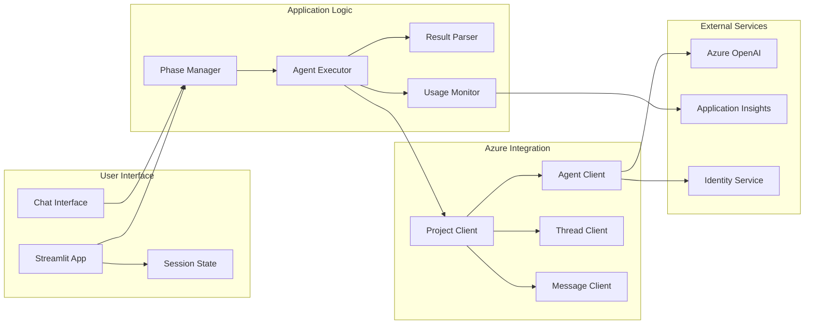

## Agent Architecture Diagrams

### Phase 1: Research & Development Agent Network

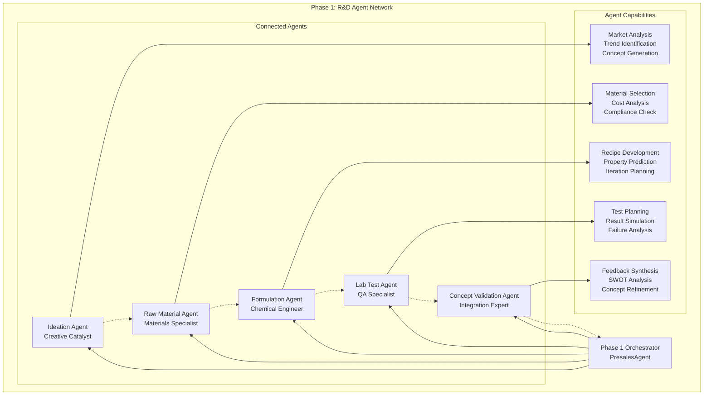

### Phase 2: Prototyping & Testing Agent Network

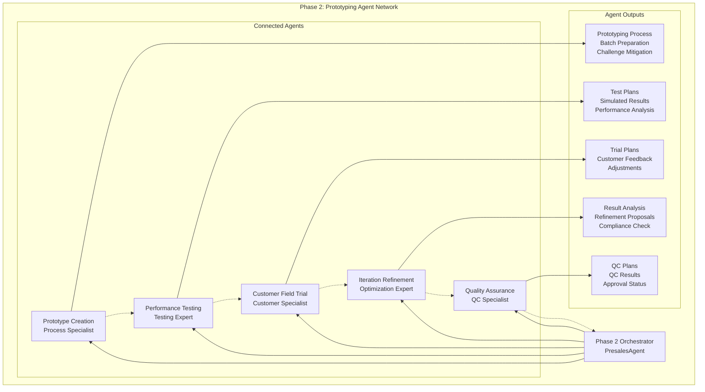

### Phase 3: Production Scaling Agent Network

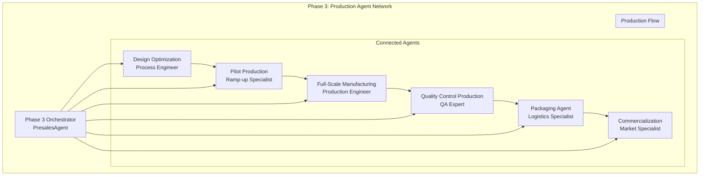

## Data Flow Diagrams

### User Query Processing Flow

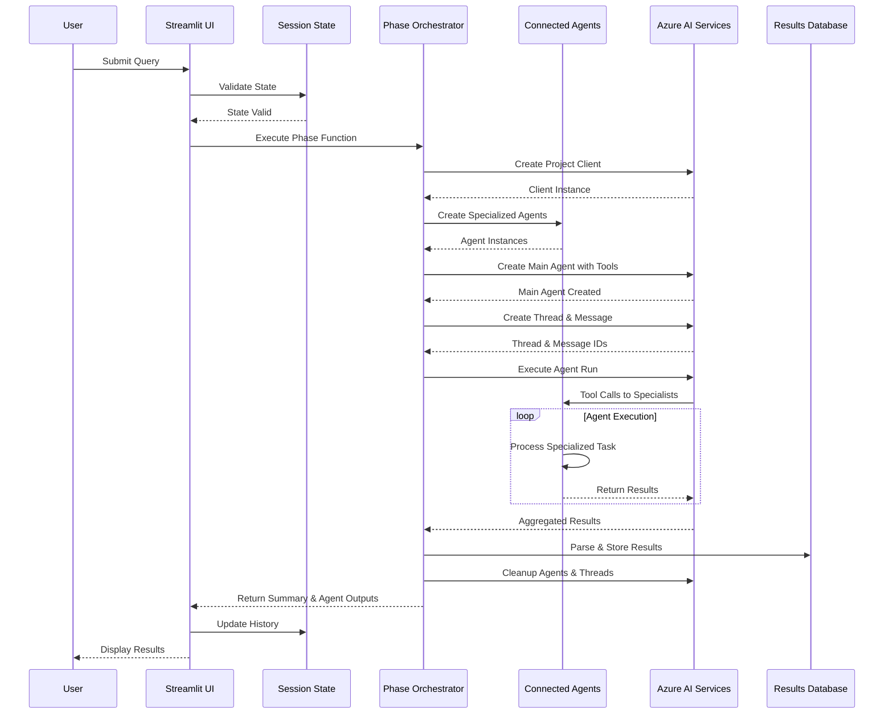

### Agent Communication Flow

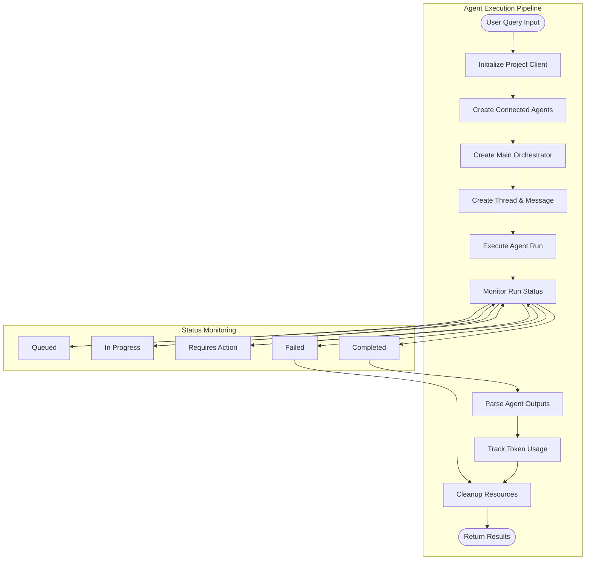

## Sequence Diagrams

### Complete Manufacturing Process Flow

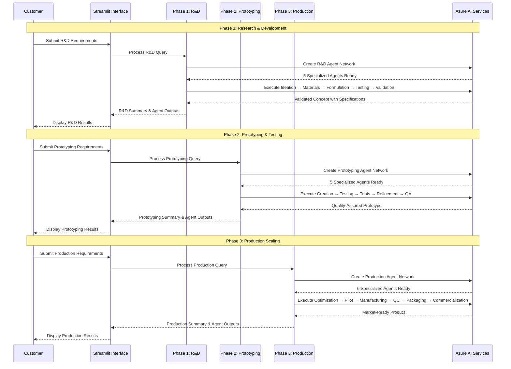

### Agent Lifecycle Management

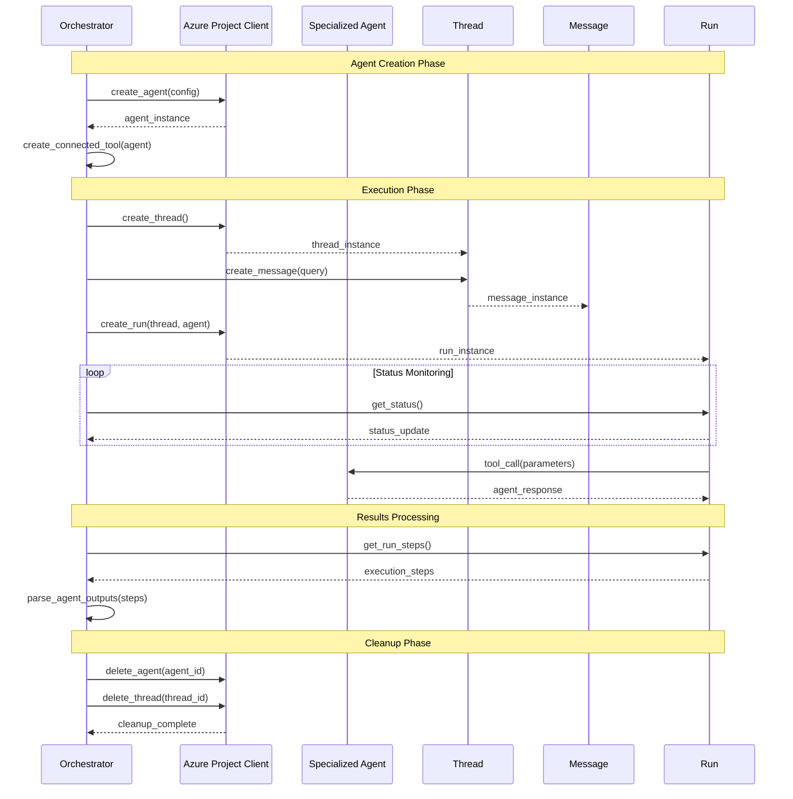

## Process Flow Diagrams

### End-to-End Manufacturing Process

```mermaid
flowchart TD
    subgraph "Phase 1: Research & Development"
        START([Market Requirements])
        IDEATION[Ideation Agent<br/>Generate Concepts]
        MATERIALS[Raw Material Agent<br/>Select Materials]
        FORMULATION[Formulation Agent<br/>Develop Recipes]
        LABTEST[Lab Test Agent<br/>Validate Properties]
        VALIDATION[Concept Validation<br/>Final Approval]
        R1([R&D Complete])
    end
    
    subgraph "Phase 2: Prototyping & Testing"
        R1P2([Approved Concept])
        PROTOTYPE[Prototype Creation<br/>Create Samples]
        PERFORMANCE[Performance Testing<br/>Validate Performance]
        CUSTOMER[Customer Trials<br/>Field Testing]
        REFINE[Iteration & Refinement<br/>Optimize Formula]
        QA[Quality Assurance<br/>Final QC Check]
        R2([Prototype Approved])
    end
    
    subgraph "Phase 3: Production Scaling"
        R2P3([Approved Prototype])
        DESIGN[Design Optimization<br/>Scale for Production]
        PILOT[Pilot Production<br/>Test Manufacturing]
        MANUFACTURING[Full Manufacturing<br/>Mass Production]
        QC[Quality Control<br/>Production QC]
        PACKAGING[Packaging<br/>Distribution Ready]
        COMMERCIAL[Commercialization<br/>Market Launch]
        R3([Product Launched])
    end
    
    START --> IDEATION
    IDEATION --> MATERIALS
    MATERIALS --> FORMULATION
    FORMULATION --> LABTEST
    LABTEST --> VALIDATION
    VALIDATION --> R1
    
    R1 --> R1P2
    R1P2 --> PROTOTYPE
    PROTOTYPE --> PERFORMANCE
    PERFORMANCE --> CUSTOMER
    CUSTOMER --> REFINE
    REFINE --> QA
    QA --> R2
    
    R2 --> R2P3
    R2P3 --> DESIGN
    DESIGN --> PILOT
    PILOT --> MANUFACTURING
    MANUFACTURING --> QC
    QC --> PACKAGING
    PACKAGING --> COMMERCIAL
    COMMERCIAL --> R3
    
    style START fill:#e1f5fe
    style R1 fill:#c8e6c9
    style R2 fill:#c8e6c9
    style R3 fill:#4caf50,color:#fff
```

### Agent Decision Flow

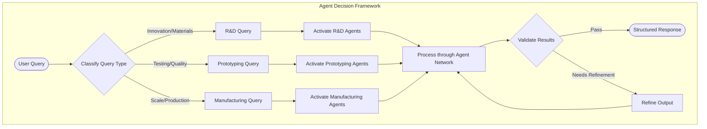

## Technical Architecture Diagrams

### System Component Architecture

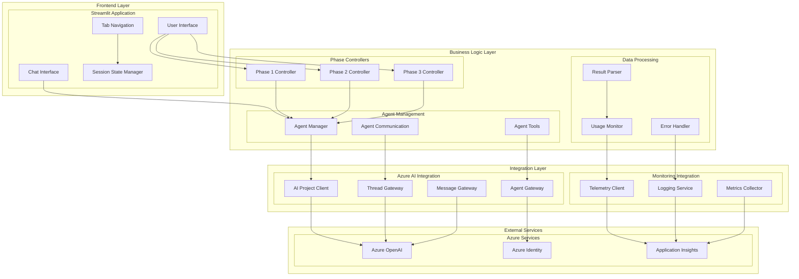

### Data Architecture

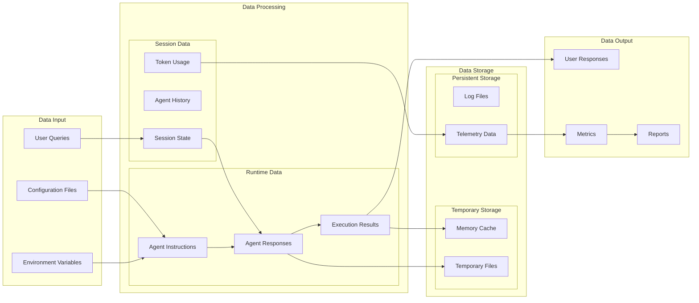

## Integration Diagrams

### Azure Services Integration

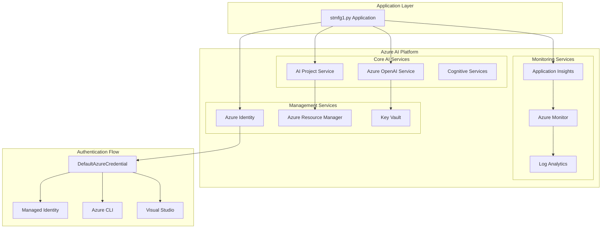

### External System Integration Pattern

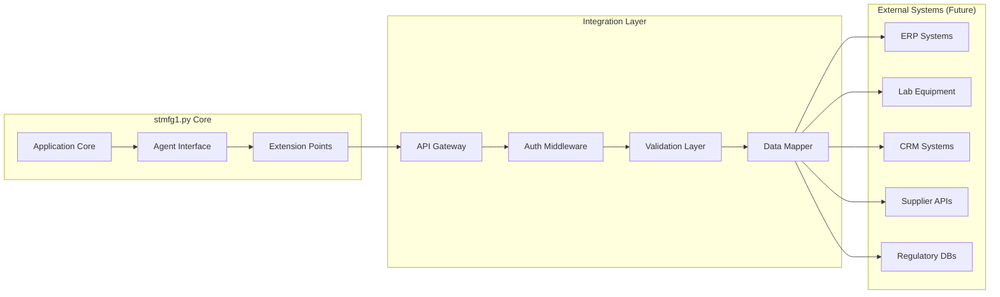

### Deployment Architecture

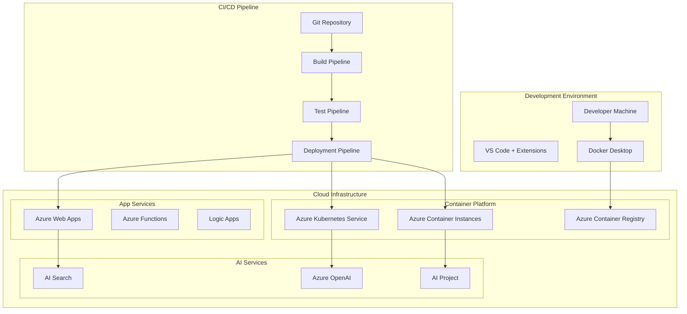

## Monitoring and Observability

### Telemetry Flow Diagram

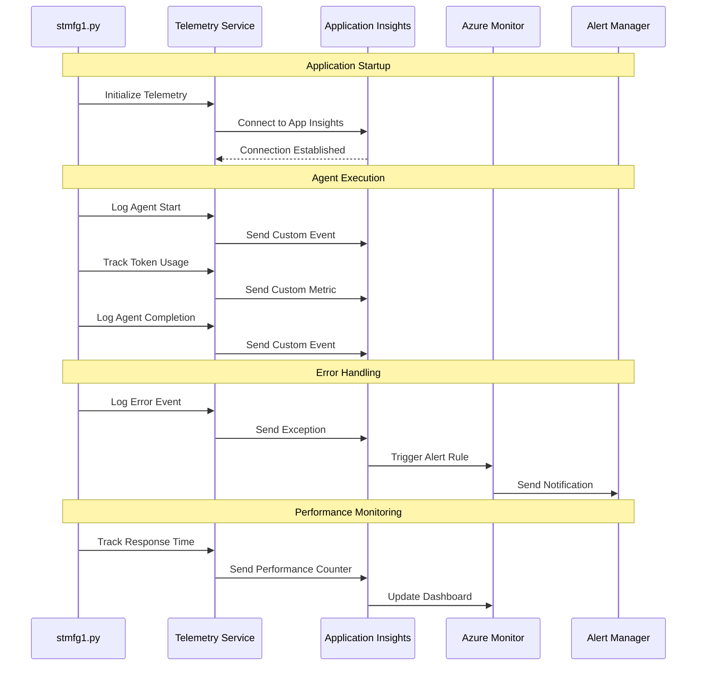

This comprehensive collection of Mermaid diagrams provides complete visualization of the stmfg1.py system architecture, from high-level overview through detailed technical implementation, covering all aspects of the adhesive manufacturing orchestrator's design and operation.