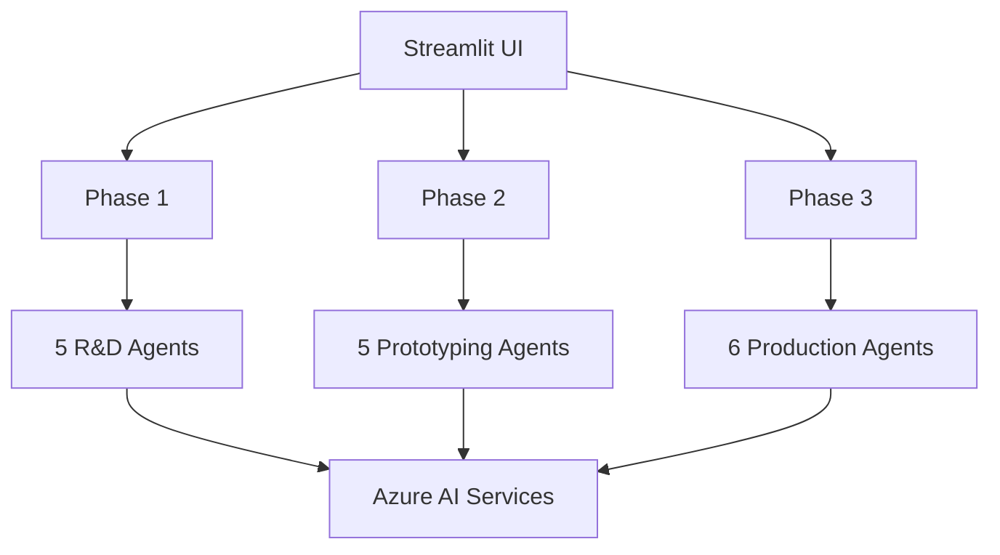

# AgenticAI Foundry - stmfg1.py Quick Reference Guide

## System Overview

**Application**: Adhesive Manufacturing Orchestrator  
**File**: `stmfg1.py`  
**Purpose**: End-to-end AI-driven adhesive manufacturing guidance  
**Framework**: Streamlit + Azure AI Project Services  
**Agents**: 16 specialized agents across 3 manufacturing phases

## Quick Start Commands

```bash
# Install dependencies
pip install -r requirements.txt

# Set environment variables
export PROJECT_ENDPOINT="https://<project>.services.ai.azure.com/api/projects/<name>"
export MODEL_DEPLOYMENT_NAME="gpt-4o-mini"

# Run application
streamlit run stmfg1.py
```

## Agent Reference

### Phase 1: Research & Development (5 Agents)

| Agent | Function | Input | Output |
|-------|----------|-------|--------|
| **Ideation** | `ideationagent` | Market requirements | 3-5 adhesive concepts with feasibility |
| **Raw Material** | `rawmaterialagent` | Concept description | Material shortlist with justifications |
| **Formulation** | `formulationagent` | Material list | 2-3 formulation recipes with ratios |
| **Lab Test** | `initiallabtestagent` | Formulations | Test plans and simulated results |
| **Validation** | `conceptvalidationagent` | Test results | Validated concept for prototyping |

### Phase 2: Prototyping & Testing (5 Agents)

| Agent | Function | Input | Output |
|-------|----------|-------|--------|
| **Prototype Creation** | `prototypecreationagent` | Validated concept | Batch preparation procedures |
| **Performance Testing** | `performancetestingagent` | Prototype specs | Comprehensive test results |
| **Customer Trials** | `customerfieldtrialagent` | Test results | Customer feedback and adjustments |
| **Refinement** | `refinementagent` | Trial feedback | Refined formulation and specs |
| **Quality Assurance** | `qualityassuranceagent` | Refined specs | QC approval for production |

### Phase 3: Production Scaling (6 Agents)

| Agent | Function | Input | Output |
|-------|----------|-------|--------|
| **Design Optimization** | `designoptimizationagent` | QA-approved prototype | Optimized production design |
| **Pilot Production** | `pilotprodrampupagent` | Production design | Pilot production plan |
| **Manufacturing** | `fullscalemfgagent` | Pilot results | Full-scale manufacturing plan |
| **Quality Control** | `qualitycontrolproductionagent` | Manufacturing plan | Production QC procedures |
| **Packaging** | `packingagent` | QC procedures | Packaging and distribution plan |
| **Commercialization** | `Commercializationagent` | Distribution plan | Market entry strategy |

## Key Functions

### Core Workflow Functions
```python
# Main phase execution functions
connected_agent_phase1(query: str) -> tuple[str, dict, dict]
connected_agent_phase2(query: str) -> tuple[str, dict, dict] 
connected_agent_phase3(query: str) -> tuple[str, dict, dict]

# Utility functions
parse_agent_outputs(run_steps) -> dict
_html_escape(text) -> str
main_screen() -> None
```

### Return Values
```python
# Standard return pattern for all phase functions
(summary_text, agent_outputs_dict, token_usage_dict)

# agent_outputs_dict structure
{
    "agent_name": "agent_response_text",
    # ... additional agents
}

# token_usage_dict structure
{
    "prompt_tokens": int,
    "completion_tokens": int,
    "total_tokens": int
}
```

## Configuration Reference

### Required Environment Variables
```bash
PROJECT_ENDPOINT=https://<account>.services.ai.azure.com/api/projects/<project>
MODEL_ENDPOINT=https://<account>.services.ai.azure.com
MODEL_API_KEY=<your_api_key>
MODEL_DEPLOYMENT_NAME=gpt-4o-mini
AZURE_TRACING_GEN_AI_CONTENT_RECORDING_ENABLED=true
```

### Azure Services Required
- **Azure AI Project**: Agent orchestration and management
- **Azure OpenAI**: Language model deployment (GPT-4 series)
- **Azure Application Insights**: Telemetry and monitoring
- **Azure Identity**: Authentication and authorization

## UI Components

### Interface Structure
```
┌─────────────────────────────────────────────────────┐
│                Main Application                     │
├─────────────────────────────────────────────────────┤
│  Tab 1: R&D    │  Tab 2: Prototyping  │  Tab 3: Prod │
├─────────────────┼─────────────────────┼──────────────┤
│  Summary Panel  │     Summary Panel    │Summary Panel │
│  Agent Outputs  │     Agent Outputs    │Agent Outputs │
│  Chat Input     │     Chat Input       │Chat Input    │
└─────────────────────────────────────────────────────┘
```

### Session State Keys
```python
session_state_keys = {
    "p1_history": [],    # Phase 1 conversation history
    "p2_history": [],    # Phase 2 conversation history
    "p3_history": [],    # Phase 3 conversation history
    "p1_agents": {},     # Phase 1 agent outputs
    "p2_agents": {},     # Phase 2 agent outputs
    "p3_agents": {}      # Phase 3 agent outputs
}
```

## Common Usage Patterns

### Example Queries by Phase

#### Phase 1: R&D Examples
```
"Develop an eco-friendly adhesive for wooden furniture with low VOC emissions"
"Create a high-strength adhesive for aerospace composite materials"
"Design a biodegradable packaging adhesive for food industry"
```

#### Phase 2: Prototyping Examples
```
"Create prototypes for the eco-friendly wood adhesive with performance testing"
"Develop customer trials for aerospace adhesive with specific bond strength requirements"
"Test biodegradable adhesive prototypes with food safety compliance"
```

#### Phase 3: Production Examples
```
"Scale the wood adhesive to industrial production with quality control"
"Plan full manufacturing for aerospace adhesive with regulatory compliance"
"Commercialize biodegradable adhesive with packaging and market strategy"
```

## Performance Optimization

### Best Practices
```python
# Efficient resource management
- Always cleanup agents after use
- Monitor token usage for cost control
- Use session state efficiently
- Implement proper error handling

# Performance monitoring
- Track response times per phase
- Monitor memory usage
- Watch for Azure service limits
- Optimize UI rendering
```

### Troubleshooting Quick Fixes

| Issue | Quick Fix |
|-------|-----------|
| **Slow Response** | Check Azure service status, verify network connectivity |
| **Authentication Error** | Verify environment variables, check Azure Identity setup |
| **Memory Issues** | Restart application, check for proper agent cleanup |
| **UI Not Responsive** | Clear browser cache, restart Streamlit server |
| **Agent Timeout** | Increase timeout values, check model deployment |

## Code Snippets

### Create Custom Agent
```python
def create_custom_agent(project_client, name, instructions):
    agent = project_client.agents.create_agent(
        model=os.environ["MODEL_DEPLOYMENT_NAME"],
        name=name,
        instructions=instructions
    )
    
    connected_tool = ConnectedAgentTool(
        id=agent.id,
        name=f"{name}_connected",
        description="Custom specialist agent"
    )
    
    return agent, connected_tool
```

### Execute Agent Workflow
```python
def execute_workflow(query, agents_list):
    thread = project_client.agents.threads.create()
    message = project_client.agents.messages.create(
        thread_id=thread.id,
        role=MessageRole.USER,
        content=query
    )
    
    run = project_client.agents.runs.create_and_process(
        thread_id=thread.id, 
        agent_id=orchestrator.id
    )
    
    # Monitor until completion
    while run.status in ["queued", "in_progress", "requires_action"]:
        time.sleep(1)
        run = project_client.agents.runs.get(thread_id=thread.id, run_id=run.id)
    
    return run
```

### Parse Agent Results
```python
def extract_results(run_steps):
    agent_outputs = {}
    for step in run_steps:
        tool_calls = step.get("step_details", {}).get("tool_calls", [])
        for call in tool_calls:
            connected_agent = call.get("connected_agent", {})
            if connected_agent:
                name = connected_agent.get("name")
                output = connected_agent.get("output")
                agent_outputs[name] = output
    return agent_outputs
```

## API Reference Summary

### Main Functions
- `connected_agent_phase1(query)`: Execute R&D workflow
- `connected_agent_phase2(query)`: Execute prototyping workflow  
- `connected_agent_phase3(query)`: Execute production workflow
- `parse_agent_outputs(steps)`: Extract individual agent responses
- `main_screen()`: Launch Streamlit interface

### Helper Functions
- `_html_escape(text)`: Sanitize HTML input
- `create_agent_with_tools()`: Standard agent creation pattern
- `monitor_run_status()`: Track agent execution
- `cleanup_resources()`: Release Azure resources

## Architecture Quick View



## File Structure
```
stmfg1.py
├── Imports & Configuration    (Lines 1-58)
├── Utility Functions         (Lines 82-98)
├── Phase 1 Implementation    (Lines 100-350)
├── Phase 2 Implementation    (Lines 352-592)
├── Phase 3 Implementation    (Lines 594-857)
├── UI Helper Functions       (Lines 860-865)
└── Main UI Implementation    (Lines 867-1039)
```

## Support Contacts

- **Repository**: [AgenticAI Foundry](https://github.com/balakreshnan/AgenticAIFoundry)
- **Documentation**: `/docs/stmfg1-*` files
- **Issues**: GitHub Issues for bug reports and feature requests

---

*This quick reference provides essential information for developers and users working with the Adhesive Manufacturing Orchestrator system.*