# Healthcare Supply Chain Orchestrator - Documentation Index

## Overview

This documentation provides comprehensive coverage of the Healthcare Supply Chain Orchestrator (`stsupply.py`), a revolutionary AI-powered system that implements the SCOR (Supply Chain Operations Reference) model through five specialized agents for healthcare and life sciences supply chain optimization.

## 📚 Documentation Structure

### Core Documentation

#### 🏠 [Main README](stsupply-README.md)
**Primary Entry Point** - Complete system overview, features, and getting started guide
- System overview and key features
- Industry applications (Pharmaceutical, Biotech, Medical Devices)
- SCOR model implementation
- Innovation highlights and competitive advantages
- Business impact metrics
- Quick start instructions

#### 💼 [Business Requirements](stsupply-business-requirements.md)  
**Business Analysis** - Use cases, value proposition, and requirements
- Executive summary and business context
- Detailed use cases with business value quantification
- Functional and non-functional requirements
- Success metrics and KPIs
- Risk assessment and mitigation strategies
- Implementation roadmap

#### 🏗️ [Technical Architecture](stsupply-technical-architecture.md)
**System Design** - Technical implementation details and architecture
- Multi-agent system architecture
- Azure AI services integration
- Data architecture and flow
- Security and performance considerations
- Deployment patterns and infrastructure
- Monitoring and observability

#### 📊 [Mermaid Diagrams](stsupply-mermaid-diagrams.md)
**Visual Architecture** - Comprehensive diagrams and flowcharts
- System architecture diagrams
- Agent interaction patterns
- End-to-end process flows
- Sequence diagrams
- Data flow visualizations
- Deployment architectures
- Integration diagrams

#### ⚡ [Quick Reference](stsupply-quick-reference.md)
**Developer Guide** - Commands, configurations, and troubleshooting
- Quick start commands and setup
- Agent reference and capabilities
- Configuration parameters
- Common usage patterns
- API reference summary
- Troubleshooting guide

## 🎯 Document Purpose Matrix

| Document | **Business Users** | **Technical Teams** | **Developers** | **Architects** |
|----------|:-----------------:|:------------------:|:--------------:|:--------------:|
| [Main README](stsupply-README.md) | ✅ High | ✅ High | ✅ High | ✅ High |
| [Business Requirements](stsupply-business-requirements.md) | ✅ Essential | ⚠️ Important | ⚠️ Important | ✅ High |
| [Technical Architecture](stsupply-technical-architecture.md) | ⚠️ Basic | ✅ Essential | ✅ Essential | ✅ Essential |
| [Mermaid Diagrams](stsupply-mermaid-diagrams.md) | ✅ High | ✅ High | ✅ High | ✅ Essential |
| [Quick Reference](stsupply-quick-reference.md) | ❌ Low | ✅ High | ✅ Essential | ⚠️ Important |

**Legend**: ✅ Essential | ⚠️ Important | ❌ Optional

## 🏥 System Overview

### What is the Healthcare Supply Chain Orchestrator?

The Healthcare Supply Chain Orchestrator is a cutting-edge AI-powered system that transforms supply chain management in healthcare and life sciences through:

- **5 Specialized SCOR Agents**: Plan, Source, Make, Deliver, Return
- **AI-Powered Intelligence**: Azure AI Foundry and OpenAI integration
- **Regulatory Compliance**: Built-in FDA, EMA, GMP compliance
- **Real-time Orchestration**: Dynamic agent coordination and optimization
- **Industry Focus**: Pharmaceutical, biotech, and medical device specialization

### Key Innovation: Multi-Agent SCOR Implementation

## 📖 Reading Guide by Role

### For Business Leaders and Decision Makers
**Recommended Reading Order:**
1. [Main README](stsupply-README.md) - Get the complete overview
2. [Business Requirements](stsupply-business-requirements.md) - Understand ROI and business impact
3. [Mermaid Diagrams](stsupply-mermaid-diagrams.md) - Visualize the solution architecture
4. [Technical Architecture](stsupply-technical-architecture.md) - Review technical feasibility (optional)

**Key Focus Areas:**
- Business value proposition and ROI metrics
- Industry use cases and applications
- Competitive advantages and innovation
- Implementation timeline and success metrics

### For Technical Leaders and Architects
**Recommended Reading Order:**
1. [Main README](stsupply-README.md) - System overview and capabilities
2. [Technical Architecture](stsupply-technical-architecture.md) - Deep technical understanding
3. [Mermaid Diagrams](stsupply-mermaid-diagrams.md) - Architecture visualization
4. [Business Requirements](stsupply-business-requirements.md) - Requirements and constraints
5. [Quick Reference](stsupply-quick-reference.md) - Implementation details

**Key Focus Areas:**
- Multi-agent architecture and design patterns
- Azure services integration and dependencies
- Security, performance, and scalability considerations
- Deployment architecture and infrastructure requirements

### For Developers and Implementation Teams
**Recommended Reading Order:**
1. [Quick Reference](stsupply-quick-reference.md) - Start here for immediate development
2. [Main README](stsupply-README.md) - Understand system context
3. [Technical Architecture](stsupply-technical-architecture.md) - Implementation details
4. [Mermaid Diagrams](stsupply-mermaid-diagrams.md) - System interactions
5. [Business Requirements](stsupply-business-requirements.md) - Feature requirements

**Key Focus Areas:**
- Setup and configuration instructions
- API references and code examples
- Agent implementation patterns
- Troubleshooting and common issues

### For Healthcare Industry Experts
**Recommended Reading Order:**
1. [Main README](stsupply-README.md) - Industry applications and benefits
2. [Business Requirements](stsupply-business-requirements.md) - Use cases and regulatory considerations
3. [Mermaid Diagrams](stsupply-mermaid-diagrams.md) - Process flows and compliance
4. [Technical Architecture](stsupply-technical-architecture.md) - Security and compliance features

**Key Focus Areas:**
- Pharmaceutical and biotech use cases
- Regulatory compliance (FDA, EMA, GMP)
- Clinical trial supply chain optimization
- Patient safety and quality assurance

## 🎨 Visual Learning Path

### Architecture Understanding Journey

## 🔗 Cross-References and Dependencies

### Document Relationships

```mermaid
graph TB
    README[Main README<br/>📖 Entry Point]
    BUSINESS[Business Requirements<br/>💼 Use Cases & ROI]
    TECH[Technical Architecture<br/>🏗️ Implementation]
    DIAGRAMS[Mermaid Diagrams<br/>📊 Visual Architecture]
    QUICK[Quick Reference<br/>⚡ Developer Guide]
    
    README --> BUSINESS
    README --> TECH
    README --> DIAGRAMS
    README --> QUICK
    
    BUSINESS -.-> TECH
    TECH --> DIAGRAMS
    TECH --> QUICK
    DIAGRAMS --> QUICK
    
    BUSINESS -.-> DIAGRAMS
    
    classDef primary fill:#4caf50,color:#fff
    classDef secondary fill:#2196f3,color:#fff
    classDef supporting fill:#ff9800,color:#fff
    
    class README primary
    class BUSINESS,TECH secondary
    class DIAGRAMS,QUICK supporting
```

### Related Documentation in Repository

#### Similar Systems Documentation
- [`stmfg1-*` files](stmfg1-README.md) - Adhesive Manufacturing Orchestrator
- [`stins-*` files](stins-README.md) - Insurance Agent Assistant
- [`architecture-blueprint.md`](architecture-blueprint.md) - Overall system architecture

#### Supporting Documentation
- [`README.md`](../README.md) - Repository main documentation
- [`implementation-guide.md`](implementation-guide.md) - General implementation guidance
- [`specialized-applications-overview.md`](specialized-applications-overview.md) - Application portfolio

## 📊 Feature Comparison Matrix

### Healthcare Supply Chain Orchestrator vs Other Systems

| Feature | **stsupply.py** | **stmfg1.py** | **Traditional SCM** |
|---------|:--------------:|:-------------:|:------------------:|
| **SCOR Model Implementation** | ✅ Complete (5 stages) | ❌ Manufacturing focus | ⚠️ Partial |
| **Healthcare Specialization** | ✅ Pharmaceutical/Biotech | ❌ Adhesives | ❌ Generic |
| **Regulatory Compliance** | ✅ FDA/EMA/GMP built-in | ⚠️ Industrial standards | ❌ Manual |
| **AI Orchestration** | ✅ 5 specialized agents | ✅ 16 manufacturing agents | ❌ No AI |
| **Real-time Monitoring** | ✅ OpenTelemetry | ✅ Application Insights | ⚠️ Basic dashboards |
| **Multi-Agent Collaboration** | ✅ Cross-stage integration | ✅ Phase-based collaboration | ❌ Siloed systems |
| **Predictive Analytics** | ✅ Demand forecasting | ✅ Process optimization | ❌ Historical reporting |

## 🚀 Getting Started Pathways

### Quick Start (15 minutes)
1. Read [System Overview](stsupply-README.md#overview) section
2. Review [Quick Start Commands](stsupply-quick-reference.md#quick-start-commands)
3. Set up environment and run demo

### Comprehensive Understanding (2-3 hours)
1. Complete [Main README](stsupply-README.md) (30 min)
2. Study [Business Requirements](stsupply-business-requirements.md) use cases (45 min)
3. Review [Technical Architecture](stsupply-technical-architecture.md) overview (60 min)
4. Explore [Mermaid Diagrams](stsupply-mermaid-diagrams.md) (30 min)

### Implementation Ready (1 day)
1. Follow comprehensive understanding path
2. Deep dive into [Technical Architecture](stsupply-technical-architecture.md)
3. Practice with [Quick Reference](stsupply-quick-reference.md) examples
4. Review deployment patterns and infrastructure requirements

## 📝 Documentation Standards

### Quality Metrics
- **Completeness**: 100% coverage of system features and capabilities
- **Accuracy**: Technical details verified against source code
- **Usability**: Multiple reading paths for different user types
- **Maintainability**: Structured format for easy updates
- **Visual Support**: Comprehensive diagrams and flowcharts

### Update Schedule
- **Major Updates**: With new feature releases
- **Minor Updates**: Monthly review and refinement
- **Critical Updates**: Immediate for security or compliance changes

### Feedback and Contributions
- **GitHub Issues**: For documentation improvements and corrections
- **Pull Requests**: For community contributions
- **Internal Reviews**: Quarterly documentation audits

## 🏆 Success Indicators

### Documentation Effectiveness Metrics
- **User Adoption**: Reduced support tickets and faster onboarding
- **Developer Productivity**: Faster implementation and fewer integration issues  
- **Business Understanding**: Improved stakeholder engagement and decision-making
- **System Usage**: Increased feature utilization and successful deployments

---

*This documentation index serves as your comprehensive guide to understanding, implementing, and optimizing the Healthcare Supply Chain Orchestrator system. Choose your reading path based on your role and objectives, and leverage the cross-references to deepen your understanding.*