# Healthcare Supply Chain Orchestrator - Mermaid Diagrams

## Table of Contents
1. [System Architecture Diagrams](#system-architecture-diagrams)
2. [Agent Interaction Diagrams](#agent-interaction-diagrams)
3. [Process Flow Diagrams](#process-flow-diagrams)
4. [Sequence Diagrams](#sequence-diagrams)
5. [Data Flow Diagrams](#data-flow-diagrams)
6. [Deployment Diagrams](#deployment-diagrams)
7. [Integration Diagrams](#integration-diagrams)

## System Architecture Diagrams

### High-Level System Architecture

```mermaid
graph TB
    subgraph "User Interface Layer"
        UI[Streamlit UI]
        API[REST API]
        Dashboard[Analytics Dashboard]
    end
    
    subgraph "Orchestration Layer"
        MainAgent[Main Orchestrator Agent]
        MessageQueue[Message Queue]
        StateManager[State Management]
    end
    
    subgraph "SCOR Agents Layer"
        PlanAgent[Plan Agent<br/>Demand & Supply Planning]
        SourceAgent[Source Agent<br/>Procurement & Suppliers]
        MakeAgent[Make Agent<br/>Manufacturing & Production]
        DeliverAgent[Deliver Agent<br/>Distribution & Logistics]
        ReturnAgent[Return Agent<br/>Reverse Logistics]
    end
    
    subgraph "AI Services Layer"
        AzureAI[Azure AI Foundry]
        OpenAI[Azure OpenAI]
        CognitiveServices[Cognitive Services]
    end
    
    subgraph "Data Layer"
        DataLake[(Azure Data Lake)]
        Database[(Azure SQL DB)]
        Cache[(Redis Cache)]
        DocumentDB[(Cosmos DB)]
    end
    
    subgraph "Integration Layer"
        ERP[ERP Systems]
        WMS[WMS Systems]
        Regulatory[Regulatory APIs]
        ThirdParty[Third-party Services]
    end
    
    subgraph "Infrastructure Layer"
        Kubernetes[AKS Cluster]
        Storage[Azure Storage]
        KeyVault[Azure Key Vault]
        ServiceBus[Azure Service Bus]
    end
    
    subgraph "Monitoring Layer"
        AppInsights[Application Insights]
        LogAnalytics[Log Analytics]
        Prometheus[Prometheus]
        Grafana[Grafana]
    end
    
    %% Connections
    UI --> MainAgent
    API --> MainAgent
    Dashboard --> MainAgent
    
    MainAgent --> MessageQueue
    MainAgent --> StateManager
    MessageQueue --> PlanAgent
    MessageQueue --> SourceAgent
    MessageQueue --> MakeAgent
    MessageQueue --> DeliverAgent
    MessageQueue --> ReturnAgent
    
    PlanAgent --> AzureAI
    SourceAgent --> AzureAI
    MakeAgent --> AzureAI
    DeliverAgent --> AzureAI
    ReturnAgent --> AzureAI
    
    AzureAI --> OpenAI
    AzureAI --> CognitiveServices
    
    MainAgent --> DataLake
    MainAgent --> Database
    MainAgent --> Cache
    MainAgent --> DocumentDB
    
    MainAgent --> ERP
    MainAgent --> WMS
    MainAgent --> Regulatory
    MainAgent --> ThirdParty
    
    MainAgent --> ServiceBus
    StateManager --> KeyVault
    
    MainAgent --> AppInsights
    Infrastructure --> LogAnalytics
    Infrastructure --> Prometheus
    Prometheus --> Grafana
    
    %% Styling
    classDef uiLayer fill:#e1f5fe
    classDef orchestrationLayer fill:#f3e5f5
    classDef agentLayer fill:#e8f5e8
    classDef aiLayer fill:#fff3e0
    classDef dataLayer fill:#fce4ec
    classDef integrationLayer fill:#f1f8e9
    classDef infraLayer fill:#e3f2fd
    classDef monitoringLayer fill:#fff8e1
    
    class UI,API,Dashboard uiLayer
    class MainAgent,MessageQueue,StateManager orchestrationLayer
    class PlanAgent,SourceAgent,MakeAgent,DeliverAgent,ReturnAgent agentLayer
    class AzureAI,OpenAI,CognitiveServices aiLayer
    class DataLake,Database,Cache,DocumentDB dataLayer
    class ERP,WMS,Regulatory,ThirdParty integrationLayer
    class Kubernetes,Storage,KeyVault,ServiceBus infraLayer
    class AppInsights,LogAnalytics,Prometheus,Grafana monitoringLayer
```

### SCOR Agent Architecture

```mermaid
graph LR
    subgraph "Plan Stage"
        P1[Demand Forecasting]
        P2[Supply Planning]
        P3[Resource Allocation]
        P4[Risk Assessment]
        P1 --> P2 --> P3 --> P4
    end
    
    subgraph "Source Stage"
        S1[Supplier Identification]
        S2[Contract Negotiation]
        S3[Procurement Planning]
        S4[Supplier Audits]
        S1 --> S2 --> S3 --> S4
    end
    
    subgraph "Make Stage"
        M1[Production Planning]
        M2[Quality Control]
        M3[Manufacturing Execution]
        M4[Batch Management]
        M1 --> M2 --> M3 --> M4
    end
    
    subgraph "Deliver Stage"
        D1[Distribution Planning]
        D2[Logistics Coordination]
        D3[Last-mile Delivery]
        D4[Performance Tracking]
        D1 --> D2 --> D3 --> D4
    end
    
    subgraph "Return Stage"
        R1[Reverse Logistics]
        R2[Product Recalls]
        R3[Sustainability Management]
        R4[Post-market Surveillance]
        R1 --> R2 --> R3 --> R4
    end
    
    %% Cross-stage connections
    P4 --> S1
    S4 --> M1
    M4 --> D1
    D4 --> R1
    R4 --> P1
    
    %% Feedback loops
    M2 --> S2
    D2 --> M2
    R2 --> D2
    R3 --> S1
```

## Agent Interaction Diagrams

### Multi-Agent Communication Flow

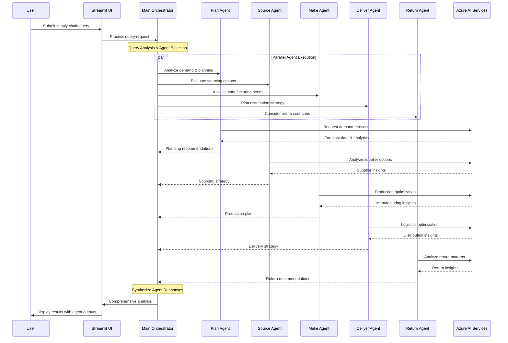

### Agent Collaboration Patterns

```mermaid
graph TD
    subgraph "Collaborative Intelligence"
        A[Query Input] --> B{Analysis Required?}
        B -->|Simple| C[Single Agent]
        B -->|Complex| D[Multi-Agent Orchestration]
        
        D --> E[Plan Agent Analysis]
        E --> F{Sourcing Impact?}
        F -->|Yes| G[Source Agent Input]
        F -->|No| H[Continue to Make]
        
        G --> I{Manufacturing Impact?}
        H --> I
        I -->|Yes| J[Make Agent Input]
        I -->|No| K[Continue to Deliver]
        
        J --> L{Distribution Impact?}
        K --> L
        L -->|Yes| M[Deliver Agent Input]
        L -->|No| N[Continue to Return]
        
        M --> O{Return Considerations?}
        N --> O
        O -->|Yes| P[Return Agent Input]
        O -->|No| Q[Synthesis Phase]
        
        P --> Q
        C --> Q
        Q --> R[Integrated Response]
        
        subgraph "Cross-Agent Learning"
            S[Shared Context]
            T[Pattern Recognition]
            U[Continuous Improvement]
            S --> T --> U --> S
        end
        
        R --> S
    end
    
    %% Styling
    classDef decisionNode fill:#ffe0b2
    classDef agentNode fill:#c8e6c9
    classDef processNode fill:#e1bee7
    classDef learningNode fill:#ffcdd2
    
    class B,F,I,L,O decisionNode
    class E,G,J,M,P agentNode
    class Q,R processNode
    class S,T,U learningNode
```

## Process Flow Diagrams

### End-to-End Supply Chain Process

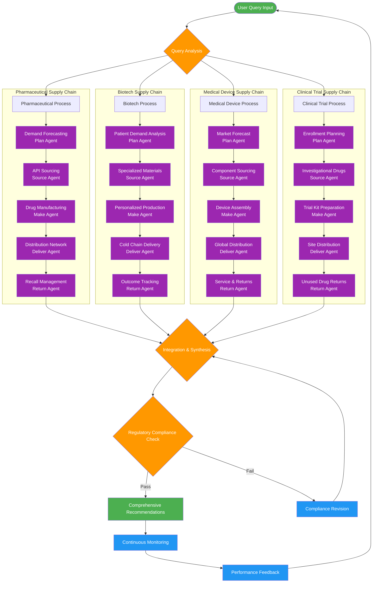

### Regulatory Compliance Flow

```mermaid
flowchart LR
    subgraph "Regulatory Intelligence"
        R1[Regulation Monitoring] --> R2[Impact Analysis]
        R2 --> R3[Compliance Mapping]
        R3 --> R4[Risk Assessment]
    end
    
    subgraph "FDA Compliance"
        F1[GMP Requirements]
        F2[Clinical Guidelines]
        F3[Manufacturing Standards]
        F4[Distribution Controls]
        F1 --> F2 --> F3 --> F4
    end
    
    subgraph "EMA Compliance"
        E1[European Guidelines]
        E2[Quality Standards]
        E3[Safety Monitoring]
        E4[Post-market Surveillance]
        E1 --> E2 --> E3 --> E4
    end
    
    subgraph "Other Regulatory Bodies"
        O1[ICH Guidelines]
        O2[Local Regulations]
        O3[Industry Standards]
        O4[Quality Certifications]
        O1 --> O2 --> O3 --> O4
    end
    
    R4 --> F1
    R4 --> E1
    R4 --> O1
    
    F4 --> Audit[Automated Compliance Audit]
    E4 --> Audit
    O4 --> Audit
    
    Audit --> Report[Compliance Report]
    Report --> Action{Action Required?}
    Action -->|Yes| Remediation[Remediation Plan]
    Action -->|No| Monitor[Continuous Monitoring]
    
    Remediation --> Implementation[Implementation]
    Implementation --> Verification[Verification]
    Verification --> Monitor
    Monitor --> R1
```

## Sequence Diagrams

### Complex Multi-Stage Query Processing

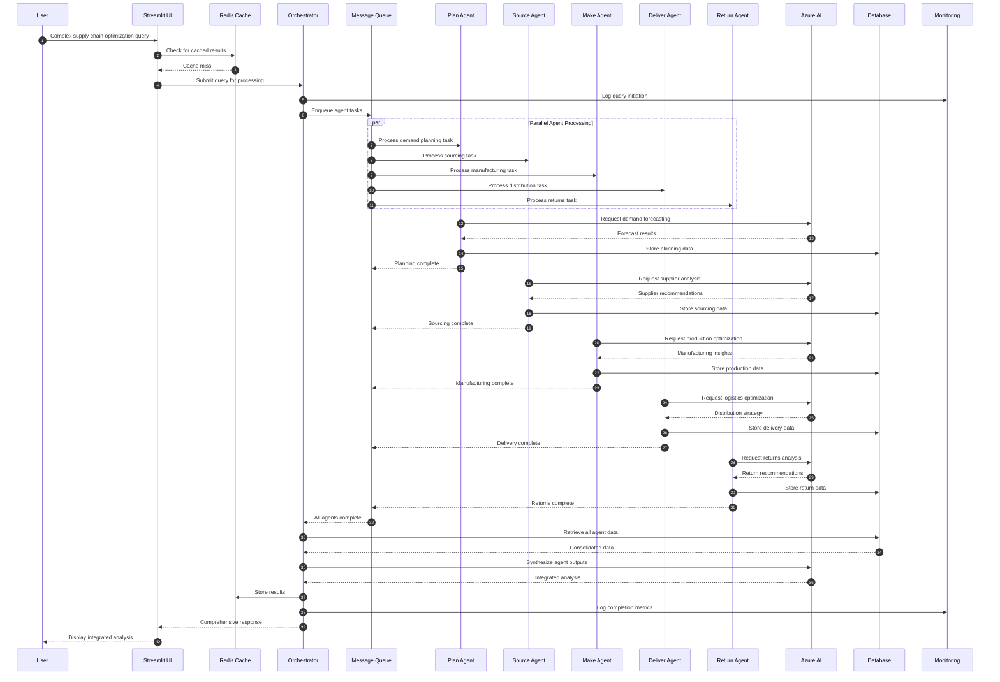

### Real-Time Supply Chain Monitoring

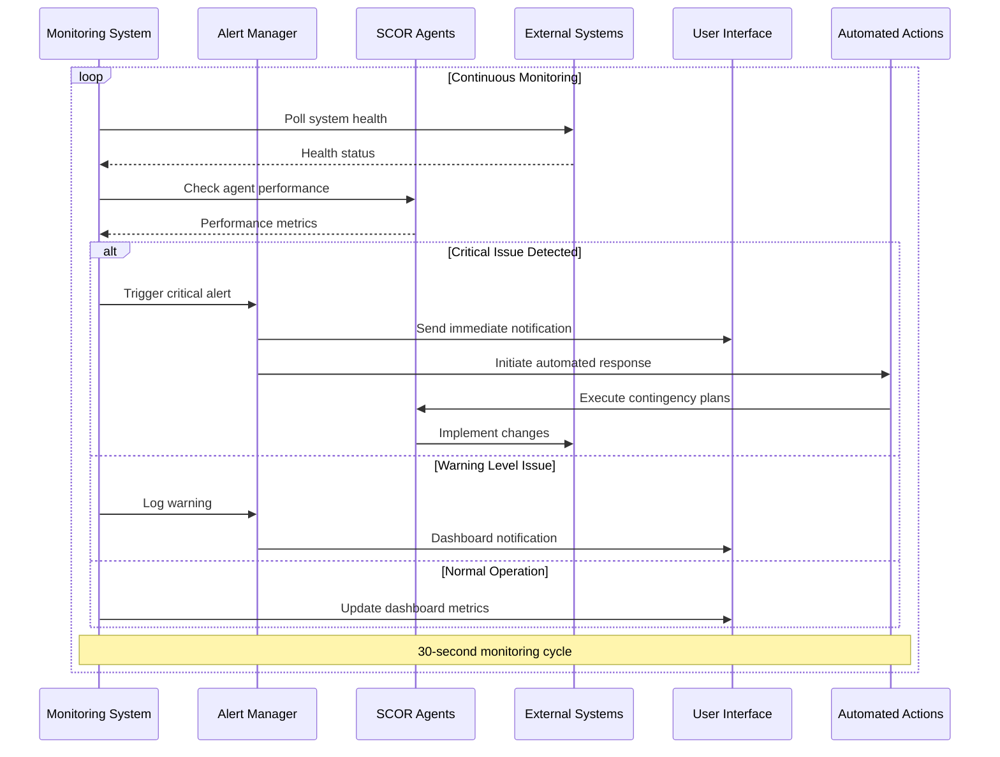

### Supply Chain Disruption Response

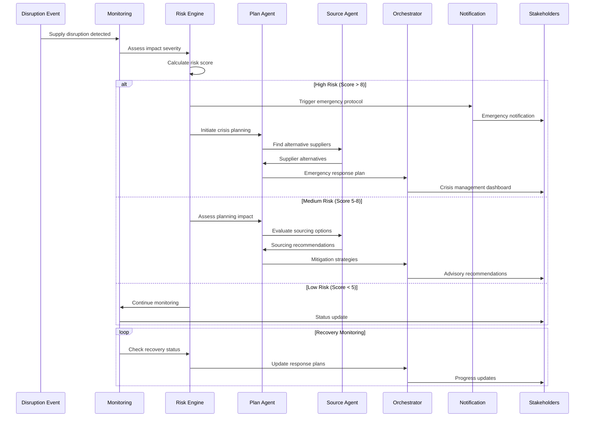

## Data Flow Diagrams

### Healthcare Data Pipeline

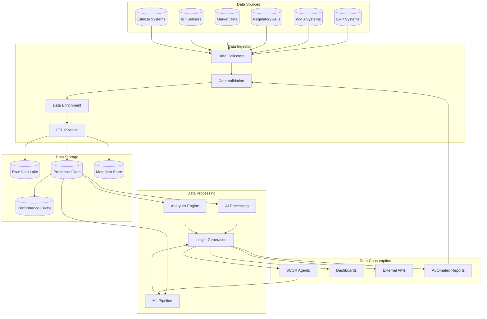

### Real-Time Analytics Flow

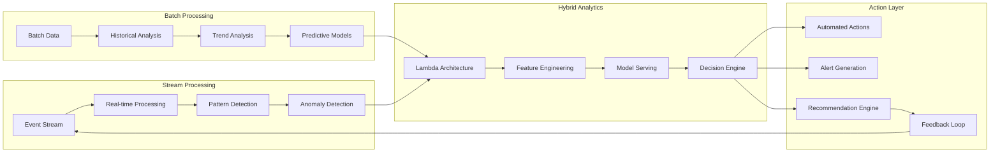

## Deployment Diagrams

### Multi-Region Deployment Architecture

```mermaid
graph TB
    subgraph "Global Load Balancer"
        GLB[Azure Front Door]
    end
    
    subgraph "Region 1: East US"
        subgraph "AKS Cluster East"
            E1[Orchestrator Pods]
            E2[Agent Pods]
            E3[API Gateway]
        end
        subgraph "Data Services East"
            ED1[(Primary Database)]
            ED2[(Data Lake)]
            ED3[(Redis Cache)]
        end
        subgraph "AI Services East"
            EA1[Azure AI Foundry]
            EA2[Azure OpenAI]
        end
    end
    
    subgraph "Region 2: West Europe"
        subgraph "AKS Cluster West"
            W1[Orchestrator Pods]
            W2[Agent Pods]
            W3[API Gateway]
        end
        subgraph "Data Services West"
            WD1[(Replica Database)]
            WD2[(Data Lake)]
            WD3[(Redis Cache)]
        end
        subgraph "AI Services West"
            WA1[Azure AI Foundry]
            WA2[Azure OpenAI]
        end
    end
    
    subgraph "Region 3: Asia Pacific"
        subgraph "AKS Cluster APAC"
            A1[Orchestrator Pods]
            A2[Agent Pods]
            A3[API Gateway]
        end
        subgraph "Data Services APAC"
            AD1[(Replica Database)]
            AD2[(Data Lake)]
            AD3[(Redis Cache)]
        end
        subgraph "AI Services APAC"
            AA1[Azure AI Foundry]
            AA2[Azure OpenAI]
        end
    end
    
    subgraph "Global Services"
        Monitor[Application Insights]
        KeyVault[Azure Key Vault]
        ServiceBus[Azure Service Bus]
    end
    
    %% Connections
    GLB --> E3
    GLB --> W3
    GLB --> A3
    
    E1 --> ED1
    E1 --> ED2
    E1 --> ED3
    E2 --> EA1
    E2 --> EA2
    
    W1 --> WD1
    W1 --> WD2
    W1 --> WD3
    W2 --> WA1
    W2 --> WA2
    
    A1 --> AD1
    A1 --> AD2
    A1 --> AD3
    A2 --> AA1
    A2 --> AA2
    
    %% Data replication
    ED1 -.-> WD1
    ED1 -.-> AD1
    
    %% Global services connections
    E1 --> Monitor
    W1 --> Monitor
    A1 --> Monitor
    
    E1 --> KeyVault
    W1 --> KeyVault
    A1 --> KeyVault
    
    E1 --> ServiceBus
    W1 --> ServiceBus
    A1 --> ServiceBus
    
    %% Styling
    classDef primaryRegion fill:#e8f5e8
    classDef replicaRegion fill:#fff3e0
    classDef globalServices fill:#e1f5fe
    
    class E1,E2,E3,ED1,ED2,ED3,EA1,EA2 primaryRegion
    class W1,W2,W3,WD1,WD2,WD3,WA1,WA2,A1,A2,A3,AD1,AD2,AD3,AA1,AA2 replicaRegion
    class GLB,Monitor,KeyVault,ServiceBus globalServices
```

### Kubernetes Deployment Details

```mermaid
graph TB
    subgraph "Kubernetes Cluster"
        subgraph "Ingress"
            Ingress[NGINX Ingress Controller]
            Cert[Cert Manager]
        end
        
        subgraph "Application Namespace"
            subgraph "Orchestrator"
                OrcPods[Orchestrator Pods<br/>Replicas: 3]
                OrcService[Orchestrator Service]
                OrcHPA[HPA: 3-10 replicas]
            end
            
            subgraph "SCOR Agents"
                PlanPods[Plan Agent Pods<br/>Replicas: 2]
                SourcePods[Source Agent Pods<br/>Replicas: 2]
                MakePods[Make Agent Pods<br/>Replicas: 2]
                DeliverPods[Deliver Agent Pods<br/>Replicas: 2]
                ReturnPods[Return Agent Pods<br/>Replicas: 2]
                
                AgentService[Agent Services]
                AgentHPA[HPA: 2-5 replicas each]
            end
            
            subgraph "Supporting Services"
                Redis[Redis Cluster]
                MessageQueue[Message Queue]
                ConfigMaps[Config Maps]
                Secrets[Kubernetes Secrets]
            end
        end
        
        subgraph "Monitoring Namespace"
            Prometheus[Prometheus]
            Grafana[Grafana]
            AlertManager[Alert Manager]
            Jaeger[Jaeger Tracing]
        end
        
        subgraph "System Namespace"
            CoreDNS[CoreDNS]
            Metrics[Metrics Server]
            CSI[CSI Drivers]
        end
    end
    
    subgraph "External Dependencies"
        AzureAI[Azure AI Services]
        Database[(Azure SQL)]
        Storage[(Azure Storage)]
        KeyVault[Azure Key Vault]
    end
    
    %% Connections
    Ingress --> OrcService
    OrcService --> OrcPods
    OrcPods --> AgentService
    AgentService --> PlanPods
    AgentService --> SourcePods
    AgentService --> MakePods
    AgentService --> DeliverPods
    AgentService --> ReturnPods
    
    OrcPods --> Redis
    OrcPods --> MessageQueue
    OrcPods --> ConfigMaps
    OrcPods --> Secrets
    
    OrcHPA --> OrcPods
    AgentHPA --> PlanPods
    AgentHPA --> SourcePods
    AgentHPA --> MakePods
    AgentHPA --> DeliverPods
    AgentHPA --> ReturnPods
    
    OrcPods --> AzureAI
    OrcPods --> Database
    OrcPods --> Storage
    Secrets --> KeyVault
    
    Prometheus --> OrcPods
    Prometheus --> PlanPods
    Prometheus --> SourcePods
    Prometheus --> MakePods
    Prometheus --> DeliverPods
    Prometheus --> ReturnPods
```

## Integration Diagrams

### Enterprise System Integration

```mermaid
graph TB
    subgraph "Healthcare Supply Chain Orchestrator"
        Core[Core System]
        API[Integration APIs]
        Adapters[System Adapters]
    end
    
    subgraph "Enterprise Resource Planning"
        ERP1[SAP ERP]
        ERP2[Oracle ERP]
        ERP3[Microsoft Dynamics]
    end
    
    subgraph "Manufacturing Systems"
        MES[Manufacturing Execution Systems]
        QMS[Quality Management Systems]
        LIMS[Laboratory Information Systems]
        DCS[Distributed Control Systems]
    end
    
    subgraph "Supply Chain Systems"
        WMS[Warehouse Management Systems]
        TMS[Transportation Management]
        SRM[Supplier Relationship Management]
        PLM[Product Lifecycle Management]
    end
    
    subgraph "Regulatory Systems"
        FDA[FDA FURLS]
        EMA[EMA Systems]
        ICH[ICH Guidelines]
        Local[Local Regulatory Bodies]
    end
    
    subgraph "External Services"
        Weather[Weather APIs]
        Traffic[Traffic Data]
        Economic[Economic Indicators]
        News[News & Events]
    end
    
    subgraph "Clinical Systems"
        CTMS[Clinical Trial Management]
        EDC[Electronic Data Capture]
        IWRS[Interactive Web Response]
        Safety[Pharmacovigilance]
    end
    
    %% Integration connections
    Core --> API
    API --> Adapters
    
    Adapters <--> ERP1
    Adapters <--> ERP2
    Adapters <--> ERP3
    
    Adapters <--> MES
    Adapters <--> QMS
    Adapters <--> LIMS
    Adapters <--> DCS
    
    Adapters <--> WMS
    Adapters <--> TMS
    Adapters <--> SRM
    Adapters <--> PLM
    
    Adapters <--> FDA
    Adapters <--> EMA
    Adapters <--> ICH
    Adapters <--> Local
    
    Adapters <--> Weather
    Adapters <--> Traffic
    Adapters <--> Economic
    Adapters <--> News
    
    Adapters <--> CTMS
    Adapters <--> EDC
    Adapters <--> IWRS
    Adapters <--> Safety
    
    %% Styling
    classDef coreSystem fill:#4caf50
    classDef enterpriseSystem fill:#2196f3
    classDef manufacturingSystem fill:#ff9800
    classDef supplySystem fill:#9c27b0
    classDef regulatorySystem fill:#f44336
    classDef externalSystem fill:#607d8b
    classDef clinicalSystem fill:#e91e63
    
    class Core,API,Adapters coreSystem
    class ERP1,ERP2,ERP3 enterpriseSystem
    class MES,QMS,LIMS,DCS manufacturingSystem
    class WMS,TMS,SRM,PLM supplySystem
    class FDA,EMA,ICH,Local regulatorySystem
    class Weather,Traffic,Economic,News externalSystem
    class CTMS,EDC,IWRS,Safety clinicalSystem
```

### API Integration Architecture

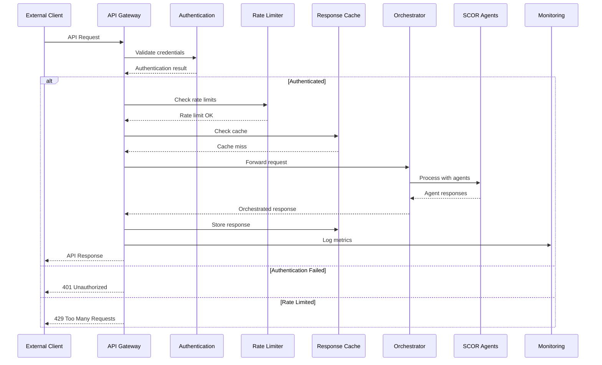

---

*These comprehensive mermaid diagrams provide visual representations of the Healthcare Supply Chain Orchestrator's architecture, processes, and integrations, supporting both technical understanding and business communication.*