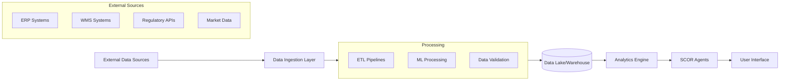

# Healthcare Supply Chain Orchestrator - Technical Architecture Document

## Table of Contents
1. [System Architecture Overview](#system-architecture-overview)
2. [Technical Components](#technical-components)
3. [Agent Architecture](#agent-architecture)
4. [Data Architecture](#data-architecture)
5. [Integration Architecture](#integration-architecture)
6. [Security Architecture](#security-architecture)
7. [Performance Architecture](#performance-architecture)
8. [Deployment Architecture](#deployment-architecture)
9. [Monitoring and Observability](#monitoring-and-observability)
10. [Technical Requirements](#technical-requirements)

## System Architecture Overview

The Healthcare Supply Chain Orchestrator follows a microservices-based, multi-agent architecture built on Azure AI Services. The system implements the SCOR (Supply Chain Operations Reference) model through five specialized AI agents that work collaboratively to optimize healthcare supply chain operations.

### High-Level Architecture

```python
# Core Architecture Components
from azure.identity import DefaultAzureCredential
from azure.ai.projects import AIProjectClient
from azure.ai.agents.models import ConnectedAgentTool, MessageRole
from opentelemetry import trace
import streamlit as st

# System Configuration
project_client = AIProjectClient(
    endpoint=os.environ["PROJECT_ENDPOINT"],
    credential=DefaultAzureCredential(),
)

# Telemetry Configuration
tracer = trace.get_tracer(__name__)
connection_string = project_client.telemetry.get_application_insights_connection_string()
```

### Architecture Principles

#### 1. Agent-Centric Design
- **Specialized Agents**: Each agent focuses on a specific SCOR stage (Plan, Source, Make, Deliver, Return)
- **Autonomous Operation**: Agents make independent decisions within their domain
- **Collaborative Intelligence**: Agents share information and coordinate actions
- **Contextual Awareness**: Each agent maintains context of the overall supply chain

#### 2. Event-Driven Architecture
- **Asynchronous Processing**: Non-blocking operations for improved performance
- **Event Streaming**: Real-time data flow between agents and external systems
- **Message Queuing**: Reliable message delivery with retry mechanisms
- **State Management**: Consistent state across distributed agents

#### 3. Cloud-Native Design
- **Microservices**: Independently deployable and scalable components
- **Container Orchestration**: Kubernetes-based deployment and management
- **Auto-Scaling**: Dynamic resource allocation based on demand
- **High Availability**: Multi-region deployment with failover capabilities

## Technical Components

### Core Dependencies

```python
# Azure AI Components
from azure.identity import DefaultAzureCredential
from azure.ai.projects import AIProjectClient
from azure.ai.agents.models import (
    ConnectedAgentTool, MessageRole, AzureAISearchTool,
    MessageTextContent, ListSortOrder, FilePurpose
)

# Web Framework
import streamlit as st
from html import escape as _html_escape

# Monitoring & Telemetry
from azure.monitor.opentelemetry import configure_azure_monitor
from opentelemetry import trace

# Data Processing & Analysis
import pandas as pd
import json
from typing import Any, Callable, Set, Dict, List, Optional

# Utilities
import asyncio, time, os
from datetime import datetime
import tempfile, uuid, requests, io, re
from dotenv import load_dotenv
```

### System Configuration

```python
# Environment Configuration
endpoint = os.environ["PROJECT_ENDPOINT"]
model_endpoint = os.environ["MODEL_ENDPOINT"] 
model_api_key = os.environ["MODEL_API_KEY"]
model_deployment_name = os.environ["MODEL_DEPLOYMENT_NAME"]

# Azure AI Project Client
project_client = AIProjectClient(
    endpoint=endpoint,
    credential=DefaultAzureCredential(),
)

# OpenAI Client Configuration
client = AzureOpenAI(
    azure_endpoint=os.getenv("AZURE_OPENAI_ENDPOINT"), 
    api_key=os.getenv("AZURE_OPENAI_KEY"),  
    api_version="2024-10-21",
)

# Telemetry Configuration
connection_string = project_client.telemetry.get_application_insights_connection_string()
configure_azure_monitor(connection_string=connection_string)
```

## Agent Architecture

### Agent Factory Pattern

The system uses a factory pattern to create and manage specialized agents:

```python
def create_scor_agents():
    """Factory method to create all SCOR agents"""
    agents = {}
    
    # Plan Agent - Demand and Supply Planning
    agents['plan'] = project_client.agents.create_agent(
        model=os.environ["MODEL_DEPLOYMENT_NAME"],
        name="planagent",
        instructions="""
        You are an AI agent in the Plan stage of the healthcare and life sciences 
        supply chain, focused on demand and supply planning. Your goal is to forecast 
        needs, allocate resources, and align strategies to balance supply with demand 
        while considering regulatory changes, market volatility, and patient-centric outcomes.
        """
    )
    
    # Source Agent - Procurement and Supplier Management
    agents['source'] = project_client.agents.create_agent(
        model=os.environ["MODEL_DEPLOYMENT_NAME"],
        name="sourceagent",
        instructions="""
        You are an AI agent in the Source stage of the healthcare and life sciences 
        supply chain, specializing in procurement and supplier management. Your objective 
        is to source high-quality raw materials, components, and services while ensuring 
        ethical standards, compliance, and supply resilience.
        """
    )
    
    # Additional agents follow similar pattern...
    return agents
```

### Agent Communication Protocol

#### Message Passing Architecture
```python
def parse_agent_outputs(run_steps):
    """Parse agent outputs from run steps to extract individual agent responses"""
    agent_outputs = {}
    
    for step in run_steps:
        step_details = step.get("step_details", {})
        tool_calls = step_details.get("tool_calls", [])
        
        if tool_calls:
            for call in tool_calls:
                connected_agent = call.get("connected_agent", {})
                if connected_agent:
                    agent_name = connected_agent.get("name", "Unknown Agent")
                    agent_output = connected_agent.get("output", "No output available")
                    agent_outputs[agent_name] = agent_output
    
    return agent_outputs
```

#### Agent Orchestration
```python
class SupplyChainOrchestrator:
    """Main orchestrator for SCOR agents"""
    
    def __init__(self):
        self.agents = create_scor_agents()
        self.connected_tools = self._create_connected_tools()
        self.main_agent = self._create_main_agent()
    
    def _create_connected_tools(self):
        """Create connected agent tools for orchestration"""
        return {
            'plan': ConnectedAgentTool(
                id=self.agents['plan'].id, 
                name="planagent", 
                description="Plan stage of the healthcare supply chain"
            ),
            # ... other agents
        }
    
    def process_query(self, query: str):
        """Process supply chain query through agent orchestration"""
        # Create thread and message
        thread = project_client.agents.threads.create()
        message = project_client.agents.messages.create(
            thread_id=thread.id,
            role=MessageRole.USER,
            content=query,
        )
        
        # Execute orchestrated run
        run = project_client.agents.runs.create_and_process(
            thread_id=thread.id, 
            agent_id=self.main_agent.id
        )
        
        return self._process_results(thread.id, run.id)
```

### Individual Agent Specifications

#### Plan Agent
**Responsibilities:**
- Demand forecasting based on historical data and market trends
- Supply planning and resource allocation
- Risk assessment and scenario planning
- Regulatory timeline integration (FDA, EMA approvals)
- AI-powered analytics and digital twin simulations

**Key Functions:**
```python
plan_agent_instructions = """
Analyze provided data: Review historical sales, market trends, emerging health issues, 
and patient feedback to forecast demand. Use statistical models or AI simulations.

Develop supply plans: Calculate inventory levels, production schedules, and resource 
needs (staff, equipment). Factor in regulatory timelines like clinical trials.

Conduct risk assessments: Simulate scenarios for disruptions (raw material shortages) 
and recommend mitigation strategies like buffer stocks.
"""
```

#### Source Agent
**Responsibilities:**
- Supplier identification and evaluation
- Contract negotiation and management
- Supplier audits and compliance verification
- Procurement optimization and cost management
- ESG (Environmental, Social, Governance) integration

#### Make Agent
**Responsibilities:**
- Manufacturing process optimization
- Quality control and GMP compliance
- Production planning and scheduling
- Batch record management and serialization
- Continuous manufacturing and automation

#### Deliver Agent
**Responsibilities:**
- Distribution network optimization
- Cold-chain and logistics management
- Last-mile delivery coordination
- Real-time tracking and monitoring
- IATA compliance for hazardous materials

#### Return Agent
**Responsibilities:**
- Reverse logistics management
- Product recall coordination
- Adverse event reporting
- Waste management and sustainability
- Post-market surveillance

## Data Architecture

### Data Model Structure

```python
# Supply Chain Data Models
@dataclass
class SupplyChainEntity:
    id: str
    entity_type: str
    created_at: datetime
    updated_at: datetime
    metadata: Dict[str, Any]

@dataclass
class PlanningData(SupplyChainEntity):
    demand_forecast: Dict[str, float]
    supply_plan: Dict[str, Any]
    risk_assessment: List[Dict[str, Any]]
    regulatory_timeline: Dict[str, datetime]

@dataclass
class SourcingData(SupplyChainEntity):
    suppliers: List[Dict[str, Any]]
    contracts: List[Dict[str, Any]]
    procurement_plan: Dict[str, Any]
    compliance_status: Dict[str, str]

# Additional data models for Make, Deliver, Return stages...
```

### Data Flow Architecture



### Data Storage Strategy

#### Azure Data Services Integration
- **Azure Data Lake**: Raw and processed data storage
- **Azure SQL Database**: Transactional data and metadata
- **Azure Cosmos DB**: Document storage for unstructured data
- **Azure Cache for Redis**: High-performance caching

#### Data Governance
- **Data Lineage**: Complete tracking of data origin and transformations
- **Data Quality**: Automated validation and cleansing procedures
- **Compliance**: HIPAA, GDPR, and FDA CFR Part 11 compliance
- **Security**: Encryption at rest and in transit, access controls

## Integration Architecture

### External System Integration

```python
# Integration Framework
class IntegrationManager:
    """Manages external system integrations"""
    
    def __init__(self):
        self.connectors = {
            'erp': ERPConnector(),
            'wms': WMSConnector(),
            'regulatory': RegulatoryAPIConnector(),
            'market_data': MarketDataConnector()
        }
    
    async def sync_data(self, system: str, data_type: str):
        """Synchronize data with external systems"""
        connector = self.connectors.get(system)
        if connector:
            return await connector.fetch_data(data_type)
        raise ValueError(f"Unknown system: {system}")

# Example ERP Integration
class ERPConnector:
    """Connector for ERP system integration"""
    
    async def fetch_inventory_data(self):
        """Fetch current inventory levels from ERP"""
        # Implementation for ERP API calls
        pass
    
    async def update_demand_forecast(self, forecast_data):
        """Update demand forecast in ERP system"""
        # Implementation for ERP updates
        pass
```

### API Architecture

#### RESTful API Design
```python
from fastapi import FastAPI, HTTPException
from pydantic import BaseModel

app = FastAPI(title="Supply Chain Orchestrator API")

class SupplyChainQuery(BaseModel):
    query: str
    context: Optional[Dict[str, Any]] = None
    
class SupplyChainResponse(BaseModel):
    response: str
    agent_outputs: Dict[str, str]
    token_usage: Dict[str, int]
    timestamp: datetime

@app.post("/api/v1/analyze", response_model=SupplyChainResponse)
async def analyze_supply_chain(query: SupplyChainQuery):
    """Analyze supply chain query through SCOR agents"""
    try:
        orchestrator = SupplyChainOrchestrator()
        result = await orchestrator.process_query(query.query)
        return SupplyChainResponse(**result)
    except Exception as e:
        raise HTTPException(status_code=500, detail=str(e))
```

### Message Queue Architecture

#### Azure Service Bus Integration
```python
from azure.servicebus import ServiceBusClient, ServiceBusMessage

class MessageQueueManager:
    """Manages message queues for agent communication"""
    
    def __init__(self, connection_string: str):
        self.client = ServiceBusClient.from_connection_string(connection_string)
    
    async def send_to_agent(self, agent_name: str, message: dict):
        """Send message to specific agent queue"""
        queue_name = f"agent-{agent_name}"
        sender = self.client.get_queue_sender(queue_name=queue_name)
        
        message_obj = ServiceBusMessage(json.dumps(message))
        await sender.send_messages(message_obj)
    
    async def process_agent_responses(self):
        """Process responses from agent queues"""
        # Implementation for processing agent responses
        pass
```

## Security Architecture

### Authentication and Authorization

```python
# Security Framework
from azure.identity import DefaultAzureCredential
from azure.keyvault.secrets import SecretClient
import jwt

class SecurityManager:
    """Manages authentication, authorization, and secrets"""
    
    def __init__(self):
        self.credential = DefaultAzureCredential()
        self.key_vault_client = SecretClient(
            vault_url=os.environ["KEY_VAULT_URL"],
            credential=self.credential
        )
    
    def validate_token(self, token: str) -> Dict[str, Any]:
        """Validate JWT token and extract claims"""
        try:
            payload = jwt.decode(
                token, 
                self.get_secret("jwt-secret"),
                algorithms=["HS256"]
            )
            return payload
        except jwt.InvalidTokenError:
            raise HTTPException(status_code=401, detail="Invalid token")
    
    def get_secret(self, secret_name: str) -> str:
        """Retrieve secret from Azure Key Vault"""
        return self.key_vault_client.get_secret(secret_name).value
```

### Data Protection

#### Encryption Strategy
- **At Rest**: AES-256 encryption for all stored data
- **In Transit**: TLS 1.3 for all communications
- **Application Level**: Field-level encryption for sensitive data
- **Key Management**: Azure Key Vault for centralized key management

#### Access Control
```python
from functools import wraps
from enum import Enum

class Permission(Enum):
    READ_SUPPLY_CHAIN = "read:supply_chain"
    WRITE_SUPPLY_CHAIN = "write:supply_chain"
    ADMIN_SUPPLY_CHAIN = "admin:supply_chain"

def require_permission(permission: Permission):
    """Decorator for permission-based access control"""
    def decorator(func):
        @wraps(func)
        def wrapper(*args, **kwargs):
            # Extract user permissions from token
            user_permissions = get_user_permissions()
            if permission.value not in user_permissions:
                raise HTTPException(status_code=403, detail="Insufficient permissions")
            return func(*args, **kwargs)
        return wrapper
    return decorator
```

## Performance Architecture

### Caching Strategy

```python
import redis
from typing import Union
import pickle

class CacheManager:
    """Redis-based caching for performance optimization"""
    
    def __init__(self, redis_url: str):
        self.redis_client = redis.from_url(redis_url)
    
    def get(self, key: str) -> Union[str, dict, None]:
        """Get value from cache"""
        cached_value = self.redis_client.get(key)
        if cached_value:
            return pickle.loads(cached_value)
        return None
    
    def set(self, key: str, value: Union[str, dict], ttl: int = 3600):
        """Set value in cache with TTL"""
        serialized_value = pickle.dumps(value)
        self.redis_client.setex(key, ttl, serialized_value)
    
    def invalidate_pattern(self, pattern: str):
        """Invalidate cache keys matching pattern"""
        keys = self.redis_client.keys(pattern)
        if keys:
            self.redis_client.delete(*keys)
```

### Asynchronous Processing

```python
import asyncio
from concurrent.futures import ThreadPoolExecutor

class AsyncAgentProcessor:
    """Asynchronous processing for agent operations"""
    
    def __init__(self, max_workers: int = 10):
        self.executor = ThreadPoolExecutor(max_workers=max_workers)
    
    async def process_agents_parallel(self, agents: List[str], query: str):
        """Process multiple agents in parallel"""
        tasks = []
        
        for agent_name in agents:
            task = asyncio.create_task(
                self.process_single_agent(agent_name, query)
            )
            tasks.append(task)
        
        results = await asyncio.gather(*tasks, return_exceptions=True)
        return self.combine_results(results)
    
    async def process_single_agent(self, agent_name: str, query: str):
        """Process single agent asynchronously"""
        loop = asyncio.get_event_loop()
        return await loop.run_in_executor(
            self.executor, 
            self.sync_agent_process, 
            agent_name, 
            query
        )
```

## Deployment Architecture

### Container Architecture

```dockerfile
# Dockerfile for Supply Chain Orchestrator
FROM python:3.9-slim

WORKDIR /app

# Install system dependencies
RUN apt-get update && apt-get install -y \
    build-essential \
    curl \
    && rm -rf /var/lib/apt/lists/*

# Install Python dependencies
COPY requirements.txt .
RUN pip install --no-cache-dir -r requirements.txt

# Copy application code
COPY . .

# Set environment variables
ENV PYTHONPATH=/app
ENV STREAMLIT_SERVER_PORT=8501
ENV STREAMLIT_SERVER_ADDRESS=0.0.0.0

# Health check
HEALTHCHECK --interval=30s --timeout=10s --start-period=60s --retries=3 \
  CMD curl -f http://localhost:8501/_stcore/health || exit 1

# Run application
CMD ["streamlit", "run", "stsupply.py", "--server.enableCORS=false"]
```

### Kubernetes Deployment

```yaml
# kubernetes/deployment.yaml
apiVersion: apps/v1
kind: Deployment
metadata:
  name: supply-chain-orchestrator
  labels:
    app: supply-chain-orchestrator
spec:
  replicas: 3
  selector:
    matchLabels:
      app: supply-chain-orchestrator
  template:
    metadata:
      labels:
        app: supply-chain-orchestrator
    spec:
      containers:
      - name: orchestrator
        image: supply-chain-orchestrator:latest
        ports:
        - containerPort: 8501
        env:
        - name: PROJECT_ENDPOINT
          valueFrom:
            secretKeyRef:
              name: azure-config
              key: project-endpoint
        - name: MODEL_DEPLOYMENT_NAME
          value: "gpt-4o-mini"
        resources:
          requests:
            memory: "1Gi"
            cpu: "500m"
          limits:
            memory: "2Gi"
            cpu: "1000m"
        livenessProbe:
          httpGet:
            path: /_stcore/health
            port: 8501
          initialDelaySeconds: 60
          periodSeconds: 30
        readinessProbe:
          httpGet:
            path: /_stcore/health
            port: 8501
          initialDelaySeconds: 30
          periodSeconds: 10
```

### Infrastructure as Code

```terraform
# terraform/main.tf
resource "azurerm_resource_group" "supply_chain" {
  name     = "rg-supply-chain-orchestrator"
  location = "East US"
}

resource "azurerm_kubernetes_cluster" "aks" {
  name                = "aks-supply-chain"
  location            = azurerm_resource_group.supply_chain.location
  resource_group_name = azurerm_resource_group.supply_chain.name
  dns_prefix          = "supplychain"

  default_node_pool {
    name       = "default"
    node_count = 3
    vm_size    = "Standard_D2_v2"
  }

  identity {
    type = "SystemAssigned"
  }
}

resource "azurerm_cognitive_services_account" "openai" {
  name                = "openai-supply-chain"
  location            = azurerm_resource_group.supply_chain.location
  resource_group_name = azurerm_resource_group.supply_chain.name
  kind                = "OpenAI"
  sku_name            = "S0"
}
```

## Monitoring and Observability

### OpenTelemetry Integration

```python
from opentelemetry import trace, metrics
from opentelemetry.exporter.otlp.proto.grpc.trace_exporter import OTLPSpanExporter
from opentelemetry.sdk.trace import TracerProvider
from opentelemetry.sdk.trace.export import BatchSpanProcessor

class ObservabilityManager:
    """Manages telemetry and observability"""
    
    def __init__(self):
        self.tracer = trace.get_tracer(__name__)
        self.meter = metrics.get_meter(__name__)
        self._setup_metrics()
    
    def _setup_metrics(self):
        """Setup custom metrics"""
        self.agent_response_time = self.meter.create_histogram(
            name="agent_response_time_seconds",
            description="Response time for agent operations",
            unit="s"
        )
        
        self.supply_chain_queries = self.meter.create_counter(
            name="supply_chain_queries_total",
            description="Total number of supply chain queries processed"
        )
    
    @trace_operation("supply_chain_query")
    def trace_supply_chain_query(self, query: str):
        """Trace supply chain query execution"""
        with self.tracer.start_as_current_span("supply_chain_analysis") as span:
            span.set_attribute("query.length", len(query))
            span.set_attribute("query.type", self._classify_query(query))
            
            # Record metrics
            start_time = time.time()
            try:
                result = self._process_query(query)
                span.set_attribute("status", "success")
                return result
            except Exception as e:
                span.set_attribute("status", "error")
                span.record_exception(e)
                raise
            finally:
                duration = time.time() - start_time
                self.agent_response_time.record(duration)
                self.supply_chain_queries.add(1)
```

### Custom Dashboards

```python
# Custom Streamlit dashboard components
def render_performance_metrics():
    """Render performance monitoring dashboard"""
    st.subheader("🔍 System Performance")
    
    col1, col2, col3, col4 = st.columns(4)
    
    with col1:
        st.metric(
            "Average Response Time", 
            "1.2s", 
            delta="-0.3s",
            delta_color="inverse"
        )
    
    with col2:
        st.metric(
            "Queries Processed", 
            "1,247", 
            delta="+156"
        )
    
    with col3:
        st.metric(
            "Success Rate", 
            "99.7%", 
            delta="+0.2%"
        )
    
    with col4:
        st.metric(
            "Active Agents", 
            "5", 
            delta="0"
        )
```

## Technical Requirements

### System Requirements

#### Minimum Hardware Requirements
- **CPU**: 4 cores, 2.5 GHz (8 cores recommended)
- **RAM**: 8GB minimum, 16GB recommended
- **Storage**: 100GB SSD available space
- **Network**: 1Gbps network connectivity
- **GPU**: Optional, for ML acceleration

#### Software Dependencies
```
# requirements.txt
streamlit>=1.28.0
azure-ai-projects>=1.0.0
azure-identity>=1.15.0
azure-monitor-opentelemetry>=1.1.0
openai>=1.3.0
pandas>=2.0.0
python-dotenv>=1.0.0
fastapi>=0.104.0
uvicorn>=0.24.0
redis>=5.0.0
asyncio-mqtt>=0.11.0
pydantic>=2.0.0
```

### Azure Service Requirements

#### Required Azure Services
- **Azure AI Foundry Project**: Core AI platform
- **Azure OpenAI Service**: LLM inference
- **Application Insights**: Monitoring and telemetry
- **Azure Key Vault**: Secrets management
- **Azure Service Bus**: Message queuing
- **Azure Kubernetes Service**: Container orchestration
- **Azure Cache for Redis**: Performance caching

#### Service Configuration
```python
# Azure service configuration
AZURE_SERVICES = {
    "ai_foundry": {
        "endpoint": os.environ["PROJECT_ENDPOINT"],
        "deployment": os.environ["MODEL_DEPLOYMENT_NAME"]
    },
    "openai": {
        "endpoint": os.environ["AZURE_OPENAI_ENDPOINT"],
        "api_key": os.environ["AZURE_OPENAI_KEY"],
        "api_version": "2024-10-21"
    },
    "insights": {
        "connection_string": os.environ["APPLICATIONINSIGHTS_CONNECTION_STRING"]
    }
}
```

### Performance Requirements

#### Response Time Targets
- **Simple Queries**: <2 seconds
- **Complex Multi-Agent Queries**: <10 seconds
- **Batch Processing**: <60 seconds per 100 items
- **Real-time Alerts**: <1 second

#### Throughput Requirements
- **Concurrent Users**: 1,000+
- **Queries per Hour**: 10,000+
- **Data Processing**: 1TB per day
- **API Calls**: 100,000+ per day

#### Scalability Requirements
- **Horizontal Scaling**: Auto-scale to 50+ instances
- **Data Volume**: Petabyte-scale data handling
- **Geographic Distribution**: Multi-region deployment
- **Load Balancing**: Intelligent request distribution

---

*This technical architecture document provides the foundation for implementing, deploying, and maintaining the Healthcare Supply Chain Orchestrator system with enterprise-grade reliability, performance, and scalability.*