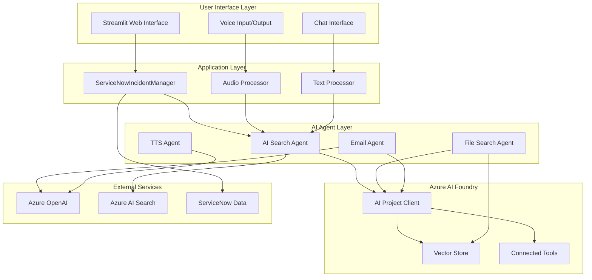
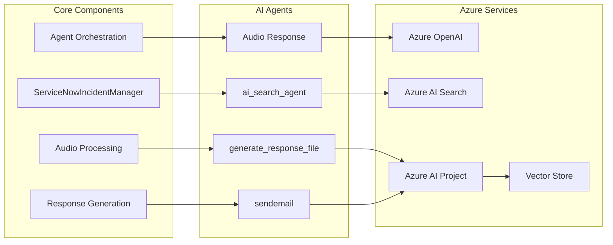
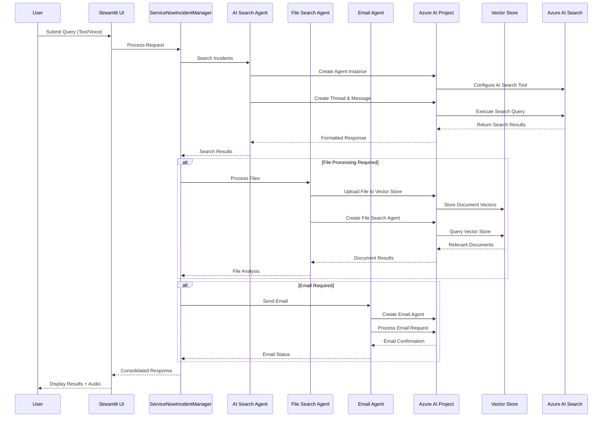
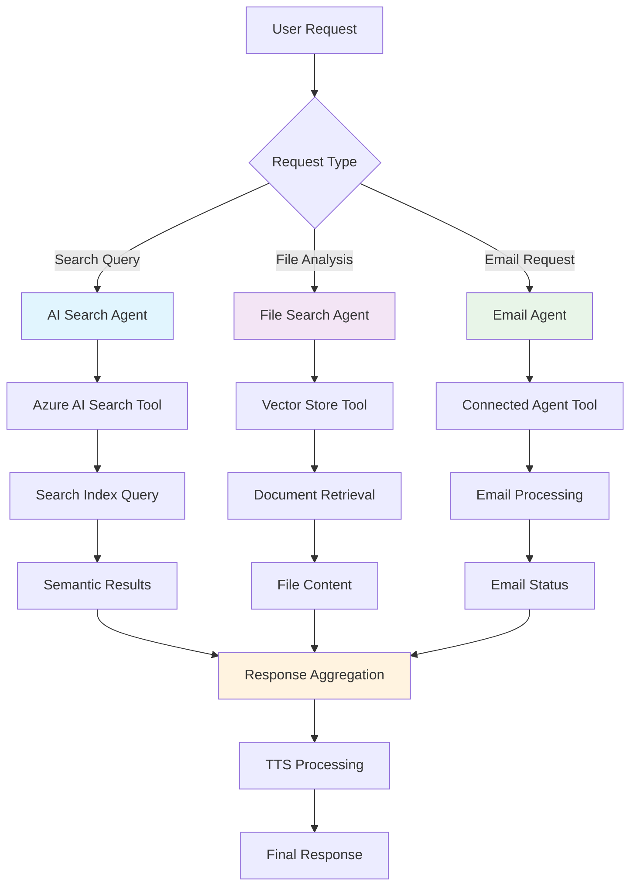
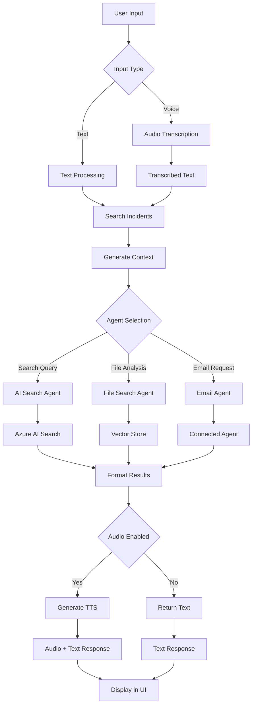
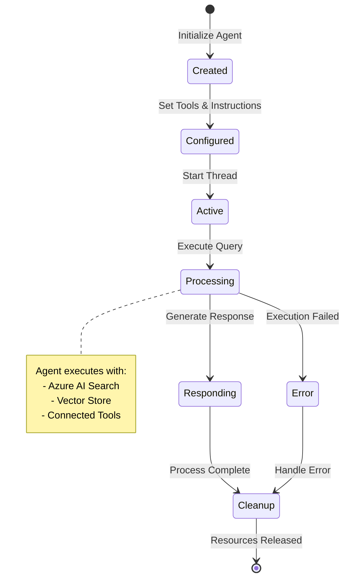
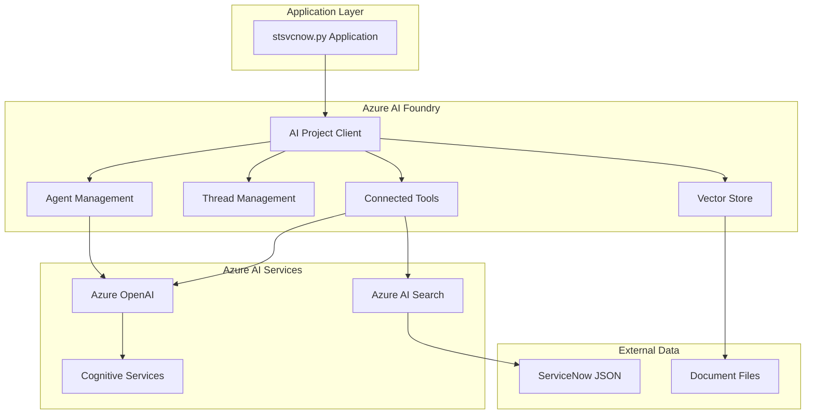
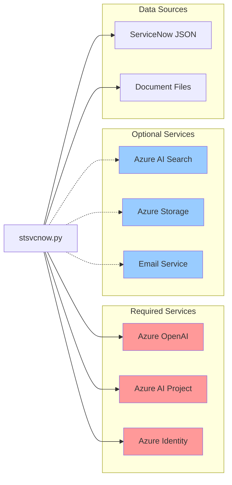

# ServiceNow AI Assistant (stsvcnow.py) - Technical Documentation

## Table of Contents
1. [Executive Summary](#executive-summary)
2. [System Architecture](#system-architecture)
3. [Multi-Agent Orchestration](#multi-agent-orchestration)
4. [Core Components](#core-components)
5. [API Reference](#api-reference)
6. [Configuration Guide](#configuration-guide)
7. [Usage Examples](#usage-examples)
8. [Data Flow Diagrams](#data-flow-diagrams)
9. [Integration Architecture](#integration-architecture)
10. [Deployment Guide](#deployment-guide)

## Executive Summary

The ServiceNow AI Assistant (`stsvcnow.py`) is a sophisticated incident management system that leverages Azure AI Foundry's Connected Agent architecture to provide intelligent IT service management capabilities. The system combines multi-agent orchestration, voice processing, and advanced AI search to deliver a comprehensive ServiceNow incident management experience.

### Key Features
- **Multi-Agent Architecture**: Orchestrated AI agents for specialized tasks (search, file processing, email)
- **Voice Interface**: Speech-to-text and text-to-speech capabilities using Azure OpenAI Whisper and TTS
- **Intelligent Search**: Azure AI Search integration with vector and semantic search
- **File Processing**: Vector store-based document analysis and retrieval
- **Connected Agents**: Azure AI Foundry Connected Agent tools for task delegation
- **Real-time Chat**: Streamlit-based conversational interface with Material Design UI
- **Professional Audio**: High-quality voice synthesis with multiple voice personas

## System Architecture

### High-Level Architecture



### Component Architecture



## Multi-Agent Orchestration

### Agent Workflow Architecture



### Multi-Agent Coordination Flow



## Core Components

### 1. ServiceNowIncidentManager

The central component responsible for managing ServiceNow incident data and coordinating AI interactions.

```python
class ServiceNowIncidentManager:
    """Manager for ServiceNow incident data and AI interactions."""
    
    def __init__(self, data_file: str = "servicenow_incidents_full.json")
    def load_data(self) -> None
    def search_incidents(self, query: str, limit: int = 10) -> List[Dict]
    def get_incident_context(self, incidents: List[Dict]) -> str
```

**Key Responsibilities:**
- Load and manage ServiceNow incident data from JSON files
- Perform intelligent incident search with fuzzy matching
- Generate contextual information for AI agents
- Maintain incident statistics and metadata

### 2. AI Search Agent

Implements Azure AI Search integration with vector and semantic search capabilities.

```python
def ai_search_agent(query: str) -> str:
    """
    Creates and executes an AI search agent using Azure AI Search.
    
    Architecture:
    - Initializes Azure AI Project Client
    - Configures Azure AI Search tool with vector/semantic hybrid search
    - Creates specialized search agent with defined instructions
    - Processes queries and returns formatted results with citations
    """
```

**Features:**
- Vector-semantic hybrid search
- Top-K result retrieval with configurable ranking
- Citation extraction and URL linking
- Automatic resource cleanup

### 3. File Search Agent

Manages document processing through Azure AI Foundry vector stores.

```python
def generate_response_file(user_query: str, context: str, conversation_history: List[Dict]) -> str:
    """
    Processes file-based queries using vector store technology.
    
    Architecture:
    - Uploads ServiceNow incident files to Azure vector store
    - Creates file search tool with vector embeddings
    - Generates contextualized responses from document content
    - Maintains conversation history and context
    """
```

**Capabilities:**
- Automatic file upload and vectorization
- Context-aware document retrieval
- Conversation history integration
- Resource lifecycle management

### 4. Voice Processing System

Comprehensive audio input/output system with professional TTS capabilities.

```python
def transcribe_audio(audio_data) -> str:
    """Transcribe audio using Azure OpenAI Whisper."""

def generate_audio_response_gpt_1(text, selected_voice):
    """Generate high-quality audio response with personality."""
```

**Features:**
- High-fidelity speech recognition with Whisper
- Professional TTS with multiple voice personas
- Audio quality optimization and error handling
- Streaming audio generation for real-time responses

## API Reference

### Core Functions

#### `ai_search_agent(query: str) -> str`
Executes intelligent search using Azure AI Search with vector and semantic capabilities.

**Parameters:**
- `query` (str): Search query string
- Returns: Formatted search results with citations

**Environment Variables Required:**
- `PROJECT_ENDPOINT`: Azure AI Project endpoint
- `MODEL_DEPLOYMENT_NAME`: Azure OpenAI model deployment name

#### `generate_response_file(user_query: str, context: str, conversation_history: List[Dict]) -> str`
Processes file-based queries using vector store technology.

**Parameters:**
- `user_query` (str): User's question
- `context` (str): Contextual information
- `conversation_history` (List[Dict]): Previous conversation messages
- Returns: AI-generated response based on file content

#### `sendemail(query: str) -> str`
Sends emails using connected agent functionality.

**Parameters:**
- `query` (str): Email request with recipient and content
- Returns: Email processing status

#### `transcribe_audio(audio_data) -> str`
Converts speech to text using Azure OpenAI Whisper.

**Parameters:**
- `audio_data`: Audio input data
- Returns: Transcribed text string

### Configuration Parameters

| Parameter | Description | Required | Default |
|-----------|-------------|----------|---------|
| `AZURE_OPENAI_ENDPOINT` | Azure OpenAI service endpoint | Yes | - |
| `AZURE_OPENAI_KEY` | Azure OpenAI API key | Yes | - |
| `PROJECT_ENDPOINT` | Azure AI Project endpoint | Yes | - |
| `MODEL_DEPLOYMENT_NAME` | Model deployment name | Yes | - |
| `SEARCH_ENDPOINT` | Azure AI Search endpoint | No | - |
| `SEARCH_KEY` | Azure AI Search key | No | - |

## Configuration Guide

### Environment Setup

1. **Azure AI Services Configuration**
```bash
export AZURE_OPENAI_ENDPOINT="https://your-openai-resource.openai.azure.com"
export AZURE_OPENAI_KEY="your-openai-api-key"
export AZURE_OPENAI_DEPLOYMENT="your-chat-model-deployment"
export PROJECT_ENDPOINT="https://your-ai-project.cognitiveservices.azure.com"
export MODEL_DEPLOYMENT_NAME="gpt-4o"
```

2. **Search Service Configuration**
```bash
export SEARCH_ENDPOINT="https://your-search-service.search.windows.net"
export SEARCH_KEY="your-search-admin-key"
```

3. **ServiceNow Data Configuration**
Place your ServiceNow incident data in `servicenow_incidents_full.json` with the following structure:
```json
{
  "incidents": [
    {
      "incident_id": "INC0000001",
      "short_description": "Issue description",
      "long_description": "Detailed description",
      "priority": "High",
      "status": "Open",
      "solution": "Resolution steps",
      "start_time": "2024-01-01T10:00:00Z",
      "interactions": [
        {
          "user": "username",
          "comment": "User comment",
          "timestamp": "2024-01-01T10:05:00Z"
        }
      ]
    }
  ]
}
```

### Azure Resource Requirements

1. **Azure OpenAI Resource**
   - GPT-4o or GPT-4 deployment for chat
   - Whisper deployment for speech recognition
   - TTS model for voice synthesis

2. **Azure AI Search Service**
   - Standard tier or higher
   - Vector search capabilities enabled
   - Semantic search configuration

3. **Azure AI Project**
   - Connected to Azure OpenAI resource
   - Vector store capabilities enabled
   - Agent orchestration permissions

## Usage Examples

### Basic Text Query
```python
# Initialize the application
incident_manager = ServiceNowIncidentManager()

# Process a text query
response = ai_search_agent("Show me all high priority incidents")
print(response)
```

### Voice-Enabled Query
```python
# Process audio input
audio_data = st.audio_input("Record your question")
if audio_data:
    transcription = transcribe_audio(audio_data)
    response = ai_search_agent(transcription)
    
    # Generate voice response
    audio_response = generate_audio_response_gpt_1(response, "nova")
    st.audio(audio_response, format="audio/mp3")
```

### File-Based Analysis
```python
# Analyze documents with context
context = incident_manager.get_incident_context(incidents)
response = generate_response_file(
    user_query="How was the Copilot issue resolved?",
    context=context,
    conversation_history=[]
)
```

### Email Integration
```python
# Send email with AI-generated content
email_query = "Send summary of critical incidents to admin@company.com"
result = sendemail(email_query)
```

## Data Flow Diagrams

### Request Processing Flow



### Agent Lifecycle Management



## Integration Architecture

### Azure AI Foundry Integration



### Service Dependencies



## Deployment Guide

### Prerequisites
1. Azure subscription with appropriate permissions
2. Azure OpenAI resource with required model deployments
3. Azure AI Project with agent capabilities
4. Python 3.8+ environment
5. Streamlit framework

### Installation Steps

1. **Clone Repository**
```bash
git clone https://github.com/balakreshnan/AgenticAIFoundry.git
cd AgenticAIFoundry
```

2. **Install Dependencies**
```bash
pip install -r requirements.txt
```

3. **Configure Environment**
```bash
cp .env.example .env
# Edit .env with your Azure credentials
```

4. **Prepare Data**
```bash
# Place ServiceNow data in servicenow_incidents_full.json
# Ensure proper JSON structure as documented
```

5. **Run Application**
```bash
streamlit run stsvcnow.py
```

### Production Considerations

1. **Security**
   - Use Azure Key Vault for credential management
   - Implement proper authentication and authorization
   - Enable Azure AD integration for user management

2. **Scalability**
   - Configure auto-scaling for Streamlit deployment
   - Implement load balancing for multiple instances
   - Use Azure Container Instances or App Service

3. **Monitoring**
   - Enable Application Insights for telemetry
   - Set up health checks and alerting
   - Monitor Azure AI service quotas and usage

4. **Performance**
   - Implement response caching where appropriate
   - Optimize vector store queries
   - Use connection pooling for Azure services

---

## Technical Support

For technical issues and questions:
- Review the troubleshooting section in the main repository README
- Check Azure AI Foundry documentation for service-specific issues
- Verify environment configuration and service permissions
- Monitor application logs for detailed error information

---

*This documentation is part of the AgenticAIFoundry project. For the latest updates and additional resources, visit the project repository.*