# ServiceNow AI Assistant - Mermaid Architecture Diagrams

This document contains comprehensive Mermaid diagrams illustrating the multi-agent orchestration architecture and technical components of the ServiceNow AI Assistant (stsvcnow.py).

## Table of Contents
1. [System Architecture](#system-architecture)
2. [Multi-Agent Orchestration](#multi-agent-orchestration)
3. [Data Flow Diagrams](#data-flow-diagrams)
4. [Integration Architecture](#integration-architecture)
5. [Component Interactions](#component-interactions)
6. [Process Workflows](#process-workflows)

## System Architecture

### High-Level System Overview

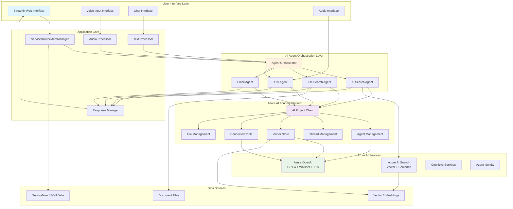

### Component Architecture Detailed

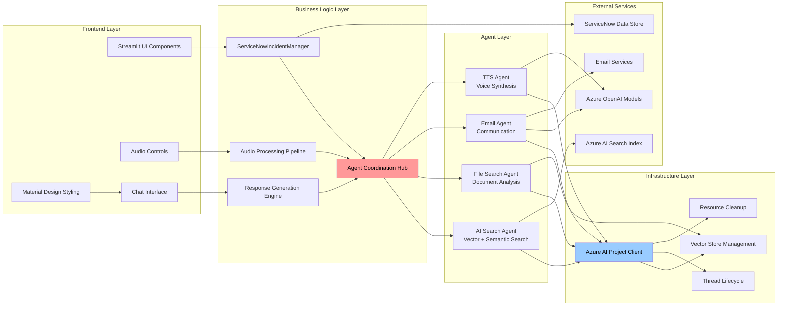

## Multi-Agent Orchestration

### Agent Orchestration Workflow

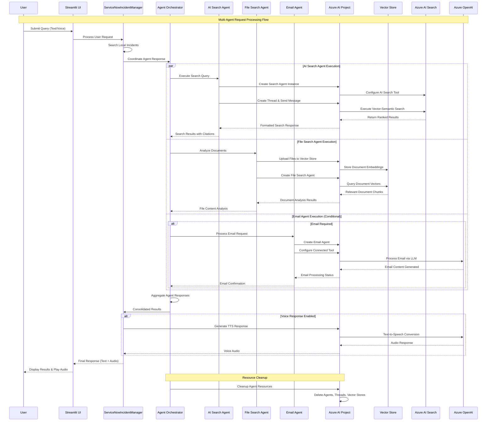

### Agent State Management

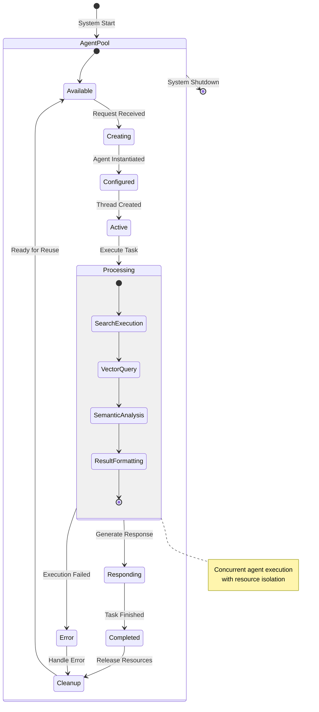

### Multi-Agent Communication Pattern

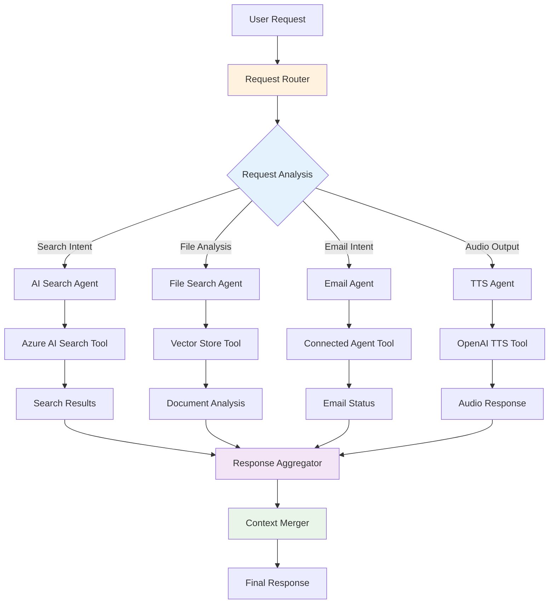

## Data Flow Diagrams

### Request Processing Data Flow

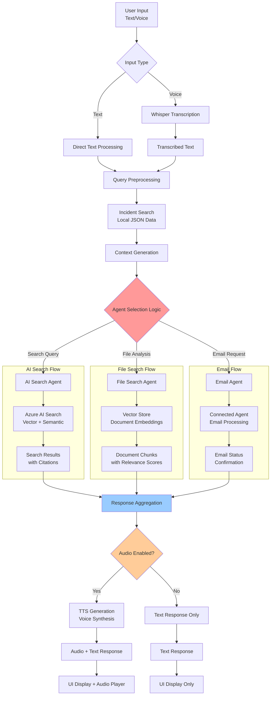

### Vector Store Data Flow

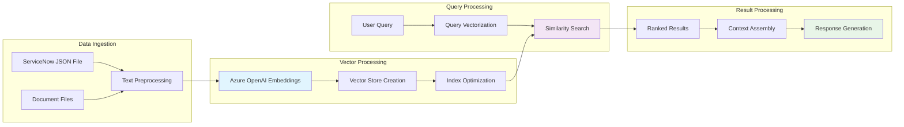

## Integration Architecture

### Azure AI Foundry Integration

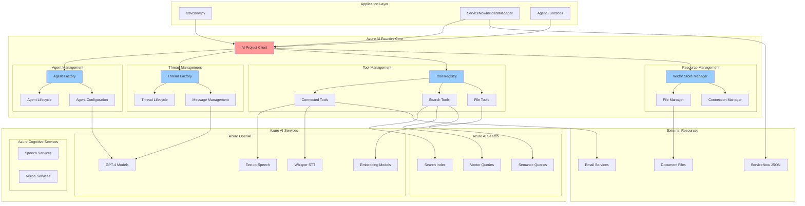

### Service Dependency Architecture

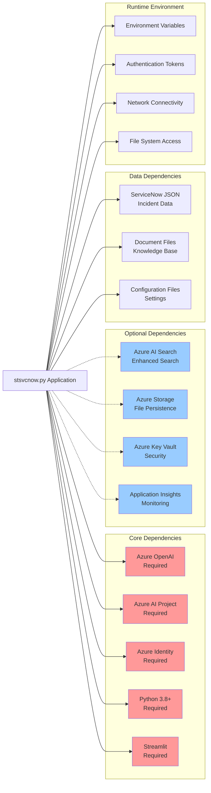

## Component Interactions

### Agent Interaction Matrix

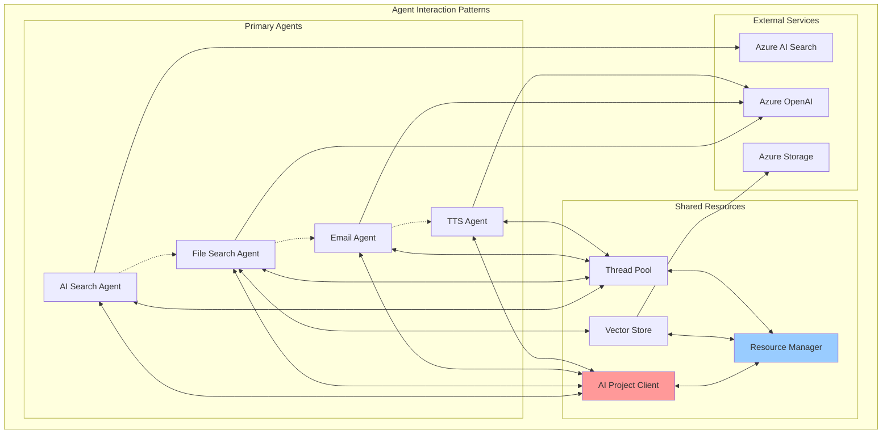

### Component Lifecycle Management

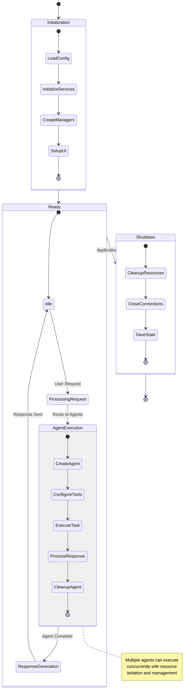

## Process Workflows

### End-to-End User Interaction Workflow

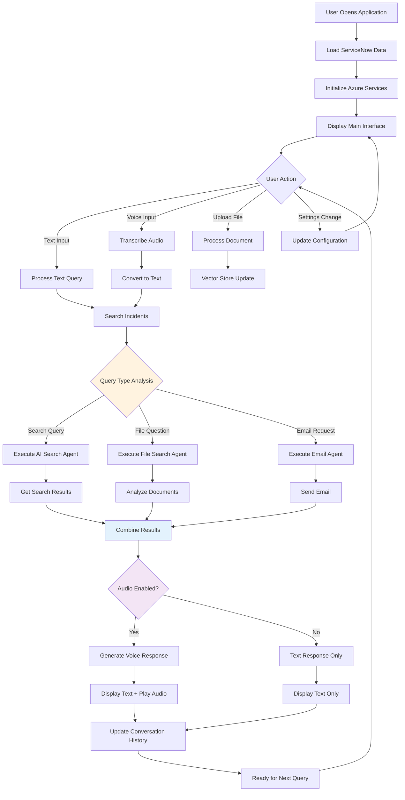

### Error Handling and Recovery Workflow

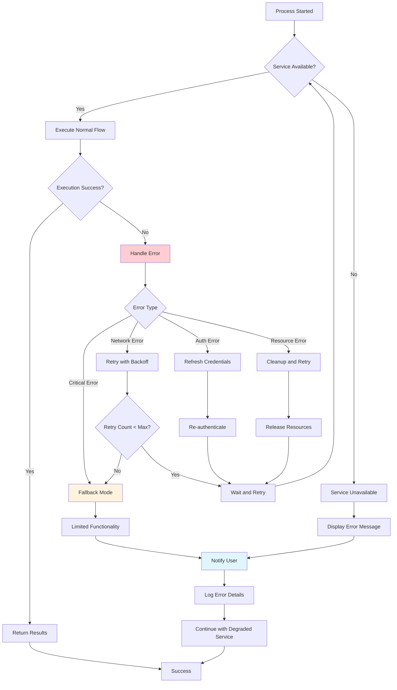

---

## Diagram Legend

### Node Types
- **Rectangle**: Standard components and services
- **Rounded Rectangle**: User interfaces and external systems
- **Diamond**: Decision points and conditional logic
- **Circle**: Start/end points in workflows
- **Hexagon**: Data stores and repositories

### Color Coding
- **Red (#ff9999)**: Critical core components
- **Blue (#99ccff)**: Azure services and infrastructure
- **Orange (#fff3e0)**: Processing and orchestration logic
- **Green (#e8f5e8)**: External services and outputs
- **Purple (#f3e5f5)**: Data flow and storage
- **Light Blue (#e1f5fe)**: User interface components

### Connection Types
- **Solid Arrow**: Direct communication/data flow
- **Dashed Arrow**: Conditional or optional interaction
- **Bidirectional Arrow**: Two-way communication
- **Thick Arrow**: Primary data/control flow

---

*These diagrams provide a comprehensive visual representation of the ServiceNow AI Assistant architecture and can be rendered using any Mermaid-compatible viewer or documentation platform.*